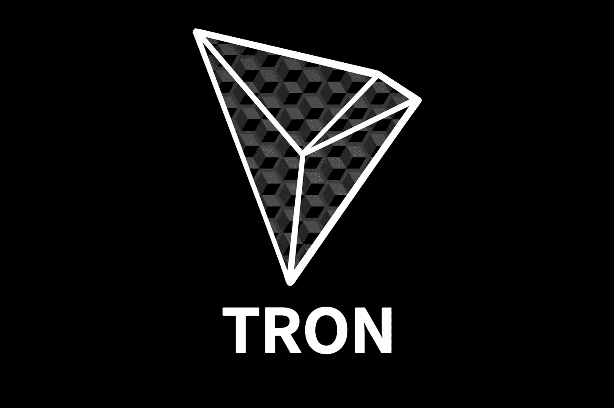

# 在按市值排名的十大加密货币中，你认为哪种最有可能失败，为什么？

> 原文：<https://medium.com/hackernoon/of-the-top-10-cryptocurrencies-by-market-cap-which-do-you-believe-is-the-most-likely-to-fail-and-19bcf19ee26a>

> 这个问题最初是在 Quora 上回答的，并为这篇文章进行了编辑。你可以在这里查看原帖。更多来自[【1】](https://medium.com/u/3853f85f7d5e#cite-QToOE)[涟漪式货币问题:为何放任区块链将 XRP 贬值](https://hackernoon.com/the-ripple-currency-problem-why-permissioned-blockchains-will-devalue-xrp-d79aef84c074)

> 最初发表于 www.quora.com。2018 年 1 月 9 日回答
> 
> 欲了解更多来自 [Quora](https://medium.com/u/3853f85f7d5e?source=post_page-----19bcf19ee26a--------------------------------) 的趋势科技答案，请访问[HackerNoon.com/quora](https://hackernoon.com/quora/home)。