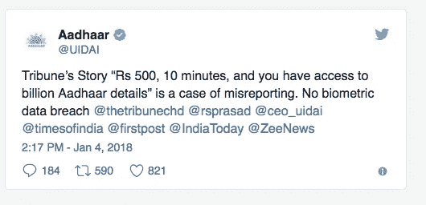
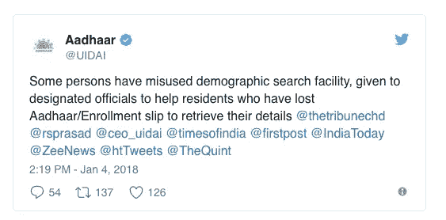

# 哦，我的阿达尔！印度政府的高度疏忽

> 原文：<https://medium.com/hackernoon/oh-my-aadhar-how-the-indian-government-messed-up-94ec1343249d>

我希望你听说了 [Aadhar 数据泄露](http://www.tribuneindia.com/news/nation/rs-500-10-minutes-and-you-have-access-to-billion-aadhaar-details/523361.html)。只需要 500 卢比(10 美元)和 10 分钟。你可以接触到十亿印度公民的私人数据。

## **这到底是怎么回事？**

*爱丽丝住在豪宅里。她去度假了。她把自己家的钥匙给了诺拉，诺拉向她的朋友们吹嘘道:“你知道吗，我有爱丽丝豪宅的钥匙。”。她的朋友们劝她用钥匙的复制品来换取金钱。他们向她保证，他们只想看一看，不会碰任何东西。她的朋友把复制品给了他们的朋友。最终，一些小偷拿到了钥匙。他们洗劫了爱丽丝的豪宅。*

根据五重奏的说法，这就是阿达尔的遭遇。政府任命了一些官员作为 Aadhar 门户网站的管理员。那些官员有权任命任何个人为管理员。这些人不需要得到官方授权，甚至不需要是政府雇员。一旦这些人有了权限。他们给了另一群人同样的权限。最终，我们的数据被泄露了。

# ***UIDAI 怎么说？***

*当爱丽丝问*诺拉*“你为什么这么做？我信任你。”*娜拉*回答道，“没事儿？没人夺走你的豪宅。我的一些朋友破坏了我的信任”。*

