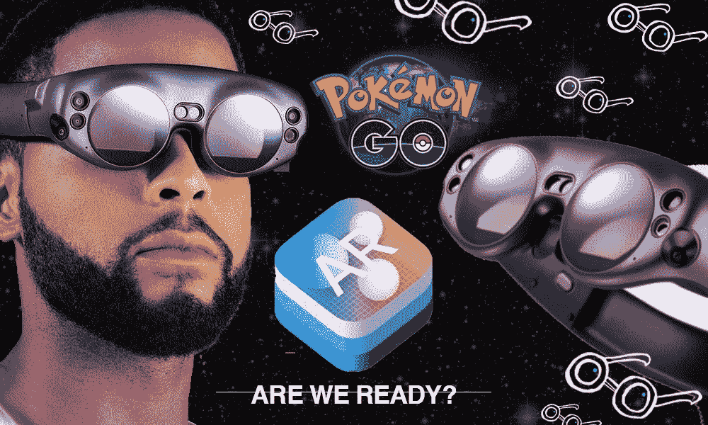
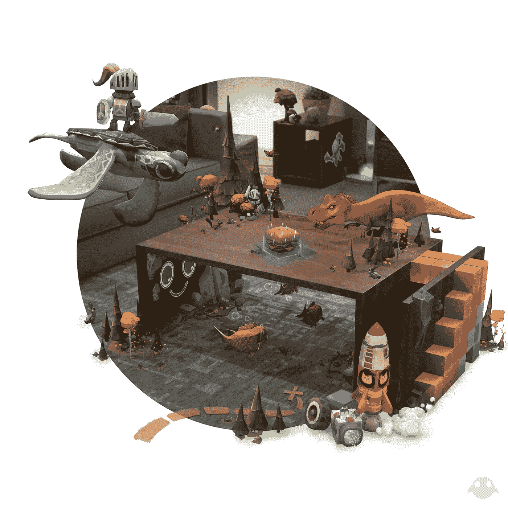
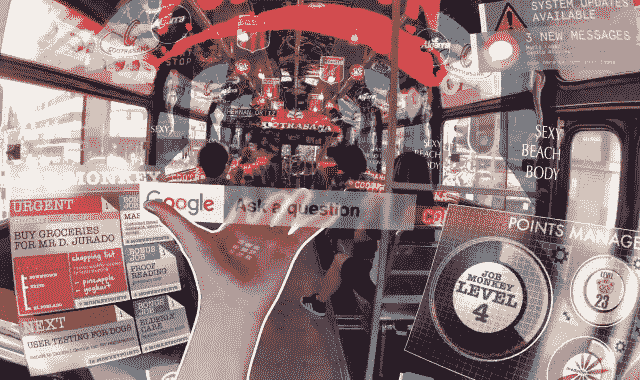
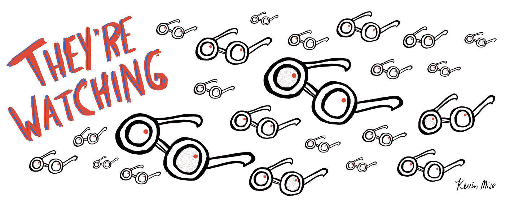
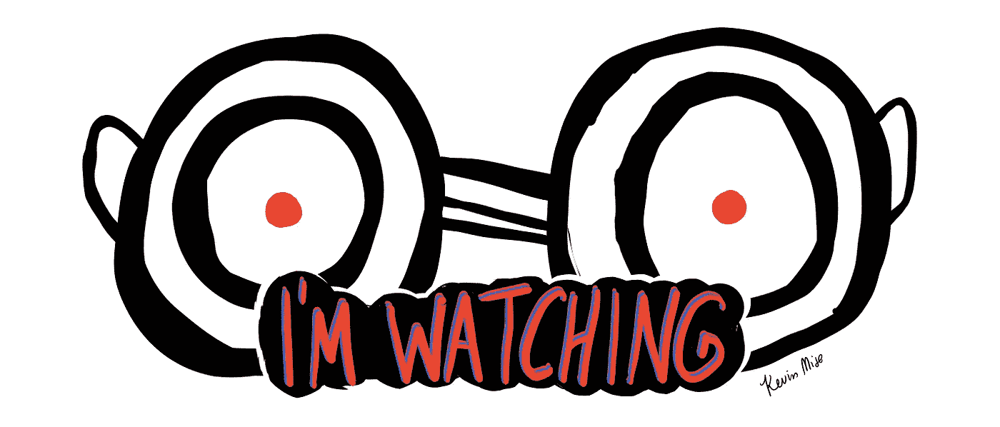

# 哦，你会看到的地方！(…也是他们要去的地方。)

> 原文：<https://medium.com/hackernoon/oh-the-places-youll-see-are-the-places-they-ll-see-too-ed3e7f8380b5>

## 关于增强世界中视觉和隐私的讨论。

Augmented Reality is coming. Are we ready? (Courtesy of Magic Leap, Apple, and the Pokémon Company)

# 在我们开始之前，我只想声明…

我从 2018 年 3 月开始写这个。从那时起，这篇文章经历了一个演变的变化。最近剑桥分析公司的丑闻是一个主要的例子，说明我们正在走向何方，以及大公司如何能够利用我们的大数据来获取利益:操纵营销、政治等。我们看到的世界也是他们看到的世界。无论如何…

# 所以我们到了:2018 年。

我们已经从外围瞥见了增强现实(AR)技术——CES 展示了模糊和奇怪的方式，以最佳方式将数字描绘投射到你的眼睛上，临时的大帽子将你的 iPhone 屏幕直接放置在你的脸上，允许你查看另一边的内容。我们最近通过[谷歌的 Tango 和苹果的 AR 套件](https://hackernoon.com/big-ar-android-vs-ios-3a683579eec8)看到了更多有前途的技术，以及谷歌去年在 [AR Core](https://developers.google.com/ar/discover/) 中对此的回应，该产品刚刚结束测试。

Creating with Magic Leap — Courtesy of Magic Leap

# 在 2017 年末至 2018 年初…

即将到来的增强现实技术最引人注目的荣誉可以交给 [Magic Leap](https://www.magicleap.com/) 的发布会(在某个时刻，你可以听到全球的技术爱好者松了一口气，因为这个东西终于发布了)和[英特尔的 Vaunt](https://www.theverge.com/2018/2/5/16966530/intel-vaunt-smart-glasses-announced-ar-video) 平视显示眼镜——后者可能不是真正的增强现实，但仍然可以被誉为我们不断提高的技术实力的证明——智能眼镜可以有点时尚的概念证明。

[一个增强的未来太令人兴奋了](https://hackernoon.com/big-ar-the-future-of-augmented-reality-c91c267b3d9f)——我们对全息视频、虚拟宠物和(当然)你可以伸手触摸的色情电影的科幻梦想即将成为现实。就工作场所而言，增强现实可以为我们提供远程签到的操作系统，以便更好地工作(至少对于一般的案头工作而言)，并以前所未有的方式可视化和分析定量数据(注意，Excel！你也是，Clippy！)–这个未来太令人兴奋了，但也令人恐惧。

令人恐惧，尤其是如果你考虑到我们目前与**大数据的关系。越来越多的是，我们正在分享越来越多的数据——我们的手机跟踪我们的面部和位置历史，供算法分析和拼凑，我们的社交媒体账户跟踪和收集我们的言语模式、我们喜欢点击的内容、我们访问的网站以及世界各地的一切数据。对于营销人员和极权政府来说，这是一座信息的金矿。你可能会说，所有这些信息都在推动这个世界——我们的工作、我们的生活都依赖于我们创造的数据，让我们的工作永无止境地继续下去。但是隐私和数据的一个方面可能会改变你的想法:这是唯一基本上没有改变的东西:我们的视觉。**

****

**Our potential augmented future IF we don’t make it clear what we stand for **today**.**

# **很快，我们将开始真正把技术放在我们的脸上——而不是作为一种短暂的趋势或时尚——而不是作为一句“哦，让我们去试试吧！”VR 演示。真的。每天。**

**它将给我们带来前所未有的好处和易用性。我们的技术将为我们提供对生产力、娱乐、资源和基于位置的数据的即时访问，而不是拿出手机或电脑或看一眼手表。**

**但是当智能技术，通常被认为是 AR，机器学习，计算机视觉等，会发生什么呢？能够看到我们所看到的？为了让 AR 帮助我们处理上下文数据，视觉信息可能需要被发送到某个地方的服务器，以处理我们所看到的东西——由大型科技公司(如谷歌、苹果、亚马逊)拥有或管理的服务器。**

**在我们的 AR 未来，我们会那么容易放弃我们的视觉隐私吗？我们目前正在放弃越来越多的音频隐私——智能手机和扬声器会听我们的每一句话，等待不可避免的“嘿 Siri！”“OK Google”和“Alexa”。**

**我们会这么容易地为大公司提供 ***小字意图*** (见使用条款你不加考虑就签字离开)进入我们的视觉世界吗？去看看我们要去哪里，我们要见谁，我们如何行动，我们下一步要做什么？用我们的算法来分析趋势和模式，这样苹果 AR-Bot 或老大哥谷歌就可以预测(很可能准确)我们的一举一动？**

****

**Glasses! Everywhere! Surveilling! Everything!**

**我并不是说这项技术必须被逆转或者停止开发。我也不是要你从衣柜里拿出旧锡纸帽。增强现实将会继续存在。我们不能阻止进步。技术会一如既往地发展。**

**但是我们可以塑造和形成我们隐私的对话。**

# **我们需要现在就开始。**

**我们不能等到 2020 年增强现实耳机/眼镜在展示厅和主题演讲中亮相。我们不能等到产品完成，技术在这里。**

**我们现在需要形成一个关于隐私的公开对话，所以在技术基础设施开始工作之前，我们有时间触及主流意识。**

**如果我们等到营销部门把产品作为闪亮的必需品来推销，等到一群技术爱好者不加考虑地购买它，等到普通消费者不考虑后果就跳上车，**那就太晚了，而且不可逆转。****

****

**Always… watching… waiting…**

**也许在一个未来的世界里，我们都很开明，眼光远远超越人类生活的日常琐事，**在那里，我们不会在乎隐私，因为用来操纵他人信息的判断和权力/控制结构(读作:勒索)将会是*所以昨天，*我们能在一个没有隐私的世界里茁壮成长吗？但是在我们达到这样一个人性的开悟点之前，我想保留我的个人隐私，非常感谢。****

**你喜欢这个帖子吗？请鼓掌，让它传递给其他可能也喜欢它的人！最多可以鼓掌 50 次！(我为掌声、掌声、掌声而活) [如果你想每周收到一封简洁的电子邮件，里面有我最好的材料，请加入我的邮件列表。我总是在思考科技、创意、营销、心理健康等等，所以你总会有一些吸引人和鼓舞人心的东西可以读。谢谢:)](http://bit.ly/kevinmise)**