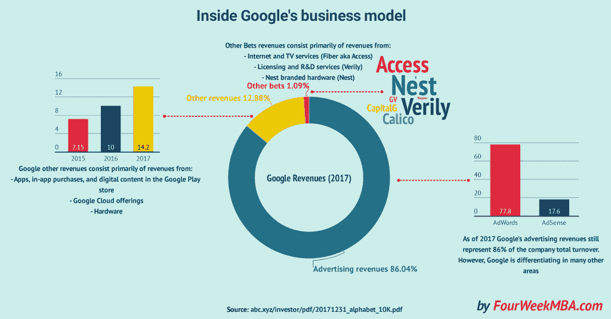
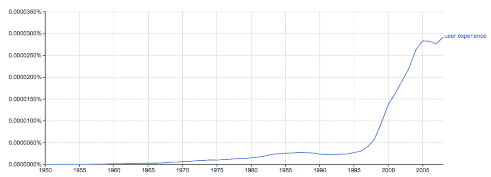
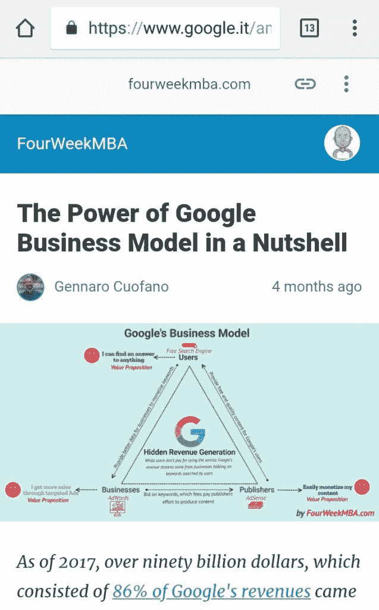
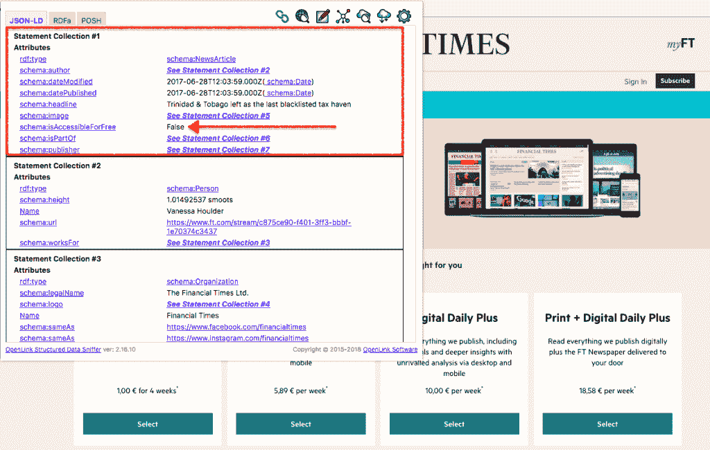
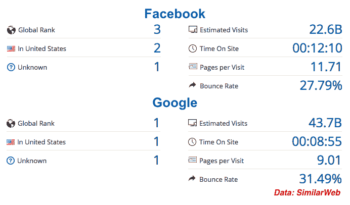
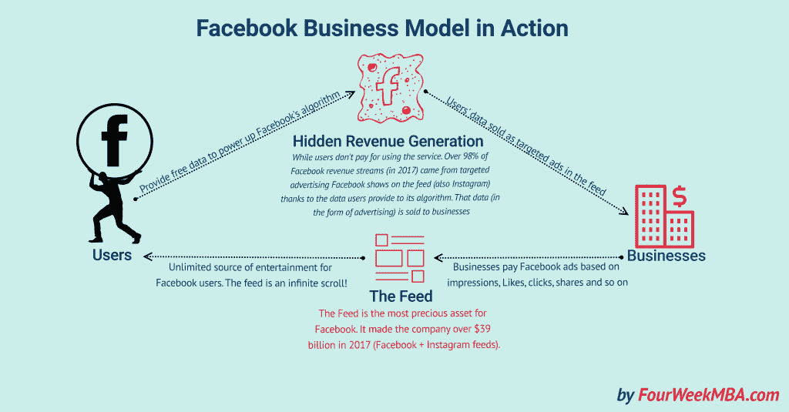

# 好吧，谷歌，你是在寻找语音的商业模式吗？

> 原文：<https://medium.com/hackernoon/ok-google-are-you-in-search-of-a-business-model-for-voice-cc23b35de318>

随着我们转向语音搜索，谷歌在快速发展，它增加了新的功能，在某种程度上让我们感受到以语音为中心的世界可能会是什么样子。在这篇文章中，我想向你展示一些对谷歌搜索结果的观察，以及它们能告诉我们什么是搜索的未来。

先说谷歌现在在哪里，商业模式和搜索方面。

# 今天的谷歌商业模式



在我的博客上，我从几个角度报道了[谷歌的商业模式](https://fourweekmba.com/how-does-google-make-money/)。如果你看看谷歌 2017 年的财务状况，你会意识到这家来自山景城的科技巨头是如何在几个领域拓展业务的。然而，公司的核心仍然是其[广告商业模式](https://fourweekmba.com/google-business-model/)。尽管如此，截至 2017 年，谷歌 86%的收入来自广告。

对于一家估值越来越接近万亿美元的公司，有人可能会问，一家仅靠广告发家的公司能有多可持续？尽管广告本身没有错，但真正的问题是不对称的商业模式，即从隐性收入中获利的模式，如何不唤醒监管巨头(如欧盟)并把他们分开？

虽然企业明白谷歌是一个大的广告页面，他们可以通过对关键词竞价来获得特色。在许多情况下，用户并不知道谷歌创收背后的机制。随着用户越来越多地了解他们的隐私，搜索引擎——如[duck duck go](https://fourweekmba.com/duckduckgo-the-former-solopreneur-that-is-beating-google-at-its-game/)——正在获得动力。如果用户最终更关心他们的隐私，而不是高度个性化的搜索的舒适性，那会怎样？

更糟糕的是，整个行业诞生于谷歌在分享其算法如何工作方面的不透明:这被称为 SEO(搜索引擎优化)。这个行业一直在滚雪球，在点上成为一个数十亿美元的产业。一方面，SEO 帮助谷歌成为一个更好的引擎。事实上，随着 SEO 之间试图对他们的内容进行排名的竞赛——通过了解[谷歌的算法](https://fourweekmba.com/rankbrain-google-seo/)如何工作——谷歌必须迅速发展，以避免被 SEO 行业所欺骗，SEO 行业是由试图进行有机排名而不是对关键词进行竞价的企业支撑的。

进化斗争的过程在很多情况下都是典型的。谷歌这样的商业引擎已经成为世界信息的中心，这在某种程度上加剧了这种情况，这也是事实。简而言之，当谈到信息和知识时，人们可能会怀疑谷歌选择的商业模式是否是正确的。这个问题并不新鲜。在过去的二十年里，这是一个被反复问及的问题。

然而，现在我们正在转向语音搜索，信息可能会变得越来越两极分化，在多个设备中偏向一个答案。更迫切地问这个问题不是更有意义吗？

让我们快速看一下谷歌现在的情况。

# 那么搜索的下一步是什么？

当谷歌开始为网络编制索引时，其“组织全世界的信息并使其普遍可用”的使命也使其成为一种商品。

事实上，通过对数十亿页面进行索引和排序，谷歌成为了一个威胁，但也是一个巨大的分发机会。随着新的博客加入网络，没有出路。要么你被谷歌收录在首页，要么你就会被从网上删除。

这种逻辑持续了数年。因为谷歌的工作主要是基于从一个页面链接到另一个页面的引用机制(所谓的反向链接)来对页面进行排名；多年来，谷歌也开始读取这些网页的元数据。这是描述网页的数据。

换句话说，随着网络的发展，谷歌不断收集越来越多的页面数据。然而，由于该算法无法处理大量数据，谷歌可能没有对这些数据做太多处理；直到 2012 年，它终于开始推出知识图谱。一个由三元组组成的大规模数据库，这使得谷歌能够管理大量的数据，并能够做一些事情。简而言之，虽然过去的所有数据可能都是无用的，因为没有办法对其进行管理。

在知识图谱之后，2011 年，谷歌终于开始用这些数据做一些事情。还有另一个关键步骤。多年来，谷歌一直通过直观的指标来评估内容的质量，这种方法非常有效。然而，随着网络的发展和 SEO 从业者变得越来越聪明，谷歌也变得越来越成熟。

今天，谷歌可能会看到 200 多个主要信号，这些信号的可能组合可能有数千个因素。因此，谷歌越来越成为一个黑匣子，我们都看到它会产生什么。但是没有人能真正理解在搜索和结果之间发生了什么。

不过有一点很关键。最后，网站可以使用一种叫做 Schema.org 的标签，这是一种由搜索引擎开发的词汇，用来给页面赋予意义。而谷歌则通过直接和间接的信号不断评估这些页面的含义。最后，网站所有者可以发表意见，告诉谷歌他们的网页是关于什么的。而谷歌仍然可以选择使用这些数据。很明显，这是网站所有者与谷歌建立更好的沟通渠道的机会。

这也为内容已经商品化的网络提供了替代商业模式的可能性。

# 有价值的内容不是商品:从一开始就应该如此

由于谷歌索引了尽可能多的内容，它也为用户创造了一个无摩擦的体验。如今，科技领域使用最多的词汇之一是 UX，即用户体验。整个想法是关于创造用户想要消费的产品，并且尽可能没有摩擦。



```
*How the term "user experience" grew with Google (mentions of "user experience" over the years in millions of books cataloged by Google)*
```

用户体验随着网络的兴起而增长；毫无疑问，谷歌是其最狂热的支持者之一。今天，有一个缓慢的网站可能意味着搜索不到。当然，谷歌告诉你内容第一。大多数情况下，光靠内容是不会让你走远的。

这种无摩擦的体验成为网络上最重要的指标之一。谷歌也有一套关键参数来衡量这一点。这些是“[以用户为中心的性能指标](https://developers.google.com/web/fundamentals/performance/user-centric-performance-metrics)”，正如谷歌所说:

> *当用户导航到一个网页时，他们通常会寻找视觉反馈，以确保一切都会按预期运行。*

**这是真的吗？**导航启动成功了吗？服务器有响应吗？**有用吗？是否有足够的内容让用户参与其中？**是否可用？**用户可以和页面交互吗，还是页面还在忙着加载？**讨人喜欢吗？**交互是否流畅自然，没有滞后和抖动？**

虽然这完全有道理，但它也创造了这样一种无摩擦的体验，给人一种内容可以商品化的印象。

重要的是用户体验！

现在你可能会说，“伟大的内容不也符合用户体验吗？”嗯…是也不是！

一般来说，直觉上认为好的内容得益于高参与度。如果一条内容很棒，你会把它全部消费掉。然而，要阅读那段内容，你还是得到达那里。猜猜是谁在挡路？是的，G 先生！谷歌是搜索领域的垄断者，也是可以在全球分发内容的工具。

如果谷歌不会让人们阅读你的内容，任何人都不可能体验它。如果没有人体验过，你如何评估用户对该内容的体验？

我这里的意思是，考虑两种用户体验。一个我们可以称之为“技术”，另一个我们可以称之为“经典”说到经常被评估的技术用户体验*先验*(在用户能看到你的页面之前)。谷歌告诉你(基于其以用户为中心的性能指标)，如果你的服务器没有成功响应(这也意味着不够快)，那些人甚至不会访问你的网站。

# 欢迎来到谷歌的独裁统治！

谷歌再次告诉我们，如果你有好的内容，那是第一位的。然而，没有正确的搜索引擎优化策略，伟大的内容可能会注定失败。此外，随着我们向移动搜索过渡，谷歌也开始强加许多出版商不喜欢的格式，这是有道理的。

以围绕 AMP 的争论为例。它代表加速移动页面，是一种移动格式，旨在提供清晰的用户体验。然而，它也从网页中剔除了对出版商导航和盈利至关重要的部分。

正如[凯尔·施雷伯](https://80x24.net/post/the-problem-with-amp/)所指出的:

> *别搞错了。AMP 是关于锁定谷歌的。AMP 意在让出版商与谷歌保持联系。点击一个 AMP 链接*感觉*就像你从来没有离开过搜索页面，AMP 内容的链接会在谷歌的新闻转盘中突出显示。这是他们对来自* [*脸书*](https://fourweekmba.com/how-does-facebook-make-money/) *和苹果的类似格式的回应，这两家公司都旨在将用户留在各自的生态系统内。然而，谷歌对 AMP 的实施比苹果和脸书的同类产品更加广泛和深远。谷歌对 AMP 的实现是在开放网络上进行的，并不仅限于像脸书或苹果这样的应用程序。*



```
*The Google AMP Lock-in experience*
```

当你在做生意或者你的组织的生命依赖于它从网络上获得的可见性时，你有选择不跟随谷歌的要求吗？

作为一名出版商，我明白 SEO 是我战略的重要组成部分。如果我停止使用 SEO 策略，我可能会回到 2015 年。当时我是唯一一个阅读我博客的人，因为我没有从谷歌获得流量，尽管我的内容很好。

像 AMP 这样的倡议也告诉你，最终，谷歌试图创造一个完整的体验，用户没有理由离开引擎(这也可以与脸书锁定相比)，除非他们必须交易，在这种情况下，你被允许这样做，因为这是谷歌赚钱的时候。

随着谷歌算法的最新变化，即所谓的医疗更新，这一点变得更加明显。

# 语音的商业模式:四种可能的情况

我想象了语音搜索的四个主要场景。这些情景中的每一个都或多或少有些道理。除了第一种情况，其他的都是推测。然而，开始具体思考搜索在未来会是什么样子是很有趣的。

# 订阅经济是答案吗？



虽然广告商业模式对谷歌来说相当有利可图，但对在线出版商来说却不是(至少不再是)。随着谷歌能够通过 AdWords 增加其吸引企业花费数字营销预算的能力，它也为博客提供了通过 AdSense 快速赚钱的能力。

AdSense 是将免费内容货币化的最快、最简单的方式，但它是不可持续的。数字出版业已经意识到这一点，这也是为什么一些玩家，如《金融时报》，多年来一直依赖于[订阅商业模式](https://fourweekmba.com/subscription-business-model/)。

在过去，虽然随着谷歌在网上积极地索引网页，订阅业务模式很难运作，你提供的免费内容越多，你就能获得越多的曝光率，从而通过广告赚钱。

然而，截至目前，大型出版商正在回归付费墙和基于订阅的商业模式。有趣的是，现在有了语义标签，你可以指向搜索引擎，网页上有任何人都无法访问的内容(见上图，名为 *isAccessibleForFree，*的属性，你可以设置为“否”)。这意味着搜索引擎知道，即使用户正在浏览页面并快速返回搜索结果，这与用户体验无关，而是与付费墙有关。

这反过来会让出版商更容易建立一个不仅仅依赖广告的商业模式。由于谷歌本身正在新的领域(从[谷歌赌注](https://fourweekmba.com/google-bets/)到[谷歌其他收入](https://fourweekmba.com/how-does-google-make-money/)来源)区分其商业模式，为什么不允许出版商——谷歌有机成果的汁液——做同样的事情呢？

谷歌正在其搜索结果上大量推出新功能。一个有趣的例子是*特色片段过滤器气泡*。这是谷歌提供给用户的一个功能，用于解决一个特定的问题，但也允许他们在几个意图中进行选择。简而言之，一个用户在寻找某样东西时，可能会对同一搜索有几个意图。想想上面的案例；我可能会在纽约找份工作。然而，当我搜索“最值得工作的公司”时，我很可能会搜索其他城市的公司(芝加哥、亚特兰大、达拉斯等等)。

通过特色片段过滤气泡，谷歌可以挖掘用户的想法，并为他们提供越来越多的相关答案。此外，过滤气泡(顾名思义)的一个特点是用户可能会对代码片段中的所有内容感到满意，而无需离开搜索结果。这可能意味着人们将在谷歌搜索结果页面上花费越来越多的时间，这与脸书效应相当。有趣的是，谷歌的参与度指标正越来越接近脸书:



```
*It is important to notice this is a rough estimate that might be far from actual numbers but decent for a quick comparison*
```

虽然谷歌允许用户进出搜索引擎并没有造成任何摩擦，但脸书要求用户注册才能访问该平台。然而，说到品牌，毫无疑问，谷歌是世界上最强大的品牌之一。

即使是一种无摩擦的体验，意味着将用户(基于意图)从网络上的 A 地带到 B 地(现在在许多情况下，用户从不离开引擎),它仍然具有极高的参与度。

在这种情况下，谷歌在满足其搜索意图时锁定用户体验，并允许用户消费她/他正在寻找的所有信息，剩下的只是交易。谷歌不是一个商店，然后它会发送用户在另一个平台上交易。在所有其他情况下，谷歌可能能够通过混合来自几个网站的片段，非常精确地为任何问题提供答案。在这种情况下，谷歌提供的体验可能比网页提供的体验更好，在网页上，发布者只能猜测用户的意图。简而言之，这是一场不平等的战争。

然而，谷歌可能仍然需要来自网上几个网站的摘录，因此向这些网站发送流量。它也将分享收入或某种回报给提供最佳信息片段以满足特定用户意图的 web 属性！

这种情况有替代方案吗？

# 区块链+知识图=谷歌的末日？

如果说有一个词在过去几年里主导了网络，那就是[区块链](https://fourweekmba.com/distributed-search-engines-vs-google/)。对于那些听说过它的人来说，他们可能是在比特币的背景下听说的。然而，中本聪创造的区块链(没人知道那是一个真实的人还是一群人)只是第一个区块链。然而，到目前为止，许多新的区块链协议已经出现，并在几个层面上证明是成功的。

先澄清一下什么是[区块链](https://fourweekmba.com/distributed-search-engines-vs-google/)。这是一个简单的分布式分类账，允许人们在没有中央授权的情况下进行交易。此外，人与人之间的交易(或交换)是匿名的，无法追踪。

区块链最有趣的是它允许人们完全在自下而上的水平上进行交易的能力。换句话说，人类历史上终于有可能在不需要中央权威的情况下创建大规模的商业组织。这意味着什么？这可能意味着官僚主义的终结，但也意味着保留大部分利润并创造不对称商业模式的权力中心的终结。

例如，当脸书收集用户数据时，它通过向他们出售广告来赚钱:



这种模式提供了一种隐性的收入来源，如果我们从业务层面来考虑，这是非常有利可图的。然而，如果我们想到这种模式可能产生的负外部性，人们就会开始怀疑，仅仅因为脸书必须提供更好的广告体验，就让它收集所有这些用户数据值得吗？

仅靠区块链无法解决问题。然而，它可以让数据所有者(无论是用户还是发布者)成为游戏的一部分。

想象一个发布者在其领域之上构建了一个知识图的场景。同一家出版商现在拥有可以让机器(如谷歌)访问的数据，以便他们可以使用这些数据向最终用户提供内容和信息。通过在大规模索引上插入知识图，用区块链机制管理数据的交易和许可可能是一个可行的解决方案。

我们在区块链上建立一个搜索引擎可能是一个乌托邦式的努力(想象一下，区块链必须以超快的速度处理更多的搜索引擎，才能提供相关的结果)。相反，使用区块链来插入出版商的知识图表，让他们管理他们想要共享和许可数据的方式可能是可行的。同时让语义搜索引擎(如谷歌)每天处理数十亿次查询，并基于这些知识图表构建内容。就像谷歌为用户提供片段一样。这些语义引擎可以从由这些大型知识图组成的数十亿个三元组中提取信息，这些三元组附加到区块链上，区块链成为那些出版商可以交易和货币化这些数据的市场。

在这种情况下，将没有单一的所有者，没有单一的公司拥有数据。理想情况下，一个对称的商业模式，出版商利用他们的数据赚钱，语义引擎根据用户的意图提供最相关的结果，并把它们与当地合适的网上商店联系起来进行购买！

# 世界末日的场景:谷歌人工智能全拿走了！

当谷歌首席执行官桑德尔·皮帅在 2018 年 5 月宣布谷歌双工时，展示了谷歌拥有的武器。Google Duplex(一个能够与人类进行复杂对话的机器学习系统)展示了谷歌今天的能力。当然，皮查伊将谷歌双工解释为解决实际问题的一种方式(比如在发廊预约)。然而，它也显示了一种机制的力量，如果释放出来，它已经可以接管许多呼叫中心人员的工作。并不是说有人试图捍卫这些工作。这些可能是世界上工资最低的工作。然而，当我们看到 Google Duplex 的自然语言理解能力时，我们开始怀疑同一台机器是否能够在内容制作方面做同样的事情。

如果网络上有足够的内容来训练谷歌人工智能，它难道不能产生自己的内容吗？

当这种情况发生时，除了它的人工智能，大 G 不需要任何人来满足用户的意图。

如果这种情况普遍存在，这真的是组织信息的方式吗？简而言之，算法能够比人提供更多相关信息的事实是否证明了这种情况的合理性？

*原载于 2018 年 9 月 19 日*[*【fourweekmba.com】*](https://fourweekmba.com/new-business-models-voice-search/)*。*