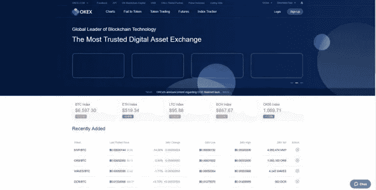
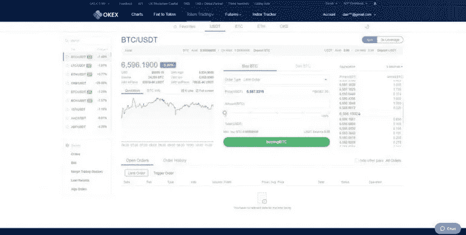
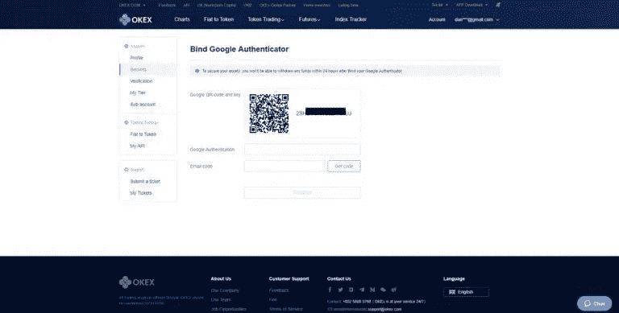

# OKEx 交易所——初学者指南

> 原文：<https://medium.com/hackernoon/okex-exchange-beginners-guide-f83cf764b617>

OKEx 是一个数字资产交易所，起源于中国。这是 OKCoin 的一个分支，该交易所专注于更专业的密码交易员。OKEx 提供了广泛的加密货币对，这为交易者提供了更大的机会，他们也可以直接与法定货币进行交易。

该交易所成立于 2011 年，从交易量来看，它已经缓慢但稳步地成为全球第二大加密货币交易所。OKEx 最近转移到了对加密货币友好的马耳他岛。然而，主要团队仍然在香港。

"我们的创始人是一群来自世界各地的技术专家."OKEx 运营总监 Andy Cheung 告诉我们:“早在 2011 年，他们就发现了一个名为‘比特币’的新概念，并对去中心化的想法感到非常惊讶。通过无休止的阅读和研究，他们自学成才，很快成为区块链领域的专家。然后，他们决定改变他们的创业方向，并推出了他们有史以来第一个数字资产交易所。”

他进一步谈到了 OKEx 的合作伙伴:“该产品的推出很快引起了许多领先风险投资公司的兴趣，其中包括由蒂姆·德雷珀(Tim Draper)联合创立的 VenturesLab，该公司与 OKEx 接洽讨论合作事宜。投资者都对我们的信念和愿景印象深刻，并愿意投资于未来的创新。在几轮融资中筹集了数千万美元，为 OKEx 今天的成功做出了重要贡献。”

# OKEx 有什么特别之处？

就交易量而言，OKEx 是全球最大的加密货币交易所之一。这意味着它在大多数交易对中具有高流动性。截至我写这篇文章时，准确地说，日交易量超过 10 亿美元。

此外，OKEx 以交易费用低而闻名，交易费用从 0.03%到 0.15%不等。这比大多数其他加密交换要便宜得多。

也是为数不多的支持完全独立的单机桌面平台的交易所。这使得在内存有限的中低端硬件上进行交易变得更加容易。此外，OKEx 还支持多显示器，这使得扩展图表视图和其他重要的有价值的信息和数据变得更加容易。

# 如何在 OKEx 上开设和注册新账户

既然你已经决定选择 OKEx，那我们就来讨论一下如何在交易所开户。以下步骤解释了这个简单的过程:

# 第一步:去 OKEx 网站

[访问](https://www.okex.com/)OKEx 网站。提示:将原始网站加入书签，这样你就可以很容易地打开它。有交易者进入欺诈网站并损失金钱的例子。因此，请始终确保您在原始网站上，该网站有其唯一的签名 SSL 证书。千万不要点击未经授权的电子邮件的链接。

# 步骤 2:完成注册过程

点击屏幕右上角的“注册”按钮，浏览简短表格，填写要求的信息。上传所有信息后，点击屏幕下方中间的“注册”。

主屏幕:一旦你注册成功，下面的屏幕打开。

将鼠标悬停在您的电子邮件上，然后按“设置”进入设置菜单。你必须进入设置，从那里你设置“基金密码”在安全标签。这是在您可以转移任何令牌之前所必需的。

# 第三步:设置资金密码并存入资金

要设置基金密码，你首先要绑定你的谷歌认证。要设置 google authenticator，您需要将 google authenticator 应用程序(如果还没有)下载到您的智能手机上，并读取网站上“绑定 Google Authenticator”屏幕中的二维码。

重要提示:二维码旁边的释义是您的备份密钥，用于重置您的 2FA 密码，以防您的手机被盗或丢失。把它放在一个安全的地方，让你的电脑离线。

现在，您可以设置基金密码，并继续将代币存入您的新帐户。存款后，您需要将资金从您的存款钱包(“我的钱包”)转入您的交易账户，该账户称为“现货账户”。

在“我的钱包”部分，您可以查看所有已存入交易所或从交易所提取的代币。一旦你点击一个特定的硬币，它会为该硬币创建一个专用的钱包，并将硬币存储在那里。一旦硬币被转移到你的交易或现货账户，你就可以交易了。

# 第四步:下订单

要下订单，请从主菜单中选择“代币交易”。从那里，选择你的基础资产:USDT、BTC、瑞士联邦理工学院或 OKB (OKex 交换令牌，非常类似于[币安的 BNB](https://cryptopotato.com/binance-exchange-beginners-guide/) )。然后，您会在左侧看到可用交易对的列表。您可以使用搜索栏进行更方便的导航。

选择所需的交易对后，使用屏幕中间的买入和卖出选项卡下单买入或卖出该交易对(如上图所示)。在按下按钮提取命令之前，设置订单类型、价格和金额。

在主页屏幕底部，您还可以分别在“未结订单”和“订单历史记录”选项卡中查看所有未结和已结订单。

# OKB 代币

OKB 是 OKEx 的官方标志，如前所述，OKEx 交易所支持对其 OKB 标志的交易对。令牌是一个 ERC-20 投诉令牌，可以很容易地在交易所交易，在 ETH 和 BTC 市场交易量相当可观。OKB 代币数量有限，有 10 亿，其中 6 亿已经分发给 OKEx 客户，用于社区建设和营销。其余的代币被锁定一至三年不等。

祝你在 OKEx 交易好运。如果你有任何问题，请在下面的评论区留言。

*原载于 2018 年 6 月 21 日*[*【cryptopotato.com】*](https://cryptopotato.com/okex-exchange-beginners-guide/)*。*