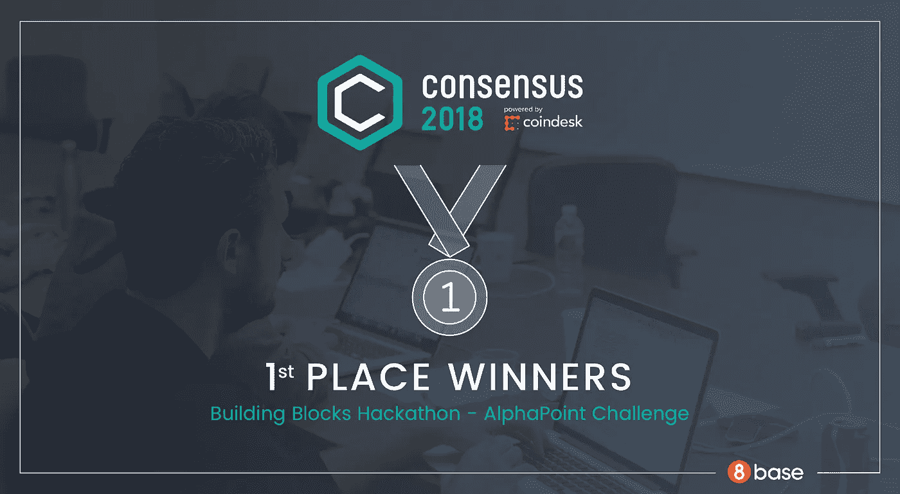
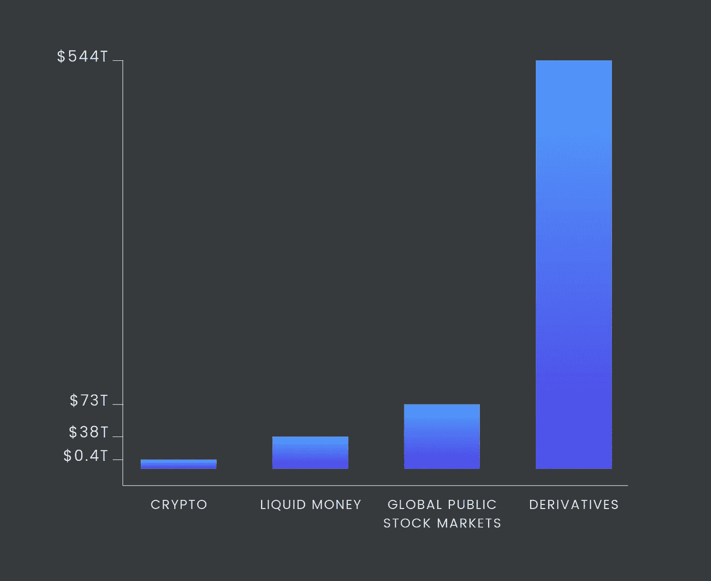

# 链上衍生品:解决 500 美元问题并在 Consensus 2018 黑客马拉松中获奖

> 原文：<https://medium.com/hackernoon/on-chain-derivatives-solving-500t-problem-and-getting-prize-at-consensus-2018-hackathon-fa04b8d3c632>

5 月初，我们几个来自 8base 的人，Evgeny Semushin，Gabe Kelly 和我，决定接受挑战，在纽约市的 [Consensus 2018 黑客马拉松](https://consensus2018-blockchain.devpost.com/)上争夺 AlphaPoint 奖。黑客马拉松共有 33 个参赛团队，还有一些大牌赞助商，如 CoinDesk、微软、IBM、Hyperledger 和 Quorum。

AlphaPoint 挑战赛的参赛者必须开发一个与数字资产交易所相关的应用程序，我们认为我的对冲基金经验应该会给我们带来优势。我们不想简单地为现有的区块链解决方案构建一个前端。相反，我们希望以一种只有区块链建筑公司才能实现的方式，将我们在智能合同开发方面的专业知识与内部财务机制的知识结合起来，专注于解决一个真正的问题。

我们在以太网上建立了一套智能合约，允许通过连锁抵押管理创建分散化衍生品。我们的解决方案使任何人都可以承保任何 ERC20 资产的看跌或看涨期权合同，而无需第三方管理行权和抵押要求。我们很荣幸获得一等奖。

下面我们将描述这个项目的实现细节。

# 问题

衍生品是一件大事。据估计，全球衍生品的市值至少有 500 万亿美元。相比之下，在我写作的时候，大约 0.4 万亿美元的加密，大约 40 万亿美元的流动资金和大约 70 万亿美元的全球股票市场，衍生品在全球经济中扮演的角色就变得非常明显。没有什么比[这张信息图](http://money.visualcapitalist.com/worlds-money-markets-one-visualization-2017/)更能说明这一点了。期权、期货和掉期等衍生品是银行、基金和公司用来管理风险的有用工具。

Market cap of various asset classes

衍生产品协议的关键复杂性源于它们通常被杠杆化的事实——这意味着潜在的风险超过了协议对手在其账户中的资金量。这导致了一个复杂的结算、维持保证金和保证金追缴系统，该系统旨在让交易对手保持一定水平的抵押品，因此退出协议的成本总是比履行协议的成本更高。

这个系统在 2008 年失败了。陷入复杂的衍生产品协议网中，华尔街玩家无法有效地解除或摆脱它们。这引发了追加保证金通知的多米诺骨牌效应，随后的违约导致了雷曼兄弟和其他参与者的倒闭。美国政府不得不介入并拯救华尔街，以帮助解除巨额违约衍生品协议。剩下的我们都知道了…

# 解决办法

[BlockSigma](https://devpost.com/software/blocksigma) 是一组智能合约，支持创建和管理加密资产的衍生协议。抵押品管理是在链上完成的，不需要中介来确保智能合约中锁定的资金满足维护保证金要求。

核心创新是完全的链上利润管理，不需要中心方或 oracle 价格反馈。我们通过集成 [Bancor](https://about.bancor.network/) 协议来实现这一点。Bancor 协议正在被大量采用，并且已经促进了数百万美元的日常交易活动。Bancor 使用确定性价格公式，该公式根据资产的供应和需求进行计算。因此，我们可以直接在链上获得基础令牌价格，这允许我们计算维护保证金要求，并在必要时触发保证金通知。

智能合约逻辑的设计方式是，一旦智能合约中持有的抵押品低于强制保证金要求，期权买方就可以强制平仓。维持保证金公式包括超额准备金，为期权买方提供经济激励，使其密切关注头寸，并在维持保证金水平不满足时通过强制平仓来获取准备金(包括超额金额)。同时，它激励期权卖方(承销商)在交易对他们不利时及时增加更多抵押品，否则他们就有失去超额准备金的风险。

# 履行

解决方案的完整源代码可以在 [GitHub repo](https://github.com/andrei-anisimov/blocksigma/tree/master/solidity/contracts) 中找到。

solidity 文件主要有三个:BlockSigmaBase.sol、BlockSigmaCall.sol、BlockSigmaPut.sol，BlockSigmaBase 实现了通用的逻辑，而 BlockSigmaCall 和 BlockSigmaPut 继承了它，实现了特定于调用或放置合约的逻辑。

让我们看看合同的界面:

现在让我们来看一看看跌合约的主要工作流程。例如，让我们考虑一份以戴为单位的 EOS token 看跌合约，它实际上允许一个人对其持有的 EOS 美元进行对冲。合同的生命周期如下:

1.  任何人都可以部署与特定的[选项系列](https://www.investopedia.com/terms/o/optionseries.asp)相对应的 BlockSigmaPut 契约。在部署期间，我们指定:(1)基础代币，(2)货币代币，(3)到期日，(4)罢工，(5)有权承销该系列合同的发行人的地址，以及(6)每个合同的最低储备要求。例如:EOS 将 2018 年 7 月 1 日到期的期权设定为 10 日执行，最低储备为 2 日。这种合同赋予买方在 2018 年 7 月 1 日之前的任何时候以 10 DAI 的价格向承销商出售 EOS 的权利。在这种情况下，每个合同的维护保证金要求将被计算为 2 +最大值(0，10 -当前 EOS 价格)。
2.  指定的发行者通过存放货币代币的所需储备来承销一定数量的合同。继续上面的例子，如果当前的 EOS 市场价格是 12 美元，发行人将必须存放 2 + max(0，10 - 12) = 2 DAI，以便发行 1 份期权合同。一旦发行，这些合约可以被视为常规的 ERC20 代币，可以转移到交易所出售给买家。
3.  一旦买方希望执行合同，他们需要允许将 EOS 转移到期权智能合同中，然后调用“执行”方法。一旦行使开始，卖方有 24 小时以货币代币的形式交付付款。在我们的示例中，对于每个 EOS 令牌，卖方必须交付 10 个 DAI。
4.  发行人允许将 DAI 令牌从其账户转移到期权智能合约中，并调用“交付”方法。一旦完成，智能合约通过将 DAI 和 EOS 分配给买方和卖方(发行人)并将保留返还给卖方来自动结算交易。
5.  (可选)如果卖方没有在 24 小时内交付，买方可以调用“强制清算”方法，将存放的 EOS 连同准备金一起收回，以弥补卖方的违约。

现在我们来看看担保品管理是怎么做的。在我们的例子中，期权合约发行时的 EOS 价格是 12 美元。假设现在它跌到了 9 美元。所需储备变为 2 + max(0，10 - 9) = 3。这意味着卖方需要为他们承销的每份合同额外存入 1 DAI。如果卖方不这样做，买方有经济动机迫使清算:

*   如果买方简单地行使期权，他们每份合约得到 10 - 9 = 1 DAI 的收益(在市场上以 9 美元收购 EOS，以 10 美元卖给发行人)。
*   另一方面，如果买方强制平仓，他们将获得全部准备金，在我们的示例中，每份合同为 2 DAI。

这促使买家尽快强制平仓，因为这能产生即时利润。

# 挑战

这种解决方案绝不是生产就绪。其主要目的是展示区块链和智能合约在期权合约的自动化结算和抵押品管理方面的突破性能力。传统上，这些服务是由中介执行的，需要人工操作和成本费用。

虽然我们的解决方案显示出巨大的前景，但我们也看到了几个潜在的重大挑战:

*   Bancor 协议没有经过战斗测试。它使用一个确定的价格公式，通过套利收敛到交换价格。尚不清楚这一机制将如何在波动性和/或价格差距巨大时发挥作用。
*   抵押品管理机制也不能幸免于剧烈的价格差距。从理论上讲，卖方的负债可能会大于准备金，在这种情况下，他们可能会违约，而买方不会得到全额补偿。这可以通过提高最低准备金来缓解。或者，就像传统金融中所做的那样，这种系统的用户可以向一个共享的“保险池”缴款，用于在极端情况下自动弥补储备不足。
*   由于 Bancor 使用确定性价格公式，因此可以操纵该公式，以牺牲另一方的利益为代价，为期权合约中的一方提供更好的收益。只有当 Bancor 转换器储备相对于期权头寸的规模较低(即其价格敏感度较高)时，这才是可行的。在这种情况下，操纵 Bancor 价格的成本可能低于通过这种操纵获得的期权收益。然而，这个问题并不是 crypto 特有的，它存在于传统市场中(例如，烧房子来收集保险)。
*   监管不确定性。我们还没有对监管方面进行任何研究，因为除了作为一个研究项目，我们目前还没有计划继续下去。

如果你看到这里没有列出的其他问题，请在评论中告诉我们。

# 总结一下

所描述的解决方案预览了未来几年区块链将给金融业带来的根本变化。它不仅能提高结算和抵押品管理的效率，还能提供透明的、自我执行的规则，以同样的方式适用于所有市场参与者。

*At*[*8 base*](https://www.8base.com/)*我们并不关注本文中描述的特定利基解决方案或协议。随着我们继续驾驭数字化转型的浪潮，我们预计未来几年类似的颠覆性技术将会激增。相反，我们专注于构建下一层基础设施，使业务用户能够轻松访问这些技术，并能够将它们集成到企业软件中，以推动业务成果。*