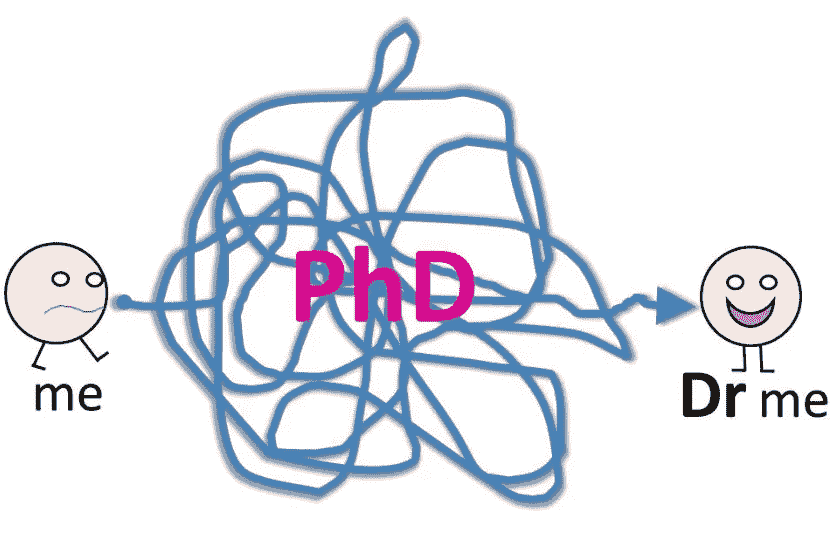

# 为你选择合适的博士学位

> 原文：<https://medium.com/hackernoon/on-choosing-the-right-phd-for-you-d7eaefec93cd>

我是那些在世界上最活跃的领域之一做研究的幸运儿之一。常被视为“现代的电”的领域。是的，我在机器[学习](https://hackernoon.com/tagged/learning) (ML)工作。我研究它的应用来理解图像和视频——计算机视觉。尽管我在这个故事中的观点偏向于 ML，但它适用于大多数博士。

ML 是目前非常活跃的研究领域。有数十亿美元的资金在流动。数百名学者正被公司接洽进行咨询。对于即将毕业的硕士生来说，这意味着大量攻读博士学位的机会。根据我与大约 5 年的 T2 理学硕士项目毕业生的交流经验，我注意到一个共同的特点:顶尖学生被大量的博士邀请所淹没，根本不知道如何选择适合他们的博士。结果，他们后悔浪费了宝贵的时间去读博士。平庸的学生只是随波逐流，去攻读博士学位，然后后悔浪费了时间。所以，我想给你一些不成文的建议，让你选择适合自己的博士。

# 主题

博士学位是一种不断探索未知的磨砺，旨在突破一个领域中特定微小区域的边界。正如[安德烈·卡帕西](https://medium.com/u/ac9d9a35533e?source=post_page-----d7eaefec93cd--------------------------------)在他的博客中所说，“博士学位同时是一段有趣又令人沮丧的经历”。所以为了最终获得一个好的博士学位(在 *n* 年内)😃)，最好是在你的领域内选择一个你极其感兴趣、令你兴奋或者一直以来都令人兴奋的话题。不被任何其他物质诱惑所诱惑是非常重要的，例如:

*   声望很高的奖学金。大多数学生接受这些奖学金，认为它们能让简历看起来更好。不要忘记，这些奖学金对学生的要求很高:严格的指导、按时完成任务、做报告、不完全学术的导师等等。结果你失去了做研究的乐趣。在我看来，你在博士期间发表的论文比仅仅赢得一份享有盛誉的奖学金来让你获得博士学位要有价值得多。你的论文可以带来认可，你获得博士学位后的职位可以为你赢得高薪。
*   工业博士学位。工业博士工资不错。然而，在我看来，为公司做一个项目和做一个行业资助的博士学位没有太大的区别。这项工作往往过于应用于投资公司，通常期望能使公司或其产品受益的结果。
*   **热门话题。**正因为深度学习是一个热门话题，所以开始攻读它的博士学位可能极具诱惑力。当你完成的时候，学术团体可能已经继续前进，并且在你的领域的不同领域大量生产论文。所以，坚持做一些让你兴奋的事情是在博士研究中生存下来的更好的方法。

所以，简单地选择一个你感兴趣的话题，它会让你坚持很多年。偏离你开始的地方是很正常的。但即使是随波逐流，我也一直看到学生呆在他们主管的专家区，不会漂得太远。

# 位置

我所说的地点是指你将要工作的城镇/城市。我的大多数朋友都拒绝了博士职位，仅仅是因为这个实验室位于世界某个角落的一个小镇上。

*   值得注意的是，一些极其熟练的科学家和教授出于个人原因，更喜欢在这样安静的小镇工作。我倾向于认为，沿着这种小镇的街道和公园安静地散步可以引发创造性的想法。
*   对于一个学生来说，在这样的地方工作的一个好处是花费更少。考虑到博士的薪水，即使在博士期间，在这样的地方工作也能省下一大笔钱。
*   没有机会每周五晚上聚会。因此，你可以更专注于你的论文，它本身就具有足够的挑战性，可以在 3 年内完成。参加聚会和课外活动只会延长你的博士生涯。

所以，当你有机会和一位著名的主管就一个非常有趣的话题一起工作时，为什么还要为你在哪里工作而烦恼呢？如果你在博士期间表现最好，你可以在你选择的城市获得一个博士后职位😃。

# 尺寸很重要

一些研究小组倾向于发表不同主题的文章。例如，一个小组可能在计算机视觉、机器人和医学成像领域发表文章。如此多样化的群体表明了以下两种情况之一:

*   你的导师是一位世界知名的教授，他可以通过雇佣非常熟练的研究人员来管理如此庞大、多样化的团队。
*   该小组是跨学科的，因此他们需要在多个领域开展工作。

在这样一个大群体中，一个令人痛苦的事实是，主管根本无法跟上每个学生的进度。例如，教授很难在 CV、ML、NLP 的每个会议上阅读论文。所以他们倾向于按照等级制度来管理团队。他们雇佣不同领域的博士后专家。博士生反过来得到博士后的指导。查看你潜在上司在过去 3-5 年的出版记录，很容易识别出这样的群体。

*   如果这个团队是等级森严的，那就和即将成为你上司的博士后谈谈。因为你会和你的博士后讨论你的问题。然而，要做好在这种环境下独自工作的准备，因为你的博士后会忙于开会、写报告等等。
*   如果你的团队很小，只专注于某个领域的 2-3 个领域，那么你可以期待你的主管给予你更多的帮助。他/她会很想从你这里得到好的出版物，而这些出版物又会带来赞助，这反过来又会扩大你的团队，这样的循环就会持续下去……

“小即是美”说到群体规模。但如果你可以一个人完成所有的事情，那么你可以选择一个大的团队，独立工作，身边会有很多独立的事情发生。

# 出版风格

在我看来，学术界有两种出版商:质量出版商和数量出版商。

*   数量出版商希望在某一年发表大量论文。所以他们会把论文送到研讨会或者世界某个角落的一个不起眼的小型会议上。对他们来说，重要的是在他们的出版物列表中获得另一篇论文。
*   高质量的出版商往往注重论文的质量。所以他们会等着把论文送到顶尖的会议或期刊上。为此，他们耐心地做了大量实验，以便令人信服地论证他们在论文中所做的陈述。当然，他们也是被引用最多的群体，因为他们一直在推动最先进的技术，所以他们的作品往往会得到国际认可。

所以，如果你发现你的潜在主管一年有 30 份出版物，要持怀疑态度。在一级会议或期刊上发表 3-5 篇文章的主管可能是更好的合作对象，原因仅仅是人们期望你发表高质量的论文，而不是大量产出。

# 自由

攻读博士学位的乐趣之一是，作为一个有创造力的人，大多数时候你可以做任何你想做的事情，至少在你工作的领域内是这样。但可能不是这样:

*   你的主管可能对自己的想法很坚定，并且总是期望你尝试和试验他的想法。
*   或者，他/她可以让你来领导“你的”工作，在你完全陷入困境或需要更多计算能力或一些设备等资源来进行实验时为你提供指导。

首先，要三思你是什么样的人。你了解这个领域的最新动态吗？你能提出自己的想法，并通过实验证明这些想法是值得的吗？如果是这样，您可能需要使用后一种监管方式。与你的潜在主管的团队成员交谈，了解他们是如何提出想法、实现它们、发布和迭代这个过程的，这是非常值得的。

# Group Mates

虽然读博士是一个人的旅程，随着时间的推移，发表论文的压力越来越大，但你往往会花很多时间和你的团队成员在一起，时不时地和他们喝几杯。他们可能不会对你有太大的帮助，即使他们想，因为他们的专业知识将在不同的领域。但是他们定义了团队的能量和士气。团队可以通过简单地鼓励你的旅程给你带来积极的氛围。或者他们可以简单地在 5 分钟的午休聊天中对你恶语相向，从而摧毁你的信心。所以，当你选择承诺 3 年以上的时候，你潜在的团队伙伴的能量和士气永远不要被低估。

在选择和他们一起工作几年之前，尽可能多的和潜在的团队成员聊天。确定团队中运行的工作文化的细线。

# 其他承诺

对博士生的一些其他承诺可能是:

*   教授课程和准备课程材料
*   指导理学硕士论文
*   在实验室指导学生

所有上述技能对于希望从事学术职业的人来说都是非常有价值的。但是他们也消耗了你 3 年宝贵的研究时间。你愿意作为一个尝遍了学术界方方面面的全才毕业吗？或者你愿意在博士期间专注于纯研究，更不用说在职业生涯的后期教学和指导他人了？

# 预期

在所有其他因素都固定的情况下，一些导师只是希望学生们自己动手，想出主意并得到结果。这是因为博士学位是将你塑造成独立科学家的唯一机会，他可以不断地推动这个领域向前发展。

有些主管会给你很多帮助。他们与你讨论所有你需要尝试的想法。如果你在做实验，他们会写论文。如果您正在编写解决方案，请为您的论文计算数字。

你和“只有你”知道你想和谁一起工作。你可以通过观察自己在做理学硕士课程时的表现来评估自己。你一个人工作吗？你喜欢团体项目还是独立项目？

# 结论

与其他学位不同，博士学位的价值在于你的贡献！如果你选择了正确的主题和正确的人，你更有可能成功。接下来是所有其他的。我希望这篇文章能帮助你在踏上旅程之前做出正确的决定，而不是事后后悔。博士快乐！😄

**另外注意:**以第一作者的身份发表几篇论文是一个研究生涯的起点。博士学位是一条明确的途径。但是在一个小小的世界里，不是有很多条路通向同一个目的地吗？😏