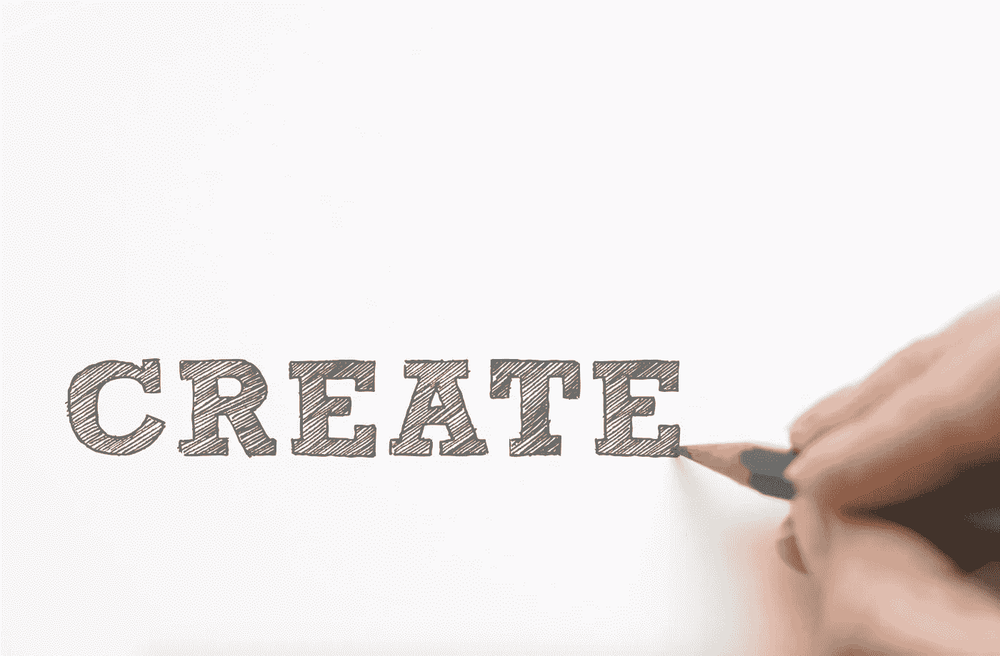

# 设计你通向更美好未来的道路

> 原文：<https://medium.com/hackernoon/on-designing-your-way-to-a-better-future-a9e0c3e4e151>

[Image from here](https://www.pexels.com/photo/close-up-of-hand-over-white-background-316465/)

## 当你“感觉被卡住”时该怎么办

“你有问题。你的朋友有问题。我们都有问题。”

这句话来自《T2》的《设计你的生活》(T3)，这是一本畅销书，作者是斯坦福大学一个非常受欢迎的班级的教授。

事实上，根据作者之一*[*的说法，这个课程的兴起是因为每个人都有问题，他们需要一个好的解决方案。*](https://www.thestar.com/life/2016/09/30/figure-out-your-life-with-help-from-a-couple-of-stanford-professors.html)*他这里指的问题不是别的，正是“弄清楚我们的生活该怎么办。”**

**我肯定有这个问题，结果经常发现自己有卡住的感觉。**

**我有尚未实现的梦想，尚未达到的里程碑。我不知道 5 年后我想做什么，但我知道我想做得更多。**

**如果要我猜的话，这种被压得喘不过气来的感觉，不知道该做什么或如何摆脱困境的感觉，是我们许多人都能体会到的。**

**然而，那些最终能实现目标的人和那些不能实现目标的人之间的区别在于他们如何对待这种感觉。**

**从*设计你的生活*中最大的收获是*“构建你的前进之路”***

**它的理念是像设计师对待应用程序一样对待生活。**

**您从一个(或几个)原型开始。你从那里开始迭代。让你得到最终产品的不是坐在沙发上 24 小时思考怎样才能得到最好的用户体验。**

**你画样机，你 A/B 测试不同的想法，经过几次迭代，也许你最终达到了想要的流量。**

> **“设计师尝试事物。他们测试东西。他们创造了一个又一个原型，但经常失败，直到他们找到可行的方法和解决问题的方法。”—比尔·伯内特和戴夫·埃文斯**

**通过反复试验，我发现，对这种“被卡住的感觉”最好的治疗方法就是离开沙发去做事情。**

**书中的几个例子分享了一个主题，它们都引起了我的共鸣。这是人们被困在自己不喜欢的工作中的主题；每天他们看着时钟移动，尽快打卡下班。然而，他们觉得自己无能为力。**

**我也去过那里。**

**在过去的几年里，我的生活经历了一系列的原型。**

**它始于我放弃了以前的医学预科生活，彻底放弃了生物学。**

**就像这本书的作者戴夫·埃文斯一样，我研究了生物学并坚持了多年，因为我有一个错误的信念，那就是我的命运是成为一名生物医学研究者。我的父母都有生物学背景，并担任教授多年。**

**当我最终决定退出时，我不知道软件工程是我的职业。我怎么会有？我从来没试过。但是我知道我不喜欢做研究或者在学术界。所以我做了些事情。**

**我在训练营外的第一份技术工作有几个月很有趣。它很快变得令人厌烦，因为我花了大部分时间在小功能上。我希望对代码库和范围更大的项目拥有更大的所有权，所以我加入了一家较小的创业公司。**

**我与体重和自我形象作斗争。我尝试了尊巴舞、跑步、普拉提、瑜伽和许多其他形式的锻炼。虽然我喜欢它们，但我对它们并不感兴趣。我不能把它们中的任何一个作为我每周至少做 2-3 次的事情。然后，我尝试了钢管舞。我找到了我的使命。**

**是的，虽然可能还有很多地方我还没有去过，但是我已经比以前在这条路上走得更远了。我每天都在加速向前冲刺。**

**摆脱困境的秘密，或者说根本没有秘密，就是做事情。**

**你不必没完没了地思考该做什么或该做什么。你只需要从一个想法开始，然后从那里迭代。**

**我知道我一直喜欢表演。无论是进行技术展示、演讲，还是舞蹈表演，我都喜欢做一名表演者。**

**我在大学里探索了各种舞蹈团体，但是我发现我不是特别喜欢团体表演。然后，我开始在 S Factor 跳舞，每节课结束的时候都在导师和其他同学面前表演。然而我想要更多。我报名参加了一个高级异国情调夜总会的演出，发现自己过着一种令人激动的，虽然短暂的双重生活。现在，我在美国各地参加各种钢管舞比赛。**

**我发现竞赛令人难以置信地充满活力和乐趣。我喜欢编排新的套路，完善新的技巧，最后，上演一场超出我自己预期的表演。**

**花了几轮迭代才找到这个满意的活动。我当然不是坐在那里想出这个主意的。我做了一些事。**

**工作效率的头号杀手是缺乏清晰和直接的行动项目。这同样适用于我们对待生活的方式。**

**拥有行动项目并坚持下去会给我们能量，让我们处于一种心流状态。**

**在测试任何一个原型之前，花费额外的几周或几个月去思考 100 个不同的原型是没有意义的。**

**进入流畅的状态。**

**停止思考，开始行动。**

> **"生命设计是原型和实验的迭代过程."**

**我是陈莉莉，白天是软件工程师，晚上是作家和钢管舞者。**

** [## 陈莉莉(@lilychendances) * Instagram 照片和视频

### 636 个关注者，275 个关注者，197 个帖子-见来自陈莉莉的 Instagram 照片和视频(@lilychendances)

www.instagram.com](https://www.instagram.com/lilychendances/)**