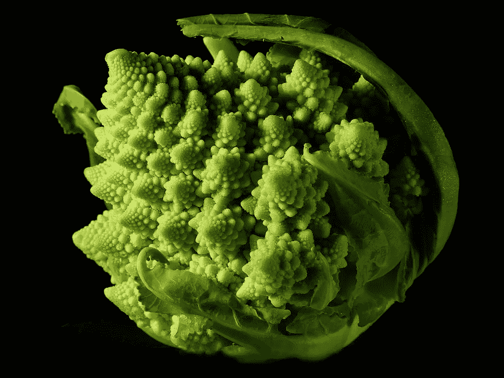

# 涌现论

> 原文：<https://medium.com/hackernoon/on-emergence-40ced92012bd>

自然中的一些概念对我们人类来说比其他人更难理解。简单的事物如何演变成复杂的事物是其中一个概念。例如，一个白蚁群体在它的低层有一个复杂的冷却系统。没有一只白蚁知道它是如何工作的。完全不知道最终的结果，他们建造复杂的土堆和巢穴，保护他们路径的遮蔽管道和连接他们“城市”的地下隧道网络。一切似乎都是有组织有计划的，但事实并非如此。进化给白蚁配备了信息素受体，通过简单地计算做同样事情的相邻白蚁的数量，告诉白蚁应该从事什么任务。如果工人过剩，他们就会成为战士等等。简单的规则产生复杂的结构。自然界到处可见的分形图案是另一个例子。分形看起来很复杂，但实际上并不复杂。它们基本上是算法。同样的模式，一遍又一遍地重复，只是起点略有改变。人脑是复杂事物从简单事物进化而来的极好例子，我们人类仍然很难接受它不是被设计出来的。宗教本身是从人类互动中产生的新兴系统，对我们是如何产生的提出了过多的解释。各种各样的野生起源的故事已经被更广泛地接受，而不是简单的解释，即我们的复杂性只是从更简单的事情中出现，遵循自然本身为它们提供的一套规则。

复杂的系统总是从人类的互动中涌现出来。你口袋里的手机是一个世纪以来自由的全球市场竞争的结果，没有一个人能想出完整的东西。这个设备，连同它的互联网连接，比它的单个部分的总和有更多的功能。一个可以即时访问世界上几乎所有文学、音乐和电影的设备可以放在你的口袋里，这在仅仅 20 年前还是不可想象的科幻小说。十年前，中本聪的白皮书首次描述了比特币，其设计目的是去中心化，但直到多年后，网络才开始显示出这一点的实际证据。*健全的货币，*或绝对的数字稀缺，*从网络中脱颖而出*不仅仅是因为它的技术设计。比特币的第一个十年实际上是如何结束的，这在真正的去中心化如何出现的过程中扮演着*巨大的*角色，这也是为什么这个实验不能被复制的主要原因。互联网上的稀缺*只能发明一次*。Satoshi 的消失可以说是走向真正去中心化的第一步。没有任何营销，谁先跳上火车的随机性是另一个原因。比特币确实有一个完美的概念。特别是在过去几年中，该网络对变革表现出了显著的抵制，鉴于该网络的规模及其共识规则中 95%的一致阈值，其当前状态可能是其最后的化身。它可能再也不会改变了。在那种情况下，一种新的复杂的生命形式从一套简单的规则中出现。即使将来实现了小规模升级，2100 万枚硬币的供应上限也永远不会改变。比特币不应该由人类来评论，它的存在与人们对它的看法无关，它应该被研究而不是被讨论。我们还不知道真正的稀缺和真正的全球匿名自由市场会对我们的物种产生什么影响，但我们即将找到答案。不这样想是天真的。

各种未来学家和末日预言家最近一直在关注即将到来的人工智能奇点的危险，警告我们不要回头，人工智能可以比任何人都更快地改善自己。正如新闻主播罗恩·博根狄所说，这种情况可能会迅速升级。这可能是我们真正关心的问题，也可能不是，但与此同时，就在我们眼皮底下，另一种不可阻挡的数字生活已经出现，它已经改变了全球数百万人的行为和偏好。这对大公司和政府来说可能是坏消息，但对寻求一点自由的小人物来说却是好消息。至少我们这些倾向于奥地利经济学派和自由意志主义的人是这么认为的。这一次，我们*将*找出事实是否如此。没有人知道它会导致什么，从这个新的现实中会出现什么新的东西。

不像白蚁，我们人类能够体验我们进步的宏伟。我们可以敬畏地看着西斯廷教堂或金字塔，我们可以深入研究比特币的技术细节和简史，并在此过程中发现思考价值的新方式。金钱是我们相互表达价值的语言，而现在这种语言是由计算机来说的。用这种语言表达的价值不能再被通货膨胀或伪造冲淡了。这是一种无国界、无权限、对等、匿名(如果你有技能的话)、不可复制、完全稀缺、不可分割、不可改变、不可触及、不可否认、可替代的语言，地球上的每个人都可以免费使用。它是一种面向未来的语言，产生于过去一系列特定的随机事件。