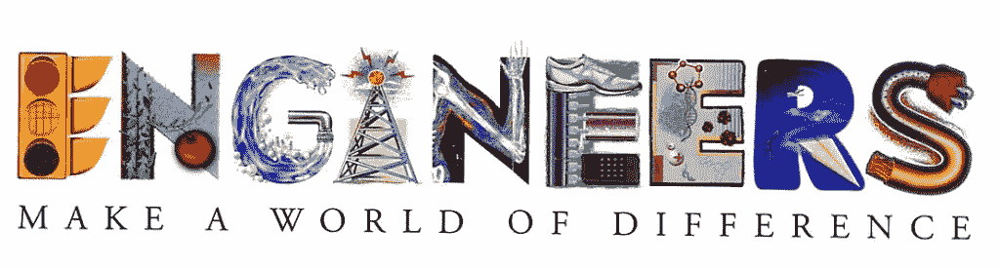
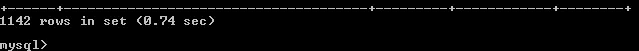
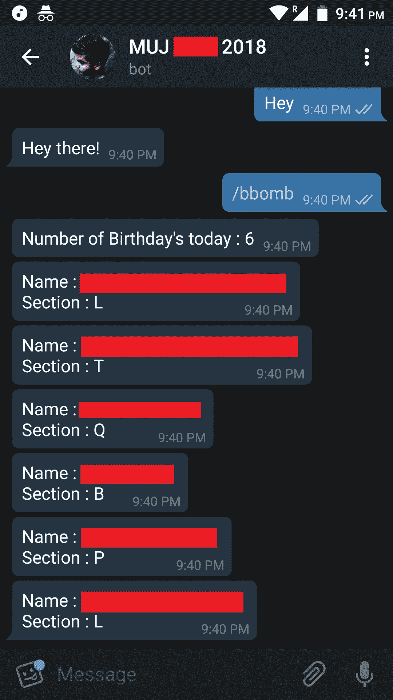

# 在印度的工程师日，17 y/o 向“黑客之道”致敬

> 原文：<https://medium.com/hackernoon/on-engineers-day-in-india-a-17-y-o-pays-tribute-to-the-hacker-way-3ca8e35a0bfd>

*嘿，我是* ***皮尤什拉杰*** *。仅此而已。我们开始吧。好的，我们开始吧。*

所以，这是一个*长-短-有点-中等长度的*故事，当我在我们的大学校园网站上做**侦察**时，有人喊出了一个关于工程师日的迷因，我忽略了它，但有些事情正在发生。

跳来跳去之后发现了中等级别的**漏洞**，很兴奋地 *…好了好了。*
**格式错误的请求** *(句号)*

那是**时间**凌晨 2 点。在黑客攻击和*泄露敏感的学生数据*之后，我变得很无聊，因为除了找乐子之外，我不做恶意的工作。是的，这仍然是非法的，但我知道还有一线希望，我猜？)

“无聊”的另一个原因是我必须做一份完整的 Bug 报告。

*Duh. Boring.*

我走出我的小**洞穴**带些东西给我的朋友们吃，因为他们正忙着看一些*【XYZ】*网络系列节目。

是的，我还没有一个像《社交网络》中的团队。 **\_(ツ)_/** **(尚未)**

One of my favorite scenes ❤

***沿…*** 向右移动

在电梯里，当往下走的时候，有东西发出咔嗒声，余波是所有楼层的按钮都发出咔嗒声。
*(把电梯停在最近的楼层，很明显，我没有吓坏，真的，真的，…好吧随便了..)*

跑进我的宿舍，跑进我的**洞穴**，*之后，看着一张张悲伤的脸，因为我什么都没带*，我打开笔记本电脑，看了看数据，几秒钟后，我意识到我已经制定了一个完整的计划。

*忘了说那天晚上早些时候发生的事了，我们回滚()！*

## 一个男孩在午夜 12 点被打了！

不，我不是在开玩笑，我是认真的。
如果你不知道的话，在**印度** *(国外的院校我就不知道了)*的大部分院校里，有一个仪式，谁过生日，谁就被同龄人暴打一顿。所以， ***我们大多数人都试图隐藏它。***

> 我做到了，我哥哥做到了，几乎每个印度学生都是这样做的。

你现在看到电梯里的按钮了吗？*(如果是的话，* ***嗨五！，*** *不，不是按钮)*

是的，我基本上是去建立一个..a..
*(没想到海扁王那个时候逗号这么烂的名字，..文件夹的名字叫* ***工程出生-天-揭示-eer*** *，我知道，哑名。)*

# 生日克星

> 这是“事情”，或者说“酷狗屎”，如果你想在乔布斯的鞋子。

Meme made by Piyush Raj ❤

# 该过程

经过一些预处理后，我开始构建一个定制的数据库。
*(没错，印度高校不太看重安全)*

在建立了一个包含 1142 名本科生和数百名其他年级学生的完整数据库后，我终于开始编码了。

*我不得不承认，处理*`***datetime***`**模块很有趣！**

**

*Oh great, I do remember the number of students*

*在做了一个基本的 **CLI** *(命令行界面)*之后，我想，
*“不会用的，嗯，因为它不是*的*****MIT****，它只是 MIT 或者说碰巧是 MIT，我不知道。”**

**(迷茫？去我的博客看看。说真的，你应该马上跟着我。)**

# *电报机器人集成*

> *电报广为人知，是“给 Z 世代的**药**”。*

*快速读取 Telegram API，编写脚本通过 Telegram 和我的*后端*和 **CLI** 进行通信。*

*基本上，我只是编写了一个电报机器人。*

# *结果呢？*

**

*Looks cool?*

*这是我在晚上 9:35 左右吃完晚饭后，坐在食堂楼梯上写完的一篇基础文章。*

*这是不言自明的。就是这样。
哦我忘了，我准备在下一次迭代中加入**自然语言处理**，..大概吧。*

# *反应如何？*

> *它是混合的。真的真的很杂。*

*当我发布它时，它最初**爆炸**，每个人都疯了。分散在我们学院的各个聊天群里。一些人喜欢它，另一些人害怕并虐待我。有些人喜欢我巧妙使用数据的方式，有些人不喜欢。有些人还威胁我。
我的应用成为了*震中*数小时。*

*但是，重要的问题是*

## *我的反应是什么？*

**

*Yeah, that was me while all this was happening.*

**(那是因为* ***我没有公开发布过这个 bot****，没有使用过 DOB(出生日期)之外的任何个人资料*蛮无害的*。我没有发布漏洞利用代码，也没有告知漏洞，我打算报告 bug。)**

# *密码？所有的技术细节？*

*嗯..是的，关于那个..*

**

*Another meme generated by Piyush Raj ❤*

> *科学和迷因像冰棍粘在舌头上一样粘在一起。作者 Piyush Raj*

*其实刚刚过了两天**工程师节** *(剥削服务器)*
*aaand*我还没做 Bug 报告。*

## *数据库？*

> *由于它包含敏感信息，我真的不能发表。*抱歉。**

***好吧，至少，骨架码？***

**我会*[***Github***](https://github.com/0x48piraj)*它。别担心。****# Hacktoberfest****来了！**

# *要诀？*

*你可以这么说，
*这家伙不想贴源代码，基本上他就是个混蛋。**

*我更喜欢用这种方式来陈述，耐心点，好事需要时间。*

**选择适合自己的。**

**嘿嘿！走之前，我想问你一件事，因为你已经读到这里了！那么告诉我，你确定“乔布斯”是正确的吗？你为什么不选择乔布斯的？**

*嗯，我问自己，然后谷歌了一下。
*(基本上我想听到的是，“嘿！他是好奇型的家伙")**

* [## 以 s 结尾的名词所有格:史蒂夫·乔布斯的还是史蒂夫·乔布斯的？|问编辑

### 谢谢这个问题。因为你不仅问哪种形式是正确的，还问哪种形式应用更广泛…](http://learnersdictionary.com/qa/the-possessive-of-nouns-ending-in-s-steve-jobs-s-or-steve-jobs)* 

# *后果*

> *一如既往的有趣。*

*我很快意识到，如果我通过做一些事情来庆祝每个国家的每一个工程师日，那将是多么有趣啊..*

 *[## 世界各地的工程师日- WFEO

### 标有*的日子每年都一样联合国教科文组织非洲工程周 2017 年 9 月 25-29 日欧洲工程师…

www.wfeo.org](http://www.wfeo.org/engineersdays/)* * [## 工程师日-维基百科

### 印度各地的工程界在每年的 9 月 15 日庆祝工程师日，作为一种非凡的致敬…

en.wikipedia.org](https://en.wikipedia.org/wiki/Engineer%27s_Day) 

Yeah, It’s on! ❤* 

# ***关于作者***

**Piyush Raj 是一位刚满 18 岁的 y/o，他是 Uvolve 的创始人，也是 2017 年谷歌代码贡献获奖者。**

**与他连线进行技术暨逻辑会谈和兔女郎上*[***Twitter***](https://twitter.com/0x48piraj)**或*[***LinkedIn***](https://linkedin.com/in/0x48piraj/)*。***

*****加油。*****