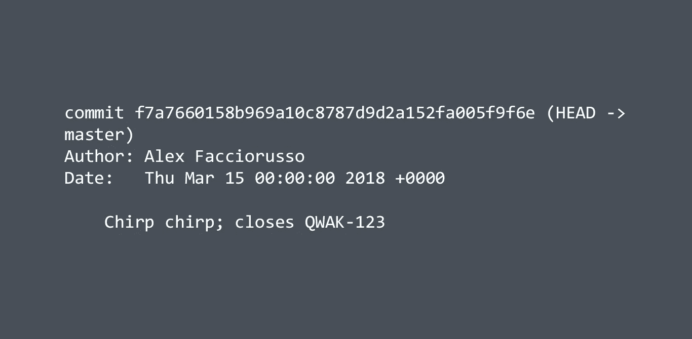

# 关于 Git 提交消息和问题跟踪器

> 原文：<https://medium.com/hackernoon/on-git-commit-messages-and-issue-trackers-f700f3cbb5a7>

## 重新思考我们的提交消息结构。



Git 是最常用的[版本控制系统](https://en.wikipedia.org/wiki/Version_control)，用于主要基于文本文件的项目，如源代码等。

如果你在一家公司工作，在一个团队中工作或者独自工作，你可能也在使用一个问题/项目追踪器，比如 JIRA 或者 GitHub、GitLab 和 Bitbucket 中的那些。

这些软件的优点是我们可以创建“问题”或“标签”，每一个都跟踪我们软件中单个特性或错误修正的[开发](https://hackernoon.com/tagged/development)。
他们的工作方式是为新创建的标签创建并分配一个 ID——可以是数字，也可以包含一个简短的项目标识符，如*ALX-1231*——这样你就可以在聊天、群组、**提交**等中轻松引用每个标签。

## 提交，提交，提交

如果我们至少使用过一次 Git，我们就会知道标准的提交消息结构是:

```
Commit summary description; corrected my horrible bugLong description (sometimes called "body"), with things like:
 * bulleted list of changes;
 * other change;
 * chirp chirp
```

注意摘要和主体之间的新行:Git 并不强制执行它，但是如果我们想要指定主体，我们需要**来插入它，否则提交将不会以正确的方式被解析。**

许多团队有一种默认的方法来引用用跟踪软件创建的票据，将问题 ID 放在提交消息本身中。

我看到比较多的标准是这样的:

```
ALX-21313 Done that fancy change; now we have cats in the UI
```

看起来不错，可能你正在你的开发工作流程中使用它。但是我想说说为什么我觉得这个结构不是最好用的。

## **1。在我们的提交消息中使用问题 ID 作为一等公民并不是最好的做法。**

我们有 Git，然后我们有一个单独的系统来管理问题。在未来的某一天，后者可能会停止工作，被抛弃，它的数据库可能会因为一个错误而被删除，或者其他任何事情。在那一刻，我们将意识到我们的 Git 消息将有一个一致的部分，没有更多的意义。**问题跟踪器不是 Git 回购的一部分。**

## **2。问题 ID 浪费了宝贵的空间，而这些空间可以用来解释我们在提交中做了什么。**

提交摘要应少于 50 个字符。为问题 ID 附加 6/7 个字符意味着我们将有 6/7——但可能更多——更少的字符用于描述所做的更改。

是的:我们可以将全文写入描述中，但或许我们可以使用这 7 个字符来适应摘要中的内容**，然后**在描述中写入问题 ID(在文章末尾剧透我的解决方案)。

除此之外，根据我的经验，我发现在“真正的”提交消息之前使用 IDs 的开发人员倾向于在摘要中写些什么，因为他们在心理上倾向于这样一个事实，即谁将阅读消息，将检查票证本身以获得更多的细节。这将需要他的时间；原本用于生产的时间。这还没有提到问题管理器本身暂时或无限期不可访问的可能性。

## 3.提交后，链接问题的性质及其状态尚不清楚。

一个问题可以有不同的类型。可以是一个 bug，一个新特性等等。

如果我们只是把它的 ID 放在消息的前面，那么检查我们项目日志的人不会知道这个提交是修复、关闭还是仅仅引用那个特定的标签。要获得更多信息，他必须再次去找问题经理，打破其工作流程。

## 4.很多问题呢？一点问题都没有吗？

假设我们的提交修复了三个标签，因为它们非常相似(有时 QA 可能会创建不同的问题，而不知道它们是由代码中的同一个 bug 引起的)。

我们会有这样的东西

```
ALX-12323 ALX-12324 ALX-12325 Something fixed finally
```

是不是很丑？

而相反的呢？当我们正在做一个微妙的改变，比如纠正评论中的一个错别字。我们不能仅仅因为纠正了一个无关紧要的评论中的一个词就开罚单(我们可以，但我认为这有点偏执)。

因此，我们将有一个没有初始提交的提交消息，导致与其他提交消息非常不一致。

## 我建议的方法

如果我用前面的观点说服了你，最常用的格式并不那么有用和完美，现在我将解释我最喜欢的 Git 消息方法。

我们要做的第一件事是**概要地解释代码的变化**。不要看问题/票！看看你们的变化，简单描述一下我们整体的变化。

```
Renamed MyUglyTweet to MyBeautifulTweet
```

如果我们在这个提交中做了很多更改，描述这些更改的主要目的，然后我们将在**提交主体**中继续解释(如果需要的话):

```
Added little birbs to the homescreen * Updated BIRDS_NUMBER constant;
 * created the interface Chirp and implemented in ChirpImpl;
```

"好的，亚历克斯，但是我们应该什么时候把我们的问题 id？"
一旦我们完成了对我们所做的每一个修改的总结，让我们决定把我们的票标识符放在哪里。

如果我们的提交只包含关于一个票证的更改，我会遵循下面的路径:如果摘要中有足够的空间，我会在问题前面附加一个动词，描述它是如何相关的。例如:

```
Added little birbs to the homescreen; closes ALX-1434
```

我们可以使用 closes、closed、close，只要这个动词确定了我们在票据上做了什么。对于特性票，我使用 close，但对于 bug 票，我通常使用“修复”或“已修复”。

> 对于这些动词，或者*关键词*，我们可以在这里检查[https://help . GitHub . com/articles/closing-issues-using-keywords/，](https://help.github.com/articles/closing-issues-using-keywords/)因为在提交中指定这些可以帮助一些问题跟踪器(比如 GitHub one)在功能分支与我们的主开发分支合并时自动关闭我们的票证。

如果摘要中没有剩余空间，我们可以将票证放在描述中:

```
Added little birbs to the homescreen, bla bla bla boringCloses ALX-1434.
```

或者，如果我们有一个变更的列表(但是我们的提交只关闭了一个票据)，我们可以将问题放在一个单独的列表项中:

```
Added little birbs to the homescreen, bla bla bla boring * Created new classes;
 * injected cream in the blender;
 * closes ALX-1434
```

如果我们通过提交关闭了更多的问题，我们将尝试为每个关闭的问题提供一个列表元素:

```
Refactored code bla bla bla bla here's no space to write anything * Extracted interface from the Qwack class (closes ALX-1323);
 * cut wings to Para.kt :bird: (fixes ALX-1324);
 * this other change doesn't close anything :pensive:
```

我认为这种方法非常简单，但是非常有效，可以在提交中包含我们的票据，而不会牺牲编写提交消息的重要性，该消息可以在浏览器上不打开问题跟踪器的情况下阅读(通过适当的集成，我们可以在执行某些操作时自动移动票据，但是我将把这个问题留给另一篇文章)。

如果您喜欢阅读这篇文章，请随意点击👏按钮，你想要多少次！

## 额外章节:你知道你可以在提交信息中使用表情符号吗？😁

也许你已经注意到，我在上一个提交消息的例子中使用了`:bird:`和`:pensive:`。这是一个由两个冒号(标点符号，而不是肠部分……)包围的单词，它将从许多 Git 服务转换为真正的表情符号！GitHub、Bitbucket 和 GitLab 都支持这个功能。

所有带有相关代码的表情符号都在像[https://emoji.muan.co/](https://emoji.muan.co/)这样的网站上。

Git 提交不需要很无聊，但是记住:负责任地在你的描述中使用你的表情符号，或者只有当你真的**确定你有足够的空间时才在你的总结中使用表情符号，更重要的是**不要使用表情符号来解释事情**、**、**，因为阅读提交消息的人可能正在使用终端！😉**


Sorry for the long post, here’s a pic of a **birb**. Photo by [cornelinux](https://pixabay.com/en/users/cornelinux-85977/) via Pixabay.