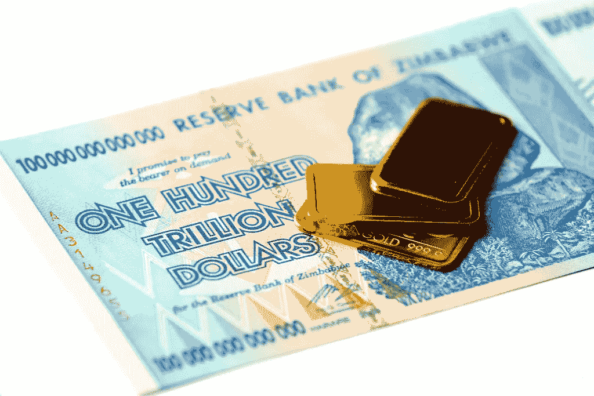

# 论格雷欣定律

> 原文：<https://medium.com/hackernoon/on-greshams-law-46efb61901ab>

雷萨姆定律指出，劣币驱逐良币。它描述了一种在发展中国家的校园里也能看到的现象。在任何市场，人们都会囤积好东西，花掉不好的东西。商店里打折的产品就是一个例子。如果一家商店有太多的某种商品，它会降低该商品的价格，以腾出仓库空间。许多商品在非常有限的时间内很受欢迎。例如，坐立不安的纺纱机遭受了类似恶性通货膨胀的痛苦，因此商人试图越来越快地摆脱他们的坐立不安纺纱机。货币的行为方式非常相似。以最近最大面值的印度卢比为例。最大的两种卢比纸币，500 卢比和 1000 卢比，于去年 11 月 8 日被印度政府停止流通。他们这样做的官方借口是打击腐败和洗钱。奇怪的是，这些钞票并没有停止流通。相反，正如格雷欣法则所预测的那样，当纸币的价值开始下降时，发行量增加了。

那么比特币到底是劣币还是良币呢？在比特币的例子中，出现了一些有趣的矛盾。比特币作为记账单位的效果越好，换句话说，价格波动越小，它作为投机资产的交易就越少。市场上的交易越多，交易费用就越高。交易费用越高，使用比特币作为货币的激励就越少(尽管第二层扩展解决方案至少会部分解决这一问题)。事务少是可用性差的标志，对吗？不一定。这也可能是格雷欣法则发挥作用的一个迹象。人们正在将劣币(美元)转化为良币(比特币)。良币不像劣币那样流通。就比特币而言，看到其真正潜力的人根本不会出售他们的比特币*，除非他们的生命依赖于此。*

*一段时间以来，密码市场一直显示红色数字。你可能已经注意到，两位数的红色在 alt 中比在比特币中更常见。这不是什么新鲜事。你现在看到的是格雷欣定律正在实时上演。恐惧、不确定性和怀疑时不时会让人们对加密货币敬而远之。数字资产被出售并转换成美元和欧元。人们出售他们害怕的东西，购买他们信任的东西。如果你仍然相信加密货币的概念，这通常意味着将你的任何硬币转换回比特币。如果你失去了所有的信仰，你可能会想要美元或欧元，但为了转换你的任何硬币，你最有可能先把它转换成比特币。生命周期就是这样进行的。随着加密馅饼变得越来越大，它向各个方向发展。随着比特币的缩水，它的缩水程度比其他货币要小一些。*

*世界从未见过像比特币这样的发明。它确实是独一无二的，它已经改变了世界。每年都有一群新的傻瓜试图寻找下一个比特币，拒绝相信这个火箭还没有离开地面，因为它令人瞠目结舌的价格运动。每年都会有回调，有些年份的回调幅度很大。人们恐慌性抛售，因为他们忘记了基本面，也不知道这从长期来看有多稳固。长期霍德勒*总是*赢。不管你什么时候买入，至少等五年后再考虑卖出，你肯定会比 99%的日内交易者做得更好。忘掉图表分析和价格预测，了解基本面，你就能对蛇油推销员、骗局和宣传免疫。知识是疫苗，不会让你患上自闭症。*