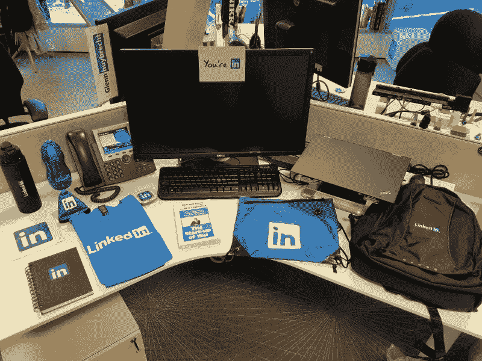

# 对雇主的忠诚

> 原文：<https://medium.com/hackernoon/on-loyalty-to-your-employer-c674c4b06b3a>

Photo by [Matthew Henry](https://unsplash.com/photos/2Ts5HnA67k8?utm_source=unsplash&utm_medium=referral&utm_content=creditCopyText) on [Unsplash](https://unsplash.com/?utm_source=unsplash&utm_medium=referral&utm_content=creditCopyText)

我刚刚回到伦敦，在科克的家中度过了过去的两周，在那里我和我的父亲度过了非常长的时间，一个不到一年前建立了他的第一个电子邮件帐户的人，一个在过去 30 年里为同一家雇主工作的人。从任何意义上来说，我父亲都是科技行业的对立面。

考虑到科技行业每位雇主的平均“职业生涯”不到三年，为同一位雇主工作 30 年的想法令人难以置信。尽管存在如此巨大的差异，但我经常看到科技行业的同事们滔滔不绝地谈论他们的雇主有多棒，以及为什么每个人都应该放下一切来和他们一起工作，结果仅仅过了短短几年，他们就宣布要“去做更大更好的事情”。

我将是第一个举起手来，承认我对过去经常这样做感到非常内疚。我从事招聘工作。雇主付我很多钱来吹嘘他们有多棒。他们付钱给我让我说服 T2 让你相信草不仅更绿，而且他们的草也更有弹性和包容性。那么，我该如何调和我对每个自称最好的雇主的冷漠和我做好工作的能力呢？

## 透明和诚实

我审查值得共事的雇主的标准非常简单。任何超过这四个标准的都是加分项(而且非常主观)，但是下面的四个标准是我的绝对零妥协标准。

> 你支付合理的薪水吗？

幸运的是，由于我的工作性质，询问关于薪水的细节是意料之中的事，雇主不会轻易撒谎。简而言之，如果你的薪水没有竞争力，那我们就是在浪费彼此的时间。公平支付或合理支付，我们将有一个良好的开端。

> 你对你的人民好吗？

[玻璃门](https://www.glassdoor.co.uk/Reviews/index.htm)是你的朋友。如果有大量负面评论，寻找一致性。它们是同时发布的吗？有一致的主题吗？提出这些观点，征求雇主的意见。一个优秀的雇主会诚实地强调他们采取了哪些措施来解决这些问题。并不是每个公司都有一个有用的 Glassdoor 档案(许多初创公司还没有被审查)，所以去 twitter 这样的地方看看现在和以前的员工，看看是否有任何危险信号。

> 你的经济安全吗？

这是[创业](https://hackernoon.com/tagged/startup) 101 乡亲。尽职调查。Companies House、Duedil 等是一个很好的开始。询问他们的跑道(如果他们目前的收入和支出保持不变，他们可以生存多久)。如果他们不愿意公开和诚实地谈论他们的财务状况，立即离开。

> 你愿意尝试新事物吗？

这个标准对我所做的工作来说是非常具体的，可能并不普遍适用。如果你要求我与你合作来提高你雇佣人的能力，那么你绝对需要开放并愿意尝试新事物。再多的钱也不足以说服我加入你的公司，遵循你那老一套的老一套方法，仅仅因为它在过去几次都很有效。

如果你符合上述所有标准，那么我就可以说服优秀的人为你的公司工作。我可以对人绝对透明和诚实。

## 美味的饮料

好吧，你找到了一份很棒的工作，办公室很棒，人们看起来超级友好，薪水不错，工作富有挑战性，生活看起来也很美好。张贴你的桌子上散落着公司品牌赃物的照片。尽情享受，但不要自欺欺人。

你是一笔交易。当然，你的雇主给你的印象是他们关心你，但是一旦你开始花费公司的钱，或者对公司的形象构成风险，或者违反你的 300 页合同的任何其他元素，那么我绝对可以向你保证，他们*会*立刻解雇你。你甚至不需要做任何错事就有风险。如果公司陷入财务困境，这不是你的错，你和你所有的同事都有危险。突然之间，“我们在这里都是一家人”的公司口号听起来有点可笑。

你的雇主付钱给你，让你花更多的时间和他们在一起，而不是和你的家人和/或爱人在一起。你的雇主是对你的心理健康影响最大的人之一。如果绝对有必要的话，你的雇主能够并且愿意立刻换掉你。

让我明确说明，你的雇主不是你的家人，他们也不是你的朋友。他们付钱让你做一项工作，而你的责任就是做好这项工作。

*   不要牺牲你与家人和朋友的关系来安抚你的雇主。
*   不要为了取悦雇主而牺牲自己的精神健康。
*   不要牺牲你的尊严、价值观和道德来取悦你的雇主。
*   不要为了安抚你的雇主而相信“hustle”这种扯淡的宣传。

## 相互尊重

埋头苦干。如果你的雇主给你优厚的报酬，努力确保你在各方面都健康，并投资于你的个人和/或职业发展，那么无论如何，告诉全世界你有多幸福。

关注你自己的[成长](https://hackernoon.com/tagged/growth)。专注于帮助和你一起工作的人。专注于有效利用你的时间和精力，这样你就可以在真正重要的人和事上花费更多的时间和精力。

在我父亲工作 30 周年纪念日前夕，我想让你们听听他的话:

> 当我弥留之际，我不会回头看我的生活，希望我曾经更加努力。我会回首往事，希望我能花更多的时间和我爱的人在一起。