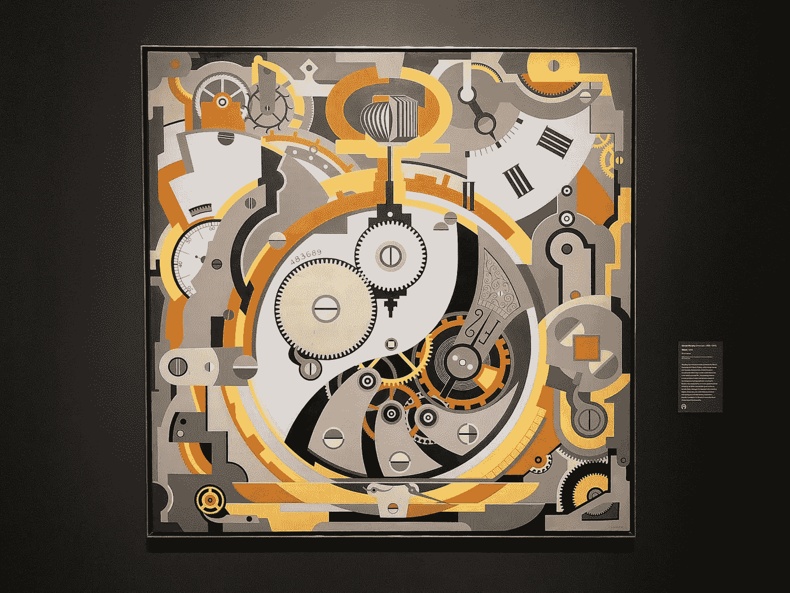

# 论产品管理与人性化

> 原文：<https://medium.com/hackernoon/on-product-management-humanity-ad80e9f4ccd4>

## 最佳产品团队如何利用智人的定义特征

> 由[温斯顿·克里斯蒂-布利克](http://bit.ly/pb-winston) | *产品经理* [*产品委员会*](https://www.productboard.com?utm_campaign=hackernoon-sapiens&utm_medium=medium&utm_source=hackernoon&utm_content=productboard-header)

最好的产品经理是高超的魔术师。为了施展他们的魔法，他们利用了人类独有的特征——或者更准确地说，是智人独有的特征。

毕竟，正是这种特性让我们比更强壮、更热情的尼安德特人兄弟更有优势，也解释了为什么我们智人在地球上定居的任何地方都处于食物链的顶端，即使是在食肉的剑齿虎、威风凛凛的猛犸象和乳齿象中间。

那种特质就是将 **神话化**的能力，想象并不实际存在的实体，感知它们就像它们是真实的一样，并共同这样做*。*

*这是尤瓦尔·诺亚·哈拉里在他的畅销书《智人:人类简史》中提出的主张，任何一个有一点好奇心的人都不应该推迟阅读(我已经拖延了太久)。对每一个数字产品团队来说，隐藏在其中的是宝贵的知识。*

**

*It‘s uncanny we ever survived this.*

# *想象一下*

*正如哈拉里解释的那样，对智人来说，珍视相同神话的能力造就了所有的不同。虽然与我们在过去 70，000 年中主宰的许多物种相比，我们相对弱小，但我们集体想象的能力为我们与直系血统或社交圈之外的其他人合作提供了机会——这是其他合作物种如尼安德特人、黑猩猩或蜜蜂无法做到的。*

*正是这种特性意味着两个不相关的具有相同核心信仰的智人可能会发现他们在离家数百英里的地方智胜一个尼安德特人部落，合作捕猎一只城市公交车大小的动物，或者在十字军东征中并肩作战。*

*它允许制定有益的普遍概念，如法律、社会禁忌、人权和对当地运动队的自豪感，这使得数百万智人能够在世界各大城市和平共处。*

*它还允许有益小说的整个分支出现，如*有限责任公司、*或像【标致】[脸书](https://hackernoon.com/tagged/facebook)这样的公司实体，以及 Slack，即使它们的创始人消失了，所有原来的员工被替换，或总部被烧毁，我们都同意“存在”。*

> *“自从认知革命以来，智人一直生活在双重现实中。一方面是河流、树木、狮子的客观现实；另一方面，神、国家和公司的想象现实。随着时间的推移，想象的现实变得越来越强大，以至于今天河流、树木和狮子的生存都依赖于美国和谷歌等想象实体的恩惠。”*

# *利用幻觉*

*那么集体想象力和产品管理有什么关系呢？*

*考虑典型的 web 应用程序:成千上万的 div、对象、函数、参数、API 端点、UI 元素和数据库记录——所有这些交织在一起形成了一个单一工作产品的印象。这一点都不容易。事实上，即使是世界上最著名的应用程序似乎也可以用透明胶带粘在一起。*

*谷歌[的工程师团队研究他们自己的算法](https://amzn.to/2rLXHob)，以了解为什么会出现某些意想不到的搜索结果，即使如此，由于搜索引擎的巨大复杂性(远远超出任何一个人的理解)，他们可能会做出最微妙、间接的调整，使用试错法，直到结果改善。*

*在 Adobe，15，000 名员工支持一些有史以来最受欢迎的数字产品，但即使像 Photoshop 和 Lightroom 这样无处不在的应用程序也面临着 T4 错误和意外行为的挑战。浏览一下社区论坛，就会发现许多问题几周、几个月或几年都没有解决。*

*此外，还有像 ClassPass 这样的产品，它们似乎巧妙地自动化了用户生活的某些方面，预订健身课程，提供餐馆推荐，或订购杂货，但本着精益生产的精神[开始是完全的黑客行为](http://firstround.com/review/classpass-founder-on-how-marketplace-startups-can-achieve-product-market-fit/)！所有的动作都是由人类在幕后手动完成的，只是由算法及时接管。*

*用户非常乐意从他们使用的产品背后的复杂性中解脱出来。事实上，发现一个 bug、发现一个措辞不当的错误消息或者发现一个可用性问题所带来的挫败感不仅仅是无法完成手头的任务。令人不安的是，有人提醒我们，整个应用程序都是一个幻觉，我们被我们不愿面对的复杂性所包围。生活已经够复杂的了。*

**

*[Cult of the Machine](https://deyoung.famsf.org/exhibitions/cult-machine): On exhibition at the San Francisco de Young until August 12, 2018*

## *只见树木不见森林*

*幸运的是，智人很宽容。我们对神话化的偏好——在哈拉里描述的抽象意义上——让我们可以直视所有移动的部分，并将应用程序解释为一个工作的整体。*

*但归根结底，这只是一种错觉。每一个不完美都有损于它。*

***产品团队的工作是尽一切努力保护用户对他们产品的整体理解:***

*   *产品[是否端到端地解决了给定用户群](https://www.productboard.com/blog/what-every-pm-needs-to-know-about-user-segments/)的需求？(还是感觉像是为不同类型的客户定制的“特价商品”的集合，拼凑成一个臃肿的产品？)*
*   *界面是否像你童年家的平面图一样可以导航？(或者用户[是否背负着记住](https://amzn.to/2GlLEmD)在哪里找到你无意中向他们隐藏的某些功能的负担？)*
*   *用户体验统一了吗？(或者不同的风格和 UI 模式是否用于应用程序中相似的实体和交互？)*
*   *是否有一个[一致的语音&音调](http://voiceandtone.com/)在整个应用中使用？(或者，当用户日复一日地使用你的产品时，他们会觉得自己是在和少数文案互动吗？)*
*   *产品质量高吗？稳定？靠谱吗？Performant？(或者有没有以出货功能更快的名义偷工减料？)*
*   *整体而言，[app 是否让用户产生某种感觉](https://amzn.to/2k0C9R8)？(还是用户在情感上对它漠不关心？)*

*当所有这些线程交织在一起时，不同的代码行就变成了一个内聚的整体。用户开始亲切地看待你的产品，就像他们会把你当成一件喜爱的艺术品，一个远离家的家，或者一个可信赖的朋友。产品变得远远大于其各部分的总和。*

*开发优秀的产品从未感觉如此…人性化*

*

[Winston](http://bit.ly/pb-winston) is building the solution of product teams’ dreams at [productboard 🚀](https://www.productboard.com?utm_campaign=hackernoon-sapiens&utm_medium=medium&utm_source=hackernoon&utm_content=productboard-footer)*