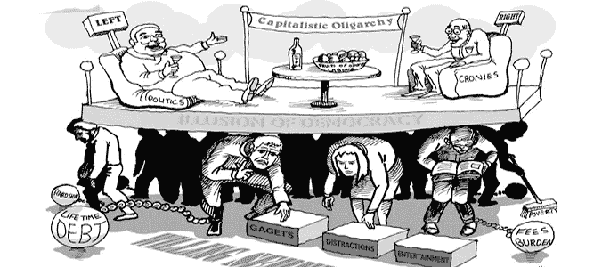

# 关于俄罗斯，媒体，专制国家和寡头政治。

> 原文：<https://medium.com/hackernoon/on-russia-media-the-authoritarian-state-and-the-oligarchy-3afbad8a6bfb>

## 当我们过渡到一个基于分散加密区块链的多极世界体系时，平衡寡头、国家和普通人的三角关系。

[最近有人问我普京如何对待记者和媒体。我开始写这些想法是为了描绘出现代全球政治的版图。](/@HowardFinster/hezekiah-winter-you-forgot-to-find-an-excuse-how-putins-treats-journalists-and-the-press-45e503508944)

## 为了理解全球经济中现代民族国家的权力集中，我开发了一个最有用的心智模型，即寡头政治、国家和普通民众的三角关系。

> 媒体是一个群体的声音。重要的是要确定媒体代表哪些群体的声音。

以这些概念为出发点，让我们开始探索这个问题，并开始描绘出这些权力的集中是如何相互作用的。

## ‘普京’如何对待记者和新闻界？

俄罗斯目前是一个中央集权的威权国家，情报机构和拥有企业和金融的强大精英对国家机器拥有很大的控制权，国家对媒体的控制和审查程度很高。美国也是这种情况。

[维基解密](https://wikileaks.org/)和[朱利安·阿桑奇](https://www.ted.com/talks/julian_assange_why_the_world_needs_wikileaks)的案件是目前华盛顿审查制度最重要的例子，或者更准确地说是情报机构和控制华盛顿的寡头政治。

相比之下，我们可以研究一下最近据称一名持不同政见的俄罗斯记者本周在乌克兰被暗杀的事件。这是乌克兰情报部门伪造的，他仍然活着，然而大多数西方媒体和英国外交部报道称普京刺杀了一名记者。这只是一个例子，但它表明，创造一个比现实差得多的形象是多么容易。

## 俄罗斯和美国国家机器的比较。

俄罗斯和美国威权主义之间的最大区别在于，在俄罗斯，当前的中央权力机构除了强大的寡头之外，还积极努力为普通民众提供服务。拥有资本的寡头和普通民众之间的不平等是巨大的，但至少俄罗斯国家在为普通民众提供教育、就业和社会安全网方面做了大量工作。这反映在当前俄罗斯国家获得的大量民主选票上。

在美国，自 20 世纪 70 年代以来，中央政府已经夺取了更多的权力，并一直以牺牲实际生活在美国的普通民众为代价，给拥有寡头阶级的跨国资本提供机会。

在 20 世纪 90 年代的俄罗斯，由于叶利钦、比尔·克林顿和华尔街，绝大部分国家资本基础设施被跨国寡头垄断。但自从俄罗斯情报部门从寡头手中获得国家控制权以来，这个中央政府一直在小心翼翼地平衡两者之间的关系，一方面是在不完全疏远跨国寡头的情况下重新为普通民众提供服务，另一方面是失去对运行一个民族国家所需资本的控制。在俄罗斯英特尔机构控制国家的过去十年中，他们一直在慢慢从跨国寡头手中夺回对国家资本基础设施的控制，并一直在使用这种基础设施为普通民众提供服务，抵御试图恢复跨国寡头均势的外部攻击。

> 因此，虽然俄罗斯仍然非常依赖其寡头，但国家的控制力比寡头大得多。在美国，情况正好相反。在美国，寡头掌握着权力的平衡。

在美国，寡头们控制着媒体，绝对压制任何反对他们的人。[英特尔机构和寡头们已经变得互相依赖以维持权力，并且都在一起工作以获得更多的权力。](/insurge-intelligence/beyond-trump-rebooting-the-system-from-inside-the-death-machine-7a9488adcf81)

与此同时，美国的民主制度完全失灵，根本不能代表美国人民。强大的中央集权政府取消了几乎所有的社会安全网，并将大多数基本服务的所有权交给寡头控制的公司。[美国的媒体、经济和政府都以牺牲普通民众为代价，为寡头服务并代表他们。](https://medium.com/insurge-intelligence/deepstate/home)寡头控制的媒体、金融和文化远比公民个人更强大。正是反对这种形式的寡头控制，俄罗斯国家机构的权力越来越大。俄罗斯政府一直在为人民而战，反对寡头控制的金融。这是一个渐进的过程，并不完美，寡头们有时会重新获得权力。俄罗斯政府确实审查和控制寡头的媒体声音，这是保护人民免受寡头统治的重要一环。

这不是一个理想的情况，我个人支持更分散的系统和瑞士式的直接民主。然而，鉴于俄罗斯的历史及其在寡头统治下遭受的苦难，强大的中央政府目前给俄罗斯普通民众带来了更好的结果。

总是有国家变得过于控制和专制的危险，然而，只要情报机构能够在普通人、寡头和外部压力之间取得平衡，那么这三种力量之间就会有一个相对稳定的平衡，直到秘密区块链迎来新的多极社会。

## “统一的”美国民族国家即将崩溃

在美国，情报机构和寡头完全致力于互相帮助，而牺牲了普通美国人民的利益。这导致了我们今天在美国看到的[大规模社会崩溃。这个等式太不平衡了，普通人被大规模剥削。这正迅速导致美国普通民众和理应为他们服务的政府之间严重缺乏互惠关系。因为普通民众和政府之间的关系完全是单向的，所以越来越多的人开始脱离这种关系，并开始与更本地化的政府形式建立关系，这些政府形式实际上代表他们并满足他们的需求。](https://eand.co/)

与此同时，美国情报机构和寡头政治拼命试图编造俄罗斯或恐怖分子发动袭击的故事，以便普通美国人民仍然觉得有必要支持臃肿、腐败的中央政府和以此为食的寡头政治。

## 太迟了

我认为，美国人民从寡头手中夺回中央政府的控制权为时已晚。我认为，中央政府将继续崩溃，地方社区和国际大都市的联合会将出现。希望寡头政治能让这一切在没有流血和内战的情况下发生。但不幸的是，我认为情况不会如此。

许多人还没有准备好适应不断变化的环境，但是先行者已经在准备未来的文明模式。

一旦华盛顿帝国崩溃，整个世界可能会很快转向联邦城邦。去中心化的加密货币和直接民主将为一个新的互联世界提供框架。随着美国入侵的威胁消除，权力将逐渐从中央集权国家手中转移，一个多极世界体系将会出现。随着[区块链](https://hackernoon.com/tagged/blockchain)应用变得无处不在，无论是国家还是寡头都将无法控制信息或金融的流动。通过这种方式，普通人将获得发言权和发言权。对信息和贸易流动的直接控制将大大削弱目前由中央集权机构如民族国家和寡头政治所掌握的权力。

## 未来

最好把你的时间、想象力和精力花在建设新的未来上，而不是停留在民族国家和寡头政治时代的旧范式中。对其他种族和他们的社会制度进行卡通式的丑化是浪费精力。理性地探索当前的权力集中以及权力转移的方式，将使我们能够建设性地利用我们的能量来改善人类和我们的当地社区。