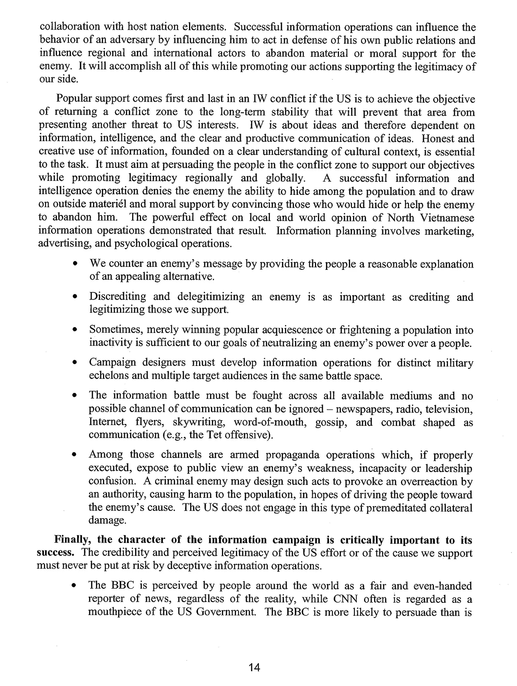
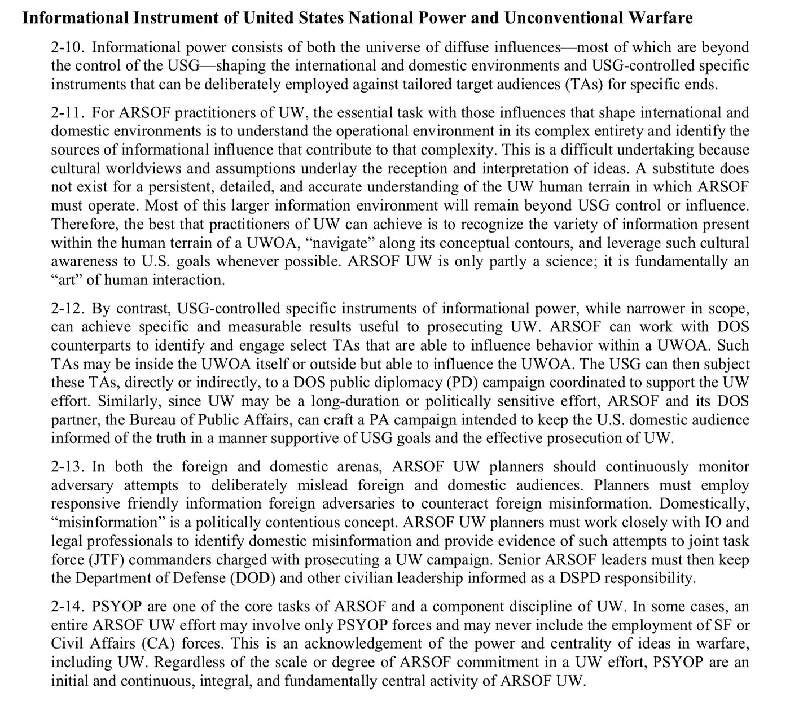

# 全面假情报战

> 原文：<https://medium.com/hackernoon/on-russian-and-washington-propaganda-c95f553a6776>

## 西方情报机构、媒体和他们的盟友会不择手段，故意欺骗他们的国内民众。

在当今时代，我们的大部分知识都是在数字空间中形成的，真理感觉像是流动的，我们周围的世界正在溶解。为了在这铺天盖地的信息洪流中生存和发展，发展技能变得非常重要，这不仅能让我们发现什么是虚假信息，还能让我们发展关于我们这个互联超复杂世界的本质的有意义的知识。

近一年来，媒体铺天盖地的报道告诉我们俄罗斯试图宣传我们。这些文章中的一些提高了人们对可以用来操纵公众舆论的修辞技巧的认识。这是公众媒体素养激增的巨大催化剂，然而这一进展似乎在充分探索这一主题的道路上停滞不前。大部分报道都是关于假新闻的概念，主要集中在对没有发生的事件进行不诚实的报道。为了回应这一点，事实报道成了焦点*。*确保事件报告有可公开证实的证据支持，让公众知道所报道的事件不是捏造的事实。

我们生活的世界是复杂而又相互关联的，光有一堆事实往往没有什么实际用途。只有在上下文中看待事实，我们才能发现原因和结果，并从中找到意义。解释事实的第二阶段是产生意义的地方。

# 事实和背景

让我们用一个简单的例子来探讨这个问题。我们将从事实开始，然后继续添加上下文，看看我们对意义的解释是否会改变。

我们发现一个人死于枪伤。受害者。

我们找到了一把有指纹的枪。武器。

我们确认了指纹是谁的。侵略者。

现在我们添加上下文。

在我们的第一个场景中，受害者是战区的一名士兵。

在我们的第二个场景中，受害者是战区的一名士兵，他刚刚射杀了一名儿童。

在我们的第三个场景中，受害者被罪犯抢劫并枪杀。

在我们的第四个场景中，受害者是一名正在攻击侵略者的罪犯，侵略者出于自卫杀死了罪犯。

在我们的第五个场景中，指纹是受害者的，所以这看起来像是一起自杀案件，但后来一个安全摄像头显示，一名攻击者开枪打死了受害者，然后操纵证据，看起来像是企图自杀。

从这个简单的练习中，我们可以很容易地看到上下文是如何大规模地改变一些数据点的含义的。我们还可以看到，随着我们不断添加上下文，我们对意义的解释会如何变化。在我们的第五个例子中，它最初看起来好像是一次自杀企图，但后来第二来源的证据表明，这实际上是一次旨在制造假象的证据操纵。

# 真实的例子

这方面的一个现代政治例子是持不同政见的俄罗斯记者阿尔卡季·巴布琴科之死。

[Source](https://www.theguardian.com/world/2018/may/30/arkady-babchenko-reveals-he-faked-his-death-to-thwart-moscow-plot#img-1) : The Guardian

我们有他尸体在血泊中的证据。受害者是著名的俄罗斯政府批评家。西方媒体有很多报道称，俄罗斯现政府暗杀批评他们的人。

然后，英国外交大臣公开证实，阿尔卡季的死亡是真实发生的。

[Source](https://twitter.com/borisjohnson/status/1001758702578360323?lang=en): Twitter

所以这应该是足够的事实和背景来对这一事件作出结论。我们应该能够从这些事实和背景中创造一些意义，然后根据这些知识采取一些行动。鲍里斯就做到了这一点。他创造了意义，并呼吁采取行动。捍卫自由，让责任人承担责任。

[Source](https://www.theguardian.com/world/2018/may/30/russian-journalist-arkady-babchenko-who-was-reported-killed-is-still-alive): The Guardian

# 制造事实

所以现在我们有事实证明死亡是伪造的，事实是捏造的，并且得到了国际媒体和国家官员的证实。如果他没有站出来宣布他的死亡是伪造的，会发生什么？它将被接受为一个事实，因为它已经得到国际媒体和国家官员的证实。更重要的是，英国外交大臣呼吁俄罗斯对此负责。

鲍里斯·约翰逊(Boris Johnson)上一次呼吁俄罗斯或俄罗斯盟友承担责任时发生了什么？

当白盔部队在叙利亚报告化学武器袭击的指控时，鲍里斯·约翰逊授权与华盛顿和法国进行联合导弹袭击。这些袭击是在禁止化学武器组织的专家实况调查团抵达以确认袭击确实发生或发现谁应对此负责之前得到授权的。在调查人员和[记者抵达](https://www.youtube.com/watch?v=lSXwG-901yU)几天后，[发现大量证据](https://www.independent.co.uk/voices/syria-chemical-attack-gas-douma-robert-fisk-ghouta-damascus-a8307726.html)显示[报道的化学武器袭击事实是伪造的](https://www.youtube.com/watch?v=lSXwG-901yU)，很可能是为了给西方导弹袭击提供借口，以帮助即将被击败并被赶出叙利亚首都重要战略据点的圣战分子。

就在一个月前，鲍里斯·约翰逊指控俄罗斯试图暗杀谢尔盖和尤利娅·斯克里帕尔。他接着声称，俄罗斯对此负责，并根据鲍里斯·约翰逊和英国外交部掌握的事实，发起了导致 28 个国家驱逐俄罗斯外交官的行动。

> “使用了什么是毫无疑问的，对于谁应该负责也没有其他解释——只有俄罗斯有手段、动机和记录。”

然后，在另一个国家政府在证据得到确认之前采取行动的案例中，结果是[英国没有确凿的证据证明俄罗斯负有责任](https://www.theguardian.com/uk-news/2018/apr/04/skripal-poisoning-deleted-foreign-office-tweet-leads-to-awkward-questions)，外交部删除了声称有证据表明俄罗斯负有责任的声明。

尽管声称使用了军用级别的神经毒剂。受害者都活得好好的，在皇家婚礼前夕出院，而此时全世界的注意力都被分散了。

正是在这一点上，看上下文是很重要的。我们有三起被指控的犯罪行为，是俄罗斯或其盟友所为。一个在英国，一个在叙利亚，一个在乌克兰。俄罗斯目前卷入了叙利亚和乌克兰的代理战争，而英国至少也深深卷入了叙利亚冲突，因为英国外交部资助了撰写化学武器报告的白盔部队，这份报告是导弹袭击的借口。美国也卷入了叙利亚，目前通过其代理部队占领了叙利亚三分之一领土。

当审视联系这些情况的背景时，乌克兰和叙利亚的代理人战争显得尤为重要。因此，让我们看看我们能找到哪些关于代理战争的事实。

# 代理战争和宣传

多亏了维基解密，我们可以阅读这本以代理战争为主题的美国军事训练手册。[美国非正规战争的多军种概念](https://wikileaks.org/wiki/US_Multi-Service_Concept_for_Irregular_Warfare,_Aug_2006)。请注意，这也可以向英国政府发布。

让我们来看看一些最相关的部分。在本手册中，术语[非正规战争](https://hackernoon.com/tagged/irregular-warfare) (IW)用于描述代理战争。

(page 5)

(page 6)

(page 7)

(page 3)

(page 15)

鉴于我们这里有公开可用的事实，即美国和盟国将密切协调打这场“全线信息战”(第 14 页)和“在 IW 冲突中，公众支持始终是第一位的”(第 14 页)，我们可以看看这些正在乌克兰和叙利亚讨论的非正规战争，看看这些冲突的事实是否符合美国和盟国非正规战争战略的方法和目标。我们将考虑到，这种“全面的方法运用了所有的国家权力工具——外交、经济、信息、金融……”(p6)，这些信息活动需要“军方和民间的密切合作”(P6)，所使用的策略包括“诋毁敌人并使其失去合法性”，或“恐吓民众使其无所作为”。(p14。)

因此，英国外交部发表了这些声明。它们是使用外交手段的一个例子。对俄罗斯和叙利亚实施广泛的经济制裁就是经济手段的例子。我们刚刚检查了信息活动的一些要素。然后我们可以看看美国和英国的媒体，因为去年有一场广泛的媒体运动，称俄罗斯用宣传攻击西方民主。这场运动非常激烈，它实现了“赢得当地、美国和世界舆论之战”的两个目标(第 13 页)。首先，它试图诋毁俄罗斯并使其失去合法性；其次，它试图恐吓民众，使其不采取行动。

他们似乎是为了恐吓美国和全世界的民众，让他们保持沉默。同样值得注意的是第 14 和 15 页上的文字解释了它们的信息操作的特征。具体来说，他们必须“获得像 BBC 一样的诚实声誉”，“为此，活动设计者必须制定信息应急计划作为模板”，以便对事件做出快速反应。

# 可敬的事实宣传

在这些声明的背景下，有趣的是，英国外交部一直是呼吁俄罗斯及其盟友承担责任的公众代表。鉴于美国总统在展示令人尊敬的事实方面缺乏声誉，利用英国外交部作为喉舌的决定与这一战略非常契合。看类似于[这个](https://arcdigital.media/russias-troll-factory-just-launched-a-new-website-targeting-americans-cbacdcf3e842)和[这个](/dfrlab/logical-fallacies-fuel-kremlin-disinfo-e4185bb455e6)的文章也很有意思。在这些文章中，我们看到他们的特点是充满了完全真实和可证明的事实主张，他们显然是为了“像 BBC 一样的诚实声誉”。而只专注于“使敌人失去合法性或名誉”

事实上，这些文章和媒体只报道不诋毁华盛顿或其盟友的宣传和媒体素养领域，这表明这些反俄罗斯的出版物实际上并没有专注于促进媒体素养或美国和西方国家的知情公民。相反，他们主要关注的是让他们的公民得到关于国内失败和问题的错误信息。

# 假旗和欺骗的艺术

除此之外，更进一步,[Intercept](https://theintercept.com/2014/02/24/jtrig-manipulation/)发布的这些文件显示了华盛顿和伦敦用来操纵其公民感知能力的一些故意操纵方法。他们自己将他们的一些行动描述为假旗行动。

[Source](https://theintercept.com/2014/02/24/jtrig-manipulation/): The Intercept

[Source](https://theintercept.com/2014/02/24/jtrig-manipulation/): The Intercept

[Source:](https://theintercept.com/document/2014/02/24/art-deception-training-new-generation-online-covert-operations/) The Intercept (page 46)

回到本文的开头，仅仅报道一组事实并不意味着你没有进行宣传。事实存在的背景和对其意义的解释同样重要。同样重要的是，要警惕那些试图操纵人口统计的注意力的行为，以及试图黑掉他们的感知和感知能力的行为。

当你看到关于一个主题的大量报道，而关于其他领域的大量报道缺乏或报道显示有问题的证据时，那么很可能有某种信息操作正在发生，在这种操作中，某一特定人群不应该考虑那件事，因为它会导致西方情报机构或情报机构结盟或控制的权力集团的声誉和可信度的损失。

# 美国自由新闻

现在让我们来看看《时代》杂志前编辑的视频，他在此之前是国务院的一名重要官员。在下面链接的视频中，他把这个职位描述为众所周知的首席宣传员的工作，他接着说，在这个职位上，他为美国的国家认同创造了元叙事。他接着说，这叫做书写历史。

# 停下来思考一下

请真的停下来考虑一下这件事的后果。这位自称是美国国务院首席宣传员的人说，他的工作是为美国作为一个国家的身份创造元叙事。他说这也叫历史。

这是什么意思？

我们有政府首席宣传员承认，公众对美国历史的理解实际上是一种宣传。

接下来我们可以看到这是如何成为可能的。事实上，他从自己承认的国务院首席宣传员，然后他成为时代杂志的编辑，显示了政府和所谓的自由媒体之间的关系在美国是多么亲密。他接着说，媒体卡特尔的存在对美国来说不是问题。

[吉米·多尔](https://www.youtube.com/channel/UC3M7l8ved_rYQ45AVzS0RGA)分解视频并强调其中的关键点。

或者你可以在这里观看原始视频:

这是政府宣传部和这些所谓的自由媒体卡特尔之间的旋转门，这使得国务院可以将美国的历史作为一种宣传来书写。事实上，美国和大部分西方国家绝大多数有影响力的媒体都被少数媒体卡特尔所控制，这使得作为一个统一的集团来控制和影响媒体变得非常容易。

这份文件[美国陆军特种作战部队非常规战争，FM3–05.130，2008 年 9 月 30 日](https://wikileaks.org/wiki/US_Army_Special_Operations_Forces_Unconventional_Warfare,_FM3-05.130,_30_Sep_2008)解释说，这是美国国家力量的信息工具的使用。

(Page 19)

# 结论

1.  西方政府积极参与操纵他们的人民和世界的看法，为他们的民族身份创造一个虚构的历史和元叙事，这与现实不符。
2.  美国政府认为“自由”的美国媒体是其国家权力的工具，它可以用来操纵公众舆论，创造虚构的历史，使美国及其盟友看起来很好。
3.  美国政府及其盟友使用假情报的一个关键原因是为其正在进行的常规和非常规战争制造公众支持。
4.  美国政府及其盟友的部队接受了使用假旗攻击的训练。
5.  没有人可以相信美国或英国政府，公众相信的美国历史或任何关于外国入侵的报道，无论是传统的还是非常规的。
6.  这使人们处于这样一种境地:所有的权威都受到怀疑，人们需要开发工具来收集和评估新知识。忠实地信任一个权威极有可能导致你被欺骗。
7.  如果一个人在阅读这篇文章时经历了强烈的情绪，强烈的忽略或怀疑所呈现的信息的冲动，这很可能是他们的个人身份感基于一个制造的元叙事的结果。如果这种元叙事破碎，那么人的身份感也会破碎，使他们处于创伤状态，人体通常会对此做出反应，就好像这是一种身体攻击，并试图拒绝逃避或否认对自我意识基础的攻击。