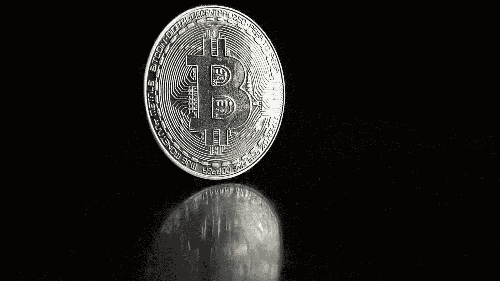

# 论稀缺性

> 原文：<https://medium.com/hackernoon/on-scarcity-b05856078caf>

什么使某物变得稀缺？一个物体的稀缺性还有哪些属性可以扣除？稀缺性、能量、时间和价值是如何联系在一起的？从表面上看，稀缺性似乎很容易描述，但实际上并非如此。当你考虑到无限的概念时就不会了。自从人类能够想象无限这个概念以来，它就一直困扰着人类。这是一个非常抽象的概念，它总是和时间联系在一起，因为即使想象一个无限的数字也需要无限的时间。如果我们真的生活在一个无限的宇宙中，稀缺就不可能存在。如果某样东西存在于一个无限的宇宙中，那么这个东西的无限数量的副本也一定存在，因为它为真的概率也是无限的。因此，稀缺必须总是在一个固定的框架内定义。没有框架，没有稀缺。

在将稀缺性定义为需要根据其上下文来定义的东西之后，让我们来考虑这些元素以及它们的相对稀缺性如何影响它们的价值。例如，空气，这种仅仅作为地球蛋糕上的一层薄薄的糖衣而存在的资源，对所有生物来说实际上仍然是丰富的。另一方面，黄金很难找到，因此被人类视为稀缺资源。黄金很贵，空气不贵。这之间有联系吗？

环保主义者和其他末日预言家经常谈论我们如何以越来越惊人的速度耗尽地球母亲的资源。虽然这种说法可能有些道理，但精神错乱的市场力量对此有一种天然的防御机制。当一件商品接近枯竭时，它的价值就会增加。把稀缺商品想象成一场音乐椅游戏。游戏中的椅子越少，竞争就越激烈，也就是说，索取一把椅子的费用就越高。稀缺性以这种方式与价值联系在一起。一种商品的稀缺程度可以通过它的*库存-流动比率*来确定，该比率决定了一种商品的产量相对于该商品需求的增加而增加了多少。如果黄金价格上涨，黄金开采将更有利可图，因此将会出现更多的黄金开采。就黄金而言，更多的开采不会对流通中的黄金总量产生太大的影响，因此价格不会因为供应量的增加而真正持平。对于其他不那么稀缺的商品来说，情况就不一样了，它们的价格会随着供应量的增加而下降。例如，石油仍然相对便宜，不是因为现在更容易找到，而是因为我们提取石油的方法更有效。

比特币完全是一只不同的野兽。它的稀缺性和存量与流量的比率从一开始就确定了。没有什么能够改变比特币的创造速度，即便是提高其矿工创造的散列能力也不行。这个框架的有效性不断被网络中的每个参与者检查和验证，这是确保比特币保持稀缺的原因。网络仍然存在，尽管受到大量的技术、社会和政治攻击，但其基本属性没有改变，这一事实足以证明人为稀缺是非常真实的事情，也是我们在某个时候都必须面对的事情。不管你是谁，也不管你对数字货币的看法如何，比特币是存在的，客观来说，它是世界上最稀缺的商品。有朝一日，比特币网络将成为世界上最有价值的商品。只是时间问题。