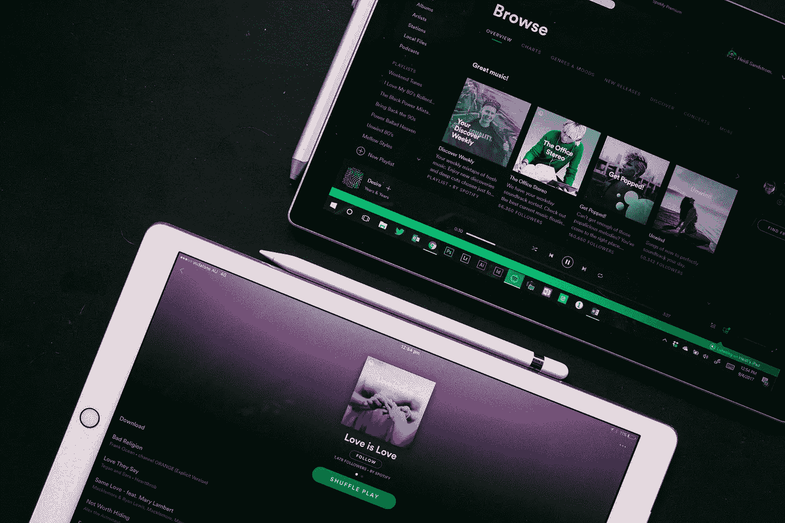

# 在 Spotify 广告工作室

> 原文：<https://medium.com/hackernoon/on-spotify-ads-studio-f689e2ab0d87>

我在 Twitter 和 LinkedIn 上分享了一些关于 Spotify 广告的想法，所以想在这方面做些扩展。

当我第一次看到 Spotify 广告工作室测试版的脸书广告时。我跳上火车去报名。与 Snapchat 非常相似，Spotify 一开始并不是一个程序化的广告平台。你必须与销售人员沟通，拥有巨额品牌预算才能在 Spotify 上制作广告。我的猜测是，IPO 后，Spotify 需要显示出收入增长和积极的运营率，因此进军中小企业广告客户市场是有意义的，他们代表着巨大的数量。

这不是一篇商业论文，因此 Spotify 商业和财务无关。去广告工作室。

**力学**

首先，我为我的咨询公司 [42+机构](http://fourtytwo.agency)制作了一个非常简单的广告。活动创建是一个很好的体验。你可以写一个脚本(文本)并请求一个你喜欢的声音/语言的配音。我选择了一个中年的英语配音来完成一个有着活泼背景音乐的基本剧本。

回想起来是个糟糕的剧本。

> 42+ Agency 是一家微观绩效营销、运营和增长机构。如果您在营销自动化、需求挖掘方面遇到困难，请立即与我们安排一次免费的路线图通话。单击横幅了解更多信息。

你选择了一个图像，标题，你就可以开始创作了。

您添加了一个带标签的 URL。根据以下条件选择您的目标:

- Geo(加拿大)

-设备(所有)

-性别(所有)

-流派/播放列表/所有音乐(重点——假设这是人们在工作时听的音乐)

预算最低为 250 加元。

不到 20 分钟，画外音就转过来了。这听起来绝对不像机器人。我认为他们要么有一些画外音艺术家，要么进入画外音艺术家市场。

**观察:**

进入它，我预计它不会得到任何点击。我已经点击了两次了。0.02 克拉。惊喜。没有转换跟踪或 Java-script-这不是一个直接的响应渠道。

我对 Spotify 广告的看法是，它是一个辅助渠道。你不会看到直接转化(utm -> GA 目标达成)，你可能看到的是随着时间的推移你的转化的整体提升&也许是直接流量的增加。我的预算太小，无法实际测量任何升力，但可以这样想。

有人在 Spotify 上听过你的广告很多次。下次他们点击谷歌或看到你的社交或博客帖子时，他们会点击进入。或者他们在 Spotify 上听到你的广告，而不是直接点击，他们可能会在 2-3 天后在谷歌上搜索你，他们会将你的品牌与此联系起来。

自然，Spotify 广告可能更适合快速消费品或零售/消费品牌，但一个精心编写的 B2B 广告也能发挥作用。只是把它当作一个辅助渠道，而不是一个直接的反应渠道。

想法/评论/问题？给我发微博[@ kamil extin](http://twitter.com/kamilrextin)

*最初发表于* [*卡米尔*](http://kamilrextin.com/on-spotify-ads-studio/) *。*