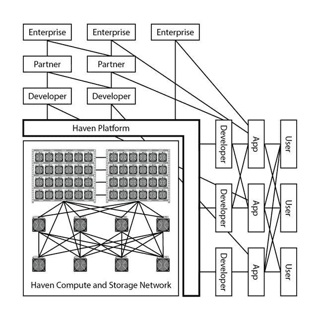

# 为了保护实用令牌

> 原文：<https://medium.com/hackernoon/on-the-defense-of-the-utility-token-5773edc9ecf2>

除了加密货币，区块链技术还催生了多个分散式计算和存储网络。这些网络寻求允许个人和公司通过交换数字令牌来相互购买和出售计算资源。它们以多种不同的形式出现，并为专业消费者提供了一个托管各种资源并“挖掘”将这些资源商品化的令牌的重要机会。尽管这些网络有显著的优势，但企业必须确信其数据受到保护。如果没有防止敌对运营商攻击的硬件，这是无法以分散的方式实现的。(鲍文、帕洛玛、刘等译，2018 年)

# 多边平台

近年来，Ebay、亚马逊、优步和 AirBnB 等公司都在利用多边在线平台模式。这些平台通过使用各种拍卖系统来匹配客户和卖家。优步为用户提供各种级别的交通服务的预定价格，而 AirBnB 则允许主人决定服务的价格。许多这类系统以方便用户、简单高效的方式将消费者和卖家联系起来，成功地打破了寡头垄断市场。

分散式云平台遵循类似的多边平台，即“让双方或多方参与进来，并实现它们之间的直接交互。”(Hagiu & Wright，2015)这些商业模式通过在一个公共平台上拍卖云服务，降低了计算和存储资源提供商的准入门槛。拍卖系统也推动了提供商之间的竞争，迫使他们不断升级系统以确保他们的业务。结果是用户的成本更低，性能更好。

# 比特币拍卖和竞争

比特币是第一个完全去中心化的自主计算平台，它将处理和保护交易的矿工与使用和消费比特币的人联系起来。比特币平台，作为大多数证明有效的加密货币，以随机拍卖的方式运行，根据系统的相关计算能力分配赢得拍卖的权利。拍卖获胜者将获得预设数量的比特币，该数量会随着时间的推移而减少。由于赢得比特币的机会随着系统计算量的增加而增加，而且这些奖励的价值如此之大，这导致了一个极其激烈的竞争环境，比所有【TOP500 强超级计算机加起来还要强大 40 倍。从这个角度来看，比特币系统的运行功率约为 40 GW，而占据公共云服务市场 50%以上份额的 AWS(亚马逊网络服务)的服务器运行功率最多为 8 GW。这意味着整个云市场都处于比特币网络的电力供应之下。

比特币拍卖系统用比特币奖励计算能力，但所做的工作是专门为了保护系统上的交易。以这种方式，由平台拍卖测量和验证的属性是仅与 BTC 和其他 SHA-256 硬币相关的特定计算能力。分散式云环境必然要衡量许多变量，以便高效可靠地调配各种工作负载。这些变量包括存储容量、各种形式的计算能力、系统速度、带宽和延迟。一旦分散式网络可以测量不同的变量，验证这些组件中的每一个，同时有效地将状态更新到网络的其余部分，则可以围绕这些变量构建自动化拍卖平台。(王，田菲尔德，迈尔，2014)

# 硬件专业化

所有分散式网络的大规模采用取决于对更安全、高效和可靠的计算机设备和系统的访问，同时比大公司拥有的云和人工智能设备更便宜。 [Node Haven](http://nodehaven.com) 正在构建一个模块化的人工智能和云计算系统，该系统将从基础芯片一直到整个平台堆栈都得到充分保护。这种架构将使企业能够处理分类、机密和关键数据，同时保持存储和处理的完整性。基于 Gen-Z 内存架构，Haven 硬件将使加密货币矿商和数据中心运营商能够在云和人工智能市场上竞争，其年收入比 2018 年所有加密货币矿币的价值大 30 多倍。通过有效地保护整个堆栈， [Node Haven](http://nodehaven.com) 的架构消除了竞争这些商品化计算和存储服务的准入门槛，从而在传统的核心数据中心建设和新兴的加密挖掘发电站之间创造了军备竞赛条件。

分散的云环境在硬件供应商之间展开了竞争，超越了少数几家公司(亚马逊、谷歌、微软、阿里巴巴),这些公司有能力为潜在的 1000 家供应商采购和构建超大规模数据中心，所有供应商的费用、设施和资本资源水平都各不相同。开源硬件联盟，如 Gen-Z，在这种环境下蓬勃发展，因为它们提供了一种构建更优越系统的方法。它们还允许兼容部件在制造商之间展开竞争，进一步降低参与者的资本成本。

云计算已经经历了一个集中化为一些大公司带来显著优势的时期。近年来，这些现有公司通过使用加速器，相对于新加入的计算提供商建立了竞争优势。这些加速器以 GPU、FPGAs 和 ASICs 的形式出现，如 TPU(张量处理单元)，在某些方面类似于现代加密货币挖掘设备。除了云产品，加速器还用于搜索引擎、高性能计算(HPC)以及人工智能环境。虽然有些设备很容易以 GPU 的形式提供给消费者，但是集成不同设备的专有应用程序仅限于垄断规模的设备，这些设备试图保持其在竞争中的优势并最大限度地提高利润率。

随着去中心化云和人工智能市场的成熟，在全球基础上瞄准特定算法的能力将推动硬件的专业化。由于这种专业化，硬件格局将发生转变，就像比特币采矿硬件一样。加速器(GPU、ASIC 和 FPGA)由于其速度和效率，将取代传统处理数据的服务器 CPU。

NODE Haven 将解决计算机市场中其他形式的垄断控制。例如，计算和存储矿工将利用财团领导的名为 [Gen-Z](http://genzconsortium.org) 的内存架构。 [Gen-Z](http://genzconsortium.org) 允许多种类型的计算资源以绕过 CPU 或者更具体地说是服务器处理器的方式访问内存。这将解除 CPU 制造商对服务器市场的束缚，并减少系统运行对任何一家公司的依赖。这遵循了 [NODE Haven](http://nodehaven.com) 的一个基本核心价值观，在这里做出鼓励竞争的决策和激励措施。这导致不同地理位置的硬件部署、更高的速度、软件开发的简易性以及最终用户的更低成本，这反过来又增加了网络的采用。所有这些导致了令牌的采用。

Haven Network Effects

# 港口网络和平台

为了支持 Haven 硬件的采用，云和人工智能目的的机器将预先配置为在 Haven 网络和平台上运行，准备好获得节点令牌。Haven 网络是一个分布式/分散式计算系统，可通过 Haven 在线平台进行访问。Haven 平台是一个用户友好的计算和存储资源市场，它利用节点令牌来交换所提供的服务。

Haven Network and Platform 的目标是创建一个计算机系统，该系统利用地理市场动态来推动设备安装，并允许公共用户通过有竞争力的知情市场来访问这些资源。设备所有者使用 Haven 后端，在节点令牌中为他们拥有和操作的资源设定价格。在高需求、租金和电费的地方，我们会假设设备所有者设定的价格会更高。在需求高但租金和电力低的地方，价格可能会更高，但一旦发现套利，竞争者可能会在该地区建造设施以增加供应。通过这种方式，我们希望供应能够有效地满足整个网络的需求，这是一个纯粹的中央集权公司永远无法做到的。这样，股权无法与代币竞争。

节点令牌有效地将计算和存储商品化，同时允许市场需求和经济因素选择安装位置。同样，Satoshi 赋予了矿工处理价值转移交易的权力，NODE token 消除了这些垄断性云和人工智能服务提供商在处理我们的数据和获得的洞察力方面的中介和权力。智力的中介只会让他们成长壮大力量。根据一些云提供商最近的表现，他们的价值甚至开始与一些国家的 GDP 相匹敌。(Wilkons，2018)建议的解决方案将权力分配给参与者，并允许消费者获得引入的市场效率的回报。

Haven Network 将映射系统上的所有计算节点，并对每台设备进行身份验证，以确保质量控制。Haven 平台将使用这些信息来优化部署在网络上的应用程序。这将通过准确地提供所需的冗余方式、时间和数量来降低应用程序所有者的成本。为应用程序所有者提供的灵活性将使他们能够随着应用程序的增长而扩展应用程序，并通过网络在全球范围内分发现有应用程序，从而以任何其他方式都无法复制的方式为边缘提供服务。

Haven 平台将以分布式方式部署到 Haven Network，不依赖于任何特定的机器或地理区域。这为潜在容量用于优化网络提供了机会，即使是在等待应用程序利用其设备的时候。最适合平台部署的设备所有者将获得节点令牌补偿。这将确保 Haven 平台和网络不会出现宕机，因此比集中式云提供商更具弹性。

# 结论

在过去，网络效应主要用于放弃产品或服务的商品化，这样一家公司就可以产生垄断效应，从消费者身上榨取价值。然而，令牌经济，例如由节点令牌建立的令牌经济，则大不相同。代币经济中的网络效应开放了商业过程中的竞争，这些商业过程是保护垄断的护城河。Haven 网络和平台将允许进入者竞争云设施所有权、平台服务开发以及硬件制造。

硬件制造商和相关网络建设之间的协同作用已经得到了很好的研究。(Katz & Shapiro，1994)一些最受欢迎的视频游戏网络，如任天堂和索尼，依赖于硬件和软件的双重模式。近年来，这些视频游戏系统还结合了在线网络，以允许它们的用户相互玩视频游戏。这些网络的价值部分来源于制造商以较低的成本建造优质设备的能力。

除了通过一起设计硬件和网络获得的协同效应，我们还以加密货币矿工的形式引入了一个设备运营商网络。这种额外的竞争将改变云硬件的部署方式。这一互补的用户群体导致比特币系统变得比所有超级计算机加起来还要大，而他们的目标是根据 2018 年 8 月 28 日的价格，总共挖掘出价值 60 亿美元的硬币。通过允许矿商在价值超过 2000 亿美元的云计算和人工智能市场上竞争，人们认为计算能力将会进一步提升。这将永远改变云的景观，并将对人类产生巨大的影响。

当前的云提供商根据集中化公司制定的策略购买硬件和选择安装。通过引入竞争性加密货币挖掘模型，Haven Network 依靠社区来根据供求关系建立设施。几乎没有竞争者的垄断公司有动机在高需求领域保持高利润率。相比之下，避风港网络通过允许个人和团体为资源设定自己的价格来促进竞争。参与者将有能力确定利润更高的区域，以市场有效的方式建设竞争性设施。结果是最终用户的供应量增加，成本降低。这反过来又促使更多的终端用户使用该系统，从而创造更多的需求，并满足更多的供应。

为了推动最终用户的采用，该平台将向第三方开放，以实施他们自己的专有云、人工智能和物联网解决方案，并在平台上销售这些解决方案。这有可能创造出比 AWS 或 Azure 在该平台上拥有的工具更丰富的工具集，同时也激励这些公司积极推动在底层 [Haven 网络](http://nodehaven.com)上采用其打包了计算和存储的解决方案。最终，我们相信，由于其性能、成本和地理优势，今天的大型云提供商将把他们的平台转移到 [Haven Network](http://nodehaven.com) 。当成千上万的企业家在全球范围内建设设施，而这种方式不可能以独立垄断的方式重现时，很难保持独立于成熟的[避风港网络](http://nodehaven.com)。网络效应将会大到难以克服。

由 Node Haven 的联合创始人查尔斯·杜塞克撰写。