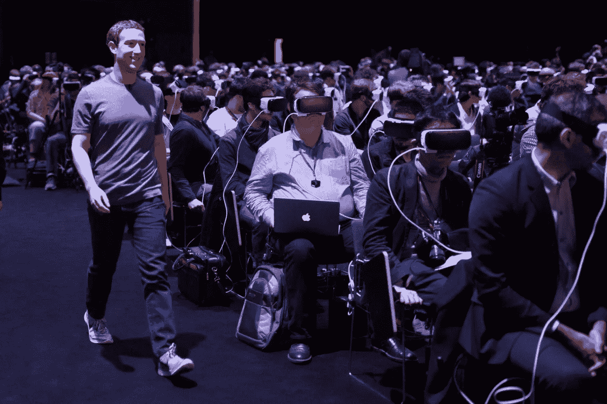

# 关于心胸狭窄的妖怪的侵扰

> 原文：<https://medium.com/hackernoon/on-the-infestation-of-small-souled-bugmen-6561ae922e07>

不要与卡夫卡的《变形记》中的巨大昆虫——被异化的人——相混淆，这个心灵渺小的 bugman 在今天的新自由主义技术公司的蜂群思维中是一个非常适应的神经元。

作为一个危险的人口过剩、残酷的[资本主义](https://libcom.org/files/Capitalist%20Realism_%20Is%20There%20No%20Alternat%20-%20Mark%20Fisher.pdf)、无耻的享乐主义、道德沦丧社会的后果，谦逊的 bugman 已经开始定义一个技术反乌托邦时代，在这个时代，每个人都拥有一切——他们的小玩意、快餐、时尚配饰——但不知何故每个人也一无所有——没有社区、没有自然精神、没有精神实质。他是一个僵尸消费者，一个[阉割过的](https://www.independent.co.uk/news/science/sperm-count-west-men-health-drop-60-per-cent-years-modern-life-a7859491.html)工资奴隶，一个没有任何意义却被塑料、像素和硅胶填满的容器。

他是一个贫瘠的公司荒地吐出来的东西。数以百万计的他，几乎一模一样的复制品，被聪明的营销人员无情地告知他们是独一无二的，并且相信这一点。他是一个被 brands 定义的人物，一个被打上蓝色勾号的 Twitter 用户。当一种文化被幼稚化、淡化，被剥夺了曾经让它伟大的智慧、哲学和高尚品质时，我们就会遇到妖怪。完全依赖于他的保姆国家和高科技设备的妥协支持，这个 bugman 已经沦落到家畜的地位。一个 200 磅的孩子。

就像一个孩子一样，这个 bugman 的浅薄让他可以适应一个堕落的、沉迷于智能手机、沉迷于多巴胺的社会中转瞬即逝的突发奇想和时尚。他将自己的身份建立在对他来说似乎意义深远的潮流之上，自以为比同行“领先一步”——一个“早期采用者”——没有意识到总是比他领先一步的是营销人员。他是千禧一代的测试对象，实验室老鼠品牌忠诚度专家每小时被支付 2 万美元。作为最新苹果 iPhone 的第一选择，他积极支持人工智能的无限制增长和行星迁移的概念。

对于 bugman 来说，事情并不总是看起来那么暗淡。他在幸运的环境中长大。中产阶级父母把他抚养成人，送他去了一所好大学。过度社会化让他毫不费力地被一个精神病态的文明所接受，但他不知道的是，他非常缺乏任何有意义的斗争；把男孩变成男人的艰苦启蒙。他的智力发展受到了真正意义上的阻碍，代价是成功地、无痛地融入了一个由愚蠢、欺骗和轻浮所驱动的小丑世界。

bugman 现在占据了两种生活状态中的一种。第一，城市臭虫生活在一个真正的人类规模的臭虫聚居地，因此得名。第二个是像[一样不自然而悲惨地生活的郊区号手](https://www.ted.com/talks/james_howard_kunstler_dissects_suburbia?language=en)，在他永远不认识的邻居和永远不会生长的树木之间小心翼翼地对称排列，一栋房子接一栋房子，一条街接一条街，一眼望不到头。

故意从 bugman 的灵魂中抽走目的和激情，使得他很容易毫无怨言地分配到一个乏味的，好孩子的[工作](https://strikemag.org/bullshit-jobs/)和一个除了支撑疯狂的社团主义结构之外没有什么作用的“事业”。他是一个在磨人的扯淡机器中心甘情愿的齿轮——一个营销人员，一个分析师，一个“项目经理”——或者可能通过成为一名律师或一名官僚，把他的生命交给了保持国家的疯狂。更糟糕的是，他吞下了肮脏的玩具商出售的 STEM 梦想，注定了自己的 0 和 1 的存在。零目的。一个悲伤的号手。

由于被他的主人吓住了，这个怪物对匿名公司极度忠诚，这似乎是一种全社会范围的斯德哥尔摩综合症。由于害怕自己的骗局被揭穿，他交出了自己的大脑，让它像油灰一样被重塑，直到它符合机器人隔间农场的模型。不久之后，他每天会发出 150 封电子邮件，承诺“接触基层”和“利用数据”。他会爬上想象中的梯子，同时被一种模糊的空虚感和潜在的愤怒所困扰，这种愤怒可能会让他早早地死去。

由于未能在工作中找到满足感，这位 bugman 已经完全沉浸在内容、数字社交和娱乐中。面对拯救自己灵魂的艰巨任务，他反而处处寻求逃避。他将自己的 60 英寸 4K 电视升级为 75 英寸 4K 电视。他买了更多的视频游戏和虚拟现实设备，找到了一个大麻经销商，并获得了抗抑郁药的处方。

作为一个狂热的网飞·宾格、电影爱好者和 Spotify 订户，他呼应了自命不凡的杂志评论，将平庸的流行文化作品称为“紧迫的”和“肯定生命的”。他看不到填鸭式的、容易消化的、由委员会创作的主流作品背后的任何东西，他永远不会知道真正的天才——杰出的作家、音乐大师或杰出的艺术家——的超越，那些可能让他的灵魂变得更大的东西。

bugman 的饮食是营养不足和令人费解的昂贵。他让吃饭变成了一种不必要的复杂行为，因为他听信了相互推销的谎言，即食物可以通过技术得到改善——见用回收纸板出售的“健康食品”小吃——以及正确准备食物是浪费时间和精力。因此，他买的每样东西都有包装，在实验室里生产，富含盐或糖。体育锻炼不是他生活的一部分，所以结果是萎缩的肌肉结构，隔离他重要器官的脂肪组织的形成，以及苍白、片状的皮肤。

这个 bugman 非常专注于让他的生活更加“高效”。如果他把每一项家务都外包出去，放弃成家，他将有更多的时间来消费，也有更多的时间来消磨在毫无意义的工作和时尚爱好上。他让人送来了他的杂货，并要求 Alexa 向他更新当天的新闻。通过 3.99 美元的应用程序进行游戏化已经占据了他生活的几乎每一个方面。对于 bugman 来说，这就是进步。

说到体育，bugmen 可以整齐地分为两个不同的群体。运动要么不是他生活的一部分——书呆子——要么是他的典型特征之一——小丑。后者，曾经是一个有前途的运动员，现在看着啤酒和赌金成为喧闹的，被净化的运动！被传送到他的视网膜上，解除他大脑中任何可能出现的生命迹象。众所周知，运动员每周花 30 个小时进行体育运动！，甚至更多的阅读/谈论它。

社交媒体是 bugman 的公共广场。这是他“辩论”、开玩笑和向蜂巢炫耀他的地位和道德美德的地方。这是他从现代生活的异化中寻求喘息的地方，但似乎从未找到。他漫无目的地浏览着自己的推特，咯咯地笑着看着 YouTube 上的吉米·基梅尔剪辑，并在《纽约时报》的评论栏中自鸣得意地称自己是“社会自由主义者和财政保守主义者”。

这位狂人极度缺乏怀疑精神，这让他走上了主流媒体充斥着技术吹捧、社会正义谬误和“不惜一切代价追求进步”的道德道路。他头脑中缺乏历史、理性和精神背景，只留下了在当今恐慌的喧嚣中受苦的可能性，对普遍的坏消息反应敏感。

这个 bugman 不在乎这个世界已经被马基雅维利式的技术专家和阴暗的官僚们不可挽回地腐蚀和破坏了。如果他实际上不是他们中的一员，他会完全相信他们的联合国认可的使命，以实现“世界和平”，“结束贫困”，以及其他诸如此类的感觉良好的废话。他对公司和全球主义智库的有害影响视而不见，这些公司和智库的存在纯粹是为了满足他的消费主义冲动，并创造维持这种行为的经济手段。他是典型的有用的白痴，把[认为他反对的一切都保持在完美的工作状态。](https://theanarchistlibrary.org/library/ted-kaczynski-the-system-s-neatest-trick)

他在意识形态的花言巧语和奥威尔式的新话中隐藏了自己知识分子的懦弱。令人信服的辩论和对真理的追求是对他在公共话语中的主导地位的挑战，因此这位广告人必须精通[扭曲论点](https://daggermag.com/JoeBernsteinIsInvincible.html)，不顾一切地试图将自己描绘成理性和正义的一方。小心他强大的工具包，包括但不限于美德信号，呼喊“仇恨言论”，稻草人的论点，以及人身攻击。这一切都源于他害怕反驳当时的“正确”观点。如果他只是简单地重复主流评论，他肯定会站在历史的正确一边。

尽管一个 bugman 的生活中所有的不人道和痛苦都摆在你面前，但请相信，亲自遇到一个揭示他的创伤的人并不是一件容易的事。他总是表现得彬彬有礼、温文尔雅、快乐而“和蔼可亲”。他非常不对抗，几乎不惜任何代价避免争议。个人电脑文化动摇了他，害怕因为错误的想法而被排斥。这就是 bugman 坚韧的外壳，永远也不会被穿透。在这个躯壳下，藏着他渺小的灵魂，徒劳地寻找生存。

虽然他可能带着一种智力和道德优越感，但这个 bugman 已经不再问大问题了。他能依稀回忆起小时候仰望星空和月亮时的敬畏之情；那些时光反映了他的祖先、他来自哪里、人类的历史和传统以及地球的野性之美。现在，他的思想被像素化的空虚、垃圾文化和他荒谬的工作分散了，看在上帝的份上，他不能简单地坐下来思考。他再也无法平静，也无法从自然和幸福的简单中获得快乐。他感到沮丧，因为他无力结束这种一天天地侵蚀他灵魂的神秘力量，但他对此却无动于衷。因此，他永远是一个心胸狭窄的狂人。

***阅读我的免费中篇小说***[***Under-Toronto***](/@adamwinfield/under-toronto-6d457338408d)***，设定在一个恶魔至上的反乌托邦 2080 年。***

**推特:**[**@ Adam winfield**](https://twitter.com/adamwinfield)

**博客:** [**重写本**](https://palimpsestaw.wordpress.com/)