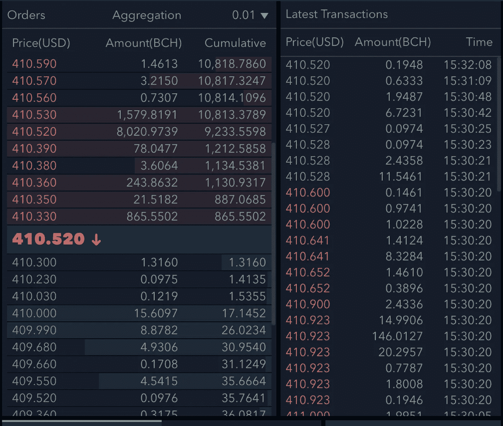
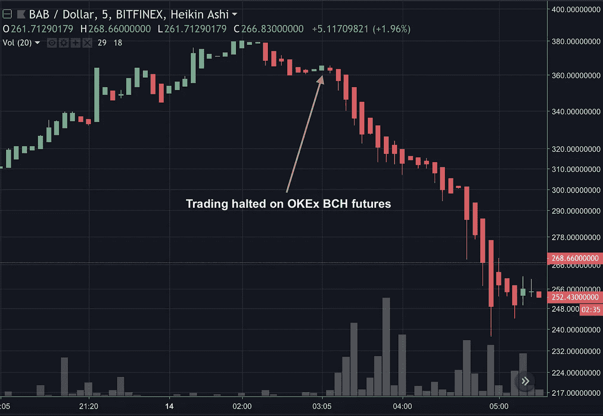
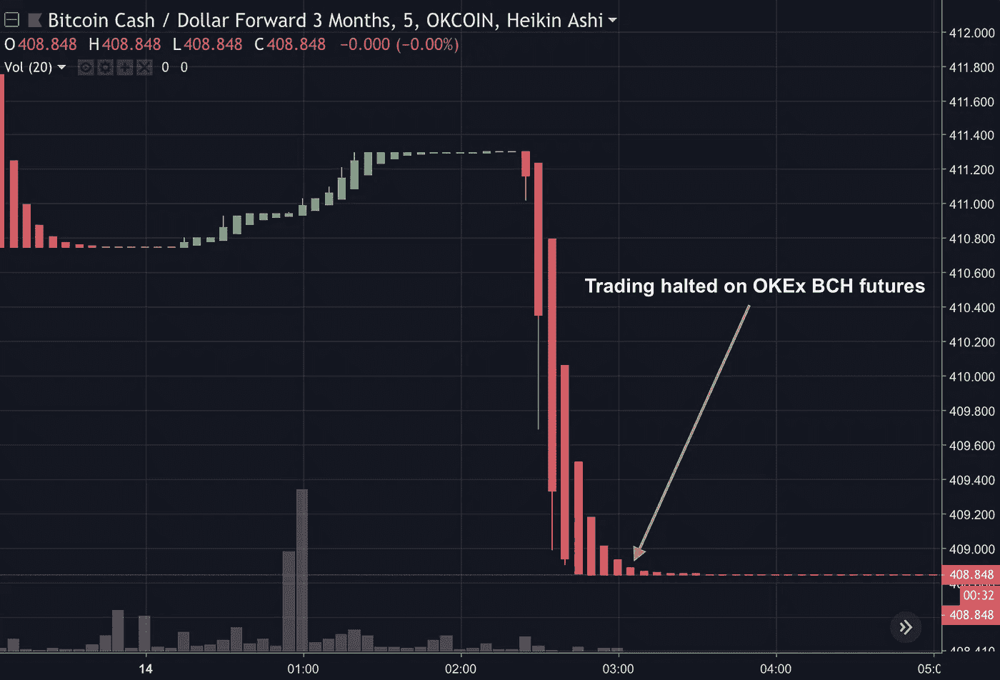
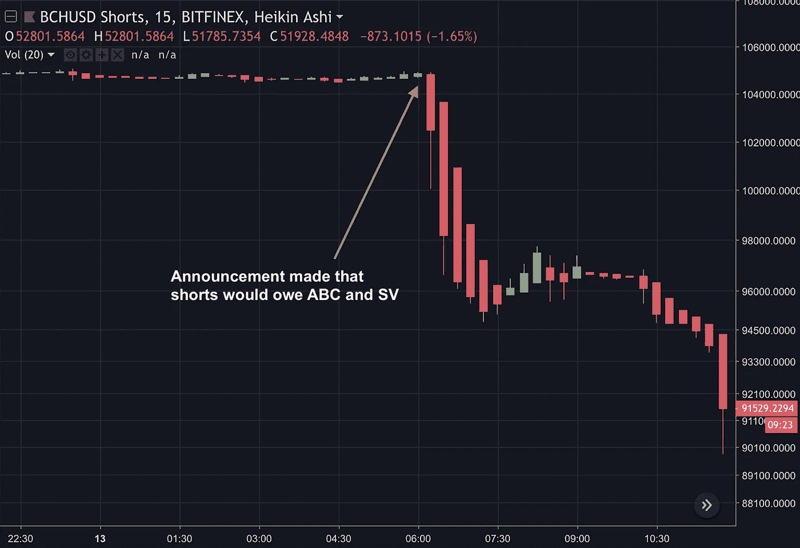
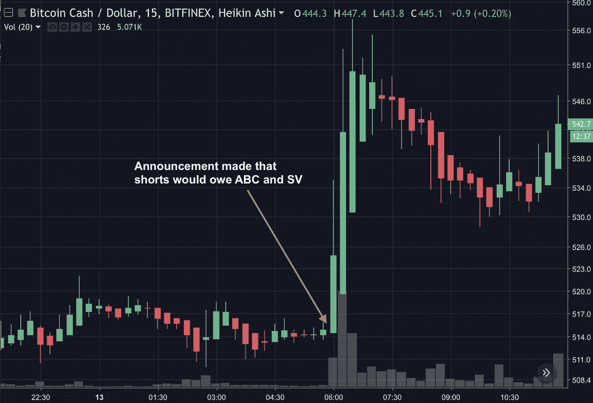

# 论交易所硬分叉政策的市场影响

> 原文：<https://medium.com/hackernoon/on-the-market-impact-of-exchanges-hard-fork-policies-bb7f7924676c>

## 解开交易者对 OKEx 和 Bitfinex 对待比特币现金可能的硬分叉的反应

交易所关于如何结算现有市场、认领和分配哪些硬币、是否在分叉硬币中创建新市场等方面的决策，会对相关工具的价格产生深远的市场影响。

在这篇文章中，我试图用两个例子来说明这一点，这两个例子围绕着 11 月 15 日[比特币](https://hackernoon.com/tagged/bitcoin)现金(“BCH”)可能引发争议的硬分叉，其中它可能分叉为比特币现金 ABC(“ABC”)和比特币现金 SV(“SV”)。这些例子也可以帮助交易者思考对[未来](https://hackernoon.com/tagged/future)政策公告的适当反应。

## **(1) OKEx 最后一刻提前交割 BCH 期货**

首先，我分享了 OKEx BCH 期货结算时间和价格的最后一分钟变化如何导致 ABC 的价格在不到两个小时内暴跌超过 35%。

**期货合约**

OKEx 在 BCH 提供三种期货合约，每周结算，每两周结算，每季度结算。这些合约的最新版本都是在 11 月 15 日可能的硬分叉后结算的。11 月 9 日，OKEx [宣布](https://support.okex.com/hc/en-us/articles/360018974712-Potential-Impacts-of-Bitcoin-Cash-BCH-Hard-Fork-on-OKEx-Futures-Market)其期货将结算于 ABC 的价格，如果有必要，它将调整其指数。

请注意，OKEx 的期货并不是唯一代表 ABC 价格的期货。像 OKEx 一样，Bitmex [宣布](https://blog.bitmex.com/)其 BCH 期货合约将在分叉后以 ABC 的价格结算。此外， [Poloniex](https://poloniex.freshdesk.com/support/solutions/articles/1000270700-pre-fork-trading-for-upcoming-bitcoin-cash-hard-fork) 和 [Bitfinex](https://www.bitfinex.com/posts) 也是为 ABC 和 SV 开放期货市场的交易所之一。

即使在 OKEx 澄清其期货将在 ABC 链上结算后，这些合约仍继续以两位数的百分比溢价交易。套利者开始在 OKEx 做空 BCH 期货，并在其他地方做空 ABC 期货，如 Poloniex 和 Bitfinex。与此同时，SV 继续强势挤兑 ABC，压制了套利者对 ABC 施加的任何买入压力。11 月 9 日，当 OKEx 宣布其期货将在 ABC 结算时，SV 从 Poloniex 的低点 50 美元(9% BCH)上涨到 11 月 14 日的高点 245 美元(49% BCH)。

**OKEx 价格限制和套利的扩大**

当 SV 的价格超过 BCH 价格的 20%时，由于 OKEx 的价格限制政策，OKEx 的期货合同不再能达到其公允价值。[【1】](#_ftn1)如果期货价格比其跟踪的指数价格低 20%以上，OKEx 的价格限制可以防止交易者开仓做空或平仓做多，反之亦然。[【2】](#_ftn2)OKEx 的 BCH 期货指数仅包含现货 BCH 市场，在那里 BCH 可以撤回并套利，如比特币基地的 BCH/美元。在任何这样的市场上，BCH 的价格必须代表 ABC 的预期价格加上 SV 的预期价格。

随着 SV 相对于 ABC 的反弹，OKEx 的 BCH 期货价格触底，约为指数价格的 80%,而公允价格有时低 20-30%。每当 BCH 指数下跌时，交易员们都竞相在 OKEx 上提交新的空头订单，以最低允许价格成交。在 11 月 13 日(东部时间)的上午和下午，很少有人玩这个游戏，空头订单经常被看似不知情的买家完成，甚至被他们挤兑。到晚上晚些时候(美国东部时间晚上 9 点左右)，许多交易者已经意识到了这个机会，在很大程度上，填补空头的唯一方法是使用机器人来放置它们。下面的截图显示了此时的订单簿和交易历史。

Millions of dollars worth of short sellers race to get orders off at the lowest allowed price

以这张截图为例，当指数在 512.94 交易时，交易者可以在 512.94*0.80=410.35 建立空单。当指数下跌至 512.91 时，交易者可以在 410.33 点输入更低的空头订单。当指数升至 512.91 点以上时，交易者不再能够在低至 410.33 点的位置建立空头订单，但 410.33 点的订单仍然存在。在这一点上，只要指数允许，交易者(大部分)使用机器人以较低的订单移动超过 10，000 BCH。

也许有点奇怪，尽管订单簿的出价方面缺乏任何深度，但这些订单经常被填满，每小时交易数百万美元。买家只是不知情，他们是流氓市场制造机器人，还是他们知道一些其他人不知道的事情？

这些套利者在填补他们的空头头寸的同时，也在其他市场买入农行股票以对冲他们的风险敞口。因此，OKEx 对指数和价格限制的选择可能在阻止 SV 的势头和支撑 ABC 方面发挥了重要作用。我们可以在接下来发生的事情中看到一些证据。

**合约的暂停交易和提前交割**

美国东部时间凌晨 3 点 05 分，距离预期分叉不到 33 小时，OKEx 暂停了 BCH 期货市场的交易。OKEx 在美国东部时间凌晨 3:21 通过[电报](http://t.me/okex_announcements/500)和美国东部时间凌晨 3:22 通过[推特](https://twitter.com/OKEx/status/1062621672069574656)广播了一则[公告，声明将在美国东部时间凌晨 3:05 暂停交易，并在美国东部时间凌晨 4:00 根据美国东部时间凌晨 3:05 的最后交易价格交割所有 BCH 期货合约。愤世嫉俗者可能会假设，OKEx 等了这么长时间才在其主要沟通渠道发布这一公告，是为了让内部人士有机会首先抛售他们的 ABC 对冲，同时坚持认为该公告已经公开。](https://support.okex.com/hc/en-us/articles/360019782211)

在接下来的几个小时里，套利者平仓了他们在农行的多头头寸，以抵消他们刚刚失效的空头头寸。在不到两个小时的时间里，美国广播公司在所有市场上从交易停止时的 363 美元暴跌至 237 美元的低点，跌幅达 35%。

BAB (Bitcoin Cash ABC) / USD on Bitfinex

BCH (Bitcoin Cash) / USD 3M futures on OKEx

美国农业银行的市场暴跌与 OKEx 宣布提前交付 BCH 期货的巧合，以及这些期货的大量交易，一起提供了强有力的证据，表明 OKEx 的政策起初支撑了美国农业银行的价格，直到最终导致它在宣布期货将提前交付时抛售。

## **(2) Bitfinex 对分叉的不确定处理**

我现在将展示 Bitfinex 处理硬分叉分布的最初不确定性如何导致 BCH 空头头寸的大量开仓，以及 Bitfinex 最终澄清其立场如何导致这些头寸的平仓以及 BCH 价格在不到一小时内立即上涨超过 8%。

我们现在知道，Bitfinex 最终于 11 月 13 日[宣布](https://www.bitfinex.com/posts/313)，在预期分叉的两天前，它将为 ABC 和 SV 创建期货市场，并让借款人和卖空交易者负责在 2018 年 12 月 31 日前交付 ABC 和 SV。然而，要理解这一声明对 BCH 价格的影响，我们必须首先考虑在这一声明之前交易者在想什么。

在 11 月 13 日的公开声明之前，交易员们自然会根据 Bitfinex 对之前分叉的处理来猜测它可能会如何对待下一个分叉。

**叉子的历史处理**

以下是 Bitfinex 就其对最近三种主要比特币来源的处理方式发布的公告的简要总结:

[比特币现金](https://www.bitfinex.com/posts/212) :
保证金多头/空头交易者未收到/欠 BCH。贷方和交易商收到了 BCH 的长期现货。为了弥补总存款中 BTC 贷款和长期现货的数量与 BTC 的数量之间的任何差异，将根据“社会化分配系数”来分配 BCH，该系数等于未平仓保证金多头除以未平仓保证金空头。例如，空头多于多头将导致 BCH 与合格 BTC 的分配比例低于一比一。

[比特币黄金](https://www.bitfinex.com/posts/230) :
Bitfinex 为后分叉版本创造了期货市场:BG1(现任 BTC)和 BG2(比特币黄金)。分叉时，借款人欠贷款人 BG1 和 BG2。该政策是在分叉前一天宣布的，期货市场的交易在分叉前几个小时开始。

[比特币 Segwit2x](https://www.bitfinex.com/posts/223) :
Bitfinex 为后分叉版本创造了期货市场:BTC(现任 BTC)和 B2X(比特币 Segwit2x)。在分叉时，借款人将同时欠贷款人 BTC 和 B2X。这个分叉最终取消了。该政策于 2017 年 10 月 6 日公布，比 2017 年 11 月 16 日的预期分叉日期提前了一个多月。

**预计治疗 11 月 15 日 BCH 叉**

在比特币黄金成为先例后，交易员可能预计 Bitfinex 将在最后一刻宣布为 ABC 和 SV 建立期货市场的可能性很大(正如我们现在所知，这最终是事实)。在这种情况下，借款人似乎有可能欠下这两种硬币，因为 Bitfinex 创建期货市场(比特币黄金和比特币 Segwit2x)时都是如此，期货市场允许借款人对冲他们的风险，使他们对欠下这两种硬币负责更加合理。

然而，也有一个非零的机会，期货市场不会被宣布。在这种情况下，Bitfinex 似乎有可能采取与比特币现金分叉时类似的方法，并效仿大多数其他交易所，将 ABC 视为分叉后的 BCH。BCH 将成为 ABC，保证金交易者不会欠或收到 SV，贷方和交易者长期现货将根据社会化分配系数收到 SV。

当然，这两种情况并没有穷尽所有的可能性，但相对明确的是，有一些机会，保证金空头交易者不会欠 SV，几乎可以肯定的是，他们不会欠一个以上的 SV 每 BCH。因此，在预期中，卖空交易者每借入一个 BCH 就欠不到一个 SV，但他们可以在 Bitfinex 上以与其他地方的 BCH 价格大致相同的价格卖空 BCH，其中每个 BCH 代表一个 SV 加一个 ABC。

因此，交易员在 Bitfinex 上集体进入 BCH 的空头头寸，可能是用相应的多头头寸进行对冲。请注意，交易者可能已经对冲了一些多头 ABC(如 Poloniex)和多头 BCH 的组合，这取决于他们对空头欠 SV 的可能性的信念，他们对自己对 Bitfinex 公告快速反应能力的信念，以及他们对 ABC 和 SV 进行不同投机的愿望。

交易员们焦急地等待 Bitfinex 的澄清，如果 Bitfinex 澄清空头欠两个硬币，他们可能会计划平仓，如果 Bitfinex 澄清空头不欠 SV，他们可能会平仓。

Bitfinex 宣布其计划

美国东部时间 11 月 13 日上午 5:48，Bitfinex 发布了一篇[文章](https://www.bitfinex.com/posts/313)，并在其电报中宣布，空头将欠 ABC 和 SV 两者。如下图所示，空头立即开始平仓，导致 BCH 价格从 514 美元的低点飙升至 557 美元的高点，不到一小时就上涨了 8.4%。当然，交易员在各交易所之间进行 BCH 套利，抑制了这种效应，并导致其他交易所的价格类似地上涨。

BCH (Bitcoin Cash) / USD Outstanding Shorts on Bitfinex, showing sudden drop in short interest

BCH (Bitcoin Cash) / USD on Bitfinex, showing price spike caused by closing shorts

## **收尾**

这些故事说明了交易者密切关注交易所政策公告的重要性，这些公告涉及交易者如何对待与预期硬分叉相关的市场。

这些故事还证明了交易所在早期透明地公布政策的重要性，最好是在潜在的分叉变得众所周知、交易员开始押注交易所将如何制定政策之前。与硬分叉相关的产品处理方面的意外变化可能会产生不良的市场影响，并增加交易所与其客户之间的不信任。

## 尾注

[【1】](#_ftnref1)这些合同的公允价值约为 ABC 在其他市场中的预期价格，如 Poloniex 的 ABC 期货，除了，主要是可感知的交易对手风险的差异。

OKEx 的[规定政策](https://support.okex.com/hc/en-us/articles/360000247811-Price-Limit-Rules-of-Futures)是价格限制是指数的+/- 25%，但实际上似乎是 20%。

[【3】](#_ftnref3)虽然这超出了本文的范围，但值得注意的是，当然，这些套利者可能一直在寻求对冲许多其他风险，例如做空 OKEx BCH 期货所需的 BCH 抵押品的长期敞口，以及 Bitfinex 上 ABC 多头头寸的风险敞口(可能使用北海巨妖的美元/USDT 对冲)。

*————
感谢 Lucas Adams 努力与我实时完成上述许多交易。也感谢伊恩·德索萨、塞缪尔·特劳特魏因和加布里埃尔·比安科尼对这篇文章的反馈。*