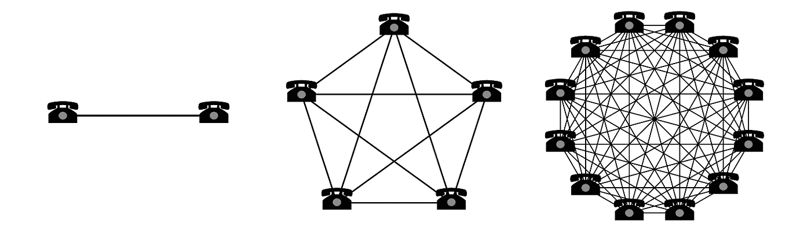
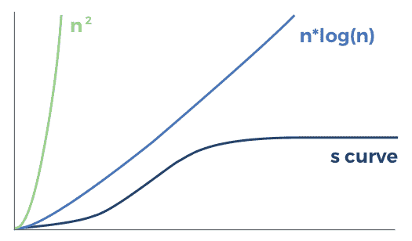
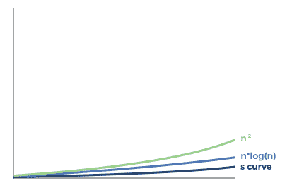
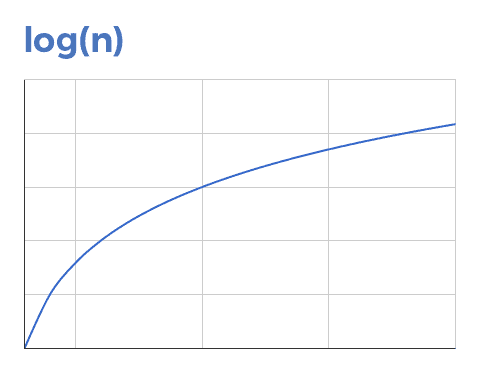
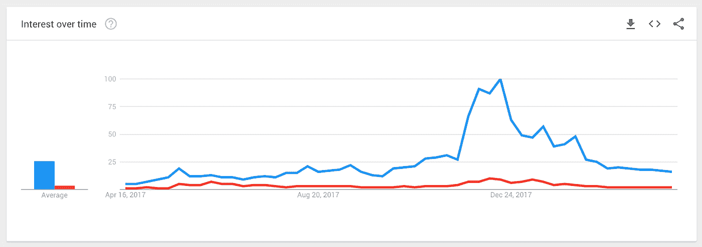

# 论价值储存的网络效应

> 原文：<https://medium.com/hackernoon/on-the-network-effects-of-stores-of-value-4286f6c98cdc>

这篇文章是智能合同网络效应谬论的精神继承者。

[比特币](https://hackernoon.com/tagged/bitcoin)有[网络](https://hackernoon.com/tagged/network)效应。许多密码鼓吹者断言，比特币的网络效应如此强大，以至于超级比特币化不可避免。

但这并不完全正确。比特币作为数字黄金的网络效应并不像许多人断言的那样。网络效应是微妙的，通常会被误解。

在这篇文章中，我将探索比特币作为数字黄金和数字现金的网络效应。我还将探索其他非网络效应的竞争壁垒。

一般背景的话，我推荐这个[中帖](/evergreen-business-weekly/the-power-of-network-effects-why-they-make-such-valuable-companies-and-how-to-harness-them-5d3fbc3659f8)，这个 a16z [幻灯片](https://a16z.com/2016/03/07/all-about-network-effects/)，这个 [Techstars 帖](https://www.techstars.com/content/accelerators/understanding-network-effects/)，还有这个关于[数据网络效果的帖子](http://mattturck.com/the-power-of-data-network-effects/)。对于更广泛的关于网络效应和技术平台的长篇阅读，我推荐作者 Sangeet Choudary 的[平台规模](http://platformed.info/)和书籍。

**网络效应的基础**

网络效应是一种*涌现的* *属性*，发生在以下情况:

随着越来越多的人使用，一种产品或服务对其现有用户来说变得更有价值。

有几种不同的网络效果:

*直接网络效应*——使用量的增加导致价值的直接增加。

直接网络效应之所以有效，是因为随着基础产品/服务的采用，现有用户获得了与越来越多的人互动的选择。基本上所有闭环通信网络都表现出这种类型的网络效应，包括基于互联网的服务，如脸书和 Whatsapp。

*间接网络效应—* 产品使用量的增加催生了越来越有价值的补充产品的生产，从而导致原始产品价值的增加。操作系统是受益于间接网络效应的最著名的产品类型。应用开发者被吸引到操作系统上来接触消费者；通过为给定的操作系统构建应用，该操作系统对新消费者变得更有吸引力，为未来的应用开发者创造了更大的市场。

*双边网络效应*——一组用户使用量的增加会增加补充产品对另一组不同用户的价值，反之亦然。一些著名的例子包括易贝，优步和 Lyft，AirBnB 和亚马逊的市场业务。在这些网络中，消费者受益于更多的选择和供应商之间的竞争，这推动了更多的消费者，从而吸引了更多的供应商。

*数据网络效应*——当一个通常由机器学习驱动的产品随着获得更多数据用户而变得更加智能。如今，数据网络效应出现在大多数基于云的现代应用中，尽管它们的相对优势因使用案例和复杂程度而有很大差异。

**量化网络效应的强度**

测量网络效应的精确强度相当困难。这不是一门精确的科学。

这尤其具有挑战性，因为额外用户对系统的边际价值会随着时间而变化。例如，在过去的几年里，我的许多朋友已经开始删除他们在脸书的个人资料。脸书现在对我来说几乎和三年前一样有用。我的脸书朋友流失 5%甚至 10%对我在脸书的体验影响相对较小，因为我还有 500 个其他朋友在使用脸书。

人们常说，网络效应绑定业务的防御壕沟可以用[梅特卡夫定律](https://en.wikipedia.org/wiki/Metcalfe%27s_law)来量化，该定律认为网络的价值与用户数量的平方成正比。为了可读性，可以说受梅特卡夫定律约束的企业的网络效应具有 n^2.的网络效应

自从梅特卡夫提出了网络价值的工作定义，它就被彻底的揭穿了。随着网络的发展，没有任何已知的网络会永久展现出 n^2 的网络效应。此外，驱动 n^2 的最初假设是，网络中的所有联系都同样有价值。相反，人们更普遍地认识到，大多数网络的网络效应可能比 n^2.更接近 n*log(n)

虽然这肯定比 n^2 更有意义(没有什么可以永远二次增长)，但即使 n*log(n)也是一条永久的超线性曲线。我们在现实中看到的是，不仅所有连接的价值不相等，而且在某个点之后，系统中每个边缘连接的价值开始下降(例如，亚洲接下来的 1000 万脸书用户对现有的美国用户来说价值很小)。

实际上，*最佳情况*网络效应比 n^2 或 n*log(n)更像 s 曲线。

有许多案例研究从经验上证明了网络效应在实践中的 S 曲线性质。这就是为什么 Macintosh 熬过了 90 年代(如果 Windows 的网络效应实际上是 n^2 的话，苹果很可能就活不下去了)，为什么有那么多消息应用(Whatsapp、Telegram、Facebook Messenger、Signal 等)，为什么 Lyft 可以有效地与 Uber 竞争(我不在乎路上有多少司机，只要我不到两分钟就能叫到车)，为什么有那么多特产电商商店可以与亚马逊竞争。

为什么人们继续说网络会受到 n^2 或 n*log(n)网络效应的影响，尽管有非常引人注目的例子作为相反的证据？因为在所有三条曲线中，很难看出每条曲线最左边部分的区别:

这是每条曲线的右半部分——只有当网络达到临界质量时才会出现的部分——这三条曲线在这里出现了实质性的分歧。n^2 曲线继续以二次方向上加速。n*log(n)曲线也永远向上加速，尽管速度要低得多。另一方面，当网络越过某个饱和点时，S 曲线从超线性变为次线性。

当然，并不是所有的网络都服从相同的 S 曲线。并不是所有的网络都受到 S 曲线的最佳网络效应的影响。

一些网络效应永远不会达到指数型网络效应，例如 S 曲线的左半部分。一些网络从一开始就只受 log(n)网络效应的影响，使它们永远是次线性的，这与 S 曲线相反，S 曲线一开始是超线性的。

log(n)网络效应最常见的例子是交换一种流动的、可替代的商品。即使你做出非常大胆的假设，即每增加一个用户都会增加每日流动性，额外流动性的边际价值对所有现有用户来说变得越来越没有价值。即使在网络的早期，这一点也是正确的。这条曲线从来不是超线性的；总是次线性的。

让我们考虑一个简单的例子，每一个新用户交易某种可替代商品会使该商品的每日流动性增加 0.01%。

当有 100 个用户时，每日流动性是商品市值的 1%。

当有 1000 个用户时，每日流动性是商品市值的 10%。

当有 10，000 个用户时，每日流动性是商品市值的 100%。

当有 100，000 个用户时，每日流动性是商品市值的 1，000%(10 倍的每日成交量)。

如果一个用户在交易中拥有 0.1%的商品，每个边际用户提供的流动性的价值就变得越来越不值钱。从技术上来说，滑点将随着用户数量的增加而减少，因此流动性也会增加，但实际上，边际流动性收益将非常低，不仅给定用户，所有现有用户都感觉不到。

给定可替换资产的所有交换具有大约 log(n)的网络效应，可以如下所示:

有充分的证据表明这在经验上是正确的。如果可替代商品交易所的网络效应在曲线上的任何一点都是超线性的，我们就不会有这么多秘密交易所了。我们可以观察到的是，如果一个交易所有一些流动性——市场领导者的一小部分——通常足以维持一个可行的交易所，并为市场参与者提供合理的流动性。

**数字黄金的网络效应**

数字黄金表现出哪种类型的网络效应？

为了回答这个问题，让我们来看看用户将如何使用数字黄金的机制。

像数字黄金这样的价值储存手段的目的是…储存价值以备日后消费。除了数字黄金被转换成其他东西的时间，数字黄金只是坐在那里，什么也不做。它不会受益于新用户的添加或删除。

当用户想要清算他们的数字黄金来消费其他商品或服务时，她需要找到流动性:有人愿意购买数字黄金。这可以在专门交易可替代数字黄金的交易所进行。

数字黄金的效用是其流动性的函数。如上所述，这意味着比特币的网络效应可以近似为 log(n)。

**数字现金的网络效应**

数字现金表现出哪种类型的网络效应？

为了回答这个问题，让我们来看看用户将如何使用数字现金的机制。

数字现金的目的是存储价值和作为交换媒介。此外，数字现金可以成为记账单位。

因此，数字现金的总体效用是多少商家想要接受用数字现金支付商品和服务的函数。

这类似于上述的直接网络效应(电话图)。接受使用数字现金支付的人越多，现有用户可以与之做生意的商家就越多。

所有主要的全球货币在其各自的辖区内都表现出这种网络效应。因为商人和消费者必须在每个管辖区以他们国家的本国法定货币纳税，所以他们选择以当地法定货币的形式收取工资(雇员)和收入(企业)。这产生了强大的网络效应，因为很少有人愿意承担持有一种货币的资产负债表风险，这种货币相对于他们用来购买商品/服务和纳税的货币而言，会受到价格波动的影响。

直觉上，这很可能受到 S 曲线网络效应的影响。接受数字现金支付的前 50%的商家比后 50%的商家更有用。

**价值储存与效用**

比特币最大化主义者会辩称，上面提出的论点是基于语义学的。具体来说，他们会说“当然，新用户会让比特币更有价值。他们会购买并持有它，通过定义使它更有价值！流动性论点是在转移视线。”

虽然这在狭义上是对的，但它忽略了竞争现实:如果其他东西变成了数字现金，并实现了超线性网络效应，会怎么样？这是我提出的更广泛的观点。单独来看，流动性的亚线性网络效应是一种转移注意力的方法。但如果其他东西成为具有超线性网络效应的数字现金，而比特币仍然是具有亚线性网络效应的数字黄金，那么比特币将被超越。

在密码圈里，这种框架通常被描述为[价值储存(SoV)与效用辩论](https://multicoin.capital/2018/03/15/paths-to-tens-of-trillions/)。SoV 的观点基于反身性:持有它的人越多，它就变得越有价值，因此驱使更多的人持有它。

当然，反身性是上下波动的。这造成了过度的波动性和不稳定性，完全违背了价值储存的目的。当价格只增不减时，很容易相信 SoV 假说。但是当价格下降时，潜在的效用价值创造了一个有机的价格底线。

很容易忘记我们在加密货币方面有多早。地球上有 70 亿人。不到 5000 万人拥有加密货币。我们的全球饱和度不到 1%。在一个开源软件的世界里，每个功能都可以被复制，赢得胜利的关键是尽快实现网络效应。这就是潜在网络效应的强度如此重要的原因。在数以千万计的用户中，这些优势会复合(或不复合)，从而在网络的终端价值上产生巨大差异。

**其他护城河**

网络效应只是竞争护城河的一种类型。护城河有很多种。

比特币最大主义者支持的其他护城河是“品牌识别”和第三方生态系统集成，如交易所、自动取款机、其他金融产品、硬件和移动钱包等。

为了探索这些护城河的力量，我将比特币与以太坊进行比较。这并不是说以太坊有可能取代比特币。相反，这意味着作为一个有竞争力的网络在推出后不到三年的时间里可以实现什么的例子。

品牌认知度确实是护城河。比特币是加密货币中的佼佼者。但是暗示它的品牌是不可触及的是完全错误的。没有哪个品牌是碰不得的。

没有一个很好的方法来衡量像比特币这样一个开放、无许可的品牌的品牌价值，但我们可以使用谷歌趋势作为一个粗略的衡量工具。

比特币是蓝色的，以太坊是红色的。在分歧最大的时候，比特币的搜索频率大约是以太坊的 11x。今天，差距是 8 倍。考虑到这个领域的不稳定性和快速发展，这种领先优势可能会在几年内消失。

第三方集成呢？在这里，以太坊几乎与比特币齐名:

交易所——所有主要交易所都支持比特币和以太坊的法币对。

硬件钱包——所有主要的硬件钱包都支持比特币和以太坊。

据我所知，所有加密自动取款机都支持这两种方式。

手机钱包——比特币和以太坊都有大量的 iOS 和 Android 手机钱包。

其他金融产品——比特币领先于芝加哥商品交易所、CBOE 和纳斯达克期货交易所。但鉴于以太坊的发展轨迹，它将在 24 个月内实现平价似乎相当合理。

同样，我的观点不是以太坊将取代比特币，而是第三方集成的范围并非不可逾越。

**结论**

网络效应和竞争壁垒通常被误解。与流行的观点相反，没有网络表现出 n^2 网络效应，事实上许多网络表现出对数网络效应，特别是可替代的资产交换。作为数字黄金的比特币将永远受到次线性 log(n)网络效应的影响，而作为数字现金的比特币可以实现超线性网络效应，因为加密的采用从<1% to 50% of the global population. The cryptocurrency that becomes the dominant store-of-value will *开始增长。根据定义*需要随着其增长展示超线性网络效应。

此外，其他类型的竞争壁垒，如品牌和更广泛的生态系统整合，并没有表现出规模报酬递增，可以通过具有超线性网络效应的竞争网络轻松克服。我们已经有充分的证据证明这是真的。

成为[超级大赢家](https://multicoin.capital/2018/03/15/paths-to-tens-of-trillions/)的战斗才刚刚开始。在所有网络效应曲线的最左边的 1%上，差异不容易辨别。人们很容易认为网络效应在实际发生之前就已经开始发挥作用了。

感谢 [Chris Dixon](https://twitter.com/cdixon) 和 [Matt Huang](https://twitter.com/matthuang) 为本文提供反馈。