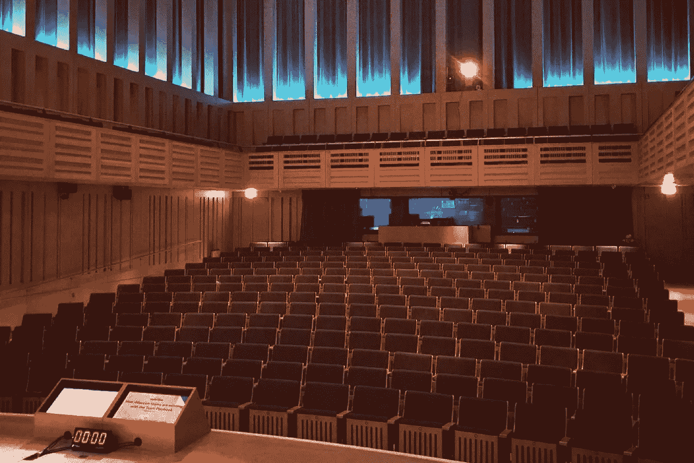

# 又上路了——让我内心的巨魔安静下来

> 原文：<https://medium.com/hackernoon/on-the-road-again-d054dd5d337b>

大约六个月前，我接受了职业生涯中的一项新挑战:公开演讲。不知何故，所有的星星都在一起了，我成为 TED 超级明星的梦想与我的公司对更多演讲者的需求相一致。就这样，我的旅程开始了，我开始代表亚特兰蒂斯人在全世界演讲。他们称之为“电路”，并说一旦你在它上面，很难下车。我说，放马过来吧。

公开演讲是我一直渴望磨练的技能。一些我天生就喜欢的东西，但是必须非常努力才能完善。一些能为我的未来打开大门的东西。另外，作为一个演讲者上路听起来不仅仅是迷人的，对吗？

# 欢迎来到斯诺普斯维尔

环球旅行有它的好处。首先，它和我与时差的斗争，让我成了一个完全的咖啡势利小人。我会说“我需要一杯真正的咖啡”和“你能做一杯纯咖啡吗？”我仰着鼻子滴美国咖啡，想到在国外点一杯拿铁就笑。我会为了咖啡和牛奶的完美比例走远走近，除非万不得已，否则我不会踏进星巴克一步。

我也成了那些“地位”势利者之一。尽管我认为万豪酒店很无聊，但我还是会住在那里，因为每个人都知道喜达屋积分奖励最高。我期待免费的座位升级，并向我妈妈吹嘘我的首映状态。我是那种在 TSA 预检线你脱鞋就大声叹气的人。我知道不堵车的时候，从一家到另一家需要 40 分钟。

# 没有运气这种东西

尽管如此，我仍然有最严重的冒名顶替综合症。我飞到世界各地去代表我的公司演讲，我不禁觉得自己是个骗子。在 2010 年的这个时候，我的公司经常被尊称为独角兽科技公司，有着清白的记录和令人羡慕的文化。

> 但是我相信没有运气这回事。所有事情的发生都是因为对那些你无法控制的事件的深思熟虑的选择和慎重的反应的结合。

我今天站在这里，是因为我曾经作出的一系列选择，我曾经采取的一系列行动，因为我曾经憧憬过我曾经渴望的未来。他们说，如果你认为它，它将是。我在其中看到的唯一真理是，如果你想它，你就会想要它，专注于它，并做出有意识和潜意识的选择，让你更接近那件事。

对我来说，我思考如何为女性的进步、同情心和开放性做出贡献。我一直想着写作。我想在我疯狂的小生命中尽我所能去冒险。现在我在这里，引导我的内在布琳·布朗，试图在这个男性主导的行业中展现我的力量。

# 巨魔大战乐观兔

在我演讲的经历中，最让我惊讶的是，在这一过程中，我不得不不断提升自己。我得多么依靠自己的心理韧性才能登上舞台，面对 400 个人，努力说出重要的话。

> 他们没有告诉你的是，当你在路上时，你是一个人。

我无耻的乐观主义是一种练习过的技能，而不是天真的遗传。我必须不断提醒自己，我做得很好。你做得很好，这需要改进，停止说“嗯”，肩膀向后，记得微笑，吸气…但是你做得很好，这并不容易！玩得开心！逗他们笑！记住，一个完美的坦普尔顿曼哈顿在另一边等着你。

否则，自我怀疑的黑暗喋喋不休开始渗透进来，企图摧毁我的活力。黑暗的喋喋不休会俘虏你，让你无法前进。它有能力解构你的世界观，代之以冷漠的果冻。你必须保持清醒，否则你根本撑不过 10 个小时的飞行看《拯救班克斯先生》(每次都让我崩溃！).

我不得不每天看着镜子里的自己说，你看起来真美。别担心那些多余的体重，你 34 岁看起来还不错，女孩！你总能把它吸出来！别担心那些白头发，你总是可以染的！酮饮食可以从明天开始！你在这里是因为你值得！你太棒了！

这是我继续前进、激励自己、日复一日醒来面对磨砺、肮脏的巴特、肮脏的街道的唯一方法，这样有一天当我回头看时，我会知道我已经尽我所能去做了哪怕是很小的改变。这是唯一能让我对那些会侵犯我的自由时间，让我远离家、丈夫、生活、日常事务和瑜伽练习的机会说“是”的东西。

这就是他们所谓的乐观偏见，这是驱使我的东西，这是我必须培养和保护的东西。这是我必须保持点亮的灯。蜡烛是如此脆弱，最轻微的一阵风就可能永远吹灭它，使我变得无动于衷。必须把那些喋喋不休的话，那些“这并不重要”的话，那些把你拖垮的内心巨魔拒之门外。

# 你知道这一切都是值得的，当…

我在伦敦的最后一次演讲中，一位年轻女士走近我。她羞涩地说:“看着你在舞台上，让我意识到，那才是我想做的。我想以帮助人们更好地合作为职业。你做了什么才来到这里？”

我几乎要哭了。

我，这个愚蠢，天真，不知从哪里冒出来的女孩，怎么突然变成了一个单身女人崇拜的人？我真的激励了某人吗？我有影响吗？

也许我就是为了这一点点机会，才不得不保持光明。所以也许有一天她不会对自己那么苛刻。所以也许有一天她不用那么努力工作了。都是为了她。她让一切都变得值得。

如果你喜欢这个博客，请关注我，了解更多关于技术、协作、生产力和在工作中做真实的自己的想法。

 [## 我不想再穿 t 恤了

### 仅仅因为我是搞技术的，并不意味着我必须穿得像它一样

hackernoon.com](https://hackernoon.com/i-dont-want-to-wear-t-shirts-anymore-f2388b2dbe2d)