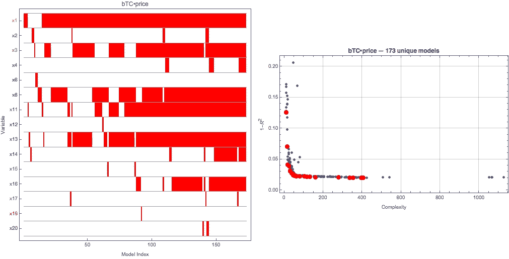
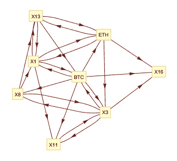
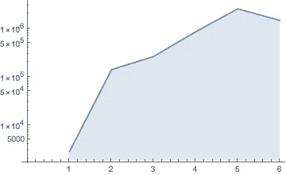

# 加密货币市场系统风险的来源

> 原文：<https://medium.com/hackernoon/on-the-sources-of-systemic-risk-in-cryptocurrency-markets-9ceb0ee249a1>

## Nassim Taleb 创造了“抗脆弱”一词来描述从冲击中受益的系统。秘密经济系统可能表现出脆弱、健壮和抗脆弱的特征。

*由珀西·维内加斯*[www.EconomyMonitor.com](http://www.EconomyMonitor.com)

## 摘要

算法货币的价值实际上存在于计算的信息内容中；但考虑到共识的约束(安全驱动因素)和网络效应的必要性(经济驱动因素)，价值的定义扩展到了网络本身的多层结构——也就是说，扩展到了区块链网络中节点拓扑的信息内容，以及网络外围网络、移动应用、网状物联网网络等中经济活动的复杂性。在作为区块链底层的本地网络信息流和真实世界数据信息流之间的边界上，出现了一个新的“脆弱性向量”。我们的研究问题是，与市场结构和设计、交易和时间成本、价格形成和价格发现、信息和披露以及做市商和投资者行为相关的因素是否可以量化到可用于对数字资产市场中的风险进行定价的程度。我们使用自适应人工智能方法来研究加密货币市场的自适应系统。结果表明，虽然在流行的话语中区块链被认为是稳健的，加密货币是抗脆弱的，但加密货币市场可能表现出脆弱的特征。

# 介绍

加密货币市场出现故障的案例数不胜数；有些与交易所的内部运作有关，如加密货币交易所 GDAX 的故障导致乙醚价格从 319 美元跌至 10 美分(Kharpal)；其他与信息传播有关，如韩国交易所在流行的价格追踪器 coin market cap(Morris)中退市后对比特币价格的负面影响。

虽然比特币网络在设计上是去中心化的，但支持比特币经济的服务运行的网络和其他外围网络却不是这样。这扩展到任何其他具有足够高的去中心化程度的加密货币，如以太。Roll (ROLL 1984)证明了波动性受市场微观结构的影响，通过将这一思想应用于秘密经济的链外方面，我们能够为区块链金融系统开发现实生活中的风险度量。

# 识别加密货币市场中具有系统重要性的服务

在撰写本文时，2018 年 3 月 6 日下午 3:38(UTC)，加密货币市场(包括硬币，不包括代币)的总市值为 405，939，039，748 美元。市值最大的资产是比特币(BTC)187，065，686，782 美元，以太(ETH)81，602，911，777 美元。

为了开始开发一个行为金融感知的分析模型，我们应该考虑在零售领域，人们通常在检查状态或执行交易之前使用一个或多个公共服务。这些服务包括针对不同区域市场的价格追踪器、各种类型的交易平台、集中交易和即时交易、钱包等等。我们使用一个通用的使用指标；图 1 显示了比特币网络的 1000 个最大贡献者和以太坊网络的 1000 个贡献者的样本(在消费点测量)。

Figure 1\. BTC and ETH off-chain supporting services

考虑到每种加密资产的不同使用案例，每种资产都倾向于在其轨道周围有许多专门的服务。然而，许多其他的是共享的(在左上方的 BTC 一侧密度更高)。如果我们也开始映射服务之间的关系，问题将很快变得难以解决。

两个集合中的共同来源将感兴趣的变量从 1000 带到 196，因此我们可以进一步按流量贡献对来源进行优先排序。但最终我们使用适应性方法作为检测不变性的方式，并通过使用价格作为响应变量来捕捉一般关系。对数据的这种处理将变量集减少到 22 个(见图 2)。自适应方法产生的模型在保持最低复杂度的同时竞相减少误差。在该图的准确性-复杂性帕累托图中，最佳模型(具有最佳可能的折衷)用红点表示。我们还注意到，通过模型之间的变量存在，只有少数来源是重要的。

Figure 2\. Variable Map and Pareto Front

# 系统风险映射

使用传统方法研究多元波动性是可能的，但让我们利用生成的表达式来构建系统相关性的图形表示。

## **(抗)脆性检测**

形式上，脆弱性和抗脆弱性被定义为对离散度和波动性的半量度的负或正敏感性(Taleb 2013)。这种情况下的不同之处在于，我们不仅仅关注价格冲击，价格本身也可能会因环境事件而突然变化。通过使用从我们对模型空间的适应性探索中选择的公式来构建图，我们获得了如图 3 所示的网络。

Figure 3\. Network of risk relationships

该网络揭示了脆弱性、重叠风险和相关反馈效应的来源。例如，很明显乙醚价格受 BTC 价格变化的影响，而不是相反。还可以理解什么是共享的风险驱动因素(例如，X1 的使用对 BTC 和 ETH 都有影响)，这允许对综合因素暴露进行更多控制(用对冲基金的话说)。

这种方法还可以发现副作用。对 X11 和 X3 的押注可能被证明是无效的，因为它们具有相互依赖的关系——但它们的风险状况是不同的，因为 X3 直接暴露于这两种加密资产价格；它们对环境的影响也有所不同——X3 比 X11 有更高的出站度(更多的出站连接)。在这种特殊情况下，这是有道理的:在实践中，钱包服务将更多地受到选定交易所的活动的影响，而不是直接受到价格的影响。

最后，该方法使得具有系统重要性的节点可追踪，例如 X1、X3 和 X13，它们都与比特币价格有关系。这是在图 1 这样的传统网络表示中不可能找到的。

## 监管和网络风险

风险网络还提供了消除不透明情况歧义的机会。例如，X13 似乎描绘了一种虚假的关系(服务如何影响分散货币的价格？)，但是更仔细的检查揭示了极端/尾部事件的发生。在 2017 年 9 月中国政府打击比特币交易所后，最受欢迎的交易所之一更名为国际服务并开始运营(但仍然主要从 mainland China 访问)。正如我们在图 6 中看到的，对大多数在线服务来说不可能的时间框架内的显著增长(在不到 6 个月内几个数量级)不仅解释了模型捕捉到的行为，还提供了加密经济中系统重要性节点存活率增加的证据。事实证明，有些服务很难被扼杀，即使它们在经济的中央集权部分运行。从这个意义上说，这些成分增强了抗脆弱的特性——它们同时增强了基础，甚至可能从冲击中受益。

Unique users X13 exchange

但是，尽管网络结构具有弹性，但攻击媒介和所用技术中的漏洞为系统的脆弱性创造了条件。例如，我们发现具有系统重要性的价格追踪者使用亚马逊 S3 等内容交付服务。2017 年 2 月 28 日，美国弗吉尼亚州北部的 S3 水桶停电，导致亚马逊网络服务无法访问。从网络应用程序到智能手机应用程序，依赖于这种基于云的存储的软件打破了互联网的相当大的一部分(尼科尔斯)。在 2017 年 5 月至 6 月和 2017 年 12 月的反弹后，比特币达到了目前的价格水平，如果像 2017 年初 AWS 中断这样的灾难性事件发生，因为比特币在消费者中得到更广泛的采用，并且与主流金融系统更加交织，价格冲击是可能的。

# 讨论

加密货币市场似乎展示了实验市场中常见的繁荣、萧条和失败的弊病(Paich 1993 年):

> 口碑、营销和学习曲线效应可以推动快速增长，通常会导致产能过剩、价格战和破产。以前的实验表明，这种功能失调的行为可能是由系统的“对反馈的误解”引起的，其中决策者没有充分考虑到 ***关键反馈*** *、时间延迟以及制约系统动态的非线性。然而，先前的研究常常不能改变这些反馈作为治疗的强度，忽略了市场过程，也没有考虑到学习。*

不仅具有系统重要性的服务依赖于可能存在风险的第三方提供商，有些服务本身也很脆弱。我们发现，经济中最重要的信息服务之一是使用开源技术构建的论坛，该技术以可扩展性问题和持续的安全漏洞而闻名；论坛运营者可能从来没有计划过这么快达到这么大的规模。从这个意义上来说，加密货币市场可能会遭遇规模增长过快的问题(Sterman 2007)，此时市场动态相对于容量调整而言是快速的。

但更重要的是，当不确定性增加了跌破数字资产基础技术(区块链)所赋予的稳健水平的可能性时，加密货币市场就会表现出脆弱性。

这就是研究加密货币市场适应性系统的适应性方法变得有助于识别和绘制风险源的地方——无论这是心理上受 ***信任不对称*** 的约束，还是本质上的基础，如从抗脆弱性条件到稳健性再到脆弱性的进展所表达的。有趣的是，鉴于传统经济理论的缺点，创造理解加密经济的新方法可能会产生意想不到的效果:去中心化分类账的出现也可能加速从经济均衡范式向经济复杂性领域的过渡(Bheemaiah 2017[Kary Bheemaiah](https://medium.com/u/4fba9e147d0a?source=post_page-----9ceb0ee249a1--------------------------------))。

如前所述，这种影响是双向的，服务使用的偏差也会影响价格。我们还必须承认，对于那些托管在集中式网络中的服务，由于运营活动，实际上等同于“期权价值”——因为它是为内部预算目的而分配的，或者因为注意力实际上是在公共市场(如双边广告市场)中交易的。但由于迁移到区块链基于技术的数字资产的最终目的是将价值符号化，我们可以设想，在短期内，定价为某个参与度指标倍数的期权将成为基于注意力的风险框架的可测量输入。考虑到理论上可以创造无限数量的资产，适应性分析方法应遵守奥卡姆剃刀原则:在与观察到的现象一致的理论中，应选择最简单的理论(李 2008)。最终，我们的目标是在高于平均水平的不确定性下实现预测，但要有可获得的资源——准确性和复杂性的最佳权衡。

# 结论

目前，加密货币市场显示出脆弱的特征。但是，人们应该为系统中发现的抗脆弱性特征感到鼓舞，尽管这些特征是广义的。剩下的公开问题是脆弱性是 K 特定的，即我们只关心低于某个预先指定的水平，即临界点的不利事件。本质上不同的多重暴露，使得定义这一等级的任务更加艰巨。作为一个例子，考虑一下专门的社交网络。鉴于所分析的复杂性空间，运营博客平台和社交网络混合模式的高贡献者没有被讨论(认为中等)。其中一些服务有助于形成公众舆论和影响投资者行为，然而相关信号是嵌入网络的“隐性”知识。在这里，经济复杂性指数的公式，以及它们对服务的普遍性和经济的多变性的处理，成为表征和量化增长驱动因素的基础。使用基于适应性因素的分析方法来增强这种方法基础，提供了理解加密货币市场脆弱性和相应价格风险的工具。

*发表于*[*【www.EconomyMonitor.com】*](http://www.EconomyMonitor.com)

*仅为教育目的提供的信息不应被视为财务或法律建议。*

推荐阅读[加密经济的复杂性](/@economymonitor/crypto-economy-complexity-48516e40f390)