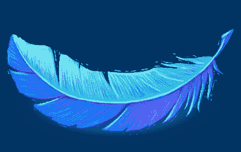

# 关于 Twitter 对社区开发者的打压

> 原文：<https://medium.com/hackernoon/on-twitter-d778fda2ed4b>

Source: [Apps of a Feather](http://apps-of-a-feather.com)

Twitter 正在严重削弱第三方(T2)Twitter(T3)的功能，许多 Twitter 超级用户将会失去他们所期望的许多功能。延续了一个非常普遍的趋势，Twitter 让他们的用户感到愤怒。

从任何合理的标准来看，我可能都不算是 Twitter 的“超级用户”，除了我几乎一直都在使用它(阅读)。但是我不怎么发微博，我只有 102 个粉丝(在我写这篇文章的时候),而且在我发微博的十年里，我已经发了四条微博了。事实上，我不是一个超级用户，所以我没有头像照片，甚至没有简历。

但我以推特机器人发誓。以前，我用过 Echofon，然后用了一段时间 Twitterriffic，最后尝试了 Tweetbot，因为我看到其他人似乎都很喜欢它。我肯定打开过 Twitter 官方 app，但是我都不记得上次是什么时候了。  正如约翰·格鲁伯昨天在他关于 Twitter 的[帖子](https://daringfireball.net/2018/08/twitter_third_party_clients)中所写的，“Tweetbot 以一种符合我对 Twitter 的心理模型的方式呈现推文和回复/提及。Tweetbot 对我来说很有意义——很大程度上只是因为它按时间顺序展示了推文。”我讨厌脸书转向算法时间线，也讨厌 Instagram 紧随其后。到目前为止，我一直能够避免使用 Twitter，但是不按顺序阅读 Twitter 对我来说简直是疯了。Twitter 的大部分内容都是关于正在发生的事情。这是一个故事，而不是*纪念物*。

我非常看重 Tweetbot，以至于我甚至不在乎我正在因为使用它而失去 Twitter 的一些功能。有时我看到看起来像问题的推文，但没有意识到它们是民意调查，因为 Tweetbot 中没有民意调查。Tweetbot 不支持民调，因为——令人震惊的转折！—它们没有公共 API。Twitter 削弱第三方应用已经有一段时间了，但昨天的变化更加糟糕。

因为我不是 Twitter 的超级用户，所以我对 Twitter 所做的改变没有太大的影响。理想情况下，Twitter 应该是实时的，但如果我看到推文和通知延迟了几分钟，这并不是世界末日。如果 Twitter 想把广告放入我的时间表，并强迫第三方应用程序显示它们(目前他们没有)，我可以处理它。我喜欢 Tweetbot 不仅能按顺序显示推文，还能同步我的时间线。因此，如果我早上在 iPad 上查看 Twitter，当天晚些时候我可以在 Mac 或 iPhone 上从我离开的地方继续。没有官方的 Mac Twitter 客户端，Web 界面肯定不是这样工作的。

我并没有对 Twitter 感到不安，因为我的 Twitter 体验将会随着这些变化而大打折扣。可能不会，通过继续使用 Tweetbot，我可能会过得或多或少好一些，尽管可能会有一些小挫折。当然，有人担心，如果开发者被迫删除大量功能，他们会放弃自己的应用程序，但我不想猜测未来某个时候会发生什么，因为现在有更切实的事情正在发生。

我对 Twitter 感到不安，因为它的原则。这一举动是对他们社区的积极敌视。Twitter 的大部分成就来自于社区，而不是 Twitter 的领导层。在成为该平台的官方部分之前， [@回复](http://log.maniacalrage.net/post/26935842947/the-real-history-of-the-reply-on-twitter)、[标签](http://stoweboyd.com/post/39877198249/hash-tags-twitter-groupings)和[转发](https://www.quora.com/Twitter-Retweets/Who-first-used-the-term-RT-on-Twitter)都在 Twitter 用户中很受欢迎。今天很难想象没有他们的 Twitter。“tweet”这个词是由 Twitterriffic 创造的，就像一只蓝色的鸟被用作 Twitter 的图标一样。Twitter 是由其社区和第三方应用塑造的，但它似乎不再关心它们了。

当然，这只是 Twitter 诸多问题中的一个。它已经成为仇恨言论和骚扰的污水池，作为一家公司，Twitter 似乎不愿意对此采取立场。在其他主要科技公司从他们的平台上移除亚历克斯·琼斯和 InfoWars 一周后，Twitter 也采取了同样的行动，他们只给他一周的暂停时间。我不想在 Twitter 的纳粹问题上纠缠，因为比我更有口才的[人](https://www.vanityfair.com/news/2018/02/how-twitter-lost-the-internet-war)已经把[比](https://www.businessinsider.com/gamergate-taught-me-what-twitters-biggest-problem-is-2014-10?IR=T)[写得](https://theoutline.com/post/1743/twitter-s-nazi-problem-is-still-out-of-control)多得多了，所以我就不说这些了: [Twitter 的优先级放错了地方](https://twitter.com/TeaAndCopy/status/1027132824757919744)。

Twitter 还没有死，但它正在死去。现在，我已经开始转移到[乳齿象](https://joinmastodon.org)、[、](#1a66)，这通常比 Twitter 更好的[，尽管它有一些缺点:例如，它更专注于作为一个社区，因此没有任何类型的验证系统。这意味着我在 Twitter 上关注的一些人(读:名人)可能永远不会搬到乳齿象。Twitter 拥有十年的用户，通常比乳齿象活跃得多。人们如此迅速地将](https://kevq.uk/how-does-mastodon-work/)转移到乳齿象网站，以至于运营[乳齿象网站](https://mastodon.social)的 Eugen Rochko，也是乳齿象网站的主要开发者之一，不得不关闭乳齿象网站的注册。)但我认为，乳齿象要拥有足够大的用户群，真正成为合适的 Twitter 替代品，还需要很长时间。当我昨天注册乳齿象的时候，我只能从我在 Twitter 上关注的 262 人中找到 3 个人。哦，还有——这很重要——Twitter 的第三方客户端要好得多。如果 Twitter 东山再起，把它的标志从一只山雀改成一只凤凰， [⁴](#72c2) 我可能会是第一批蜂拥而至的人之一。但目前，乳齿象看起来是最好的选择。(我们很幸运拥有它！似乎仍然没有一个像样的替代脸书，这是一个比 Twitter 更大的烂摊子。)

我太想喜欢 Twitter 了。Twitter 曾经是我最喜欢的社交网络。这里曾经是西部荒野的第三个 [⁵](#6aa6) 化身，在这里[人们讲着无聊的笑话](https://www.polygon.com/2018/7/30/17621870/comedy-twitter-james-gunn-dan-harmon-jokes)，你可以读到其他人生活中平凡却迷人的一面——名人也吃披萨！谁知道呢？我的 Twitter 现在大约有 10%是我最初加入的有趣的事情，60%的人在抱怨美国政治(在这种环境下，这是意料之中的)，30%的人在抱怨 Twitter 和杰克·多西。⁶ 我们不能指望 Twitter 一直像过去一样有趣和迷人:自然，所有的平台都会进化，但 Twitter 已经退化了。

所以，杰克，请扭转这个影响第三方应用的荒谬决定。请不要再做人们最不关心的改变，而是处理你的平台的实际问题。请禁止纳粹、骚扰和仇恨言论。请让 Twitter 再次变得伟大。

1.  [^](#3722) 我前阵子下载并再次尝试了 Twitterriffic 但是[不太喜欢](https://twitter.com/noahhalford/status/935471071012245504)。
2.  ^除了唐纳德·川普。
3.  [^](#686a) 我是[@ nhalford @ mastodon . social](https://mastodon.social/@nhalford)
4.  [^](#686a) 也许是一个标志，那个[看起来像](https://motherboard.vice.com/en_us/article/59yjaq/does-the-upside-down-twitter-logo-look-like-sonic-the-hedgehog)指节颠倒的针鼹。
5.  ^:第二个是网络的早期，第一个是狂野的西部。
6.  ^:这些数字并不是基于任何实际数据，但它们可能并不是可怕的估计。