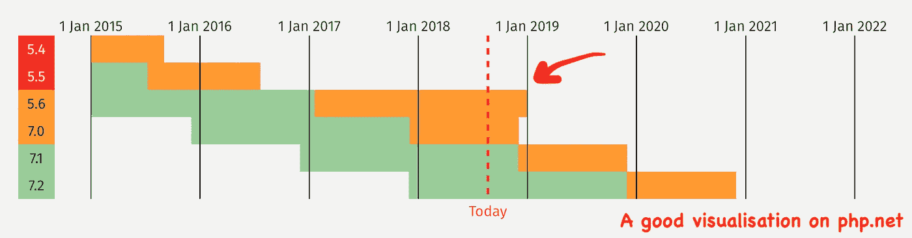
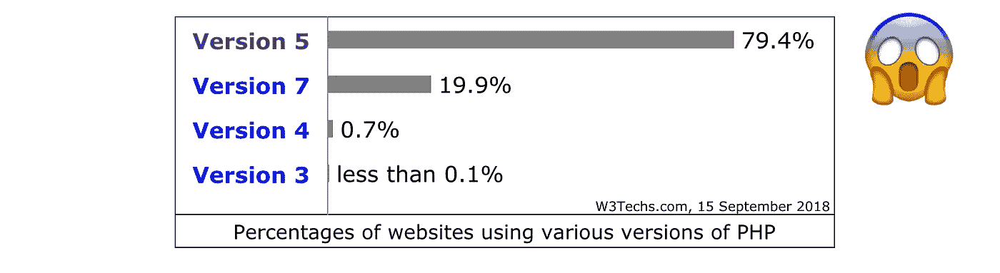

# 关于即将到来的 PHP 5.6 和 PHP 7.0 的截止日期

> 原文：<https://medium.com/hackernoon/on-upcoming-php-deadlines-1e3bdf04c7e2>

**末日将近！**至少为 [PHP](https://hackernoon.com/tagged/php) 5.6 和 PHP 7.0。为什么要更新？为什么有这么多旧的 PHP？如何建立最新的心态？

这是一个很长的阅读，包括背景，哲学问题和琐事的主题。不要期待代码示例。

# 为什么要升级到 PHP 7.2 呢？

时间差不多了。“PHP 5.6”是最近的 5 个版本，从 2018 年 12 月起将不再有安全补丁。任何新的漏洞都不会再被修复。这同样适用于最初的 PHP 7 版本，7.0 版。2015 年 12 月发布。当前版本是 PHP 7.2，下一个版本是 PHP 7.3。

在这里可以看到官方支持的 PHP 版本和寿命。

# 旧的 PHP 还存在多少？

截至 2018 年 9 月:PHP 5 仍是 PHP 使用最多的版本。根据你问的是谁，你会得到不同的答案:

*   **~80%老 PHP** 据 [W3Techs](https://w3techs.com/technologies/details/pl-php/all/all) (PHP 7 也包括了已弃用的 PHP 7.0)
*   **~66%老 PHP** 据 [WordPress](https://wordpress.org/about/stats/)
*   **~21%老 PHP** 据[作曲](https://seld.be/notes/php-versions-stats-2018-1-edition)

为什么会有差异？嗯，我相信 **W3Tech** 只是抓取网页嗅探`X-Powered-By`头以获得今天使用的版本。这包括所有的公共 IP 和所有被忽视的网站。由于这给了潜在的黑客关于 PHP 版本的信息，通常的做法是隐藏或伪造这个头，所以也许要对这个数字有所保留。幸运的是，WordPress 领先了一点，因为它是一个活跃的“网页设计师”社区，在美国有很大的股份。当然，Jordi 和作曲家走在了前面，因为那些 PHPeople 大多是“网络开发者”,他们更关心这些事情。

# 谁该为所有的旧 PHP 负责？

我们和其他开发人员对新的 PHProfessionality 感到兴奋:Composer，Laravel——对我们来说，PHP 真正实现了向现代[编程](https://hackernoon.com/tagged/programming)g 语言的转变。尽管如此，PHP 作为一种漂亮的主页语言还是有着不好的名声——这也是事实。PHP 过去是，现在仍然是(除了 JavaScript 之外)第一个选择创建主页的 web 本地语言。许多这样的网站仍然存在。都是那些小企业和他们的半专业网页设计师 T4。当你收到 200 美元为一家餐馆建立一个网站时，你不太可能在接下来的 10 年里维持它。

大量可疑的共享主机提供商将客户锁定在长期合同和过时版本中。我可以想象现在有一半的 PHP 5.6 网站可能已经关闭了。但这不是主机提供商的兴趣所在，他们更感兴趣的是让它们继续存在。

# 如何处理所有的旧 PHP？

不管整个互联网中旧 PHP 安装的真实数量是多少，很快就会有成千上万的过时的、未受保护的 PHP 服务器等着黑客来接管它们。也许我们应该聚在一起，提高对这种情况的认识，以便更多的人觉醒和更新？像`**#uPHPgraded**`这样的标签呢？

或者，更好的是，这是一个建立新商业模式的呼吁？想象一下，你会用僵尸服务器做什么？比特币采矿还是脸书农业？

# 建立一个最新的心态

保持您自己的代码和底层软件依赖关系最新不仅仅是一个好的实践，它还是一个需求。在 fortrabbit 上，我们是一起的。我们负责更新基础架构；您对自己编写和使用的代码负责。更新保持您的代码安全，快速和敏捷。根据 4.13 条款，我们的客户有义务在[之前使用最新软件。](https://github.com/fortrabbit/legal/blob/master/terms.md#-4-obligations-of-the-customer)

最新的思维模式需要提前思考和自律。[技术债](https://en.wikipedia.org/wiki/Technical_debt)是这里的关键词。预先考虑到你所有的代码都需要持续的关注和时间。

当你是代码维护者和企业主时，就更容易了，比如一家初创公司或你自己项目的自由职业者。在更大的结构和客户代理关系中更复杂。尽早将维护作为一个主题，包括在您的评估中。提高对保持软件最新的重要性的认识。为前期工作预留时间预算。

# 包扎

我很高兴看到重度开发下的 PHP 语言越来越接近更短的发布周期，甚至打破了一些旧习惯。它还活着。让我们拥抱变化，勇往直前。

*最初发表于*[T5【blog.fortrabbit.com】](https://blog.fortrabbit.com/on-php-deadlines)*。*