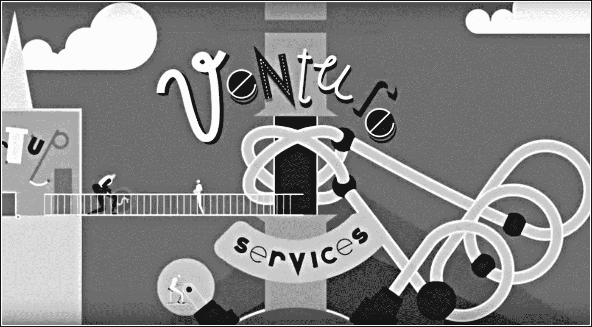
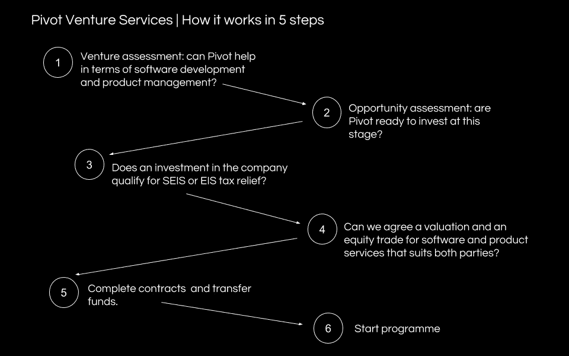
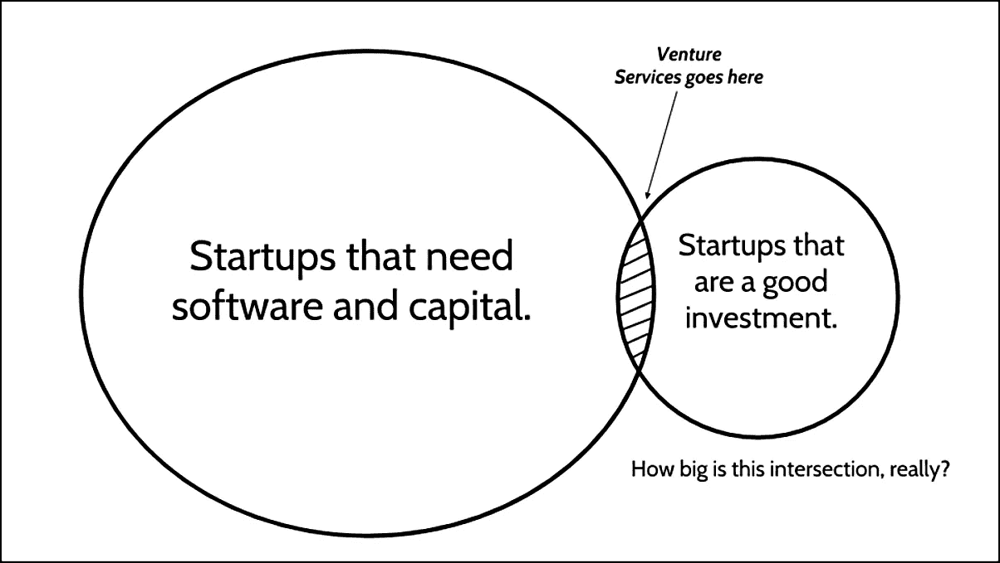

# 论风险服务

> 原文：<https://medium.com/hackernoon/on-venture-services-2a9c152bdefc>

The two biggest obstacles for startup founders.

> *"* Venture services 专注于解决创始人需求的一个特定细分领域:对优质软件的需求，以及购买软件的资金需求。

*这篇文章是关于[冒险](https://hackernoon.com/tagged/venture)和*冒险*系列文章的第二部分。[第一部分](https://hackernoon.com/on-venturing-7bf67a83ce34)主要从供应商的角度审视了风险投资的“是什么”和“为什么”。*

*这第二部分深入探讨了风险投资在*风险服务*的背景下实际上是如何运作的，这是我作为总部位于伦敦的 [Pivot 风险服务](https://www.pivot.uk.com/)的合伙人所占据的风险生态系统的一角。*

*我的第一次创业经历是通过[pre type](http://prehype.com/)，公司创业模式的先驱。[pre type](https://hackernoon.com/tagged/prehype)在全球范围内推动了许多创新项目，并与新闻集团合作，帮助诞生了 [Newsmart](https://www.getnewsmart.com/) ，我在 2015 年担任其产品总监。*

*我在风投行业的第一次真正突破是在北卡罗来纳州夏洛特的一家风投服务公司 [Castle](https://castle.co/) (又名“Castle Digital Partners”)担任总经理。我建立了卡塞尔的伦敦工作室，并签署了他们的第一笔欧洲风险投资交易。*

*各种形式的风险投资都是天使投资的专业化。*

*天使投资名声不好。一个以混乱、业余和异常高风险为特征的领域。*

*我曾经参加过一个投资研讨会，会上一位经验丰富的天使提出了他的观点，即人们不应该指望从天使投资中赚钱，天使投资更多的是为了娱乐。*

*这似乎有悖直觉。但当你的公司是你、一个大创意和幻灯片时，很难说服别人支持你(尤其是如果你以前从未创办过公司。)考虑到这些障碍，第一次创业的人能够成功创业是一个奇迹。*

*从分析角度来看，超早期创业公司是一个“死区”。估值、预测、市场规模和商业计划就像[史洛丁格的猫](https://www.youtube.com/watch?v=UjaAxUO6-Uw)；同时值 0 和 100 万。*

**

*An early-stage startup valuation.*

*机构投资者要到很久以后才会参与进来。他们是规模化投资者，而不是创业投资者。他们享受着相对奢侈的工作产品、市场吸引力，甚至来自所投资公司的收入。*

## *什么是创业服务？*

*风险服务公司服务于两种利益群体，一种是早期创始人(T0)的利益群体(T1)，另一种是早期(天使)投资者(T2)的利益群体(T3)。它们促进交易，使双方的利益朝着快速创造股权价值的方向一致。*

*众所周知，杰夫·贝索斯建议创业者如果想建立一个持久的企业，就要[【把赌注压在不会改变的事情上】](http://www.collaborativefund.com/blog/betting-on-things-that-never-change/)。他打赌，客户对低价和快速交货的渴望不会改变，这两者似乎都得到了很好的回报。*

*对于风险服务公司来说，赌注如下:*

1.  *我们打赌初创公司的创始人将继续需要资金和高质量的软件。*
2.  *我们打赌，富有的个人将越来越希望投资初创企业，同时降低失去投资的风险。(特别是在英国，他们将继续利用英国政府慷慨的税收减免计划，如 [SEIS 和 EIS](https://www.syndicateroom.com/learn/overview/seis-eis-tax-relief) ，只要它们可用。稍后会有更多相关内容…)*

## *赌注 1:创始人*

*Proptech。法律技术。互联企业。智能城市。很多。科技行业正在迅速多元化。典型的初创公司创始人也是如此。*

*在硅谷之外，首次创业者成为黑客或程序员的情况越来越少。相反，大多数人都是领域专家，他们发现了用软件打破或改变现状的机会。用保罗·格拉厄姆的话说，他们“只是一些商人”**

*[***重要提示**:格雷厄姆先生以一种有点贬义的方式使用这个术语。我们绝对不知道。]*

*对于“只是一些有远见但没有技术经验的商业人士”来说，构建一个初始产品并找到足够的资金来支付它的挑战可能是不可逾越的。这是创业过程中比通常认为的更大的障碍。*

*从历史上看，寻求创办公司的非技术型创始人有两种选择。*

***要么**他们找到一位技术型联合创始人/首席技术官，并依靠他们开发产品，以换取合理的股权份额。*

***或**他们进一步向外接触众多软件服务提供商(又名“开发商店”)中的一家，通常位于欧盟东部边缘(想想波兰、捷克、白俄罗斯、乌克兰、俄罗斯)或印度，并向他们支付现金。*

*每条路线都有它的优点和缺点，这两者都有很好的记录[这里](https://dualbootpartners.com/non-technical)和[这里](https://youtu.be/nuPAJ7X4WMw)。*

**

*风险服务公司为创始人提供了第三种选择，这种选择介于投资员工和独立供应商之间。理想情况下，它能提供两者的优点。*

*这些公司不创建公司或声称他们的想法。他们与使命驱动的创始人合作，解决他们需求的特定部分:对工作软件的需求和支付软件的资本需求。*

*对于初创公司的创始人来说，找到一个愿意消除早期发展的两个最大障碍的合作伙伴可能会很有吸引力。经常听到创始人谈论他们对*增值资本*的渴望。如果操作得当，风险服务应该感觉像是类固醇的加速器。*

*通过股权交易，风险服务公司与创始人达成了供应商无法达成的目标一致。这创造了信任和共享成果的伙伴关系文化。*

*然而，最吸引投资者的是，风险服务显著降低了风险。这包括团队风险、技术风险和(最重要的)生产前阶段的执行风险。*

*烧完初始资本却无法交付实际产品的创业公司比例仍然高得惊人。这通常发生在首席执行官意外地与首席技术官分道扬镳，发现自己只拥有一半没有价值的产品的时候。*

*有经验的天使会在多个场合见证这一点。相信产品会按时按预算交付，这是很难得的，也是很吸引人的。*

## *投资者*

*投资决策并不存在于真空中。它们发生在复杂的宏观经济环境中，包括财政激励和机会，特别是税收减免和拨款资助。*

*所有政府都寻求经济增长。由于初创企业从定义上来说是高增长的工具，政府越来越多地试图激励早期投资。人们普遍意识到这些计划的慷慨，再加上对创业公司的兴趣激增，已经形成了一场资本寻找家园的完美风暴。*

*举例来说，让我们来看看英国政府的[种子企业投资计划](https://www.gov.uk/guidance/venture-capital-schemes-apply-to-use-the-seed-enterprise-investment-scheme)，更广为人知的名称是 SEIS。对于早期创业公司来说，SEIS 相当于冰毒。*

*用 [CrowdCube](https://www.crowdcube.com/pg/seis-tax-relief-42) 的话说，*

**“说种子企业投资计划(SEIS)异常慷慨，多少有些轻描淡写。当然，我们都希望我们的投资表现良好，但如果你以 45%的税率缴税，投资 10，000 英镑却完全失败，那么由于税收减免，你只会损失 2，750 英镑。”**

*高所得税账单的富裕个人蜂拥寻找初创公司，这将使他们能够利用 SEIS 提供的税收减免。但很少有人能直接接触到合格的公司，或者有时间找到它们。*

*尽管纾困本身就是一个目的，但投资者也希望保护自己的投资，将下行潜力降至最低。他们不只是在寻找有资格享受 SEIS 税收减免的创业公司。他们在寻找*有资格享受 SEIS 税收减免的最佳创业公司*。*

*通过进入精选的早期创业公司，风险公司在这些交易中处于有利地位。*

## *风险服务如何运作*

*在第一部分，我观察到风险交易的经济细节很少被披露。很难量化创始人和风险投资公司之间到底有多少股权(和现金)易手。范围很广。*

*作为揭开神秘面纱的第一步，下面是一个成功的风险投资项目如何在 [Pivot](https://www.pivot.uk.com/services) 运作的分析。这是一条快乐的道路，一条所有的盒子都被选中的道路。*

*非常简短的总结是，风险服务意味着建立软件以换取股权，辛迪加部分股权以支付成本，并保留剩余部分作为保证金。这使得公司的激励和利润与他们的合伙人的创始人的激励和利润相一致。*

*稍微长一点的版本如下:*

1.  *该公司会见了一个初创公司的创始人，并根据市场机会和优质软件创造动力和初始牵引力的程度做出了投资决定。*
2.  *该公司与创始人密切合作，对帮助初创公司实现既定目标所需的软件开发成本进行评估。*
3.  *公司的投资经理决定是否需要额外的现金，并计算公司将作为保证金增加的股权溢价。*
4.  *公司同意与创始人进行投资前评估，并提议开发他们的软件，以换取公司%的股权。*
5.  *如果双方同意风险投资提案的条款，创始人通常通过期权或预先认购协议(ASA)将同意的股权转移给公司。*
6.  *风险企业为初创公司设计、开发和部署约定的软件，并在约定的时间内维护/迭代该软件。软件工程团队直接从风险投资公司的资金中获得报酬，或者通过辛迪加给投资者%的股权来换取现金。*

**

## *为什么创业服务很难*

*与其他形式的风险资本相比，风险服务仍然是小众的。*

*这主要是由于商业模式的复杂性。在一笔成功的风险投资交易中，有比传统投资更多的活动部分和更多的因素需要调整。大多数投资者更愿意避免作为风险合伙人的额外管理费用和责任。*

*我观察到的其他原因如下:*

## *#1:现金流*

*在第一部分中，我们探讨了为什么服务行业的利润不能为冒险提供资金；至少不是长期的。*

*服务企业以现金的形式产生收入。冒险就是投资，是递延收益。让两者不可调和的通常是成本基础。*

*由于软件公司是轻资产公司，其成本基础的最大份额是工资。如果你每个月底有很多工资要支付，那么你需要现金来支付。而且，如果你所有的利润都用于投资，那么你在经济低迷时期就有很大的风险。*

*我曾经历过拥有大量劳动力的服务公司在试图进入风险行业时几乎破产的情况。后果是严重和不幸的，主要是对雇员而言。*

*那么，风险投资公司如何在没有大型开发人员和设计人员团队开销的情况下开发软件呢？我们在 Pivot 通过逐个交易动员团队，并在严格管理、固定成本的环境下工作来解决这一问题。*

*我们通常采用混合模式，CPO 和 CTO 在“岸上”(在我们的例子中，在伦敦)工作，而 UX、设计和工程部门在“近岸”(通常在东欧)工作。我们总是寻求通过与许多企业的相同人员合作来建立长期的合作伙伴关系。这创造了熟悉和信任的纽带，随着时间的推移产生真正的团队效率。*

*该团队的成本被计入风险公司筹集的总资本，然后转换为公司的股权。*

## *#2:市场规模*

*寻找好的投资创业公司很难。寻找产品前、收入前的初创公司*和*是一项很好的投资，这是一场神话般的寻宝游戏。*

*很难准确估计风险服务市场的规模。根据我们已经完成的交易与我们错过的机会的比率，T2 可能会非常小。*

**

*在投资范围的最高风险端工作的不利之处在于，嗯，它是有风险的。大多数投资者更愿意看到市场吸引力的证据。投资一个尚不存在的市场是一个巨大的信念飞跃。*

*Pivot 努力通过支持那些回售给他们主要网络的创始人来降低这种风险，至少在一开始是这样。*

*前律师很适合向其他律师出售法律技术解决方案。前营销人员向他们以前的(营销)同事出售营销平台是一个合理的赌注。与黑客不同，在销售方面，“某个商业人士”通常更有优势。销售是更大的长期挑战。*

## *#3:文化*

*风险服务公司结合了两个不同领域的专业知识(和应用):早期投资和软件产品开发。这些领域的人来自不同的地方，有不同的思维方式，说不同的语言。*

*服务提供商本能地倾向于与任何愿意与他们合作的人合作。投资者本能地持怀疑态度。服务提供商默认为'是'投资者默认为‘否’。*

*当我说创业者和整个创业社区对待这两者的方式也*非常不同的时候，我是根据经验来说的。**

*投资者处于食物链的顶端，并得到相应的待遇。他们的电子邮件和会议请求得到了很高的回复率。他们通常不卖也不卖。*

*对于软件服务提供商来说，生活是不同的。他们的大部分时间都花在撰写无人知晓的评估和提案上。他们的通信被忽略。他们必须不停地忙碌。*

*风险服务公司的部分成就是为这些非常不同的个人找到一个共同的基础。仅此一项就是进入的障碍。*

## *TL:DR*

*到目前为止，这就是我要分享的全部内容。你可能知道，我看好风险投资(和风险服务)作为一个新兴类别在整个风险投资中的潜力。*

*任何其他玩家(或有抱负的玩家)，我很乐意听到你的意见。*

**这是 TL:DR* :*

1.  *风险投资仍然是一个利基市场，主要是由于其商业模式的复杂性。*
2.  *所有股权交易(即创业公司不支付现金)是最引人注目的、与众不同的、潜在利润丰厚的风险投资形式。聪明的创始人重视迅速加入经验丰富的产品团队的机会，并准备相应地交易他们的股权。*
3.  *没有资本池，尤其是基金或投资者财团，风险投资是不可能成功的。*
4.  *尽可能降低管理费用是成功的关键。*
5.  *虽然价值主张很有说服力，问题也很大且很常见，但潜在市场的规模仍然很难量化(可能非常小。)*