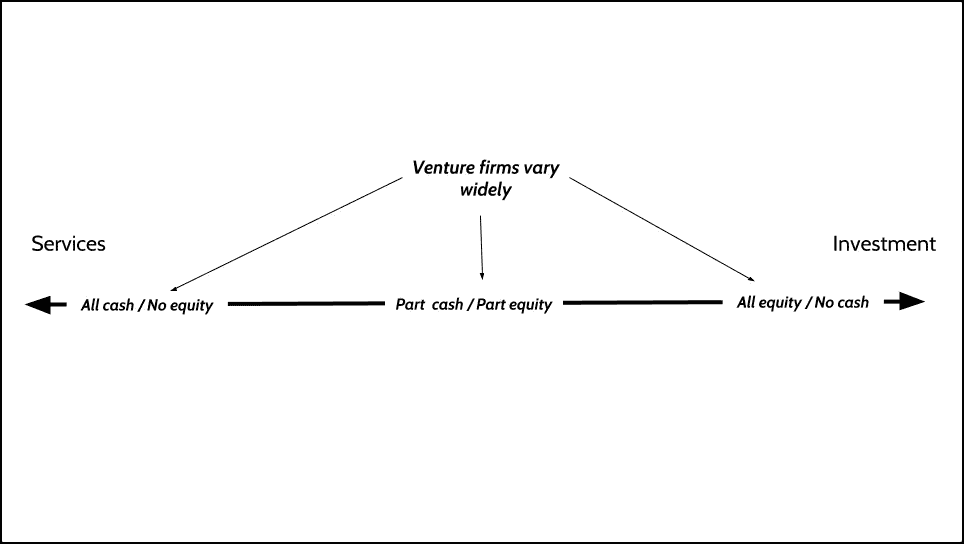

# 论冒险

> 原文：<https://medium.com/hackernoon/on-venturing-7bf67a83ce34>

With thanks to William Hogarth.

这篇文章是关于冒险和冒险的两篇文章的第一部分。第一部分主要从提供者的角度审视风险投资的“是什么”和“为什么”。

第二部分深入探讨了“如何”在“风险服务”的背景下进行风险投资，这是我作为总部位于伦敦的 [Pivot Venture Services](https://www.pivot.uk.com/) 的合伙人所占据的风险生态系统的一角。

这个系列也是关于早期创业公司的:在他们内部和周围工作意味着什么，为什么风险投资是一个值得[创业公司](https://hackernoon.com/tagged/startup)创始人考虑的投资选择。

这篇文章的标题图片来自威廉·霍加斯的[系列画作](https://en.wikipedia.org/wiki/A_Rake%27s_Progress)，描绘了伦敦现代资本主义诞生期间的财富积累和损失。如今，任何在初创企业领域工作的人都会认出骗子、幻想家和流氓，更不用说他们所处的充满机遇和(最重要的)风险的世界了。

## 什么是风险投资？

冒险意味着风险。作为动词,“冒险”意味着在结果不确定的活动中分担风险。冒险需要对风险和混乱的胃口。尽管迫切希望降低投资环境中的风险，但无法避免的是，与其他投资选择相比，风险仍然很高。

当听到“风险”这个词时，大多数人都会想到风险投资。风险投资公司是我们称之为“技术”的行业不可或缺的一部分，也是几乎每一家我们能说出名字的“技术公司”(以及无数其他我们说不出名字的公司)的成长故事的一部分。

尽管获得了感觉上的主流地位，风险资本仍然描述了将资金分配给可能提供更高回报的高风险投资。这些投资被称为创业公司。风险投资公司向初创公司提供资金，以换取股权。

本文中的“风险”指的是用服务换取创业公司的股权，而不是现金投资。这种形式的交换通常被称为“汗水权益”(有时简称为“汗水”)，意指劳动力(“汗水”)而非资本的交易。风险不是一个单独的资产类别，而是风险资本的一种形式。

软件中的“血汗资产”自古以来就存在。然而，这通常意味着初创公司的创始团队投入的时间(免费)，而不是与另一家公司的安排。

初创公司和软件服务公司之间也有血汗股权协议，但它们往往是无偿的附带利益(“我们真的很喜欢你，但你没有钱，所以我们会为股权做一些工作”)，而不是服务提供商的战略重点。在过去的几年里，这些关系已经开始扩散和发展。

冒险作为一个主题或商业类别，最近获得了大量曝光。这在很大程度上要归功于前 ustwo 所有者、FKTRY 创始人朱尔斯·艾尔哈特(Jules Ehrhardt)在他广为流传的文章《2020 年 T2 数字国家状况》(State of the Digital Nation 2020 )中对 fk try 的未来发表了明确的支持。

《2020 年的状态》对全球风险投资的前景进行了特别全面的描述。它揭示了一个支离破碎的生态系统和各种各样的参与者。甚至名字也千差万别。还有 [*创业工作室*](https://humanventures.co/)[*产品工作室*](https://www.surfncode.io/)[*创业开发公司*](http://prehype.com/)[*创业工作室*](http://www.sweet.studio/)*[*创业服务公司*](https://castle.co/about) *和* [*创业建设者*](https://venturebuilders.nl/) *。*在这个列表中，朱尔斯加入了他自己的创意，即 [*创意资本工作室*](https://fktry.com/) 。**

*大多数风险公司倾向于关注团队的产品和构思能力；因此，像“工厂”和“工作室”这样的术语在名称中出现的频率很高。这些反映了创始团队的背景，他们通常来自数字战略、设计或工程背景。*

*但是，风险投资是一种双面业务、服务和投资。而且，根据我的经验，投资挑战是最难做对的部分。*

*有许多来自代理和开发部门的有能力的服务公司，他们能够按照约定的时间表交付高质量的软件产品。很少有投资公司能在种子阶段持续产生高回报。*

*在我看来，风险投资的基本经济学很少被任何一个参与者披露。因此，很难确切知道他们如何构建风险交易，或者他们的历史回报率。很容易证明风险投资是一项令人兴奋的业务。但是有利可图的？没有那么多。*

*许多风险公司同时为现金和股权而工作。这是因为他们对自己的服务打折扣，而且没有资金可以利用。就其价值主张和它所产生的关系的性质而言，这种安排倾向于“服务”这一端。*

*那些由*资助的公司倾向于关注交易的潜在好处(而不是现金的短期利益)，所以只为股权而工作。这些公司往往被视为(和对待)更像投资者。**

**

*让事情更复杂的是，不同风险公司期望的股权范围也非常广泛。*

*对于初创工作室来说，这一比例通常超过 50%，有时甚至超过 80%，这使得首席执行官成为雇员，而不是创始人。对于风险服务公司来说，对于处于产品前期并需要 MVP 的初创公司来说，这个数字通常在 20%左右。对于有 MVP 和一些牵引力的创业公司来说，可能只有 10%。*

## *为什么要冒险？*

*根据我的经验，人们选择冒险有三个原因。*

*第一个是*每个人都想和初创公司*合作，打造下一个很酷的产品。*

*不幸的是，创业公司往往对外来者关闭。他们不怎么接触服务公司或顾问。从定义上来说，他们资金紧张，因此能够自给自足。*

*好奇者只有两条路可走:找到一条或者加入别人创立的一条。当然，你也可以投资一个。但投资者不与他们的投资对象“共事”,很少能看到幕后的真实生活；只是创始人想要传达的美好现实。*

*第二个原因是第一个原因的一个促成因素，Y Combinator 的杰西卡·利文斯顿最近对此进行了很好的阐述。*

*在她的文章中，' [*思考股权*](http://foundersatwork.posthaven.com/think-about-equity) *'* ，杰西卡指出，没有人通过挣工资而变得(真正)富有，*

**“除了工资，还有一种赚钱方式。你可以通过创业或为创业工作来获得它。决定为哪家初创公司工作，不像决定为哪家大公司工作，不像决定去哪家大公司工作，因为最有上升空间的股票是那些规模很小的初创公司，大多数人从未听说过它们。**

*我们大多数人从小就被教育要把物质进步和工资增长联系在一起。但是，在过去十年中，我们观察到许多年轻男性(主要是男性)在相对较短的时间内为自己和同事创造了难以置信的财富。他们中没有一个人是靠在大公司拿薪水而做到的。*

*真正的财富是通过*拥有*，而不是*赚取*获得的。西方的经济格局正在发生变化，员工的期望也在发生变化。人们意识到公平是财富的真正来源。他们想加入。*

*最后，还有经济上的必要性。*

*正如副标题所示,《2020 年的状态》的一个关键主题是，数字机构采用的“服务现金”模式前景黯淡。商品化正在摧毁利润率，而且将继续下去，除非他们重新发明如何为他们创造的价值收费。朱尔斯认为，前进的唯一途径是冒险。*

## *为什么 Venture 还是小众？*

*如果与初创公司合作的吸引力(和潜在的好处)如此之大，为什么冒险没有得到更广泛的应用呢？原因在于，成功地将服务与投资结合起来，远比许多人意识到的更具挑战性。*

*(再次)引用朱尔斯的话，*

**“基于风险、递延收入、风险工作的经济学与有偿时间咨询工作根本不可调和。”**

*服务公司能产生现金。他们从服务中获得的现金允许他们支付他们唯一的实际成本(他们的员工)和净健康的利润。另一方面，冒险是投资，这意味着推迟现金换股权。私营公司的股权缺乏流动性。因此，现金流很快成为服务公司进入风险投资的一个问题。*

*从长远来看，用服务业的利润来资助风险投资是不可持续的。我经历过一些公司在试图转型时几乎破产。被警告。*

*朱尔斯的观察是正确的，没有资金池(他称之为“边车基金”)，几乎不可能维持下去。*

*如何调和这两种截然不同的商业模式？我们将在第二部分对此进行探讨。*

## *泰勒:博士*

1.  *风险投资是指为初创企业的股权提供交易服务，是风险资本的一种形式。*
2.  *尽管人们对这种商业模式的兴趣高涨，但目前风险投资领域是多样而分散的，没有主导者。*
3.  *由于其商业模式的复杂性，风险投资仍然是小众的。*
4.  *没有关于整个行业盈利能力或回报率的综合数据。*

**尽管本文的重点是创业，但重要的是要承认，许多精英咨询公司，特别是麦肯锡和波士顿咨询集团，已经通过他们的 [BCG Digital Ventures](https://www.bcgdv.com/) 和 [McKinsey New Ventures](https://www.mckinsey.com/about-us/new-ventures) 部门在企业中创业一段时间了。*

*麦肯锡将这种努力称为“基于资产的咨询”,经过多年的潜行，已经逐渐开始公布其解决方案的细节[。不足为奇的是，支撑与客户的风险交易的财务安排仍未披露。](https://www.mckinsey.com/solutions)*