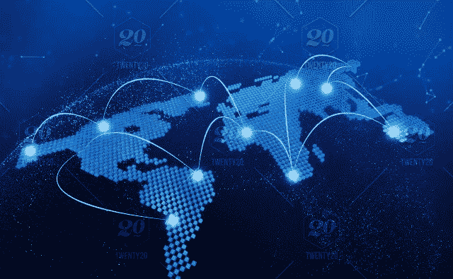

# 什么是有价值的小组讨论

> 原文：<https://medium.com/hackernoon/on-what-makes-a-worthwhile-panel-discussion-b9d3a9b30203>

【2018 年 10 月
加州三藩市

最近，我一直在旅行，在 Startengine 峰会等会议上发言，在 Commerce Ventures 的炉边聊天上发言，并在 SF Blockchain Week 期间主持自己的 meetup。

许多小组没有足够的时间深入探讨该主题的实质内容，而只是触及表面问题。在任何讨论中，在我看来，最具启发性的小组是那些不回避被要求为自己的假设和立场辩护的小组成员之间的小冲突的小组。

我们举行了各种座谈会，有的只有知名公司的高管参加，有的则有产品和营销经理参加。侧重于产品或营销的专题讨论可以和首席执行官的专题讨论一样信息量大，因为它们可以从不同的角度展示同一个公司和行业。我特别喜欢主持有营销团队参加的小组讨论，因为他们可以深入了解如何以更外行的方式在区块链扩展困难概念的日常挑战，并了解在行业中提高意识的挑战，同时确保在该领域中强调关键的差异化和定位因素。

总的来说，作为 SF Security Token 和 NYC Security Token Meetup 的组织者，我寻求创造对话和小组讨论，通过在博客、YouTube 频道或网站上找不到的想法的相互作用，给与会者留下非常独特的观点。

我希望您能够加入我们的下一个安全令牌小组，并更愿意听取关于主题和话题的建议。
___

免责声明:这些观点仅代表我个人的观点，并不代表 Sharespost 或我可能建议或投资的任何公司的观点。

如果你想联系，请在 [Twitter](https://twitter.com/John1wu) 、 [Medium](/@John1wu) 和 [LinkedIn](https://www.linkedin.com/in/johnwu87/) 上关注我。