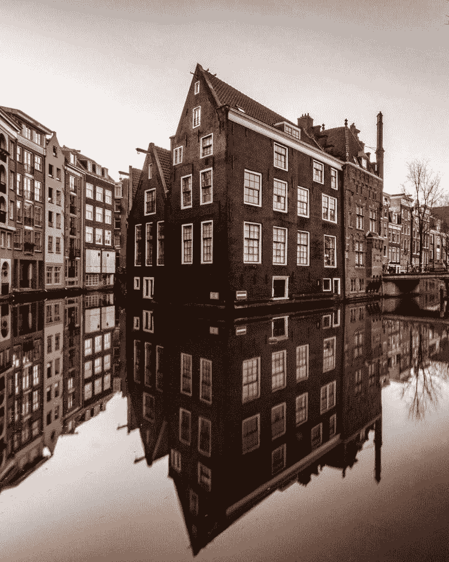
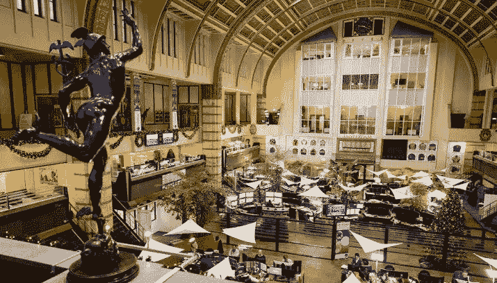
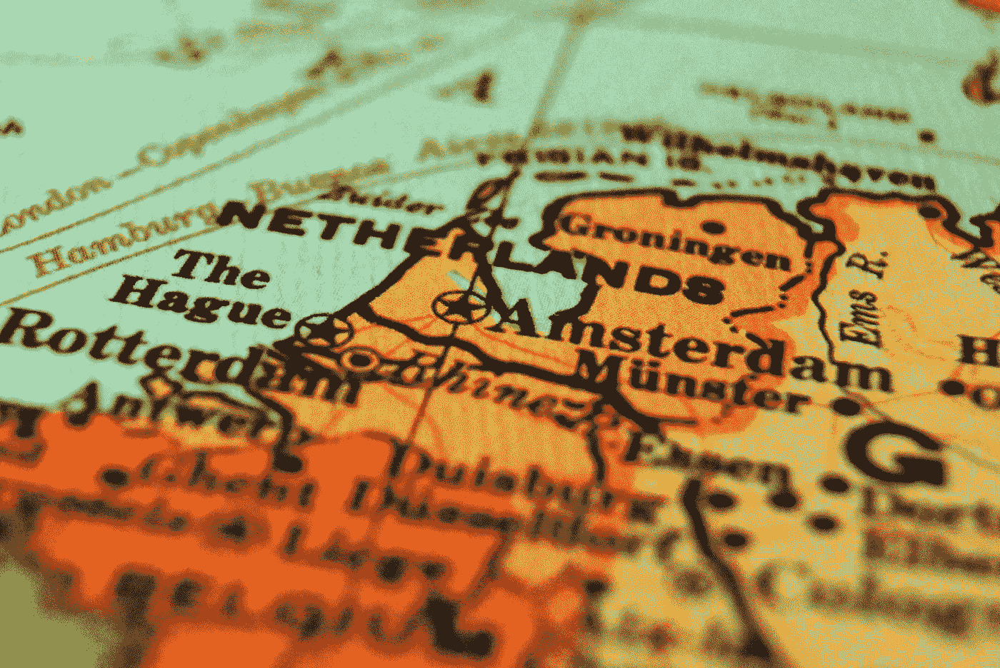

# 世界证券发行中心:荷兰

> 原文：<https://medium.com/hackernoon/on-worlds-security-token-offering-epicenter-the-netherlands-1561938cf1eb>

想知道“股票”这个词是从哪里来的吗？

它来自荷兰语单词“Kerfstok”，这是一种中世纪的工具，用于跟踪债务和/或预付款形式的金融交易。

股票、债券、衍生品、证券等金融工具的前身，本质上是一个双轨制，一个由债务持有人持有，一个由信贷持有人持有。

这些木棒演变成可交易的金融工具，并最终成为中世纪欧洲的一种货币。

专家指出，荷兰人凭借他们在贸易探险中的金融创新获得了世界贸易的霸权(1585-1740 年)[【2】](http://www.oxfordscholarship.com/view/10.1093/acprof:oso/9780198211396.001.0001/acprof-9780198211396-chapter-2)。

霸权世界周期理论指出，每一次全球权力转移都以一个国家相对于其他国家的技术优势为标志[【3】](https://books.google.nl/books/about/Political_Geography.html?id=GXz9xHdHeZcC&redir_esc=y)。自然，有更多的因素导致全球权力转移，但该理论试图减少到一个或两个优势。

参见下面对世界霸权转移的简单解释:

*   葡萄牙:1494 年至 1580 年。造船技术和海权专业知识。
*   荷兰:1585 年至 1740 年。金融创新/集体投资。
*   英国:1800 年至 1910 年。工业革命。
*   美国:1914 年至今。分工和大规模生产。

世界权力从葡萄牙人转移到荷兰人手中，是因为一群站在阿姆斯特丹运河上的人认为有更好的方式来资助贸易考察。有人可能会说:

如果我们从陆地上的富商那里收钱，用他们的钱来建造强大的船只，并向他们支付我们探险所得的利息呢

发行股票并建立世界上第一家公司(VOC)的想法诞生了…

就像商人和水手可能会感觉到 17 世纪的金融即将发生颠覆性的事情一样，我感觉到现在，在 21 世纪，一些事情即将发生。这也与交易、财务、流动性和所有权证明有关。

在这篇文章中，我将详细阐述为什么我认为荷兰是一个[安全](https://hackernoon.com/tagged/security) [令牌](https://hackernoon.com/tagged/token)生态系统出现的完美温床。我将试着根据我最近参加的当地活动和更多关于荷兰作为技术和创新切入点的一般信息来进行推理。

# 2018 年荷兰的安全令牌

> 它从事件开始

答几个月前，我参加了一个关于资助&区块链的未来的活动。来自不同区块链项目的人聚集在一起，与立法者、政府和金融管理局(AFM)一起讨论生态系统融合的可能性。

这个活动在一个标志性的场所举行:阿姆斯特丹证券交易所，世界上第一个证券交易所。或许，这个证券交易所也将发展成为世界上第一个机构安全令牌交易所——为密码交易员指定的角落已经是一个良好的开端。

Amsterdam stock exchange — [source](https://nieuws.nl/economie/20180223/beurs-amsterdam-sluit-met-kleine-plus/)

8 月 15 日，我和我的同事在我们的 [VMC 举办了一场安全令牌产品(STO)见面会。艾](https://medium.com/u/6dddfa30b962)阿姆斯特丹办事处。我们的目标是分享我们在迈向 STO 的过程中获得的知识，并向对该领域感兴趣的其他人学习。

与会人员和公司的数量以及他们在安全令牌领域的参与程度给我留下了深刻的印象。几家初创企业，如: [Peliqan](https://peliqan.ai/#/home) 、 [Eventx](https://eventx.network/) 已经参与了 STO，或计划很快开始上市。与会的相当一部分初创企业甚至没有在其解决方案中利用区块链技术，而是简单地利用安全令牌的优势作为项目融资的一种方式。

凯恩和拉奥集团的子公司 Core Digital 的创始人出席了会议。它们为希望向公众发行/提供安全令牌的公司提供了端到端的解决方案。参观了他们在阿姆斯特丹金融中心的办公室后，我知道这些人非常了解如何在荷兰建立和营销 STO。

一些传统投资者也参加了会议，揭示了加密和机构投资者之间的联系。这很好，因为在我看来，我们必须折中——正如我在之前的文章结尾所描述的。

9 月份，我在海牙应用科学大学做了一场关于安全令牌的公开客座演讲，一群兴奋的金融、商业和计算机科学学生探讨了令牌化未来的可能性。

 [## VMC 的 Adriaan Jacob Brouwer 在 LinkedIn 上说:“我真的很喜欢做我的第一次客座演讲(😱)…

### 2018 年 9 月 18 日:VMC 阿德里安·雅各布·布劳威尔在 LinkedIn 上发布了图片

www.linkedin.com](https://www.linkedin.com/feed/update/urn:li:activity:6447771025940709376) 

看到一所大学如此早地向学生传授这方面的知识，令人印象深刻。

现在，我们已经了解了安全令牌在荷兰的现状，将它放在荷兰作为欧洲(fin)技术中心的背景下会更加有趣。

为了回答下面的问题:

# 为什么是荷兰？

> 科技天堂

> *该国在全球创新指数上排名第二(GII) [4]。据* [*I 阿姆斯特丹*](https://www.iamsterdam.com/en/business/news-and-insights/news/2017/how-amsterdam-is-becoming-the-new-silicon-valley) *统计，阿姆斯特丹有超过 25 万名科技工作者，意味着该市 25%的人口在科技*[*【5】*](https://www.iamsterdam.com/en/business/news-and-insights/news/2017/how-amsterdam-is-becoming-the-new-silicon-valley)*工作。*

对于试图在欧洲市场立足的国际科技公司来说，荷兰被视为一个完美的切入点，原因如下:

*   **宽容的创业签证要求**
*   **全球最佳“英语作为第二语言”演讲者**
*   **国际贸易条约与地理位置**
*   **教育水平高**

> 欧盟合规性

欧盟(EU)要求欧盟境内的公司在向公众发行证券或允许在常规市场交易时发布招股说明书。

这意味着在荷兰金融管理局(AFM)监督下的安全令牌的发行自动符合其他欧洲国家的法规，例如德国、法国、丹麦、瑞典等。

> 早期采用者

在阿姆斯特丹过热的房地产市场上，这种做法的第一个迹象非常明显。

> 一方面，阿姆斯特丹的房价由于缺乏房源而飙升，但另一方面，八分之一的购房者不打算住在自己的房子里。在过去的十年里，拥有两栋到 50 栋房子的房主数量翻了一番。更有甚者，20 个人在该国首都拥有 100 多套房子**。**

*传统上，房屋是缺乏流动性的资产，这加剧了上述日益加剧的不平等问题。*如果我们能让这些资产的价值具有流动性，会怎么样？*这可能会释放出大量的财务收益，可用于开发新的物业，为社会带来更大的利益。*

*我不是第一个得出这个结论的人…*

*房产管理公司 [Annexum](https://www.annexum.nl/) 和金融科技初创公司 [Bloqhouse](https://bloqhouse.com/) 启动了一个试点项目，让投资房产变得更加容易。*

*MijnVastgoed 正与房地产业主合作，将房地产资产分割成不同的代币，每个人都可以投资。*

*国际区块链房地产协会( [IBREA](https://www.ibrea.network/) )的创始人 Ragnar Lifthrasir 承认，大量优质初创公司和房地产公司正在抓住新的令牌化可能性，而美国的房地产公司则有点不情愿[9]。*

*此外，一些初创公司正在创建符合欧盟招股说明书标准的安全令牌发行平台。然而，这些项目处于相对早期的阶段，因此，在此提及它们还为时过早。*

# *结论*

*从多个零散的信息中得出坚定的结论并不容易，这些信息与我在这篇文章中试图提出的主要论点有某种联系。此外，我在这篇文章中的任何主张都没有坚实的一致论点的基础，这些论点表明荷兰确实将成为世界安全令牌产品的中心。或许，安全令牌行业还太年轻，甚至不能断言它将在哪里聚集。*

*也许此时此刻，安全令牌的趋势在全球每个技术中心都是爆炸性的。当然，这意味着在荷兰发生的收养和事件并不特别。或者，也许我只是希望阿姆斯特丹将成为安全标志的中心，因为我对它如此着迷，并希望能在行动的顶部。*

*然而，我希望我在这篇文章中的例子表明，荷兰可能是发展生态系统的完美之地。*