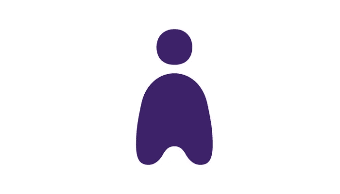
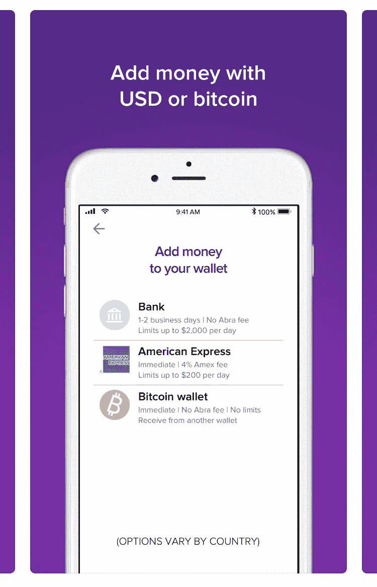
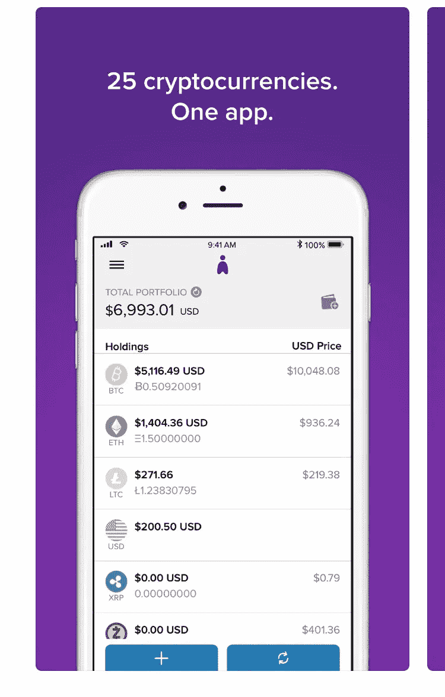
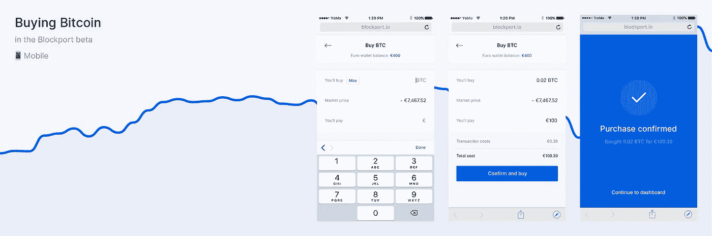
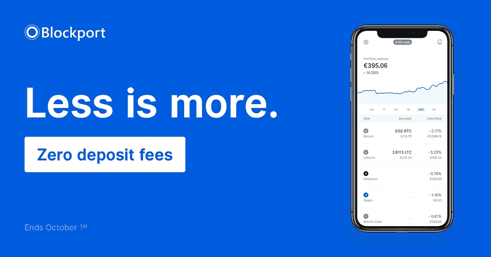
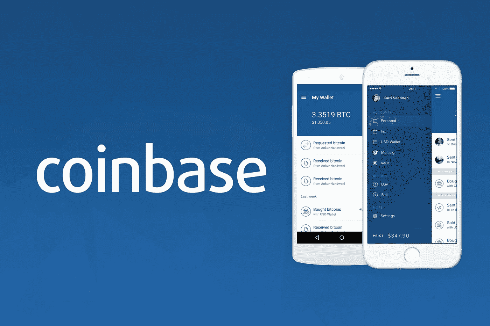

# 登上加密列车:菲亚特网关

> 原文：<https://medium.com/hackernoon/onboarding-the-crypto-train-fiat-gateways-c39d4ab2dab7>

进入市场的便利性是 [crypto](https://hackernoon.com/tagged/crypto) 采用(去中心化)的最关键的方面之一，然而很少有用户友好的初学者网关。在我的上一篇文章中，我讨论了交易所([币安和 Cobinhood](/p/61890b373075?source=linkShare-5f6545e5a578-1533382528) )，目前集中，最近推出或计划推出菲亚特网关，这很好！

然而，它们并不是对初学者最友好的选择。在这样的平台上操作和交易需要很长的学习曲线。因此，如果我们正在寻找初学者，用户友好的平台，选择是稀缺的。新加入的用户友好型网站是[凯西](http://abra.com)、 [Blockport](http://blockport.io) 、[比特币基地](http://coinbase.com)，以及其他一些最近增加了加密功能的网站，如 Robinhood(没错，就是 Robinhood，不要与加密交易所 Cobinhood 混淆)和 Square Cash。在这篇文章中，我将讨论前三个平台，包括一些零押金的平台。

## 阿布拉

凯西是一款在 iOS 应用商店和 Google Play 上都有售的应用。该平台允许用菲亚特(美元)购买超过 **25 种加密货币**。该公司以上市硬币的即时购买为荣，这是通过信用卡与美国运通合作实现的。对于银行存款，用户可以在美国启动后的 1-2 个工作日内使用他们的资金，如果您在菲律宾，则需要 2-4 个工作日，在菲律宾也有现金存款选项。他们有一个储存用户资金的电子钱包。

ABRA UI/UX

**优点**

*   本文提到的平台中最强大的加密货币列表。目前有 25 种加密货币。
*   该平台面向美国**和欧盟**的公民**和**开放。
*   该平台与美国运通有合作关系，所以没有必要担心一些供应商在使用信用卡时会收取过多的预付现金费用。
*   **目前对 ACH 银行存款不收取存款费用**。

**缺点**

*   **难**用户入职，根据他们的点评。
*   **用美元退出市场困难**。多名用户报告称，他们在银行账户中兑现他们的菲亚特时遇到了不正常的情况。
*   **低** **存取款**。据报道，大部分金额在 200 美元左右。
*   与本文中的其他两个平台相比，用户界面/UX 最不友好(用户主观)。
*   ACH 存款需要**1-2 个工作日**才能清算，这可能会导致用户错过机会利率。

## 封锁港口

我以前在我的“雷达下系列”中提到过 Blockport，理由很充分。这是唯一可用的“**去中心化的**”项目，让用户进入加密市场。他们目前正在测试他们的 DEX，但它对所有居住在欧盟(EU)和/或拥有欧洲银行账户的用户开放( *Revolut 是开设从美元兑换成欧元的银行账户的绝佳选择*)。他们最初的贸易伙伴扩展到了比特币基地之外，但还没有凯西那么广泛。你目前可以用菲亚特购买 BTC(比特币)、LTC(莱特币)、BCH(比特币现金)、ETH(以太坊)和 XRP (Ripple)。这是一个坚实的阵容，允许临时加密的家伙尝试它或进入更广泛的交流(通过撤回到个人或交流钱包)。它迎合了初学者和有经验的交易者，他们都可以从参与他们的社交交易平台中受益，我将在后面讨论。

如果你担心平台正在进行 *beta* 测试*，* blockport (BPT)令牌持有者可以证明团队在使其成为“开放” *beta* 之前进行的冗长、详细的测试。该团队最关心的是使 UI/UX 尽可能高效，尽管它已经令人印象深刻(类似于比特币基地)。

Blockport 通过使用 API 在交易所之间套利，以获得代币/硬币的最佳价格。他们目前只连接到一个平台。然而，一旦它完全开发出来，我希望它能提供这里和其他地方提到的平台的最佳用户体验。除了交换 API，Blockport 还可以作为一个合规的、**安全的**钱包，如果你想把你的加密货币放在那里的话。该项目是混合分散的，这使得它比提到的任何其他平台都更安全。该平台与集中式交易所相关联，同时使钱包去中心化。你拥有钱包的私人钥匙，而不是封锁端口，因此你完全控制钱包的使用和安全。这种混合分散功能仅在 Blockport 中提供，为客户提供了更加安全、全面和透明的体验。

到目前为止，他们的 beta 测试已经搭载了 5000 多名用户，他们已经准备好迎接更多的用户。Blockport 最近宣布，新用户和现有用户将能够在**10 月 1 日**之前以**零**存款费存款欧元(€)。而用户可以通过**交易**交易，手续费为 **0.30%** 这与比特币基地目前收取的 4%相差甚远(如果你使用信用卡的话会更高)。

Blockport UI/UX

与其他平台不同，Blockport 计划中的社交交易功能将在 Blockport 的下一个版本中首次亮相。社交交易将允许有经验的交易者赚钱，同时向他们的“追随者”宣传他们的交易，后者支付他们，为没有经验和有经验的交易者创造一个双赢的环境。其他计划中的更新包括:令牌/硬币扩展、对额外用户(欧盟以外的用户)的支持、交换扩展、商店(允许用户购买他们的原生令牌、 **BPT** ，可用于折扣交易费用)、**移动应用**发布(目前可以在移动浏览器上使用 Blockport)等等。访问他们的[网站](http://blockport.io)查看他们的路线图并试用他们的平台(同样在 10 月 1 日之前**零**押金)。

**赞成者**

*   Blockport 在今年 10 月 1 日之前的费用存款为零。
*   银行存款可以立即动用。
*   交易费用低。
*   所提供的套利确保你支付的是最佳市场价格，而不是溢价。
*   通过持有他们的本地代币 BPT，你可以在未来获得交易费的折扣。
*   该平台有一个直观的用户界面/UX，可通过手机和桌面使用。
*   这个平台提供的**钱包**是**去中心化**的，你持有它的私钥(你控制你钱包的安全)。
*   **轻松**用户入职。

**缺点**

*   该平台目前仅面向位于**欧盟**的用户。
*   Blockport 仍在测试中，尽管它似乎没有得到充分的测试，这可能是用户关心的一个问题。

## COINBASE

如果你在美国，比特币基地是你向新人介绍加密货币最简单的平台。它直观易用，具有与 Blockport 相似的用户界面/UX。在这里，用户可以通过银行存款、银行电汇和信用卡(请注意，使用信用卡不仅会增加您在比特币基地的费用，还会增加您的卡提供商的预付现金费用)购买法定加密(美元和欧元)。目前提供的令牌/硬币有:BTC、BCH、LTC、ETH，同时他们发布了一个更新，计划在不久的将来支持 ETC(以太坊经典)。此外，比特币基地宣布未来支持更多的令牌，但没有正式的列表日期。在此阅读相关内容[。](https://blog.coinbase.com/coinbase-is-exploring-cardano-basic-attention-token-stellar-zcash-and-0x-9e44f0eb823f)

Coinbase UI/UX

这个平台也有利于进入市场，但它不是分散的，因此人们担心你的货币是否安全。银行存款和银行电汇的费用在 4%左右。更多的是用信用卡。这些费用不包括您的金融机构收取的费用(例如:使用信用卡收取的预付现金费用或银行电汇费用)。比特币基地最近还宣布了比特币基地亲和比特币基地保管，这将使更多的机构。这不应该影响用户友好的应用程序(比特币基地也可以通过移动浏览器和桌面访问)。访问[比特币基地](http://coinbase.com)，查看他们的申请并了解最新消息。

**优点**

*   对于美国公民来说，这是最容易访问的、用户友好的菲亚特至加密网关。
*   在本文提到的所有其他平台中，比特币基地的存在时间最长
*   它们还有一个更复杂的交易所，比特币基地专业交易所，你可以免费转到那里。
*   比特币基地临时保管钱包中的资金(你钱包中的密码或美元)被**保险**以防任何黑客攻击。
*   相对**容易**的用户入职。
*   对于*一些用户* ACH 银行存款可用于**即时**使用。

**缺点**

*   与大多数其他法定加密网关相比，费用往往偏高。
*   当**购买**时，他们平台上的硬币/代币的成本总是**高于市场价格**，而当**出售**时，总是**低于市场价格**。这让你处于劣势。例如，瑞士联邦理工学院的市场价格可能是 750 英镑，比特币基地保险费率是 765 英镑，这是 2%的溢价，购买后会自动亏损 15 美元。
*   今年早些时候的信用卡惨败打破了许多人对比特币基地的信任。
*   在比特币基地使用信用卡，除了收取较高的费用，你的信用卡公司可能还会向你收取高额的**现金** **预支** **费用**。
*   你的资金放在一个集中的钱包里，你没有私人钥匙，但是这个钱包是有保险的。

随着更多的平板加密网关的出现，我将定期更新这篇文章。

*周一*，*2018 年 8 月 6 日*