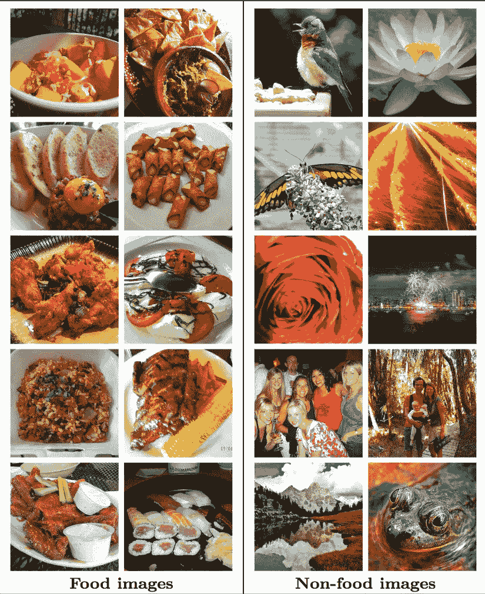
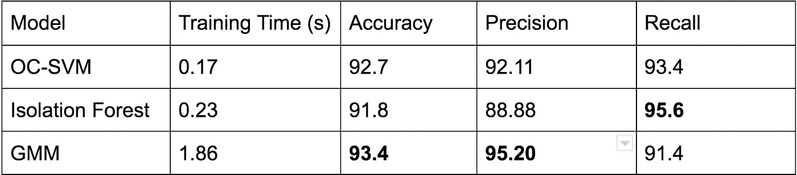
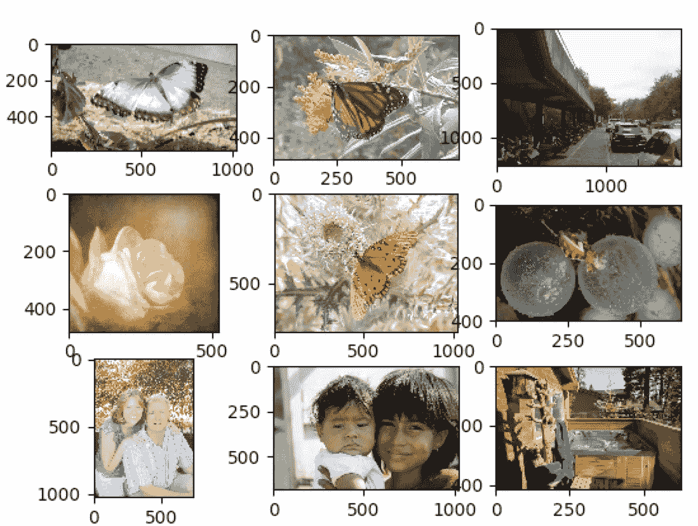

# 具有深层特征的图像的一类分类

> 原文：<https://medium.com/hackernoon/one-class-classification-for-images-with-deep-features-be890c43455d>

作为程序员，我们经常会遇到需要构建 A vs ~A 类型的二进制分类器的项目，其中当分类器被给予一个新的数据样本时，它能够预测该样本是属于 A 类还是离群值。解决这个问题的一个可靠但困难的方法是使用一类学习模式。

在一类学习中，我们只在正类数据集上训练模型，并自发地从中对宇宙[A union ~A]做出判断。这是一个热门的研究课题，有多种工具可以实现这一任务，如[一级 SVM](http://scikit-learn.org/stable/modules/generated/sklearn.svm.OneClassSVM.html) 和[隔离林](http://scikit-learn.org/stable/modules/generated/sklearn.ensemble.IsolationForest.html)。在由~A 样本组成的数据可以采用任何分布，并且不可能学习~A 类的模式的情况下，单类学习可以被证明是至关重要的。

但是当样本点的维数增加时，单类学习变得更具挑战性。例如，考虑 224x224px 的图像大小-由于每个样本点包含大量的特征(在本例中为 50，176 个特征)，因此在这里直接应用任何一种开箱即用的学习算法都是致命的。因此，通常需要有效且有区别的特征表示来为图像或高维数据建立单类分类器。

*这篇文章介绍了使用深度神经网络功能实现单类学习，并比较了基于 OC- SVM、隔离森林和高斯混合方法的分类器性能。*

**作为特征提取器的 CNNs】**

当涉及到图像中的对象识别时，卷积神经网络已经被证明是最先进的。CNN 已经取代了传统的[机器学习](https://hackernoon.com/tagged/machine-learning)管道，其中特征提取和用于从这些特征中学习的模型是两个独立的实体。此外，CNN 还可以帮助提取图像的有意义的特征，因为深度神经网络也可以学习哪些特征是重要的，哪些是不重要的，以便区分一个类别。这允许我们简单地[使用从这些准备就绪的深度 CNN 返回的特征](https://blog.keras.io/building-powerful-image-classification-models-using-very-little-data.html)，并构建我们的分类器。

此外，ImageNet 数据上预训练 CNN 的可用性(超过 1，000 个类别和超过 1，400 万张图像)使图像分类变得更加简单，因为预训练 CNN 通常会返回足够令人满意的特征*来使用它们训练轻量级模型。*

*正如我前面提到的——由于 CNN 返回的特征向量给出了生成它们的图像的强大表示，我们使用这些特征来训练我们的单类分类器。出于本文的目的，我们使用 ResNet-50 作为模型的特征提取器。*为什么？*因为它快速、准确、可信，因为[赢得了 2015 年的 ImageNet 挑战赛](https://blogs.microsoft.com/ai/microsoft-researchers-win-imagenet-computer-vision-challenge/)。*

****用于这个问题的数据集—*** 我们使用的是 [Food5k](https://mmspg.epfl.ch/food-image-datasets) 数据集，其中包含了 Food 和~Food 两种图像(各 2500 张)。样本图像如下所示-*

**

*Sample food vs ~food images*

***一类 SVM 和隔离林模型的实现细节:***

*我们首先为图像数据集计算 ResNet-50 特征。其代码如下所示-*

```
*from keras.applications.resnet50 import ResNet50
def extract_resnet(X):  
    # X : images numpy array
    resnet_model = ResNet50(input_shape=(image_h, image_w, 3), weights='imagenet', include_top=False)  # Since top layer is the fc layer used for predictions
    features_array = resnet_model.predict(X)
    return features_array*
```

*我们可以相应地计算数据集中所有图像的 ResNet 特征。下一步，沿着管道-*

1.  *对获得的特征应用标准缩放器。*
2.  *n_components = 512 的主成分分析。*
3.  *将剩余的功能传递给一个类 SVM 模型或隔离林*

*在下面的代码中，X_train 和 X_test 是训练和测试图像的 resnet 特性。*

```
*from sklearn.preprocessing import StandardScaler
from sklearn.decomposition import PCA
from sklearn.ensemble import IsolationForest
from sklearn import svm

# Apply standard scaler to output from resnet50
ss = StandardScaler()
ss.fit(X_train)
X_train = ss.transform(X_train)
X_test = ss.transform(X_test)

# Take PCA to reduce feature space dimensionality
pca = PCA(n_components=512, whiten=True)
pca = pca.fit(X_train)
print('Explained variance percentage = %0.2f' % sum(pca.explained_variance_ratio_))
X_train = pca.transform(X_train)
X_test = pca.transform(X_test)

# Train classifier and obtain predictions for OC-SVM
oc_svm_clf = svm.OneClassSVM(gamma=0.001, kernel='rbf', nu=0.08)  # Obtained using grid search
if_clf = IsolationForest(contamination=0.08, max_features=1.0, max_samples=1.0, n_estimators=40)  # Obtained using grid search

oc_svm_clf.fit(X_train)
if_clf.fit(X_train)

oc_svm_preds = oc_svm_clf.predict(X_test)
if_preds = if_clf.predict(X_test)

# Further compute accuracy, precision and recall for the two predictions sets obtained*
```

***PS** :隔离林和一类 SVM 返回的预测都是{-1，1}的形式。-1 表示“非食物”，1 表示“食物”。*

***使用高斯混合和保序回归的一类分类***

*直观地说，食物可以属于不同的类别，如谷类、蛋类、面包等。，并且一些食物也可以同时属于多个簇。因此，我们可以在正类数据点(ResNet 特征)上拟合高斯混合。[高斯混合模型](https://brilliant.org/wiki/gaussian-mixture-model/)*是一种概率模型，用于表示总体人口中的正态分布子人口*。可以推测，混合模型代表了正态分布亚总体的聚类。一个高斯混合模型，一旦与数据拟合，就可以给我们关于是否有任何新点从该分布中产生的概率的信息。*

*但是要注意— ***高斯混合模型返回给定样本*** 的概率密度函数值的对数(而不是实际概率)。因此，有必要将这些概率密度函数值转换为“概率得分”，这可以表明新样本将属于置信度为“x”的高斯分布。*

*实现这一点的简单而有效的方法是通过对验证集数据点的对数概率密度分数 w.r.t .标签拟合保序回归模型。[保序回归](http://www.research.ibm.com/people/z/zadrozny/kdd2002-Transf.pdf)是一种概率校准技术，它可以通过沿着分类器返回的分数拟合一个逐步非递减函数，将分类器分数校准到近似概率值。*

***使用 GMMs 进行一堂课学习的实施细节***

```
*# The standard scaler and PCA part remain same. Just that we will also require a validation set to fit
# isotonic regressor on the probability density scores returned by GMM

# Also assuming that resnet feature generation is done
from sklearn.mixture import GaussianMixture
from sklearn.isotonic import IsotonicRegressiongmm_clf = GaussianMixture(covariance_type='spherical', n_components=18, max_iter=int(1e7))  # Obtained via grid searchgmm_clf.fit(X_train)log_probs_val = gmm_clf.score_samples(X_val)isotonic_regressor = IsotonicRegression(out_of_bounds='clip')
isotonic_regressor.fit(log_probs_val, y_val)  # y_val is for labels 0 - not food 1 - food (validation set)

# Obtaining results on the test set
log_probs_test = gmm_clf.score_samples(X_test)
test_probabilities = isotonic_regressor.predict(log_probs_test)
test_predictions = [1 if prob >= 0.5 else 0 for prob in test_probabilities]

# Calculate accuracy metrics*
```

# ***结果和讨论***

*以下是使用三个一类学习技巧获得的结果*

**

*Results table comparing all three algorithms over food vs ~food data*

*因此，GMM 模型(使用保序回归校准)优于其他两种单类学习模型，并且与在训练神经网络 700 次迭代后获得的“最先进的”相差不远。此外，在最先进的方法中，该模型是在正负数据样本上训练的，而在我们的方法中，该模型**只是在正类样本上训练的，**因此使其在处理~A 样本中的任何类型的分布时更加稳健。*

*与一级 SVM 相比，GMM 通过正确预测更多“非食物”图像来帮助提高模型的精度。这导致相当少的假阳性。例如，一些被 GMM 正确预测为“不是食物”(与 OC-SVM 相对)的图片是-*

**

*Not food correctly predicted by GMM as opposed to OC-SVM*

*最后补充一点——我没有深入研究如何对高斯混合模型进行网格搜索，但任何希望了解更多信息的人都可以查看这个 [sklearn 教程](http://scikit-learn.org/stable/auto_examples/mixture/plot_gmm_selection.html#sphx-glr-auto-examples-mixture-plot-gmm-selection-py)。*

*如果你喜欢这篇文章，你可以在 https://medium.com/squad-engineering[查看更多关于小队工程的故事。](https://medium.com/squad-engineering)*