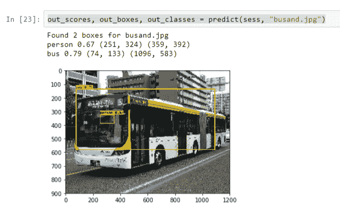

# 一门课程结束:推动你完成吴恩达在 Coursera 上的深度学习专业化

> 原文：<https://medium.com/hackernoon/one-course-to-the-end-nudging-you-to-complete-andrew-ngs-deep-learning-specialization-on-coursera-2fc4323d1a7a>

If you do, you will understand why blurry cats are relevant

你已经走到这一步了。完成深度[学习](https://hackernoon.com/tagged/learning)专业所需的五门课程中的四门。如果/当 Coursera 决定推出第五个(推出日期已经推迟了一个多月)，你将成为第一批完成这项工作的人之一。

不管你在你的道路上处于什么位置，我希望推动你注册并完成专业化。我与 Coursera 和吴恩达没有任何联系(虽然，正如许多在线课程一样，在花了这么多时间看着同一个人在你家与你进行一对一的交谈后，你确实开始感觉到，你与他们有些关系)，我也不认为这个课程的第一个版本是 100%完美的学习体验…

**但有两个原因促使我希望我认识的几乎所有人都完成某种深度学习(更广泛的人工智能领域的子学科)的基础学习**

**第一个:它无处不在，人们每天都在讨论它对现在和未来的影响**

**第二:它有可能成为影响巨大的领域之一，只有少数人理解或掌握(甚至学者每天都有新发现)**

显然，并不是每个人都必须是这方面的专家，或者甚至对这个主题有非常先进的想法，但在基本层面上，它应该被视为一种普遍文化，一种允许人们对他们每天听到的新闻进行更好的推理的东西(包括以更知情的方式写作)。

我在葡萄牙的国家电视台观看了一场辩论，在这场辩论中，主持人似乎并不比在家观看的观众对这个话题了解得更多。我认为这应该改变。

**一些障碍可能会马上穿过你的大脑:**

第一:这是火箭科学

**第二:我日常工作不需要这个**

关于第一个障碍，有些东西很难掌握，有些很难记住，但是正如课程老师在课程开始时回忆的那样，如果你记得一些代数和微积分，即如何乘矩阵和导数的意义，这应该是至少允许你第一次尝试这个主题所需的数学。

第二，在大多数情况下，这可能是真的，但我敦促你也要记住，你将能够更好地理解关于这个主题的新闻，并有助于扩大对这个主题有基本了解的人的范围，理想情况下，这些人可以是高中的年轻人——只要他们具备所需的基本知识，也可以是从事最多样化职业的人，以及希望对当今主题有所了解的普通公民。

既然你在某种程度上考虑这是否可以被视为一种爱好，一个你每周上两次的舞蹈课，那么让我们继续看一些当你试图取得进步时可能会有帮助的事情。

*   **投入:**保持一定的规律，无论晴雨，参与材料、视频讲座和作业。如果课程之间有太多的空间，传导线可能会丢失，需要回去重复以前的讲座来回忆你在哪里。(在第一批课程中，Coursera 方面从第 3 门课程到第 4 门课程有一些中断，现在从第 4 门课程到第 5 门课程有一些中断，但我想未来所有进度上的延迟都将由您负责)。
*   **继续前进:**就像阅读一本书一样，不要试图一下子理解所有内容，稍作停顿，需要时再回头看，而是努力继续前进——我发现一些测验的一些答案在后面的课程中变得更加清晰，如果我停留在原地，我可能现在还在那里。
*   不要一开始就追求完美的知识和理解。如果你期望在继续前进之前完全掌握某事，你可能会发现自己无法继续前进。
*   也不要宣布你的学习已经结束。如果你完成了第五门课程(无论他们何时决定开设)，不要宣布你的学习已经结束。回想一下上面的观点，现在你已经有了大致的了解，回到仍然给你带来麻烦的特定方面(重放讲座、复习作业或做一些替代阅读，并从其他来源获得解释，这可能会让你更好地理解这一点)。
*   回忆一下你学习的其他方式。这不仅仅是一个深度学习的练习，对许多人来说，这是一个能够并愿意回忆很久以前学习的概念的练习，对其他人来说，这是一个参与在线学习和论坛等[工具](https://hackernoon.com/tagged/tools)的机会，这需要自己的技能，以便能够提取最佳结果并对理解做出贡献。
*   **Re(学会提问)**。从古代哲学家时代开始，提问就被认为是一种学习的工具，在自我导向的在线学习中，这一点变得尤为正确。有时候，你只会从你和其他人在论坛上提出和回复的问题中得到你需要的东西。老师不可能涵盖所有假设的问题，尤其是当你第一次上课的时候，所以是的，有时甚至不重播课程或重读作业也会有所帮助。你必须要问，或者知道在哪里可以找到其他人可能会问的类似问题。这种技能可以转移到其他线上或线下的课程中，更广泛地说，可以转移到生活中。

也许你在专业化结束时意识到这只是你想要进一步探索的东西的开始，也许你决定这个大(也许仍然模糊的图片)对你的目的来说已经足够了。无论如何，你将更有能力处理每天出现在你的新闻提要上的关于人工智能的新闻。

我发现，看到很多人提到在同一个练习中被卡住了几个小时或几天，但最终带着解决方案回来并继续下去，这特别有激励作用。在一些传统的课堂上，一些学生有这种“被迫来这里的态度”,在这里，你会看到纯粹的精力被用于学习新的东西。

在完成练习时，我也对一些发现感到非常惊讶。在这一次，在我完成的最后一门课程(第四门)中，当我将互联网上的图像输入到算法中时，它能够识别除了公交车(黄色方块)之外的人(红色方块)，而人眼(尽管直觉认为应该有一个或更多人)将无法识别。

在一个讲座中，通过算法识别的图像，显示了计算神经网络最终输出的中间阶段，这些图像在不同阶段具有相似的模式，这似乎就像我在机器的潜意识中导航，看到彼此明显没有任何相似之处的图像被分组在一起，并想知道机器究竟如何能够找到一些相似之处，它们之间的一些模式。

这里也有很多令人惊讶的地方。

说到这里，我真的希望能在第五道课上见到你，或者如果你刚刚开始，祝你一路顺风。