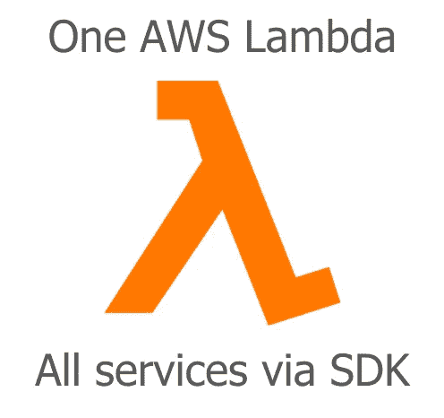
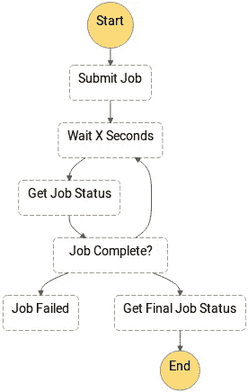

# 一个 Lambda 通过 AWS SDK 调用任何 AWS 服务

> 原文：<https://medium.com/hackernoon/one-lambda-to-call-any-aws-service-via-aws-sdk-ad572f0477f5>

One AWS Lambda. All services via SDK

最近，在设计一个步骤函数来执行 ETL 作业、训练机器学习模型和执行批量预测时，一个*等待检查*模式(如[作业状态轮询器](https://docs.aws.amazon.com/step-functions/latest/dg/job-status-poller-sample.html)示例所述)取而代之。由于一些相关服务(如 Glue 和 SageMaker)的异步特性，一些步骤需要等待一项工作完成后才能进入管道的下一阶段。

Job Status Poller Sample

然而，在这种情况下，有六个在管道中。这意味着要写六段代码来做同样的事情。是的，起初，考虑到不同步骤的目标，它们似乎是不同的。要调用的服务及其方法不会相同。但最终，他们都有一个相同的模式，那就是:

*调用一个* ***方法*** *从一个* ***服务*** *用下面的***参数并得到其* ***结果*** *。**

*因此，考虑到这一点，我创建了一个通用的 [Lambda](https://hackernoon.com/tagged/lambda) 来通过 AWS SDK 调用任何 [AWS](https://hackernoon.com/tagged/aws) 服务。它的来源和文档可以在这里找到:[https://github.com/DiegoZoracKy/lambda-aws-sdk-call](https://github.com/DiegoZoracKy/lambda-aws-sdk-call)*

*一点 [Unix 哲学](https://en.wikipedia.org/wiki/Unix_philosophy)。Eric Raymond 的 17 Unix 规则中的[生成规则](https://en.wikipedia.org/wiki/Unix_philosophy#Rule_of_Generation)(我真正相信的一个概念)可以告诉我们这里应用了什么。*

> ***世代法则***
> 
> *开发人员应该**避免手工编写代码**，而是**编写生成代码的抽象高级程序**。这条规则的目的是**减少人为错误，节省时间**。*

*我希望它能对其他人有所帮助，也欢迎任何反馈。*

*很快我会发表一篇新文章，展示如何在 Step 函数上使用这个通用 Lambda 来触发作业并等待它们完成。*

> ***更新 2018-09-26:***

*根据一个用户在 Reddit 上发给我的关于安全性和最小特权原则的评论，我意识到其他人可能最终只能看到一种应用这里所介绍的方法。与他看到的一样(一个 Lambda 拥有整个公司使用的所有特权)，这不是最好的方式，可能会导致同样的问题。*

*首先，一个是 Lambda 的源代码，另一个是 Lambda 本身。你可以有不同的 Lambdas，有不同的特权，但都有相同的源代码。*

*在我提到的例子中，一个 Step 函数需要以至少 6 种不同的方式与 2 个不同的服务进行交互。无论如何，一些 Lambdas 需要有正确的特权来处理这些交互。在这种情况下，您可以:*

*A) 6 个 Lambdas，具有 6 个不同的源代码，其中每个都具有正确的特权。*

*B) 6 个 Lambdas，带有 1 个源代码(对所有人都一样)，其中每个人都有适当的特权。*

*C) 1 个 Lambda，1 个源代码，仅具有在上述任何情况下都会被给予的相同特权(不是对一切的完全访问)。*

*从安全的角度来看，无论如何都有 6 个动作要通过 Lambdas 来执行。不管是通过六个不同的兰姆达还是只通过一个。最后一种策略似乎更容易管理。*

*采用最后一种情况的一些好处是:*

*   *团队不必停下来编写新代码。这节省了时间，这很重要，但更重要的是，它防止了新的错误诞生。*
*   *只有一个代码需要测试，并保证它按预期工作。不容易出错。错误和意外行为的空间更小。*
*   *统一合同。假设所有调用共享相同的输入和输出结构。*

*最后一个对我们的团队非常有用，尤其是在阶跃函数的情况下。它让我们可以自由地实现整个管道，只需关注我们的输入和输出数据序列，而不必担心被调用资源的行为。*