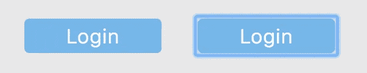

# 要删除的一行代码:聚焦蓝色轮廓并保持可访问性

> 原文：<https://medium.com/hackernoon/one-line-of-code-to-remove-focus-blue-outline-and-keep-accessibility-bca3ccea9892>

每个人在制作带有按钮的网页时都会遇到这个问题……点击按钮后，按钮周围出现奇怪且不合适的蓝色轮廓(见下文)

After clicking a button, the blue outline appears to indicate that it is in focus.

一种方法是用 css 删除轮廓:

Do not do this!

该纲要的目的是提高网站对残疾人或只使用键盘导航的人的可访问性，所以我们不能完全取消它。我们希望仅在按钮被按下后移除轮廓。

如果你在网上看看，有很多[过于复杂的解决方案](https://hackernoon.com/removing-that-ugly-focus-ring-and-keeping-it-too-6c8727fefcd2)可以检测按钮是通过点击还是通过*标签*键盘按下来高亮显示，并相应地调整 css/classname。也有一些[实验性的 CSS 特性](https://developer.mozilla.org/en-US/docs/Web/CSS/:focus-visible)试图解决这个问题，但是它们还不能与大多数浏览器兼容。

确实存在一个简单的解决方案！我们可以在提交事件后调用按钮上的 *blur()* 函数来移除焦点🎉

event.target.submit.blur() removes focus after a submit event

现在你有了…一个单线解决方案，在按钮按下后移除蓝色轮廓，同时保留辅助功能。