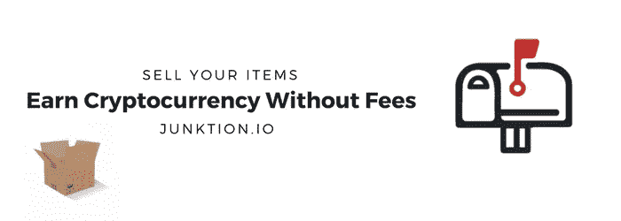
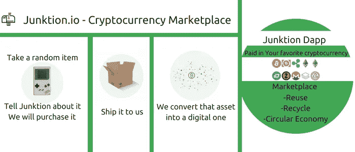

# dapp 领域发展最快的创业公司之一是招聘

> 原文：<https://medium.com/hackernoon/one-of-the-fastest-growing-startups-in-the-dapp-space-is-recruiting-780bdd1f9ac2>

[Junktion](https://junktion.io) 是一个 dapp，是 ebay 和 cryptokitties 的混合体。这是我们的一位天才开发人员写的一篇文章。

我们正在寻找任何愿意与我们合作的人，但特别关注以下人员。

*   一个喜欢使用 reactjs 制作 cryptokitties 或易贝克隆体的开发人员。
*   一个全明星营销人员，可以与世界分享我们的信息。
*   一个对密码充满热情的作家来写我们的博客。

我们的一名开发人员 Josh 来自日本，曾为丰田开发软件。这是他为我们写的关于他为什么加入的内容。

# 我加入 Junktion.io 团队的原因

当我第一次知道这个项目时，它确实让我思考我如何才能潜在地成长为以太坊的一个新领域。

我们有这么多 dapp 出现，但我认为缺乏 dapp，实际上处理我们的外链需求。

让我们现实一点，我们还没有完全做到“在线”的一切。
我们仍然线下购买(和出售)实物商品。虽然我们在网上买了很多东西，但是我们怎么处理那些我们不再需要的东西呢？现在有几个这样的渠道，易贝是最突出的一个，但是你知道易贝和贝宝每笔交易收取多少费用吗？

查看[这篇文章](https://hackernoon.com/the-junktion-ecosystem-cryptocurrency-marketplace-458a0d0c62e2)由我们的创始人 [Patrick Manfra](https://twitter.com/PatrickManfra) 简直是疯了！

Junktion.io 试图解决的问题是有意义的，这是一个新的出路。这个比以前的销售点有更多的功能。我们认为这将成为新的规范。我们正在创造一个循环经济，但也融入了传统的加密货币。

你用残币获得报酬，用残币购买，用残币换其他硬币，买一台新的笔记本电脑，卖掉你的旧笔记本电脑，你用残币获得报酬…诸如此类。这就是循环经济。

> 明白我的意思了吗？

是的，我们过去在易贝也是这样做的，但你在易贝买卖越多，你要支付的费用就越多，这不是很令人兴奋，我们也没有真正推动自己创新。Junktion 做了 Ebay 做梦都想不到的事情。这就是为什么我们正在招募有才能的人来实现这些目标。

这并不是说易贝不好，我也没有贬低易贝，我以前在易贝买卖过很多股票，效果不错，虽然不完美也不有效，但确实不错。

## 构建区块链时代的新前沿

我要说的是，我们正处于一个新时代的边缘，区块链时代。我们有机会升级我们拥有的东西和技术，我们可以弥合数字资产和实物之间的差距。

我们正在搭建一个平台，一座桥梁。我们在这里修复市场，并帮助适应区块链技术作为一个社区，蓬勃发展的创新和变化。

我以开发人员的身份加入团队，因为我相信这个项目。我相信我们可以做得更多，我们可以创造一个比目前更好的平台。作为一名开发人员，我发现新技术令人着迷，尤其是当它试图处理与技术不直接相关的事情，弥合这一差距时。

# 一个由区块链驱动的市场，光是这个想法就让我兴奋不已。

我们希望有同样想法的人加入我们，从开发、营销或战略角度解决这些问题。如果你有任何有价值的补充，请联系我们。

想象一下，你拥有的一件有感情的物品被永久保存在区块链上，成为区块链的一部分。这种想法不是很诱人吗？或者至少有趣？

我们仍在寻找加入团队的人，帮助我们建立一个更好的市场。

发送电子邮件至 [info@junktion.io](mailto:info@junktion.io)

约书亚·阿基诺
junk tion . io 的开发者

我们可以利用所有能得到的帮助。

捐赠:

比特币:3 he E5 q y1 cnk 7 TCC 7 gxbaymm 6 zxldttkmzh

以太坊:0x 496 e 41 BC 14 c 65 b 2019472 cfda e205 BD 53 e 1634 a