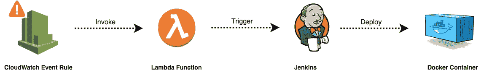
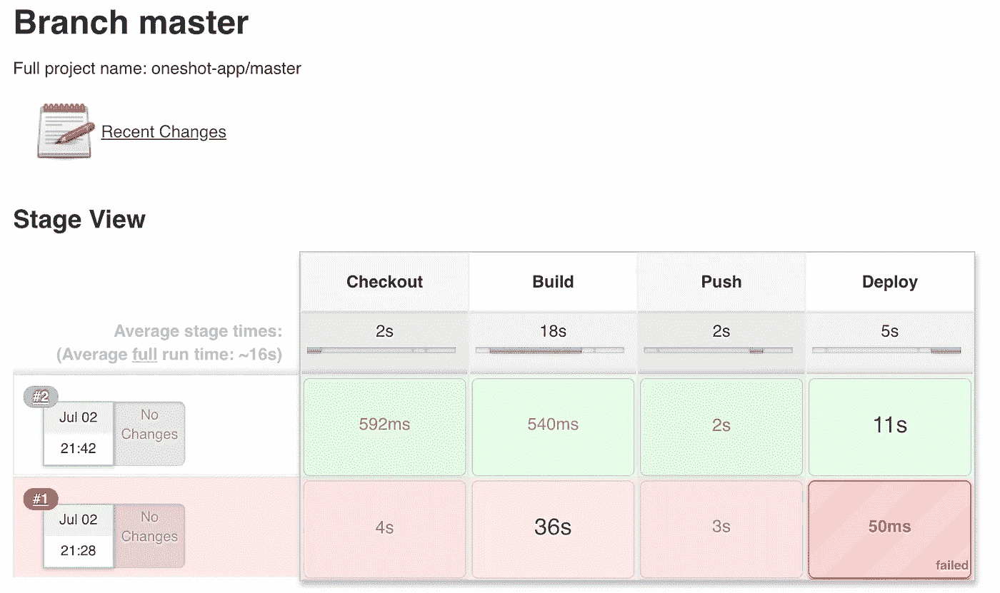
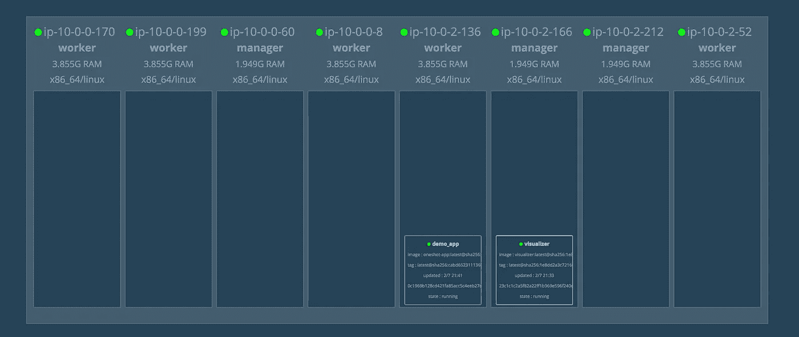
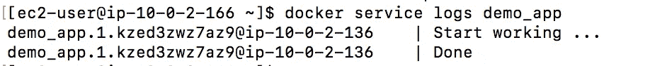
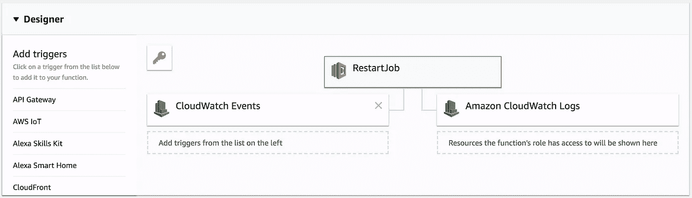
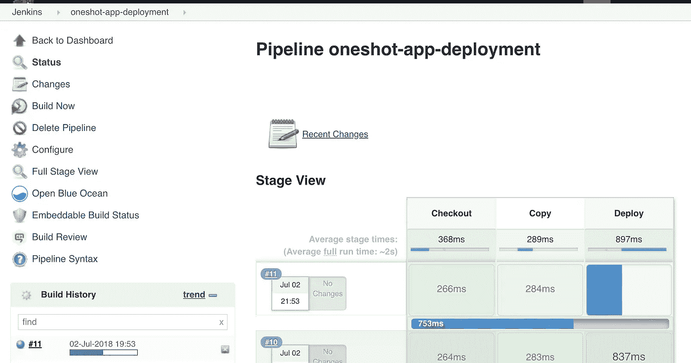

# 无服务器的一次性容器

> 原文：<https://medium.com/hackernoon/one-shot-containers-with-serverless-10794f68fc16>

您是否遇到过类似以下用例的短期容器:

*   批处理和 ETL(提取、转换和加载)作业。
*   数据库备份和复制。
*   用于生成学习和训练模型的机器学习算法。
*   集成和健全性测试。
*   网络爬虫。

您想知道如何定期部署容器或响应事件吗？答案是通过使用 Lambda 本身，这个想法是通过让 Lambda 函数从构建服务器触发容器的部署。下图说明了如何实施这一过程:

我在 Go 中编写了一个简单的应用程序，使用 sleep 方法模拟一个短时间的过程:

由于 **Go** 是一种编译语言，我使用了 Docker 的多阶段构建特性，用下面的**Docker 文件**构建了一个轻量级的 Docker 映像:

接下来，我在 Jenkins 中有一个简单的 CI/CD 工作流，下面是用于构建管道的 **Jenkinsfile** :

流水线执行的一个例子如下:

现在，对应用程序的所有更改都将触发 Jenkins 上的新构建，该构建将构建新的 Docker 映像，将该映像推送到私有注册表，并将新的 Docker 映像部署到 Swarm 集群:

如果在其中一个集群管理器上发出" *docker 服务日志 APP_NAME"* ，您的应用程序应该可以正常工作:

现在我们的应用程序已经准备好了，让我们使用 Lambda 函数让它每天早上 8 点执行。下面是将在每次调用函数时执行的*入口点*(处理程序):

它使用 Jenkins API 来触发部署流程作业。

现在定义了函数，使用下面的 shell 脚本创建以下内容:

*   构建一个部署包(*)。zip* 文件)。
*   创建一个 IAM 角色，拥有将日志推送到 CloudWatch 的权限。
*   从部署包创建一个基于 Go 的 Lambda 函数。
*   创建将在每天上午 8 点执行的 CloudWatch 事件规则。
*   让 CloudWatch 事件调用 Lambda 函数。

因此，将按如下方式创建 Lambda 函数:

要测试它，您可以从 Lambda 控制台或使用以下 AWS CLI 命令手动调用它:

Jenkins 中应该会触发新的部署，您的应用程序应该会再次部署:

就这样，这是一个关于如何将**无服务器**与**容器**一起使用的快速示例，您可以更进一步，使用 Lambda 函数在您的**Swarm**/**Kubernetes**集群中横向扩展/纵向扩展您的服务，方法是使用 CloudWatch 事件来处理预期的计划事件(节假日、黑色星期五……)，或者使用其他 AWS 管理的服务(如 API Gateway)来响应传入的客户端请求。

*完整代码可以在我的* [*GitHub*](https://github.com/mlabouardy/lambda-oneshot-container) *上找到。请务必在下面留下您的评论、反馈或建议，或者直接在 Twitter 上与我联系*[***@****mlabouardy*](https://twitter.com/mlabouardy)*。*