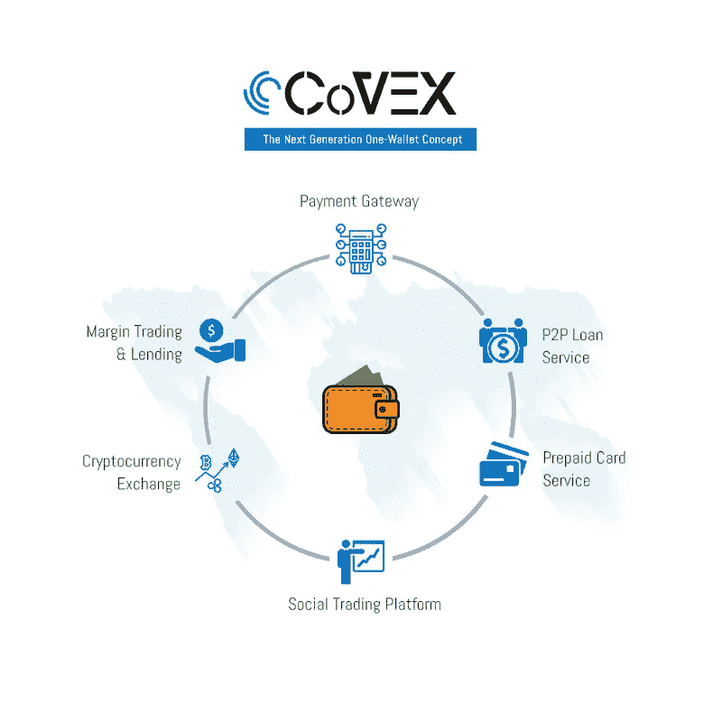

# 一个钱包服务

> 原文：<https://medium.com/hackernoon/one-wallet-service-5cce4f26ae91>

# 一个钱包服务的概念

在过去的几年里，我们见证了[加密](https://hackernoon.com/tagged/crypto)资产的爆炸式增长，交易量飙升至数十亿美元。多年来，我们看到[比特币](https://hackernoon.com/tagged/bitcoin)占据了很大的主导地位，并一直领先，但在 2017 年底，尽管比特币仍是加密领域的第一名，但主导地位下降了，我们看到了替代比特币的增长。2018 年 1 月，整个加密市场处于近 8500 亿美元的 ATH(历史最高水平)，日交易量超过 600 亿美元。由于新用户注册导致过载，许多领先的平台已经暂时关闭。随着日交易量达到历史最高水平，平台开始以更高的盈利能力运作。

“币安在 2017 年 7 月才开始交易，员工不到 200 人，但其盈利能力已超过德国最大的银行和欧洲最大的银行之一，CCN 报道。”

今天，即使对一个有经验的交易者来说，在加密市场交易也是一件复杂的事情。因此，如果我们考虑到大多数进入加密货币世界的人都是交易新手，没有太多经验，那么拥有许多对用户不友好的平台是一个大问题。

因此，CoVEX Coin Platform 正在实施下一代基于区块链的平台，交易者可以在该平台上交易和交换加密货币，复制交易技巧，并与投资集团内的其他交易者竞争。他们正在将社交/复制交易、保证金交易和支付网关带入一个透明的区块链。他们的平台将使交易民主化，并改善整体用户体验。

这不仅仅是我们获得所有交易服务的单一平台，它的一个钱包的概念，你可以用它来交换，贷款，支付，预付或借记卡服务。

一个钱包意味着一站。一旦你在初始阶段完成了 KYC，它将适用于每个级别。你的钱包将是分散的钱包，它可以存储多种货币，但它运行在集中的平台上。

作为一个在一个交易平台中拥有如此多功能的新进入者，我能对读者说的是，一旦你开始投资 CoVEX，你永远不会想到跳到任何其他交易平台。