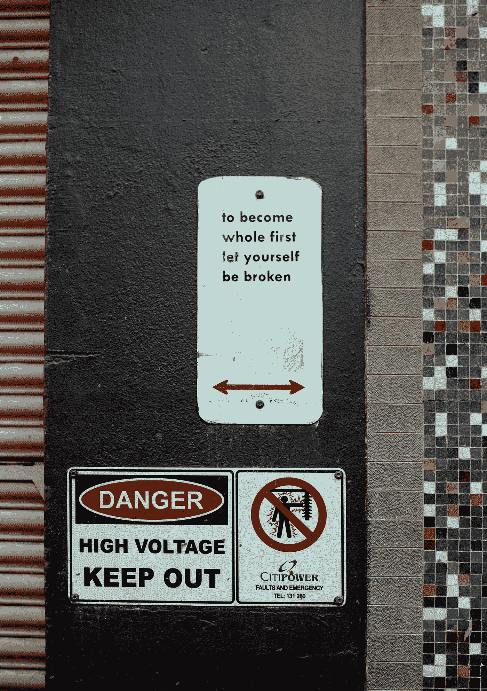

# 一个错误的转向导致我们走向集权。

> 原文：<https://medium.com/hackernoon/one-wrong-turn-led-us-to-centralization-7bc04c3470a0>

Photo by [Annie Spratt](https://unsplash.com/photos/6_7F-2g166c?utm_source=unsplash&utm_medium=referral&utm_content=creditCopyText) on [Unsplash](https://unsplash.com/search/photos/intersection?utm_source=unsplash&utm_medium=referral&utm_content=creditCopyText)

要么是预测者失败了，要么是经济学家。但是这一次我们可以相信他们一直都知道，他们这么做是出于他们自己的贪婪。除了残忍的统治者试图奴役大量人口外，中央集权从来都不是解决办法。中心主义只做了一件伟大的事情，那就是让我们屈服。这个世界已经被这些追逐利润的狼驱动了很长时间，现在，他们甚至不在乎是否撕裂人类。

一直以来，我们都认为自己不如别人，不管是我们的领导还是一些假装成救世主的骗子。它不仅会缩小我们的大脑，还会带来许多疾病，如抑郁症和精神障碍。历史上从来没有一次，富人和有权势的人没有以上帝的名义或为国家做出牺牲的名义来理想化和提倡白活。如果你选择不白活，你没有选择，因为每个国家都有一个中央集权政府，没有人希望公民知道他们痛苦的真相，你只有一个选择，继续白活。

> 明白这一点的人不会到达顶峰，他们要么精疲力尽，要么选择忽视。

我们不是被上帝骚扰，就是被国王骚扰。我们被教导要为我们的领导服务，我们很乐意这样做，而不是在我们有限的时间里做一些伟大的事情。但是就像上面说的，除了忽略这一切，我们别无选择。

权力下放教会了我们一件事，一件将改变我们在宇宙中的地位的事，作为一个高级物种，我们的首要任务是一起工作，我们可以一起提高我们的生活质量，并找到一种方法至少可以无限延长它。这不是共产主义的宣传，如果我们着眼于短期，看看我们能够一起实现什么，好处大于坏处。

我们把我们的命运交给被选择的权威，因为我们被灌输了总是由某人领导有多好的想法，这一切都始于通过集权而将分歧聚集在一起，而不是通过分权而有一个不偏不倚的方法。

有无数的例子表明，人们滥用他们的权威和权力来逃避法律，同样的法律对那些没有足够的政治支持或力量来反击的无辜者造成了不可挽回的伤害。虽然一些法律实际上不会对人们造成太大伤害，但随着中央集权的到位，你可以很容易地通过贿赂或控制任何部门的单一中央权力机构来摆脱任何人都能想象到的最严重的犯罪。

> 我们大多数人都想满足自己的需求，然后平静地死去，我不会告诉你不这样做。

但是，请想一想，如何通过一个叫做去中心化的简单实现来实现这一切。没有世界上一半的人白白死去，没有你为了平静的死去而奋斗一生，我们在宇宙中有更多的事情要去发现。