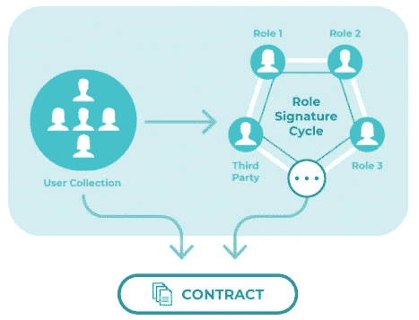

# OneLedger——一个独特有趣的企业区块链交叉账解决方案

> 原文：<https://medium.com/hackernoon/oneledger-a-uniquely-interesting-enterprise-blockchain-cross-ledger-solution-c6e3eed08120>

***免责声明*** *:我与总账团队没有任何关系。我既不是财务顾问，也不是财务建议。无论接下来发生什么，都只是反映了我对这个项目的理解，以及我对其未来前景的个人看法。*

随着全球采用区块链技术的步伐开始加快，我们已经看到了一些关键的技术挑战，其中一些已经限制了企业级区块链的采用规模。其中一个挑战是，如今区块链互操作性几乎不存在。目前，区块链作为孤立的网络存在，其中引入了两个主要限制:

*   **没有实际可行的方法在不同的区块链之间直接传递值*。****今天，如果我们想要转移数字资产*‘跨’*链，我们必须通过将资产转移到中介*集中*交易所，使用他们内部的钱包和账本交换资产，然后将新资产转移到他们相应的区块链。当然，这一过程耗时、成本高，并涉及大量第三方风险。跨链原子交换(Cross-chain atomic swaps)是指数字资产可以在不同的区块链之间转移，而不需要信任第三方，这种技术正在开发中，但还远未准备好被广泛采用。*
*   ***企业和个人无法*轻松*在多个区块链平台上部署分布式应用(dApps)。**如今，要跨多个平台部署 dApps，开发人员需要用多种语言编写智能合约，这取决于所选择的每个平台。这又是昂贵的、资源密集的和耗时的，因此使得 dApps 实际上不可行，并且对于企业来说基本上无效。*

*有一些项目，如 Cosmos、Polkadot、Aion 和 Overledger，目前正在研究区块链系统互操作性的不同方面，每个项目都提出了不同的机制和解决方案，以促进跨分类账业务。*

*然而，有一个特别的项目采取了一种独特有趣的方式来使区块链互通: **OneLedger。***

# *什么是 OneLedger？*

*[**总账**](https://oneledger.io/#home) 是通用区块链协议启用:*

*   *通过业务模块化实现跨分类账访问*
*   *使用分片和*改进的实用拜占庭容错*共识机制的高性能扩展*

*OneLedger 旨在使企业和个人能够通过 OneLedger 的模块化工具构建应用程序，然后这些应用程序将使用其*应用程序编程接口(API)* 网关与 OneLedger 协议进行通信。*

**

*Overview of the high-level interactions of OneLedger protocol with applications and other public blockchains; taken from OneLedger whitepaper found [here (PDF)](https://oneledger.io/wp-content/uploads/2018/03/oneledger-whitepaper-03.12.18.pdf)*

*OneLedger 协议与*侧链*通信，侧链又可以与任何其他公共分布式分类帐(如比特币、以太坊、超级分类帐等)同步。)支持[*【HTLC】*](https://en.bitcoin.it/wiki/Hashed_Timelock_Contracts)和*支付渠道的散列时间锁合约。**

*OneLedger 协议的共识机制的一个有趣的特点是，使用*公钥基础设施(PKI)* 和*身份管理*，**企业所有者可以启动他们自己的许可或无许可侧链，拥有他们自己唯一标识的基于角色的网络共识。***

*OneLedger 的使命是成为*企业区块链交叉账解决方案*，促进企业采用区块链技术，并使其能够将该技术集成到其特定的业务应用中。*

# *OneLedger 作为区块链互操作性解决方案的独特之处是什么*

*OneLedger 区别于区块链互操作领域中其他项目的三个最有趣的特性是:*

1.  ***OneLedger 允许任何人发起*有权限*或*无权限*侧链，可以与其他公共分布式账本(如以太坊、比特币等)同步。)**支持 HTLC 和支付通道，不考虑它们的一致协议。这些侧链可以配置独特的网络共识。*
2.  ***OneLedger 使用智能身份管理系统为企业的私有侧链配置独特的*基于角色的共识*。**使用身份管理系统允许企业控制节点参与共识，限制用户对其网络的读写访问，并跟踪用户在网络上的资产。通过给每个用户分配一个*主私有/公共密钥对*，在多个分布式网络中执行这种身份管理，其中私有密钥将用于对网络上来自用户的所有消息进行数字签名。*
3.  ***使用 OneLedger 的*软件开发工具包(SDK)* ，开发人员可以为他们的 dApp 编写*‘主智能合约’*，并在多个公共区块链上同时部署 dApp。**这消除了开发人员用多种语言编写智能合同的需要，如果他们要部署在多个区块链上，就像今天的情况一样。*

# *OneLedger 架构*

**

*OneLedger architecture; taken from OneLedger whitepaper found [here (PDF)](https://oneledger.io/wp-content/uploads/2018/03/oneledger-whitepaper-03.12.18.pdf)*

*这里的想法是不要太深入到 OneLedger 的架构，而是看看他们的架构中的一些关键组件，以及它们如何适应整体共识方案。*

## *OneLedger 商务中心*

**OneLedger 业务中心*包含 **OneLedger 业务应用开发套件**，该套件将使用户能够将其业务模块映射到区块链上。使用 OneLedger 的*软件开发工具包(SDK)* ，开发人员可以为他们的 dApp 编写一个*‘主智能合约’*，**在多个公共区块链上同时部署 dApp。***

*在这里， *OneLedger 业务中心，*OneLedger 旨在将企业与独立模块开发人员联系起来，帮助开发软件插件，以集成所需业务流程的多个模块。*

## *身份管理系统*

*OneLedger 使用**智能身份管理系统**支持企业:*

*   *为节点定义角色和信任层次结构，这些节点在其许可的网络上参与共识，以及*
*   *控制节点操作员对其许可网络的读写访问。*

*通过给每个用户分配一个*主私有/公共密钥对*，在多个分布式网络中执行这种身份管理，其中私有密钥将用于对网络上来自用户的所有消息进行数字签名，从而将用户与其在企业中的角色联系起来。*

**

*Business Logic Modularization using role-based consensus; taken from OneLedger whitepaper found [here (PDF)](https://oneledger.io/wp-content/uploads/2018/03/oneledger-whitepaper-03.12.18.pdf)*

*实际上，**企业能够配置*基于角色的共识方法*** ，其中每个角色都链接到一个独立的节点，该节点可能参与也可能不参与共识，这取决于预先配置的业务逻辑。*

*OneLedger 协议还使用*公钥认证*来创建:*

*   *高度可配置的**个人和机构数字钱包**，*
*   ***基于交易历史和网络行为的企业和消费者信用评分**，以及*
*   *仲裁机制在出现分歧时达成更紧密的共识。*

## *私有和公共侧链*

*OneLedger 共识协议与两种类型的侧链通信:*

*   ***私有侧链:** OneLedger 允许企业推出他们自己的许可或无许可侧链，可以用唯一的网络共识进行配置。*
*   ***公共侧链:**私有侧链可以与任何公共区块链(如比特币、以太坊、超级账本等)的公共侧链同步。)支持[*【HTLC】*](https://en.bitcoin.it/wiki/Hashed_Timelock_Contracts)和*支付渠道的散列时间锁合约。*实际上，**公共主链将共识卸载到相应的 OneLedger 公共侧链，提供可扩展的链外解决方案。** OneLedger 协议用户可以在侧链上执行任意数量的交易，然后选择将其数字资产撤回到他们选择的公共主链上。*

## *OneLedger 共识协议*

*为了将业务逻辑与私有和公共侧链集成，OneLedger 使用了三层共识概念。*

**

*OneLedger’s three-layered consensus protocol hierarchy; taken from OneLedger whitepaper found [here (PDF)](https://oneledger.io/wp-content/uploads/2018/03/oneledger-whitepaper-03.12.18.pdf)*

*共识始于**业务初始化，**业务或个人编制了一个通用的智能合同，定义了参与共识的角色及其各自的行为。然后，这个一般化的契约被转换成一个契约，该契约对于期望运行该契约的公共区块链来说是可识别的和可执行的。*

*下一层，**渠道共识**，旨在执行契约中定义的角色之间的交互。为了实现通道一致性，基于*拜占庭容错部分同步*的侧链一致性在通道内所有参与者之间进行。当*超过三分之二*的参与节点同意时，达成侧链共识。当然，渠道可以通过两种不同的商业模式运行，在这种情况下，当两种商业模式达成共识时，就达成了侧链共识。*

*一旦在通道中达成共识，数据将被写入块，广播到通道中的所有节点，并存储相应的状态。*

*当请求公共链之间的转移时，需要最后一层**公共链共识**。这将在侧链共识开始时启动*侧链预共识*。*

**

*OneLedger sidechain consensus in conjunction with public chains; taken from OneLedger whitepaper found [here (PDF)](https://oneledger.io/wp-content/uploads/2018/03/oneledger-whitepaper-03.12.18.pdf)*

*预共识模块将提案提交给相关的公共链，公共链的验证者将在其中进行投票，以锁定或解锁数字资产。如果公共链投票成功，并且超过三分之二的侧链节点同意，则预共识块将被提交并添加到分类帐中。*

# *团队和顾问*

*[OneLedger 的团队](https://oneledger.io/#team)在区块链协议和共识算法开发、高性能计算、信息安全、云计算和商业智能方面积累了丰富的经验。*

*OneLedger 的**创始人兼首席执行官(CEO)** 、[、 **David Cao** 、](https://www.linkedin.com/in/david-cao-ab217014/)，是[加中区块链专业协会(CCBPA)](http://ccbpa.ca/) 的主席，在区块链技术和企业架构领域拥有超过 13 年的累积经验。在成为 Hyperledger 和区块链社区的活跃成员之前，David 还在 IBM 多伦多实验室担任 Java/WebSphere Commerce 开发人员，并在施乐公司担任首席商务顾问。*

*OneLedger 的**首席技术顾问**，[， **Alex Todd** ，](https://www.linkedin.com/in/alextodd/)是区块链初创公司 [Trust 2 Pay](http://trust2pay.io/) 的创始人兼首席执行官，该公司正在为全球开发一个由区块链支持的社会信用评级系统。Alex 还是加拿大安大略省公共交通系统基于智能卡的费用支付系统 [PRESTO](https://www.prestocard.ca/en/) 的前首席技术官(CTO)。*

*OneLedger 的**首席工程师**， [**Stephen Li**](https://www.linkedin.com/in/stephenliy/) ，曾在[摩根士丹利](https://www.morganstanley.com/)和[德意志银行](https://www.db.com/company/index.htm)担任高级顾问，在 [IBM](https://www.ibm.com/us-en/) 和[微软](https://www.microsoft.com/)担任软件工程师。Stephen 是分布式应用创新和 Solidity 智能合同开发方面的专家。*

*OneLedger 还有一个强大的顾问委员会，为项目的未来方向注入信心。顾问委员会中一些最著名的名字包括 [**马修·尼默格**](https://www.linkedin.com/in/matthew-niemerg/)——前 IBM 卓越中心高性能计算博士后研究员、 [**特雷弗·科维尔科**](https://www.linkedin.com/in/trevorkoverko/)—[Polymath](https://www.polymath.network/)的首席执行官、 [**约尔·劳**](https://www.linkedin.com/in/jorlaw/)—[VerifyInvestor.com](https://verifyinvestor.com/)的联合创始人和[霍迈尔法律 PC](http://homeierlaw.com/) 的创始股东。*

# *OLT 令牌的使用和分发*

*OLT 是 OneLedger 的本地令牌，将由 OneLedger 生态系统中的三个主要参与者使用:*

1.  ***用户:**企业和个人将向节点支付 OLTs 作为交易费，以使用 OneLedger 平台上的任何服务。*
2.  ***节点:**参与节点将收到 OLTs 作为网络费用。OneLedger 将允许每个人最初运行一个节点。然而，随着生态系统的成熟，为了保持网络的完整性，建立节点将需要一定数量的 OLT。*
3.  ***开发人员:**开发人员需要 OLT 令牌将他们的模块和代码部署到 OneLedger Marketplace，并签订一份定义销售条款的智能合同。*

**

*OLT token usage between network users, nodes and developers; taken from OneLedger whitepaper found [here (PDF)](https://oneledger.io/wp-content/uploads/2018/03/oneledger-whitepaper-03.12.18.pdf)*

**

*OLT token distribution; taken from OneLedger whitepaper found [here (PDF)](https://oneledger.io/wp-content/uploads/2018/03/oneledger-whitepaper-03.12.18.pdf)*

*将发行 1 亿个 OLT 代币，35%的代币的**代币销售硬上限为 1500 万美元。***

*25%的社区预留令牌将用于开发者资助和社区参与。*

*除了代币销售中分发的代币，所有代币都有预定义的锁定期和归属期，详见 [OneLedger 的白皮书](https://oneledger.io/wp-content/uploads/2018/04/oneledger-whitepaper.pdf)。*

# *路标*

*OneLedger 仍处于其发展路线图的早期阶段，在未来几年内计划了许多重要的里程碑。一些最重要的里程碑是以太坊和比特币侧链的推出，跨链共识的 MVP 推出，API 网关的推出，以及 Alpha 版本和 OneLedger 平台的第一个版本的推出。*

*以下是 OneLedger 在 2018 年至 2019 年将遵循的路线图:*

## ***2017 年第三季度至第四季度***

*   *最终白皮书*
*   *概念的理论证明*

## ***2018 年 Q1-Q2 奥运会***

*   ***启动以太坊侧链测试网***
*   *将以太坊侧链与 OneLedger 协议引擎同步*
*   *实施和优化跨链共识*
*   *添加更多公共链支持*
*   ***发布跨链共识 MVP***

## ***2018 年第三季度-第四季度***

*   ***启用比特币侧链，允许跨链支持***
*   *完全分散的跨链交换协议*
*   *模块化工具和编译器的完整实施*
*   *实施 OneLedger 的身份管理系统和智能合同授权系统*
*   ***启动 API 网关***
*   ***推出总账平台 Alpha 版***

## ***2019+***

*   ***发布第一版总账平台***
*   *集成更多区块链协议*
*   *拓展业务网络*

# *结论*

## *机会*

*   *OneLedger 似乎提供了一种非常实用且可扩展的方法，使企业能够以区块链不可知的方式运营。*
*   *OneLedger 将允许 dApps 通过一个主合同在多个平台上运行，这是对 dApps 目前运行方式的巨大改进。*
*   *由于 OneLedger 协议的独特元素，它在探索区块链互联空间的未知领域方面处于一个**独特的位置。***
*   *OneLedger 有一个非常适中的 1500 万美元的代币销售硬上限，这意味着在平台开发的这个阶段,**项目没有高估自己的价值。***
*   *总账有一个由 [**曹大卫**](https://www.linkedin.com/in/david-cao-ab217014/) **领导的**非常有经验的团队和顾问委员会。*****

## *关系*

*   *OneLedger 仍处于其开发的早期阶段，该平台的 **Alpha 版本计划于 2018 年第三季度至第四季度推出**。该团队如何实现其雄心，仍有待观察。*

## *结果*

*OneLedger 是区块链的一个基础设施项目，拥有经验丰富的团队和顾问委员会、强大的使用案例以及 1500 万美元的适度象征性销售硬上限。**我看好 OneLedger 的未来前景，一定会持续关注！***

## *OneLedger 上的进一步阅读*

*   ***网址**:[http://oneledger . io](https://oneledger.io)*
*   ***电报**:[http://t.me/oneledger](https://t.me/oneledger)*
*   ***白皮书**:[http://oneledger . io/WP-content/uploads/2018/04/oneledger-white paper . pdf](https://oneledger.io/wp-content/uploads/2018/04/oneledger-whitepaper.pdf)*