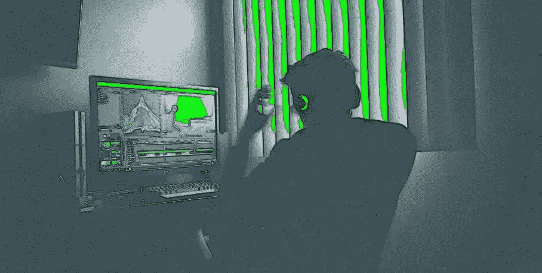

# 在线游戏可能会从区块链中受益匪浅

> 原文：<https://medium.com/hackernoon/online-games-could-benefit-significantly-from-the-blockchain-31e75c13ad4b>

> 由《编年史》(2015 年至今)的联合创始人萨曼莎·拉多奇亚撰写。[原载](https://www.quora.com/How-could-Blockchain-make-online-games-better/answer/Samantha-Radocchia)于 [Quora](http://quora.com?ref=hackernoon) 。

早在我读大学的时候，我就在一个叫做“第二人生”的电子游戏上完成了我的人类学论文。只不过这不仅仅是一个电子游戏。这是一个虚拟世界，人们的化身在这里生活、玩耍和工作。

就像在现实世界中一样，人们需要一种相互交换价值的方式。如果有人缝制了一件虚拟衬衫，他们希望因此得到补偿。

解决办法？游戏背后的公司林登实验室提出了一种虚拟货币，玩家可以在游戏中使用，甚至可以在游戏外兑换真实货币。

今天，我们称之为加密货币。当时，它只是一种在游戏中补偿人们或支付商品和服务的方式。有一次，胖子斯利姆甚至在其中一个虚拟岛屿上举办了一场音乐会，并向观看的人收费。

现在，林登实验室有一个新的虚拟世界项目，叫做高保真。这一次，他们用区块链来支撑他们的内部网络货币。这真的不太令人惊讶，因为游戏行业是我们最早看到构成我们当前加密货币的点对点行为的地方之一。

虽然游戏行业在许多方面领先，但它可能会被它帮助创造的技术彻底改变。方法如下:

## **成长中的产业**

游戏行业在帮助玩家在虚拟世界中交换真实价值方面有着悠久的历史。数字资产并不新鲜，但我们交换这些不同资产的能力正在增强。

例如，以太坊网络上的 [CryptoKitties 热潮](https://www.quora.com/Did-this-CryptoKitties-cripple-Ethereum-If-so-what-are-the-possible-outcomes/answer/Samantha-Radocchia)是基于收集和交易拥有真实价值的数字猫。它相对较新，但以太坊已经在交易量方面遇到了问题。随着游戏下一阶段的展开，这个数量只会增加。

令人兴奋的是，我们现在有了一个基于区块链的游戏引擎，可以用于交易和收集数字资产。它为更多基于区块链的游戏奠定了基础，并迫使网络扩大其容量。

## **改变商业模式**

除了升级游戏引擎，区块链也在改变行业商业模式。目前，电子竞技模式与流媒体、赞助和标准体育补偿有关。随着区块链变得越来越普遍，我们可能会看到一个更分散的补偿和赞助模式的转变。我们可以看到玩家和赞助他们的公司之间的直接联系，新的收入模式有利于玩家。

但这些变化也可能延伸到开发者身上。独立开发者可以被激励去改进游戏，而不仅仅是让中央工作室创作游戏——以换取小额交易费。

有很多爱好者和开发者想要贡献自己的力量，但是在现有的模型下，他们做不到。他们想从事游戏开发，但因为他们无法在大型工作室找到工作，他们基本上被逐出了这个行业。

区块链提供了一种开源思维，允许独立游戏开发者建立在通用框架上，并为他们的工作获得报酬。

## **对开发商的补偿**

但是对于虚拟交换的价值，游戏中需要有一个市场或某种生态系统。这为想要控制和参与他们正在玩的游戏的开发者和玩家带来了有趣的机会。

假设一个开发者想要在游戏中构建一些东西。他们可能会受到激励，通过象征性付款来帮助建设。反过来，这为熟练的游戏玩家开发和掌控游戏提供了可能性。

或者想象一下，你想要在你最喜欢的游戏中构建一些东西，但是你没有技术知识来实现它。所以，你用代币支付给开发者，让他们为你做这件事，为他们实现你的想法提供真正的补偿。

问题是，游戏的运作方式与电影和电视剧类似。他们非常片面。消费者得到呈现给他们的东西，然后被动地跟随。区块链代表了一个将部分权力重新放回玩家手中的机会。我们可能很快就会有部分由实际玩游戏的人设计或开发的游戏。

始于《第二人生》等虚拟世界的价值交换尚未发挥出全部潜力。我们仍然无法无缝地将价值从游戏转换到比特币钱包，再转换到贝宝账户——或者手中的现金。但区块链技术正在兴起，随着我们向前发展，游戏行业既是该技术的驱动者，也受其影响。

> 由《编年史》(2015 年至今)的联合创始人萨曼莎·拉多奇亚撰写。[原载](https://www.quora.com/How-could-Blockchain-make-online-games-better/answer/Samantha-Radocchia)于 [Quora](http://quora.com?ref=hackernoon) 。
> 
> 更多来自 Quora 的趋势科技答案，请访问[HackerNoon.com/quora](https://hackernoon.com/quora/home)。