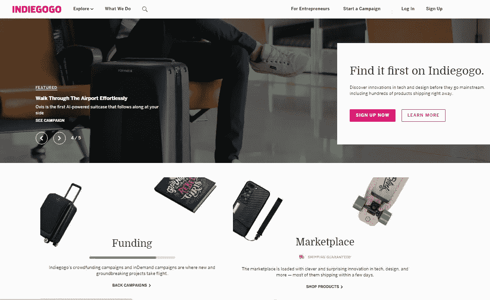

# 在线市场:现代消费者的天堂

> 原文：<https://medium.com/hackernoon/online-marketplaces-modern-consumer-paradise-f9074c641de0>

由伊琳娜·贝兹博罗代赫

充满活力的陈列柜，一排排重复的货架，诱人的穆扎克，微笑的店员……这是一幅购物天堂的精确画面，在这里，你可以随时将现金兑换成 1001 英镑左右的东西，就像被强大巫师的魔杖迷住了一样。嗯，看起来没有——再也没有了。购物梦正在逐渐非物质化并转移到网上。虽然花在网上购物的钱是非常真实的——据[Statista](https://statista.com/statistics/379046/worldwide-retail-e-commerce-sales/)统计，2017 年，全球消费者在网上挥霍的金额高达 23 亿美元。

在线市场已经成为当代的商业中心。快速、易于理解、经济高效——它们保证了所有参与者(买方、卖方和平台运营商)几乎不可避免的收益。难怪他们的数量在不断增长。新来者正成功地与亚马逊、易贝或优步等老牌巨头并肩发展。

投资者也喜欢网上[营销](https://hackernoon.com/tagged/marketing)。仅在欧洲，2017 年就有 [53 笔在线市场投资](http://go4venture.com/wp-content/uploads/2017/05/Marketplaces-Blog-2017.pdf)超过€的 1000 万大关。就在那一年，总部位于纽约的在线市场 Artsy 宣布投资 5000 万美元，日本跳蚤市场 Mercari 向美国扩张，从未公开的投资者那里筹集了 4700 万美元。AngelList 有 4425 名 marketplace [初创公司](https://hackernoon.com/tagged/startup)投资者，平均估值为 430 万美元，未来在线 marketplace 的发展前景如何？

# 但是首先，什么是在线市场？

在线市场是一个允许多个买家和卖家直接交换商品和服务的平台。该平台由市场运营商管理。运营商负责吸引双方玩家，保证安全，提供信息，促成交易。作为收入，运营商从在线市场平台的所有销售额中抽取一定比例。它与网上商店的主要区别是有许多供应商，作为市场的所有者，你的行为更像一个租户。

今天，在线市场出售几乎所有的东西:衣服、软件和硬件、媒体、医药、娱乐——任何你喜欢的东西。产品、服务甚至项目都有市场。它们可以组织为拍卖或众筹、面向 B2B、B2C 或 C2C、横向(销售大量类别的商品)和纵向(专门从事特定产品或服务)、搜索和匹配。不断的变换使得任何分类都是相对的和有缺陷的。所以，让我们把这些尝试放在一边，简单地进行一次虚拟漫步，看看它们诱人的吸引力。

# 庞大的巨人

多供应商电子商务市场是最古老和最完善的在线市场平台。在线市场的想法本身就是从它们中产生的。正是亚马逊和易贝确立了在线销售的规则和技巧。而且他们仍然定下了基调。这种电子商务市场遵循横向模式，充当“一站式商店”，在 B2C(乐天、沃尔玛、Jet.com)和 B2B(阿里巴巴、JOOR)领域向所有人出售一切。

但吸引顾客到这些平台的不仅仅是商品种类。因此，亚马逊成功的主要关键是从一开始就坚持对客户的特殊待遇。优质账户、最高知名度、高客户服务水平——它们反映了企业价值观，但它们也鼓励人们每年多花两倍的钱。另一个表明特殊态度有助于建立强大公司声誉的例子是易贝的慈善商店。在那里，每个人都可以买卖支持慈善事业的礼物。

这些电子商务网站提供的过多选择无疑是它们的主要优势。尽管如此，还是很容易迷路。很多人因为缺乏个性化的沟通而对网购分心。他们喜欢向咨询师提问。一些卖家也认为细节规范是专业精神不可或缺的一部分。他们当然会更喜欢 RFQ(询价)和在线市场目录——例如，全球资源。在这些网站上，买家浏览商品，但不会马上付款。相反，他们会在完成订单之前提交报价请求或联系供应商。这有助于建立信任关系，并确保购买 100 %符合顾客的需求。但有时甚至更窄的限制也是可取的。

# 开拓一个利基市场

虽然一些市场提供了非常广泛的商品，但其他市场则专注于单一类别或产品(Newegg、Houzz 等)。).这些都是垂直的，或利基在线市场。利基市场通过提供一系列特定的商品来满足购物者的需求。他们更有针对性，客户喜欢他们，因为他们确实节省时间。对他们中的一些人来说，专业化甚至创造了额外的价值。

因此，它帮助连接专业艺术家和收藏家的在线市场平台 Artsy，不仅通过创造排他性和高尚的氛围扩大了购买艺术品的人数，还向世界展示了尚未确立的人才。如今，Artsy 平台上有 2800+个付费画廊。意识到你需要排队才能被允许，有助于平台保持高标准并创造额外的需求。

为了比较，让我们看看另一个流行的艺术家在线市场，Etsy。Etsy 的特色是专注于独特的手工制品。与 Artsy 相反，这个市场的准入门槛非常低，这对卖家来说非常有吸引力，而人气排名有助于买家不要迷失在低质量报价的海洋中。Etsy 既照顾手工艺者(通过举办研讨会、提供商业咨询和小额贷款)，也照顾购物者(尽可能使浏览和购买变得容易)。它有助于建立一个强大的身份和品牌忠诚度。Etsy 在 2005 年从一个简单的小网站起步，如今已经是一家拥有超过 3 . 6 亿美元资金的大型上市公司。

许多专家预测，未来属于利基市场，在最近的几十年里，我们将会看到越来越多的利基市场。另一个经常提到的电子商务趋势是重点从商品转向服务。

# 让我为你服务

当搜索各种作品和服务时，服务市场保证了速度和便利。要证明它们的受欢迎程度，提到优步或 Airbnb 这样的顶级在线市场就足够了。这些公司开发的商业模式变得如此受欢迎，以至于优步和优步已经成为从[立法](https://lawpath.com.au/)到[彩票](https://www.lottoland.com/)等一系列服务的家喻户晓的名字。很少有人组织出国旅行而不查看 Airbnb 网站。

另一组流行的在线服务市场包括自由职业者的网站。[根据预测](https://investors.intuit.com/press-releases/press-release-details/2015/Intuit-Forecast-76-Million-People-in-On-Demand-Economy-by-2020/default.aspx)，到 2020 年，仅美国的按需经济就将超过 700 万人，高达全国劳动力的 43%。这些人不仅是数字游民，还有电工、水管工和出租车司机。目前，利基市场由 Upwork、Fiverr 和 TaskRabbit 主导，服务范围从软件工程到修理凳子。

对于 C2C 细分市场，在线市场显示其特殊功效的领域是协作消费。它们让任何人都可以出租或交换各种物品，而不是购买。像乌克兰 Maemo 这样的租赁市场为你一生中可能需要一次的东西省钱。

这些不仅仅是在线市场提供的现有服务。通常，他们会创造出全新的服务类别，这在 10 到 20 年前是没有人会想到的。因此，Collabary 将品牌与社交网络内容创作者联系起来，DogVacay 帮助寻找旅行期间的宠物保姆，在 Indiegogo 上，你可以订购很少有人听说过的技术和设计创新。

# 卫星编队

市场的增长导致了功能的扩展。有一天，客户的需求和期望超过了他们的能力。它导致卫星业务的形成，这些业务为市场供应商和购物者提供相关的服务和支持。通过这种方式，GuestReady 和 Pass Keys 为 Airbnb 主机提供物业管理服务。优步最初是一个寻找司机的平台，现在欢迎购买和租赁汽车的公司。

卫星在线系统插入现有的在线市场平台，并建立在这些平台之上。一个说明性的例子是 Vistr，这是一个建立在杰出的会计软件平台 Xero 之上的现金流预测服务。

对于市场租户本身来说，新的商业选择正在出现。因此，今天的亚马逊不仅是美国最大的市场，也是领先和最具创新性的送货服务提供商。另一个面向自由职业者的全球在线市场，Freelancer.com 最近推出了一项招聘服务，帮助公司为候选人组织面试。

# 社交网络的力量

2000 年代中期，脸书引入了买卖集团，这开启了另一种类型的电子商务点——网络市场，或市场网络。它们结合了当今非常流行的社交网络和在线市场的主要元素。事实上，人们多年来一直使用社交网络来推广商品和服务，脸书所做的只是顺应现有的潮流。这导致了 2016 年 Facebook Marketplace 的推出，并迅速成为多供应商电子商务最受欢迎的在线网站之一。普通用户每天在脸书上花费大约 50 分钟。加上有针对性的补充，几乎可以无限制地访问成千上万的个人资料，以及自由和容易的沟通，它为企业创造了巨大的机会。

嗯，在他们决定将这个平台货币化之前，脸书早就作为一个交流网络存在了。那么新来者呢——他们有机会吗？加州初创公司 HoneyBook 的例子表明，是的，这是很有可能的。HoneyBook 是一个协作平台，通过在一个网络保护伞下所有参与者之间彻底组织的互动来简化活动规划。参与活动策划的不同专业人士可以相互合作，与客户合作，建立自己的圈子，收取报酬，达成交易。该倡议得到了业界的积极支持，每年吸引成千上万的新用户。2015 年，该公司从最知名的硅谷投资者那里筹集了 2200 万美元，这些投资者都在争夺这一荣誉。

# 从电子商务到移动商务

你今天在网上花了多少时间？是从桌面还是从手机？你从哪里读到这篇文章的？好吧，让我们抛开猜测，转向统计数据:[截至 2018 年第二季度](https://www.statista.com/statistics/277125/share-of-website-traffic-coming-from-mobile-devices/)，全球所有网络流量的 51.89%源自移动设备。那么，现在手机在网上销售中占据最大份额并迅速增长，这难道不奇怪吗？无限制的访问(即使在离线模式下)，简单安全的支付，巨大的个性化潜力使手机成为电子商务的理想选择。

移动市场的兴起有两种主要方式。其中一些只不过是最近开发的基于网络的电子商务平台的移动版本。因此，亚马逊、易贝、Etsy 已经有了他们的移动应用。其他人从零开始做移动市场。这里属于 Lyst，Grabble，和愿望。

上面说的例子都是从产品类别来的。但是也有服务移动市场。例如，在旅游行业，CoolCousin 代表了一个移动应用程序，它将游客和准备分享真实体验的当地人联系起来。有了这个应用程序，你可以寻求建议，找到主人和导游，选择路线，名胜古迹和当地人推荐的美食——发现真实的世界。

# 甚至更远的未来

在本文的范围内，我们想提到的在线市场发展的最后一个创新是区块链。区块链为不同的加密货币提供数字账本，以便按时间顺序公开记录交易。区块链市场的要点是它的分散结构——这些基本上是无人拥有和控制的开源平台。在这样的市场上，买卖双方的交易是在没有任何第三方参与的情况下进行的。因此，所有支付都是即时处理的，不需要任何支付系统，交易费用非常低。

已经存在一些专注于多种商品和服务的区块链市场。例如，OpenBazaar 是一个多供应商区块链平台，支持来自 30 多个国家的企业。所有交易都是通过托管账户匿名进行的。区块链市场的其他例子有 ModulTrade、Multiven、CanYa 和 Storj.io

# 综上

未来，在线市场有望继续增长，这对每个人来说都是好消息。对顾客来说，这意味着网上购物将变得更加方便、愉快和完美。对零售商来说，这是接触更多顾客的绝佳机会。对于那些正在考虑发展在线市场的人来说，这是一个坚实的证据，证明他们走在正确的道路上。已经有主意了？让我们[一起讨论一下](https://stfalcon.com/en/contacts)！也许你的网站将来会成为最好的在线市场！

*最初发表于*[T5【stfalcon.com】](https://stfalcon.com/en/blog/post/best-online-marketplaces)*。*