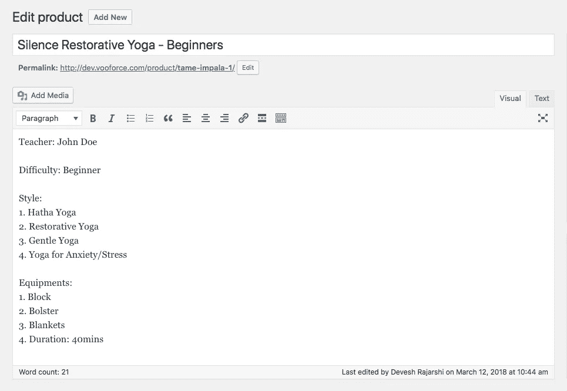
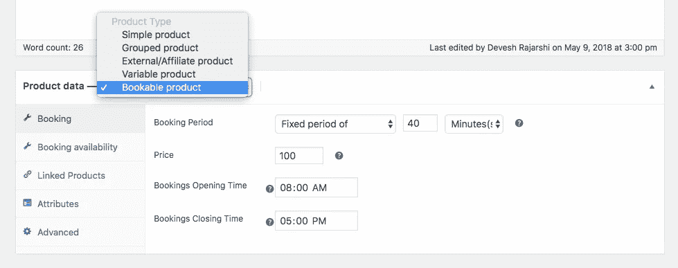
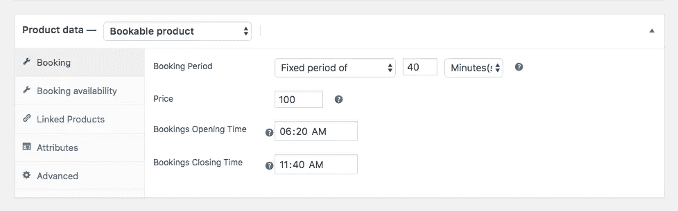
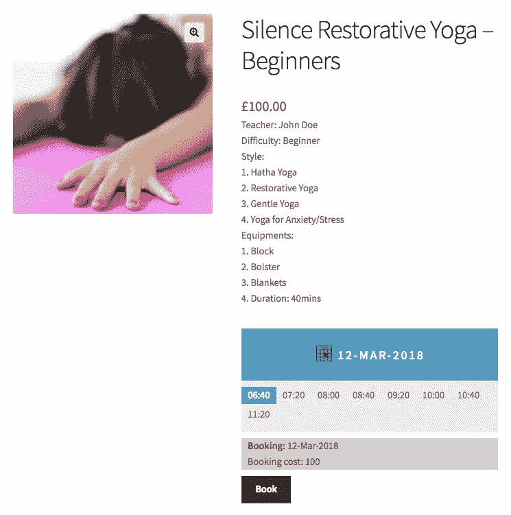
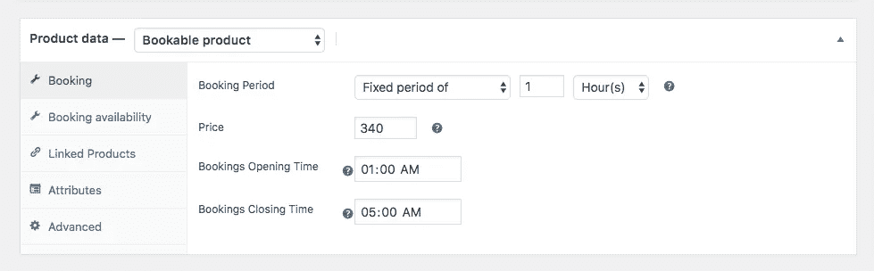
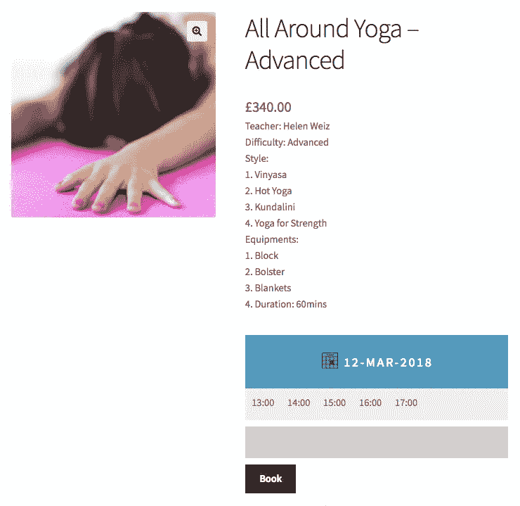
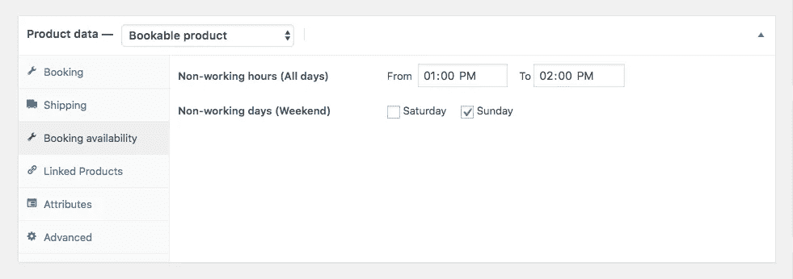
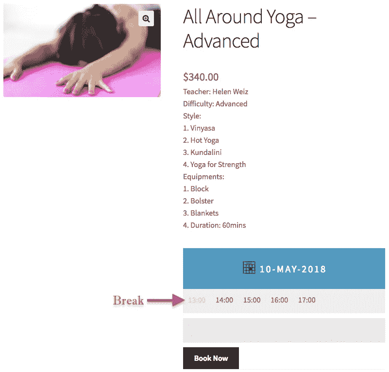
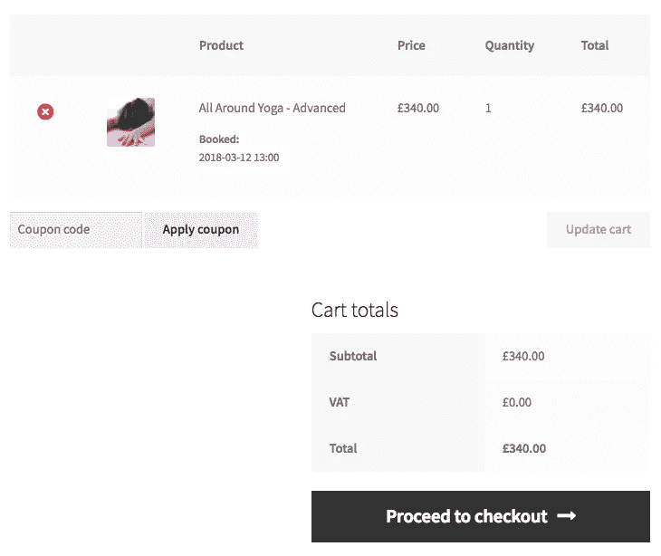

# 瑜伽课程的在线网上商务预订系统

> 原文：<https://medium.com/hackernoon/online-woocommerce-booking-system-for-your-yoga-classes-f97bf5837adf>

瑜伽已经成为所有年龄段中最受欢迎的健身潮流之一。它赋予人们精神力量，将健康提升到有益健康的水平。全球各地的人们都在接受瑜伽，并将其融入生活。因此，对好的瑜伽馆的需求增加了很多。很多瑜伽老师和健身专家都开了自己的工作室，一路赚着钱。

如果你是一名瑜伽教练或经营一家瑜伽馆，你会知道，报名参加课程的人数增加是一个好消息，管理增加的预订人数成为一个问题。安排课程、分配候选人和管理付款变得很困难。

因此，为了自动化和简化瑜伽课程的预订，你需要一个强大的系统来处理你的预订。如果你是 WooCommerce 用户，你可以使用免费的 WooCommerce 预订和预约插件 。它有必要的功能，让您能够自动化预订过程。你只需要一开始设置好规则，让插件给你安排好日程。这样你就可以更专注于课程和参与者的全面发展。

# 如何组织瑜伽课？

这个问题没有明确的答案，但是有几个重要的步骤适用于所有人。我们建议你遵循这些步骤，为自己建立一个合适的在线瑜伽课程预订系统。

# 选择瑜伽风格，并给每堂课分配时间

了解你的目标受众中最流行和最有益的瑜伽风格是很重要的。你可能只想坚持几种瑜伽风格，因为增加风格的数量可能会损害质量和你的奉献精神。此外，你或聘请的教练应该是这些风格的专家。这样做最终会**增加你的瑜伽馆**在许多有志者中的知名度。这也能证明对你未来的收入有好处。

以下是一些最受欢迎的瑜伽课程:

1.  阿什坦加
2.  葡萄酒花
3.  昆达里尼
4.  哈塔
5.  高温瑜伽
6.  恢复性瑜伽

如果你有一个 WooCommerce 网站，那么你可以为每一种瑜伽风格单独开设课程。你只需通过进入 **WordPress >仪表板>产品>添加新的**来定义可预订的产品，然后写下 yoga 课程的名称。在下图中，你可以看到**静默恢复瑜伽**的可预订产品样本。您可以在产品页面的描述部分提及相关细节，如下图所示。

You can mention the yoga class name here

为了减少混乱，您可以简单地为不同类型的类创建类别，并将每个可预订的产品分配到它们各自的类别。例如，如果你想每天上四节恢复性瑜伽课，那么你可以创造四种不同的产品。你可以进一步划分，把两个班安排在上午，另外两个班安排在下午。此后，您可以将每对中的一对分配给初学者，另一对分配给高级用户。

理想情况下，你应该有两种类型的瑜伽课程，一种是为初学者准备的，另一种是为 T2 的高级学员准备的。初学者课程可以在短短的 **30 分钟**内完成。但是，你也应该在同一节课中包括热身和放松练习。因此，总时间可达 45 分钟。对于高级课程，您可以将**课程延长至 2 小时**。这个环节应该包括热身、伸展、放松以及其他一些主流瑜伽姿势。这门课需要更多的耐力，你的学生可以更深入地练习。这很好。

# 定义您的课时和每节课的费用

一旦安装了插件，该选项将仅出现在**产品数据**部分。选择可预订产品后(见上文)，您可以点击**更新**。

一旦您设置了可预订的产品，您必须设置分配给每堂课的持续时间。让我们考虑一下前面的静默恢复瑜伽的例子，再举一个全能瑜伽班的例子。我们将在两次不同的会议中将它们定义为两个独立的类。

## 寂静恢复瑜伽——初学者

为了实现这个类，您必须在产品数据页面中进行以下设置。

一旦你在产品页面上完成了上述操作，你将会在产品页面上看到如下内容。

## 全方位瑜伽——高级

现在，如果你要创建一个混合多种瑜伽风格的高级课程，那么你可以利用下面的设置。

您的客户将能够在产品页面上看到以下内容。

他们可以很容易地选择可用的课程，你甚至可以提到每个课程的价格。

你也可以定义一段时间休息一两个小时，或者在课间吃午饭。为此，该插件提供了一个惊人的特性，叫做预订可用性。基本上，在这一部分，你可以定义一个特定的时间段，这将是不工作的，这样，你的学生就不能在该时间范围内预订。如果你周末休息，你也可以这样定义。

因此，产品页面看起来会像下面这样。看一看:

最后，您的学生可以进一步转到购物车页面并支付课程费用。以下是购物车页面的外观。

# 结论

这篇文章向你展示了如何使用免费版的 WooCommerce 预订和预约插件为你的瑜伽课程建立一个预订系统。你可以利用这个插件的高级版本，在你的 WooCommerce 中加入更多的功能。这个插件很容易使用和配置你的商业案例。看看这篇文章，看看如何使用这个插件来建立一个 [**医生预约系统**](http://pluginhive.com/create-woocommerce-doctor-appointment-booking-system/) **。**

此外，如果你需要专业专家来帮助维护你的网站， [**WP Buffs**](https://wpbuffs.com/partnerships/) 是个不错的选择。

如果你需要任何帮助或发现插件中的任何功能有任何困难，请在下面评论。我们非常乐意帮助你。