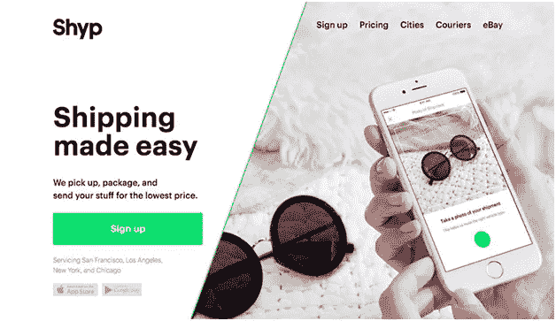

# 到 2022 年，只有 10%的初创公司会存在。你会成为他们中的一员吗？

> 原文：<https://medium.com/hackernoon/only-10-of-startups-will-exist-by-the-year-2022-are-you-going-to-be-one-of-them-a68b775fba8a>

“我很抱歉，成千上万的顾客通过运送足够绕地球 50 万圈的包裹验证了我们的想法。”

这是来自 Shyp 的首席执行官**凯文·吉本的话，Shyp 是一家提供运输和履行服务的按需创业公司。2018 年 3 月，该公司停止运营，并已裁员。这个创新的创业想法后来怎么样了？是什么导致了它的关闭？**

你是企业家吗？你在经营什么创业公司吗？你想把你的想法发展成赚钱的生意吗？

这篇文章是给你的。如果你属于以上任何一类，它绝对值得一读。

# Shyp:一家曾经筹集了 6200 万美元资金的公司

这个故事不一样。

Credit: wearecoordinate.com

Shyp 的目标是通过轻触按钮使运输变得更加简单和可能，它被开发为“运输优步”应用程序。该应用程序提供了一种非常简单而新颖的按需航运服务方式，在美国人当中非常受欢迎。它允许客户拍摄他们想要发送的礼物、电子产品或其他物品的照片，然后让用户输入目的地和取件时间。该公司规定在最短时间内提取物品，包装这些物品，并交付到要求的目的地。这真是一个好主意，因为它重新定义了邮政服务或航运公司递送邮件的方式。

这已经成为历史，也给了我们每个人一个更大的教训。

# 哪里出了问题？

它是基于一个糟糕的商业模式吗？是的，你可以说。

“*大约两年前，我们重新分配了资源，将重点转移到利润更高的客户群:小企业。但是，我们决定保留我们业务中受欢迎但不盈利的部分，由他们自己的小团队支持。这是一个错误——我的错误*，“*吉本写道。*

另一个因素，

“我们收取 5 美元的取件费，这包括包装和送货上门。所有的物品都不是生来平等的。运输你的鞋子和运输你的电视，实际上听起来并没有太大的商业或财务意义。这不，”吉本说

不，如果你认为糟糕的用户体验也是原因之一，这是不对的。Shyp 通过精心设计的功能和用户界面提供了无与伦比的客户体验。

> "一切都始于一个想法."

每一家初创公司，无论是初创期还是成长期，都需要从这个故事中汲取关键经验。

## 我们需要从中学到什么？

1.  无论是杂货店、汽车还是维修服务，按需技术现在都不能吸引顾客
2.  如果您选择的是按需模型，那么一切都已经可用了
3.  你需要一个长期的经营策略
4.  你需要经常评估客户的需求
5.  只有融资并不能让你的创业成功
6.  可持续的想法比复制粘贴更有意义

另一方面，Yerdle 的联合创始人 Carl Tashian 分享了扼杀创业公司的原因。他写道，

> 行为、文化和人际关系问题是创业公司的最大杀手，但它们很少在公共场合被讨论。

这是不可否认的事实。

当我们讨论一家初创公司的成功时，有许多因素需要我们牢记在心。

许多流行语来来去去，趋势也是如此。例如，我们已经看到了随需应变业务的巨大成功。根据一个来源，8650 万美国人已经使用了点播服务。世界各地的人们都接受它，但正如他们所说，现在每个按需模式都必须经历一次彻底改造，以证明其潜力。

***“跟上变化至关重要。”***

无论在哪个领域，技术都是深入部署的。许多初创公司已经发展成为大型科技组织，他们的服务被世界各地的人们所使用。并不是每次你都需要想一些突破性的或打破常规的东西来获得成功。你需要换个角度思考，这才是重点。需要举例吗？在这里。

# Tapzo 被 Amazon Pay 收购，投资约 4000 万美元

如果你不知道 Tapzo，让我们先弄清楚。

Tapzo 是一家印度初创公司，它将优步、Ola 等各种应用程序，Swiggy、Zomato 等其他食品配送服务，Book My Show 等娱乐服务，以及 BillDesk 等账单支付服务聚合到一个应用程序中。

听起来很有趣。

您只需一个应用程序即可访问基于应用程序的服务。专注于你的想法如何有用会有所不同。并购成为日常生活中的主流新闻。在这种情况下，你如何利用技术来实现你的想法是值得讨论的。

无论你是专注于技术驱动的想法，还是希望通过技术传播对创业公司的认识——在这两种情况下，你如何选择资源可能是任何创业公司成功的关键因素。

## 你如何选择你的技术合作伙伴？它们有助于证实你的想法吗？它们有助于思维吗？

**在我们继续之前，这里有一些你需要回答的问题:**

你清楚你的想法吗？

你的用户是谁？

你在解决用户的任何问题吗？

你有没有写下或画出你的想法？

你有多个想法和它的维度可供选择吗？

你能很好地演示你的想法吗？

如果你不能对上述任何一个问题给出合适的答案，你可以寻求创业技术合作伙伴的帮助，他们可以和你坐在一起，谈论你的想法，帮助验证它，定义这个想法的范围，并确定与之相关的可能风险。

从建议合适的技术组合到最终完成，创业咨询服务可以通过概念验证( **POC** )来帮助测试您的想法。此外，如果你想用最少的功能来测试你的基本想法，在你开始实际实现一个想法之前，有一个建立 **MVP** (最小可行产品)的过程。

你所需要做的就是找到有经验的创业技术合作伙伴，从资金需求到维护部分，他都会帮助你，以确保它的成长。如果你想了解深入的服务，看看下面:

*   讨论你的想法
*   验证和定义
*   原型和风险分析
*   设计和开发
*   各级质量保证和测试
*   产品发布的端到端支持
*   维护和反馈

经验和专业知识相结合可以完成工作。如果你想建立自己的企业或执行你独特的想法，不要等待。凭借 30 多年的经验、客户至上的方法和提供端到端 IT 服务的技能，我们@ [SPEC INDIA](https://www.spec-india.com/) 正在帮助初创公司和企业家将他们的想法变成现实。

通过选择合适的[初创 IT 解决方案提供商](https://www.spec-india.com/services/startup-it-solutions-services/)，思考如何借助合适的技术更好地实现您的想法。