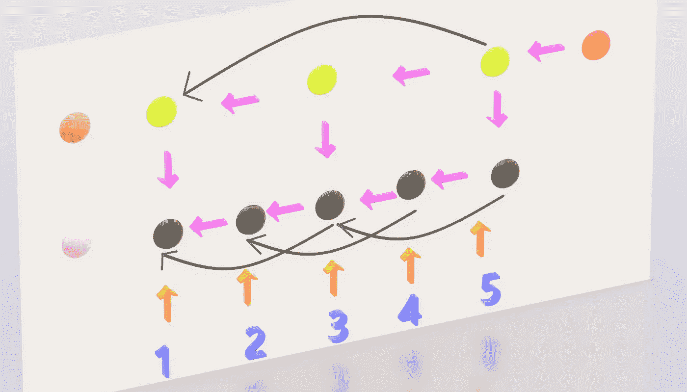
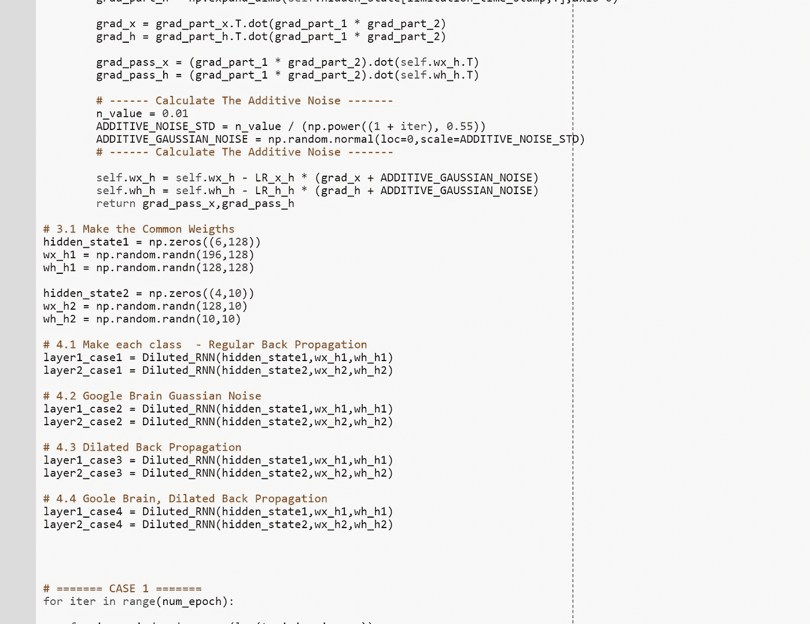

# 只有 Numpy:扩张反向传播和谷歌大脑的梯度噪声与互动代码

> 原文：<https://medium.com/hackernoon/only-numpy-dilated-back-propagation-and-google-brains-gradient-noise-with-interactive-code-3a527fc8003c>

Photo of [gwanghwamu](https://en.wikipedia.org/wiki/Gwanghwamun) from [pixelbay](https://pixabay.com/)

所以昨天我从 [NIPS 2017](https://papers.nips.cc/book/advances-in-neural-information-processing-systems-30-2017?utm_campaign=Revue%20newsletter&utm_medium=Newsletter&utm_source=Deep%20Learning%20Weekly) 找到这篇论文[扩张型递归神经网络](https://papers.nips.cc/paper/6613-dilated-recurrent-neural-networks)，在这里实现了[。但是我突然想到，Res Net 和 High Way net 是以一种允许输入数据 X 和转换数据 X’之间直接连接的方式构建的。](https://towardsdatascience.com/only-numpy-nips-2017-implementing-dilated-recurrent-neural-networks-with-interactive-code-e83abe8c9b27)

为什么我们不能对反向传播做同样的事情呢？将之前图层的渐变连接到更深的图层…..

我的意思是，如果你不使用框架来执行自动微分，为什么我们不把梯度从最新的层连接到更深的层，看看会怎么样？在这篇文章中，我们会这样做，也让我们更进一步，并与应用[谷歌大脑的梯度噪声](https://arxiv.org/abs/1511.06807)的模型进行比较。

由于我是在阅读了扩张的 RNN 后获得灵感的，我就称之为扩张的反向传播，**然而，如果有人知道其他论文以这种方式进行了反向传播，请在评论部分告诉我。另外，我假设你已经阅读了我关于实施扩张 RNN 的博文，** [**如果没有，请点击这里。**](https://towardsdatascience.com/only-numpy-nips-2017-implementing-dilated-recurrent-neural-networks-with-interactive-code-e83abe8c9b27)

**网络架构(前馈方向)**

Side View

Front View

**红圈** →网络的最终输出，预测数的一个热编码的(1*10)向量

**棕色圆圈** →第 2 层隐藏状态 0
**石灰圆圈** →第 2 层隐藏状态

**粉色圆圈** →层 1 的隐藏状态 0
**黑色圆圈** →层 1 的隐藏状态

**蓝色数字 1、2、3、4、5** →每个时间戳的输入(请*注意这一点*，因为我将使用这些知识来解释训练/测试数据)

**略带桃色？箭头** →前馈运行方向，

如上图所示，网络架构与上一篇帖子完全相同。然而，有一件事我改变了，那就是每个时间戳的输入数据。

**训练数据/测试数据**

**粉色框** →时间戳 1 处输入(矢量化 14*14 像素图像)
**黄色框** →时间戳 2 处输入(矢量化 14*14 像素图像)
**蓝色框** →时间戳 3 处输入(矢量化 14*14 像素图像)
**紫色框** →时间戳 4 处输入(矢量化 14*14 像素图像)
**绿色框** →输入

尽管有些图像看起来比其他图像大，但它们都是(14*14)像素的图像。并且每个图像都是通过对原始图像(28*28 像素图像)应用不同种类的合并操作而制成的。下面描述了每个池操作。

**粉色方框** →均值池使用 [np.mean](https://docs.scipy.org/doc/numpy-1.13.0/reference/generated/numpy.mean.html) 函数
**黄色方框** →方差池使用 [np.var](https://docs.scipy.org/doc/numpy/reference/generated/numpy.var.html) 函数
**蓝色方框** →最大池使用 [np.max](https://docs.scipy.org/doc/numpy-1.13.0/reference/generated/numpy.maximum.html) 函数
**紫色方框** →标准差池使用 [np.std](https://docs.scipy.org/doc/numpy/reference/generated/numpy.std.html) 函数
**绿色方框**

下面是实现这一点的代码。

记住这一点，让我们看看其他的训练数据。最后，我这样做的原因很简单，我想。

Image of 0

Image of 3

**情况 1:正常反向传播**

**紫色箭头** →梯度流的标准方向

上面是正常的(或标准的)反向传播，我们计算每一层的梯度，将它们传递给下一层。并且不同时间戳的每个权重使用它们来更新它们的权重，并且梯度流继续进行。

**案例二:谷歌大脑梯度噪声**

**紫色箭头** →梯度流的标准方向
**黄色箭头** →添加梯度噪声

同样，紫色的箭头代表标准的梯度流，但是这次在更新每个权重之前，我们要给梯度添加一些噪声。下面是我们如何实现这一目标的屏幕截图。

**情况 3:扩张的反向传播**

**紫色箭头** →梯度流的标准方向
**黑色箭头** →扩张反向传播，将梯度的一部分传递给之前的层，这些层并不直接相连。

现在，我们在这里介绍我们的新理论，希望能提高模型的准确性。这里有两点需要注意。

1.  我们只是将渐变的一部分传递给前面的图层。

如上所述，我们有一些称为“衰减比例率”的变量，我们将使用[逆时间衰减率](https://www.tensorflow.org/api_docs/python/tf/train/inverse_time_decay)来减少随着时间的推移它可以传递到前面层的梯度量。如绿色框中所示，由于我们将来自未来层的梯度乘以衰减比例率，随着训练的持续，扩张的梯度流量的量减少。

2.扩张的梯度流每 2 层跳过一次。

如上面的红框所示，时间戳 5 处的渐变仅适用于时间戳 3 处的渐变。然而，这种结构可以进一步探索，使梯度流更加密集。

**案例 4:扩张型反向传播+谷歌大脑梯度噪声**

**紫色箭头** →梯度流的标准方向
**黑色箭头** →扩张反向传播，将梯度的一部分传递给之前的层，这些层不直接相连。
**黄色箭头** →添加渐变噪点

这里，我们不仅在每次权重更新中添加了渐变噪声，还使渐变流更好。

**训练和结果(Google Colab，本地设置)**

以上是在 Google Colab 上运行代码的结果。准确度栏代表模型对 100 幅测试图像的正确猜测。不幸的是，我忘记打印出准确的准确率，但我们可以看到情况 2(谷歌大脑梯度噪声)具有最高的准确性。此外，非标准反向传播的情况比标准反向传播更好。在时间成本函数中，我们可以看到标准反向传播具有最高的成本率。

以上是在我的本地笔记本电脑上运行代码的结果。准确度栏代表模型对 100 幅测试图像的正确猜测。有趣的是，与标准反向传播相比，情况 3(扩张反向传播)表现不佳。然而，扩张的反向传播和谷歌大脑的梯度噪声的结合已经超越了每个模型。

**互动码**

我搬到了 Google Colab 来获取交互代码！所以你需要一个谷歌帐户来查看代码，你也不能在谷歌实验室运行只读脚本，所以在你的操场上做一个副本。最后，我永远不会请求允许访问你在 Google Drive 上的文件，仅供参考。编码快乐！

请点击此处[访问互动代码。](https://colab.research.google.com/drive/18F9dFn7ZejVg0ei5gh5SGi-aF6rN6Mj6)

**遗言**

我喜欢 Tensorflow 和 Keras 之类的框架。然而，我坚信我们需要探索更多不同的方法来执行反向传播。

如果发现任何错误，请发电子邮件到 jae.duk.seo@gmail.com 给我，如果你想看我所有写作的列表，请[在这里查看我的网站](https://jaedukseo.me/)。

同时，在我的 twitter [这里](https://twitter.com/JaeDukSeo)关注我，并访问[我的网站](https://jaedukseo.me/)，或我的 [Youtube 频道](https://www.youtube.com/c/JaeDukSeo)了解更多内容。如果你感兴趣的话，我还做了解耦神经网络的比较。

**参考**

1.  常，张，杨，韩，魏，余，米，郭，陈，谭，黄，黄铁生(2017)。扩张的循环神经网络。在*神经信息处理系统的进展*(第 76–86 页)。
2.  Neelakantan，a .，Vilnis，l .，Le，Q. V .，Sutskever，I .，Kaiser，l .，Kurach，k .，和 Martens，J. (2015 年)。添加梯度噪声改善了对非常深的网络的学习。arXiv 预印本 arXiv:1511.06807 。
3.  Seo，J. D. (2018 年 2 月 14 日)。only Numpy:NIPS 2017——用交互式代码实现扩张型递归神经网络。检索于 2018 年 2 月 15 日，来自[https://towards data science . com/only-numpy-nips-2017-implementing-expanded-recurrent-neural-networks-with-interactive-code-e 83 Abe 8 C9 b 27](https://towardsdatascience.com/only-numpy-nips-2017-implementing-dilated-recurrent-neural-networks-with-interactive-code-e83abe8c9b27)
4.  索引。(未注明)。检索于 2018 年 2 月 15 日，来自[https://docs.scipy.org/doc/numpy/genindex.html](https://docs.scipy.org/doc/numpy/genindex.html)
5.  [1]" TF . train . inverse _ time _ decay | tensor flow "， *TensorFlow* ，2018。【在线】。可用:[https://www . tensor flow . org/API _ docs/python/TF/train/inverse _ time _ decay。](https://www.tensorflow.org/api_docs/python/tf/train/inverse_time_decay.)【访问时间:2018 年 2 月 16 日】。