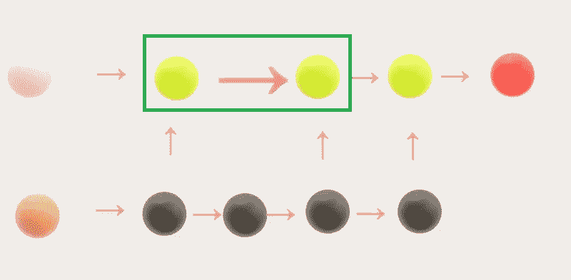

# Only Numpy:使用带有交互代码的扩展更新门 RNN (Google Brain + NIPS2017)推荐抑郁症的最佳治疗

> 原文：<https://medium.com/hackernoon/only-numpy-recommending-optimal-treatment-for-depression-using-dilated-update-gate-rnn-google-c327353f2d99>

Depressed Man [from Pixel Bay](https://pixabay.com/en/despair-alone-being-alone-archetype-513529/)

佛罗里达大学的生物统计是一个寻找健康相关数据的好地方。其中之一是由 T2 国立卫生研究院进行的一项关于抑郁症的研究。直接引用网站“ *109 名临床抑郁症患者被分为三组，每组给予两种活性药物(丙咪嗪或锂)中的一种或不给予任何药物。对于每个患者，数据集包含所使用的治疗方法、治疗结果以及其他一些有趣的特征*……”

该数据集有五列，每列说明见下文。

Screen shot from [this web page](http://bolt.mph.ufl.edu/2012/08/02/learn-by-doing-exploring-a-dataset/)

利用这些数据，我们可以建立一个分类器，预测某种治疗是否可以防止抑郁症复发。利用这个模型，我们可以推荐最有可能防止抑郁症复发的最佳治疗方案。

最后，为了好玩，让我们使用不同类型的反向传播来比较什么给我们最好的结果。我们将要使用的不同类型的反向传播是…

a.[谷歌大脑的梯度噪声](https://becominghuman.ai/only-numpy-implementing-adding-gradient-noise-improves-learning-for-very-deep-networks-with-adf23067f9f1)
b. [扩张型反向传播](https://hackernoon.com/only-numpy-dilated-back-propagation-and-google-brains-gradient-noise-with-interactive-code-3a527fc8003c)
c. [扩张型反向传播+谷歌大脑的梯度噪声](https://hackernoon.com/only-numpy-dilated-back-propagation-and-google-brains-gradient-noise-with-interactive-code-3a527fc8003c)

如果你不知道它们之间的区别，请阅读我链接的博文。

***注:所有 CSV 数据均来自*** [***佛罗里达大学生物统计***](http://bolt.mph.ufl.edu/) ***，如果您计划使用数据集，请查看其数据使用年龄政策。具体来说，我将使用来自“*** [***边做边学***](http://bolt.mph.ufl.edu/2012/08/02/learn-by-doing-exploring-a-dataset/) ***”数据集的 CSV 数据。***

**训练数据**

如上所示，我已经从原始数据集中删除了两列，它们是…

***a. Hospt*** :患者的医院，用 5 个医院(1、2、3、5、6)中每一个的代码表示

***b .时间*** :复发前的时间(天)，或者如果没有复发，患者参与研究的时间(天)。

这是因为，我想简化我们的目标。我们只是希望模型能告诉我们某种治疗是否能防止抑郁症复发。

**网络架构(数学方程形式)**

[Image from Paper](https://arxiv.org/abs/1611.09913)

**红框** →更新门 RNN 的通用方程

如上所述，更新门 RNN 实现起来非常简单，因为它与普通的递归神经网络没有什么不同。

**网络架构(图形形式/ OOP 形式)/前馈方向**

Front View of the Network

Side view of the Network

**绿框** →我们的网络存在被扩大的跳过连接的地方。
**略带粉红色？箭头** →前馈过程的方向。

所以前馈过程很容易理解，和香草 RNN 没有什么不同。现在让我们看看 OOP 的实现。

**绿框** →初始化所有重量
**蓝框** →标准更新门 RNN 前馈操作

对于 C 门，我使用了 arctan()激活函数，对于 G 门，我使用了 tanh()激活函数。

**情况 1:标准反向传播**

Front View of the Gradient Flow

Side view of Gradient Flow

**略带桃色？箭头** →梯度流的标准方向

案例 1 是一个使用标准反向传播的模型。(虽然在 RNN 它被称为穿越时间的反向传播，但为了简单起见，我就称它为反向传播。)

**案例二:谷歌大脑添加的渐变噪声**

Front View of Gradient Flow

Side view of Gradient Flow

**略带桃色？箭头** →梯度流的标准方向
**蓝色箭头** →每次重量更新时增加梯度噪声

同样，这与标准反向传播没有太大区别，因为我们只是在每次权重更新之前添加梯度噪声。

**情况 3:扩张的反向传播**

Dilated Back Propagation Front View

Side view of Dilated Back propagation

**略带桃色？箭头** →梯度流的标准方向
**黑色弯曲箭头** →扩张的反向传播，其中我们将梯度的一些部分传递到先前的层，这些层没有直接连接。

如果上面的图有点混乱，请在这里阅读我写的博文。简而言之，我们只是在没有直接连接的图层上添加了一部分渐变。

**案例四:** **扩张反向传播+谷歌大脑添加的梯度噪声**

Front View of Case 4

Side View of Case 4

**略带粉红色？箭头** →梯度流的标准方向
**蓝色箭头** →在每次权重更新时添加梯度噪声
**黑色弯曲箭头** →扩张的反向传播，其中我们将梯度的一部分传递到不直接连接的先前层。

案例 4 只是将反向传播的每一种方法结合在一起。

**培训和结果(所有情况)**

**左图** →案例 1:随时间推移的成本
**右图** →案例 1:测试集上的性能

学习率似乎有点高，因为随着时间的推移，成本波动很大。然而，该网络似乎概括得很好，因为它在测试集上做得很好。

**左图** →案例 2:随时间推移的成本
**右图** →案例 2:测试集上的性能

与案例 1 相比，案例 2 的时间成本图看起来没什么不同。以及在测试集上的性能。

**左图** →案例 3:随时间推移的成本
**右图** →案例 3:测试集上的性能

案例 3 有点有趣，从成本随时间变化的图表中可以看出，与其他案例相比，成本值更高，我认为这是它在测试集上表现不佳的原因。

**左图** →案例 4:时间成本
**右图** →案例 4:测试集性能

最后一个案例是最好的，不仅模型在训练结束时具有最小的成本值，而且在测试集上表现良好。

**交互用例**

在所有的模特完成训练后，程序会询问你在今天之前抑郁了多少天，你的年龄和性别。之后，模型会向你推荐最有可能防止抑郁症复发的治疗方法。上面是一个 48 岁女性的例子，她已经抑郁 90 天了。

**交互代码**

*我为了交互代码搬到了 Google Colab！所以你需要一个谷歌帐户来查看代码，你也不能在谷歌实验室运行只读脚本，所以在你的操场上做一个副本。最后，我永远不会请求允许访问你在 Google Drive 上的文件，仅供参考。编码快乐！*

请[点击此处访问交互代码。](https://colab.research.google.com/drive/1u8cIYwkwnqsqclcObyiz7YkXY2sTBZYv)

**最后的话**

谢天谢地，我不是那种经常沮丧的人。而且这种模式从来就没打算认真对待。我只是想实现扩大更新门 RNN。然而，如果有人患有抑郁症，我真的希望你得到专业人士的帮助。有抑郁症没什么尴尬的。

如果发现任何错误，请发电子邮件到 jae.duk.seo@gmail.com 给我，如果你想看我所有写作的列表，请点击这里查看我的网站。

同时，在我的推特[这里](https://twitter.com/JaeDukSeo)关注我，访问[我的网站](https://jaedukseo.me/)，或者我的 [Youtube 频道](https://www.youtube.com/c/JaeDukSeo)了解更多内容。如果你感兴趣，我还在这里做了解耦神经网络[的比较。](https://becominghuman.ai/only-numpy-implementing-and-comparing-combination-of-google-brains-decoupled-neural-interfaces-6712e758c1af)

**参考**

1.  Collins，j .，Sohl-Dickstein，j .，和 Sussillo，D. (2016 年)。递归神经网络的容量和可训练性。 *arXiv 预印本 arXiv:1611.09913* 。
2.  边做边学-探索数据集(抑郁症数据)。(未注明)。检索于 2018 年 2 月 14 日，来自[http://bolt . mph . ufl . edu/2012/08/02/learn-by-doing-exploring-a-dataset/](http://bolt.mph.ufl.edu/2012/08/02/learn-by-doing-exploring-a-dataset/)
3.  常，张，杨，韩，魏，余，米，郭，陈，谭，黄，黄铁生(2017)。扩张的循环神经网络。在*神经信息处理系统的进展*(第 76–86 页)。
4.  将浮点数限制在小数点后两位。(未注明)。检索于 2018 年 2 月 19 日，来自[https://stack overflow . com/questions/455612/limiting-floats-to-two-decimal-points](https://stackoverflow.com/questions/455612/limiting-floats-to-two-decimal-points)
5.  F.(2018 年 1 月 26 日)。Google Colab 免费 GPU 教程—深度学习火鸡—中等。检索于 2018 年 2 月 19 日，来自[https://medium . com/deep-learning-turkey/Google-colab-free-GPU-tutorial-e 113627 b 9 f5d](/deep-learning-turkey/google-colab-free-gpu-tutorial-e113627b9f5d)
6.  如何使用 wget 获取 csv 文件？(未注明)。检索于 2018 年 2 月 19 日，来自[https://stack overflow . com/questions/30710102/how-to-get-CSV-files-using-wget](https://stackoverflow.com/questions/30710102/how-to-get-csv-files-using-wget)
7.  将 pandas 数据帧转换为 numpy 数组，保留索引。(未注明)。检索于 2018 年 2 月 19 日，来自[https://stack overflow . com/questions/13187778/convert-pandas-data frame-to-numpy-array-preserving-index](https://stackoverflow.com/questions/13187778/convert-pandas-dataframe-to-numpy-array-preserving-index)
8.  替换整个数据帧中的字符串/值。(未注明)。检索于 2018 年 2 月 19 日，来自[https://stack overflow . com/questions/17142304/replace-string-value-in-entire-data frame](https://stackoverflow.com/questions/17142304/replace-string-value-in-entire-dataframe)
9.  Seo，j . d .(2018 . 2 . 15)。只有 Numpy:扩张的反向传播和谷歌大脑的梯度噪声与交互代码。检索于 2018 年 2 月 19 日，来自[https://hacker noon . com/only-numpy-expanded-back-propagation-and-Google-brains-gradient-noise-with-interactive-code-3a 527 fc 8003 c](https://hackernoon.com/only-numpy-dilated-back-propagation-and-google-brains-gradient-noise-with-interactive-code-3a527fc8003c)
10.  Seo，J. D. (2018 年 1 月 18 日)。only Numpy:Implementing " ADDING GRADIENT NOISE IMPROVES-LEARNING FOR-VERY-DEEP-NETWORKS-with-ADF 23067 F9 f12018 年 2 月 19 日检索自[https://becoming human . ai/only-Numpy-Implementing-ADDING-GRADIENT-NOISE-IMPROVES-LEARNING-FOR-VERY-DEEP-NETWORKS-with-ADF 23067 F9 f1](https://becominghuman.ai/only-numpy-implementing-adding-gradient-noise-improves-learning-for-very-deep-networks-with-adf23067f9f1)
11.  美国国立卫生研究院。(未注明)。检索于 2018 年 2 月 19 日，来自[https://www.nih.gov/](https://www.nih.gov/)