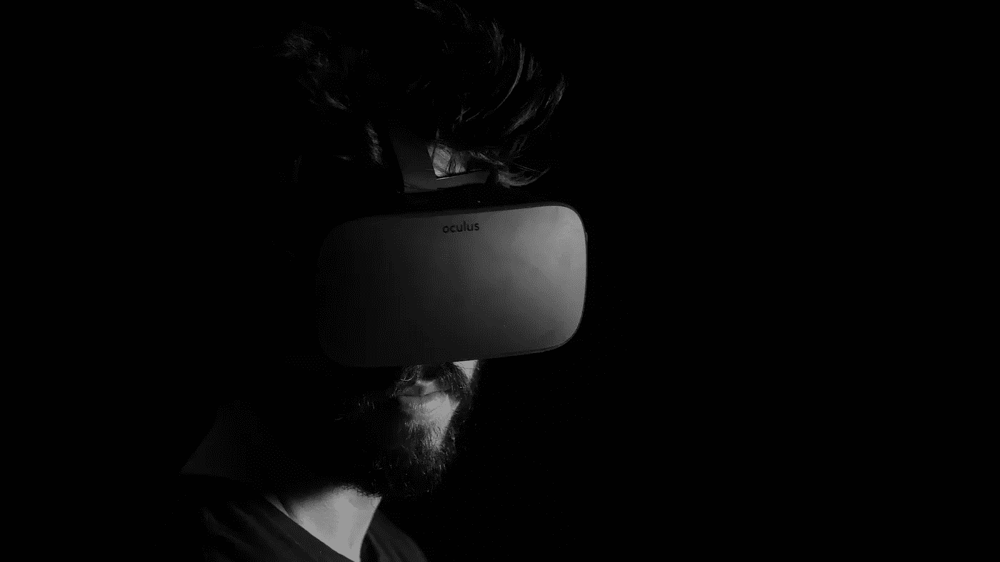

# 只有技术能把我们从技术革命中拯救出来

> 原文：<https://medium.com/hackernoon/only-technology-can-save-us-from-the-technological-revolution-3c0a1ae0b29d>

## 为什么每个人都必须加入“技术社区”

Photo by [Lux Interaction](https://unsplash.com/photos/xL3xDwWx7_s?utm_source=unsplash&utm_medium=referral&utm_content=creditCopyText) on [Unsplash](https://unsplash.com/search/photos/virtual?utm_source=unsplash&utm_medium=referral&utm_content=creditCopyText)

没有人能够完全理解“技术”或者它将把我们带向何方。技术超出了人类的理解能力，我们正快速奔向一个不确定的——可能是未知的——目的地。当我们停下来考虑最近技术“进步”的速度和范围时，某种程度的焦虑是很自然的。

但这并不意味着我们应该忽视技术或否认技术对我们生活的影响。相反，我们必须利用“群众的智慧”。这意味着拥抱和参与技术驱动的社区，这些社区将(不可避免地，或好或坏)定义我们共同的未来。

这里，我并不是说每个人都应该成为最新科技产品或服务的早期采用者。相反，我们都需要成为多样化技术社区的积极参与者，以确保技术帮助我们解决最重大的环境和社会问题，并避免不道德或危险的选择。

> 只有通过积极参与技术，我们才能在技术赋予我们的不确定的命运中生存下来。

对于一个技术飞速发展的世界，这是唯一合理和负责任的回应。

而这个建议适用于*每个人*。企业(年轻人和老年人)、政府、媒体、大学以及你我。

以商业为例。

# 技术行业

技术导致的“中断”是当今公司面临的最大威胁之一。公司发出盈利预警的例子比比皆是。原因通常很简单:许多公司根本没有为数字化转型的新需求做好准备。

即使一家公司了解这些技术，他们也常常会对其新的、颠覆性的应用感到惊讶。或者说，他们没有预见到市场/消费者不断变化的需求。或者说，他们没有认真对待新的市场进入者。当然，这些新的竞争对手往往太小，不会引起立即的关注，但当他们不被重视，并迅速扩大规模时，很快就会来不及做出反应。随着新来者迅速超越现有者，这种缓慢反应的影响可能是灾难性的。

此外，数字技术有助于最成功的科技公司将业务扩展到其他领域。

几天前，有消息称 *Airbnb* 想要进入房地产业务，这里我不是指出租房屋，而是设计房屋，进而成为城市规划领域的主要参与者。

 [## 独家:Airbnb 将于 2019 年开始设计房屋

### 在发起了一场家庭共享革命后，Airbnb 的创始人开始问自己，“下一步是什么？”他们…

www.fastcompany.com](https://www.fastcompany.com/90271599/exclusive-airbnb-will-start-designing-houses-in-2019) 

另一个例子是科技巨头(*亚马逊*、*字母表*和*苹果*)向医疗保健市场转移。不断转向相邻的——甚至不同的——经济领域，已经成为建立品牌和社区、保持竞争力的必要条件。

 [## 亚马逊的早期投资者约翰·杜尔登确信杰夫·贝索斯将推出 Prime Health

### 大卫·保罗·莫里斯|彭博|盖蒂图片社约翰·杜尔登通过早期投资为他的风险公司赚了一大笔钱…

www.cnbc.com](https://www.cnbc.com/2018/11/29/john-doerr-convinced-amazon-will-roll-out-prime-health.html?__source=twitter%7Cmain) 

不关注技术变革、不断变化的市场需求和新的竞争对手将迅速使公司成为“恐龙”，并迎来它们的灭亡。

**那么，为了应对这种新的运营环境，公司可以做什么，也应该做什么？**

首先，他们需要调整心态。特别是，他们需要理解数字化转型对现有商业模式的影响。

最明显的是，企业不应该再把自己视为“公司”。对于“公司”，我指的是一个封闭的、等级森严的、中央集权的组织，它围绕着一个官僚的职能分工和形式化的程序来构建自己。

相反，所有公司都需要采取一种完全不同的自我理解和组织形式，这种形式更扁平、更包容、更多样化，与所有利益相关者进行有意义的对话是所有业务的核心。

正是这种类型的组织，我称之为“社区”一群人，他们有共同的兴趣，为了共同的目标，以一种扁平的、学院式的方式一起工作。

技术驱动、技术促进和技术支持的社区可以帮助我们通过基于社区的学习、基于社区的问题解决和基于社区的决策来建设未来。

建立未来社区的唯一方法——在这种情况下是商业——是拥抱技术，尤其是数字技术。

这是因为数字技术让主宰“公司”几十年甚至几百年的繁琐耗时的程序和流程变得过时了。此外，这些新社区打破了等级制度。我们不再需要“中间人”和中介来顺利运作和保证可靠性。新技术越来越多地提供了信任的基础，或者取代了对信任的需求。

考虑下面的例子:

*   算法和智能手机应用程序有助于创建社区驱动的组织。
*   大数据分析和人工智能在商业决策和预测中发挥着越来越重要的作用。
*   人工智能用于做出选择和任命决定，确保公司吸引正确的人才。
*   当公司考虑发行硬币(作为忠诚度计划的一部分)时，区块链解决方案可能是有用的，但在建立有效、透明和可持续的供应链等方面也是有用的。
*   数字技术(数据分析、区块链、人工智能、增强和虚拟现实)有助于与利益相关者进行持续和实时的报告/对话。
*   诸如银行之类的公司使用 API(应用程序编程接口)来允许他们的客户使用第三方的应用程序来访问银行服务。

简而言之，数字技术使得创造透明、扁平、可信的社区成为可能，这些社区与以前占主导地位的“公司”大不相同。这些新社区由技术驱动和维持，是在快速变化的世界中学习、实验和共同创造(并通过这样做保持相关性)所必需的。

当然，这种开放和充满活力的商业社区的承诺经常被遗忘或遗忘，尤其是随着企业的发展。我们都可以想到有前途的年轻企业随着扩张而“公司化”的例子。但是，如果这些公司放弃了带给它们最初成功的价值观和原则，它们将无法长期生存。

# 这对“你和我”意味着什么

“走向数字化”不仅对企业和其他组织至关重要。这也适用于个人层面。你(和我)都必须更积极地参与创造未来的技术社区。

一个原因是，在数字社会中生活和工作，技术只是生活各个方面的一个重要组成部分。

上周我读到一篇关于瑞典的文章，描述了他们如何迅速转变为一个真正的数字社会。他们已经在试验植入微芯片来实现“击掌付款”他们致力于电子克朗的实现，这是一种最终可能取代瑞典传统货币的数字货币。

 [## 现金在瑞典几乎绝迹

### 用卡或电话支付或只是在网上购物最初因其方便而流行起来，但随着新的…

www.techspot.com](https://www.techspot.com/news/77555-cash-has-almost-gone-extinct-sweden.html) 

不要误解我。一直都有社区。但这些都是当地组织的，是“排外”和封闭的。现在，我们看到越来越多的社区基于技术(博客、视频博客等)在全球范围内进行数字化组织。)不依赖于等级制度和中介，运作起来更加顺畅和快捷。

还有更多。我相信社区“把事情做好”的力量或者，至少，以一种比传统的等级制度更透明、更民主的方式做事。

当然，我看到了许多人提到的技术的缺点(沉迷于屏幕时间、错误使用或误用社交媒体、假新闻讨论)。但是忽视技术不是一个选项。我们必须研究和理解它。我们必须建立我们的“技术素养”我们必须拥抱技术，成为现在讨论的一部分。

我们正处于十字路口，没有回头路。科技是不可阻挡的。我们需要技术来增强我们的智慧，成为讨论和决策的一部分(认识到越来越多的决策是在社交媒体的基础上做出的)。政府和监管机构将成为未来的平台和社区。要产生任何影响，每个人都必须参与到未来的创业和动态技术社区中。

当然，这很讽刺。只有拥抱和(迅速)采用技术，我们才能在技术革命中生存下来。

非常感谢您的阅读！请按住👏*下面，还是留下评论吧。*

*每周都有新的故事。因此，如果你关注我，你不会错过我关于数字技术如何改变我们生活、工作和学习方式的最新见解。*