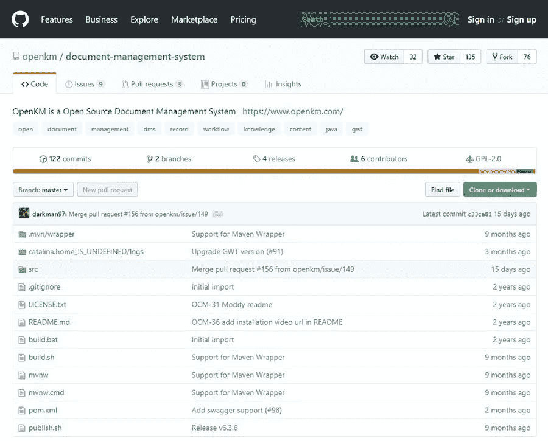
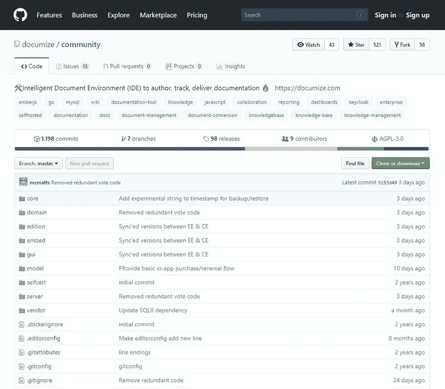
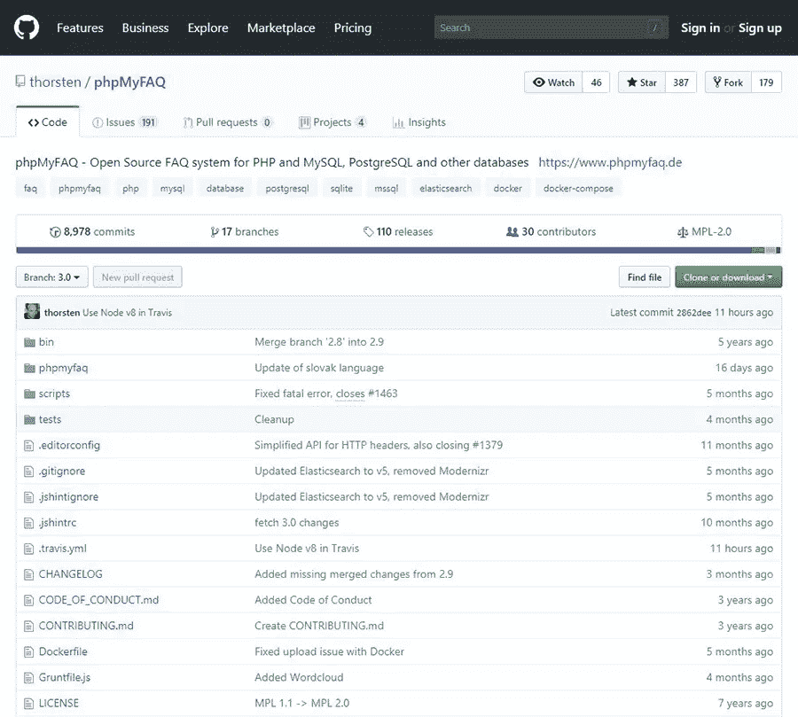
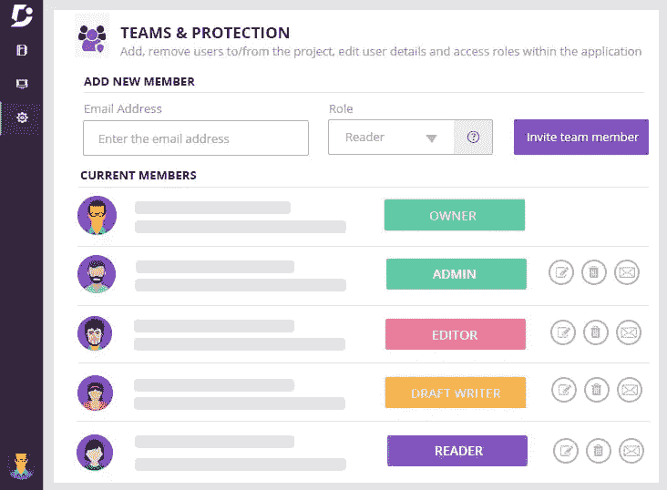

# 开源知识库软件与 SaaS 解决方案

> 原文：<https://medium.com/hackernoon/open-source-knowledge-base-software-vs-saas-solution-61f68db44d4d>

> 由 Jade Emmons 在[开源知识库软件可以为您的公司提供将软件代码集成到现有软件堆栈中的机会。你不需要依赖 API，因为你可以直接修改和使用代码。](https://medium.com/u/936d31f88686#1</h1>
 
> [如果你正在为开发者托管一个知识库，那么将软件与你的其他开发工具和工作流程集成起来肯定会很方便。](https://medium.com/u/936d31f88686#1</h1>
 
> # [好处#2](https://medium.com/u/936d31f88686#1</h1>
 
> [如果您是一家有广泛安全需求的企业公司，那么可以在内部托管开源知识库软件。SaaS 知识库软件通过您的互联网浏览器访问，并托管在您的供应商的服务器上。](https://medium.com/u/936d31f88686#1</h1>
 
> [如果您选择开源知识库软件，您将在您的服务器上安装并运行您自己的软件版本。](https://medium.com/u/936d31f88686#1</h1>
 
> # [开源知识库软件与 SaaS 的比较](https://medium.com/u/936d31f88686#1</h1>
 
> [现在我们已经检查了开源知识库软件的好处，让我们看看为什么许多公司选择 SaaS。](https://medium.com/u/936d31f88686#1</h1>
 
> # [缺点#1](https://medium.com/u/936d31f88686#1</h1>
 
> [许多公司被开源软件所吸引，因为他们认为他们不必付费，但这种软件实际上并不是免费的。](https://medium.com/u/936d31f88686#1</h1>
 
> [大多数开源知识库软件对“社区用户”是免费的，但是如果你是一个大公司，你需要支付使用费，就像 SaaS 解决方案一样。](https://medium.com/u/936d31f88686#1</h1>
 
> [你还需要在自己的服务器上托管开源知识库软件，所以它实际上仍然不是免费的。](https://medium.com/u/936d31f88686#1</h1>
 
> [不要担心托管和管理你的知识库文章。选择 SaaS 解决方案。](https://medium.com/u/936d31f88686#1</h1>
 
> # [缺点#2](https://medium.com/u/936d31f88686#1</h1>
 
> [对软件的支持通常通过社区论坛等提供。你不付费的开源知识库软件将不会有官方的技术支持。](https://medium.com/u/936d31f88686#1</h1>
 
> [相比之下，像 Document360 这样的 SaaS 解决方案是通过浏览器交付的，你需要根据你需要的用户数量按月付费。作为回报，我们会全力支持您的启动和运行，如果出现任何问题，我们也会提供支持。](https://medium.com/u/936d31f88686#1</h1>
 
> # [缺点#3](https://medium.com/u/936d31f88686#1</h1>
 
> [公司有时想要代码的所有权，这样他们就可以控制产品开发。](https://medium.com/u/936d31f88686#1</h1>
 
> [但是你没有 SaaS 解决方案，或者开源解决方案。开源软件是在你需要遵守条款的许可下发布的，所以这并不意味着你将拥有代码的所有权。](https://medium.com/u/936d31f88686#1</h1>
 
> [即使有了开源知识库，你也需要让项目维护人员开发一个你需要的特性。他们也可以删除他们认为合适的功能。](https://medium.com/u/936d31f88686#1</h1>
 
> # [缺点#4](https://medium.com/u/936d31f88686#1</h1>
 
> [SaaS 知识库](https://document360.io/blog/saas-knowledge-base-solutions/)受益于产品路线图，内部资源正致力于开发该软件。
> 
> 不要等待项目维护人员来开发你需要的特性。为按需请求选择 SaaS 解决方案。
> 
> 相反，开源知识库软件通常依赖于自愿为项目贡献时间的开发人员。它可能会缺乏动力或方向。
> 
> # OpenKM 分析
> 
> 
> 
> [OpenKM](https://www.openkm.com/) 可在 [SourceForge](https://sourceforge.net/) 目录中获得，该目录是开源软件的数据库，被评为 4.5 星(满分 5 星)。
> 
> OpenKM 更多的是一个知识管理解决方案，所以这意味着如果你正在寻找一个面向客户的知识库，那么 OpenKM 可能不适合你。你通常会用它来存放内部文件，比如 pdf 和 MS Word。
> 
> 知识管理是关于协作，以及在一个由大多数用户积极贡献者组成的知识库中管理内部知识。相比之下，知识库通常是集中管理的，面向大量读者(通常是您的客户或内部员工)。
> 
> 有了 [SaaS 知识库解决方案](https://document360.io/blog/saas-knowledge-base-solutions/)有一个专门的客户支持团队，因此如果发生任何严重情况，您可以从相对即时的帮助中受益。对于像 OpenKM 这样的开源解决方案，你唯一的选择就是在论坛上发帖，除非你付费获得支持。
> 
> 开源知识库软件通常以分层计划出售，如 SaaS。OpenKM 区分其社区版和专业版，如果你想了解定价，你需要联系他们的团队。如果您想要任何客户支持，您将需要支付一个计划。
> 
> 用 OpenKM 免费版为您请求的每个功能付费？不用再付钱了！选择 SaaS 解决方案！
> 
> 使用免费社区版，您将无法访问 OpenKM 的所有特性。
> 
> 用 Java 编码的 OpenKM。这里有一个到 GitHub 上的[知识库和他们的](https://github.com/openkm/document-management-system)[支持知识库](https://docs.openkm.com/kcenter/)的链接。
> 
> # 文档化分析
> 
> 
> 
> [Documize](https://documize.com/) 也是针对内部知识管理。基于开源模型，鼓励用户向 Documize 提交功能请求。
> 
> 这个想法是，Documize 将围绕客户需求来构建产品，而不需要昂贵的集成。它使用了开源和专有模型的有趣组合。
> 
> Documize 允许用户集中他们的内部文档，并与外部团体分享，这比维基软件更进了一步。Documize 没有做到的是允许你创建一个专业的产品知识库。
> 
> 你知道开源平台对任何功能请求都有定价计划吗？选择 SaaS 解决方案来降低成本！
> 
> Documize 也有社区版，是他们的免费版本。这里有一个到 GitHub 上的[库的链接。基本计划中没有大多数功能，因此您必须联系他们，了解他们的业务和企业计划定价。](https://github.com/documize/community)
> 
> # phpMyFAQ 分析
> 
> 
> 
> phpMyFAQ 更像是一个真正的知识库产品，旨在托管面向客户的帮助内容。背后的团队好像在软件上很努力，从 2001 年就开始走了。这是他们在 GitHub 上的[资源库的链接。](https://github.com/thorsten/phpMyFAQ)
> 
> 该软件有无限的常见问题，类别，用户和群体。它还包括 40 多种语言，以适应多语言用户。
> 
> 它是在 Mozilla 公共许可证 2.0 下发布的。这意味着您已经被保证可以免费使用 phpMyFAQ，访问源代码，并有权修改和发布 phpMyFAQ。
> 
> 对于 phpMyFAQ，你仍然需要提供你自己的数据库来使用他们的[知识库软件](https://document360.io/)。顾名思义，它是用 PHP 编写的，正如你所料，除了通过论坛或 twitter 之外，团队不提供任何支持。
> 
> # 文档 360
> 
> [文档 360](https://document360.io/) 是一个 SaaS 解决方案。它为您的公司提供了一个具有许多高级功能的专业知识库:
> 
> *   **文章协作** —评论和生命周期
> *   **结构化类别** —用于内容层次结构
> *   **高级编辑** —支持降价和代码块
> *   **定制功能** —带有定制图像的 HTML 和 CSS
> *   **集成**——与 Olark 等流行软件的集成
> *   **安全性** —不同的团队角色、备份和恢复自定义域映射
> 
> 
> 
> 所有这些功能以及更多功能都包含在 Document360 订阅的每个级别中。我们开发资源的很大一部分已经投入到使 Document360 成为一个优秀的知识库产品中。我们为您托管软件，在幕后管理安全性，并提供即时客户支持。
> 
> 我们在用户体验上进行了大量投资，因此知识库软件前端界面看起来很专业。你所要做的就是创建你自己的内容和定制品牌来满足你公司的需求。
> 
> 定价计划基于一种模式，即你为知识库支付一定数量的“作者”，但“读者”(即你的客户)的数量是无限的。Document360 对我们的定价完全透明，并显示在[网站](https://document360.io/pricing/)上。
> 
> # 结束语
> 
> 总的来说，我们讨论的大多数知识库解决方案都是开源的，您可以下载并修改源代码。尽管大多数软件仍然是为了盈利而出售的，它通常是针对那些对通过知识管理改善内部协作感兴趣的公司。
> 
> 这些解决方案中的大多数不适合用作产品知识库，甚至不适合用作[内部团队知识库](https://document360.io/blog/create-good-internal-knowledge-base/)。他们更像是文档的维基，而不是帮助中心。phpMyFAQ 最接近于一个真正的知识库，而且是免费的。
> 
> 所有的开源解决方案都需要内部的开发资源。如果你选择 SaaS，不用担心安装，托管和开发，因为这一切都为你做好了。包月套餐中包含的所有内容。

*原载于 2018 年 11 月 15 日*[*document 360 . io*](https://document360.io/blog/open-source-knowledge-base-software/)*。*