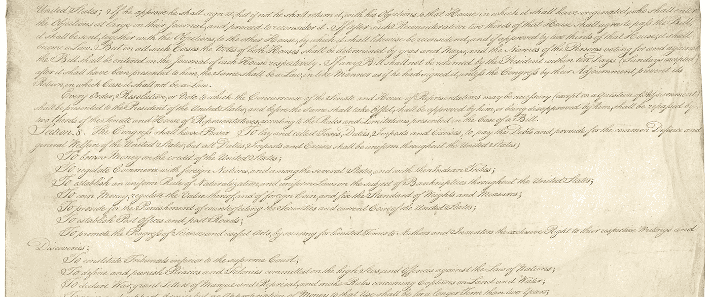

# 开源软件作为一种公共产品

> 原文：<https://medium.com/hackernoon/open-source-software-as-a-public-good-ec040bf9cc46>

## 雕塑和软件有什么共同点？

我认为首先说两件事很重要:

*   我创造了开源软件
*   在某些情况下，我为开源软件感到自豪

鉴于这两点，当我看到诸如[为什么开源失败了](/@johnmark/why-open-source-failed-6cae5d6a9f6)、[约翰·马可最近的一篇文章](/@johnmark)之类的文章时，我产生了极大的兴趣。

现在，我想首先承认，文章中提出了几个重要的、有充分根据的观点。重点介绍了专利法和开放源码的复杂、交织的性质，以及企业使用开放源码软件作为提高企业生产力的机制。

然而，有一部分尤其吸引了我的注意，我在此引用其中一部分:

> 使用或开发更多的开源软件不会改善任何人的生活。开发开源软件不是公益。这不会带来一个更公平或更公正的社会。事实上，按照目前的结构，开源开发是问题的一部分。

我将采用这种分层的、洋葱式的陈述，来分析开源的真正影响。

# 雕塑家

想象一下，你是一位经验丰富的艺术家，也许是一位雕塑家。你在各种不同的材料上有天赋，创造出大大小小的艺术作品。当你定期接受工作委托时，你经常抓住机会为自己和他人创建小项目。

在某个时候，你觉得你家附近的小公园需要一些艺术。你与市政府讨论，授予他们在当地公园永久展示你最精美的大理石雕塑之一的权利。艺术品被展示出来，让你兴奋的是，公众感觉公园的气氛有所改善。更有趣的是，接下来的讨论是关于创建一个类似雕塑和实物艺术品的户外艺术展览。

现在，你可能想知道，“这和开源软件开发有什么关系？”

让我们后退一步。

# 知识产权法

如果我们暂时把注意力集中在美国，知识产权法的历史可以追溯到美国宪法的一小部分。也就是说，这种语言可以在第一条第 8 款第 8 项中找到:

> “国会有权……通过在有限的时间内保护作者和发明家对他们各自的著作和发现的专有权，来促进科学和实用艺术的进步；”

虽然这是美国特有的，但其他国家在各自的基本立法文件中也有类似的知识产权概念。版权、商标和专利的概念，以及围绕版权、专利程序、商标注册等条款的后续立法，都可以在著作权或发明这一基本概念中找到其根源。

在众多观点中，我想强调两点:

*   知识产权的基本前提是不区分媒介(例如一块石刻或当地杂志上的一篇文章)
*   所有形式的工作，无论是科学的、艺术的还是其他的，在法律面前都是平等的

出于有意简洁的考虑，我将跳过几百年来知识产权领域的变化，比如获得版权的过程、版权的期限、什么有资格获得专利等等。然而，那最终是无关紧要的信息。

# 开源软件的价值

我们回到我上面引用的部分，为了便于阅读，下面再次引用:

> 使用或开发更多的开源软件不会改善任何人的生活。开发开源软件不是公益。这不会带来一个更公平或更公正的社会。事实上，按照目前的结构，开源开发是问题的一部分。

约翰·马可立场的这一部分是基于软件固有的知识产权质量，包括开放源码。虽然我理解——甚至在某些情况下同意——机构使用和创造知识产权在许多方面并不像它所宣传的那样是有益的、改善世界的行为，但以上部分仍然没有价值。

让我们解开知识产权所有权或转让的问题。正如雕塑家绝对保留他们创作的艺术品的所有权和版权一样，个人或非个人实体也保留他们软件的所有权。然而，这并不排除软件可以“开源”的可能性，以及超越其存在的进一步价值。

开源软件在很多方面相当于将雕塑捐赠给公共公园。只要公众尊重艺术家的权利，现在许多人都可以自由地欣赏它。同样，现在世界可以自由使用开源软件并从中获取价值，只要作者的权利得到尊重。

因此，从该软件中获得的价值超过了如果它保持封闭源代码所获得的价值。这就像向公园捐赠艺术品一样是一种公益，因此“开发开源软件不是公益”的观点似乎完全没有根据。

虽然我承认，作为一个软件生产社会，我们还有很长的路要走，以更好地协调和解决知识产权相关的问题，但我可以自信地说，在许多方面，当对比开放源代码和封闭源代码软件时，净价值更大。

*感谢阅读！如果你喜欢这篇文章，让我知道，并与他人分享！*

*如果你有兴趣接触，我在* [*LinkedIn*](https://goo.gl/2tySiH) *，*[*Twitter*](https://goo.gl/xAvf1h)*，Medium 和许多其他平台上。*

*代码图标 via CC BY 3.0 来自*[*Just UI*](https://www.behance.net/gallery/46430855/Luchesa-Flat-Icons)*。美国宪法来自* [*国家档案馆*](https://www.archives.gov/founding-docs/downloads) *。*