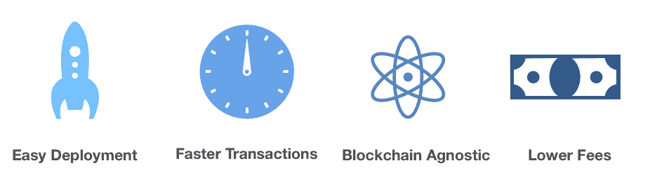
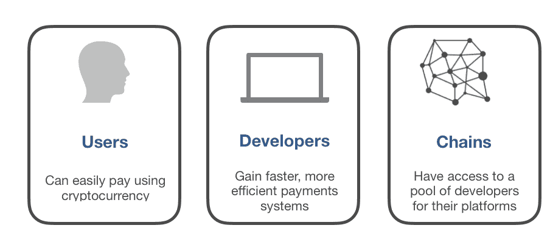

# 开放——应用开发者的涟漪

> 原文：<https://medium.com/hackernoon/open-the-ripple-of-app-developers-6de6f23d20f9>

Photo by [Valeriy Khan](https://unsplash.com/photos/0sUe24rw_Fg?utm_source=unsplash&utm_medium=referral&utm_content=creditCopyText) on [Unsplash](https://unsplash.com/search/photos/app-developers?utm_source=unsplash&utm_medium=referral&utm_content=creditCopyText)

Ripple 是一个著名的分散支付平台，主要为银行和支付转账提供支付轨道。这是第一个针对金融机构间转账的区块链解决方案。

Ripple 在为银行带来分散化创新方面做得很好，但与银行业相比，应用程序开发市场是一个巨大的机会。这就是开放协议的努力方向。

开发者将使加密货币和区块链技术改善我们的日常生活。OPEN 正在建设支付轨道，将所有区块链直接连接到软件应用程序中，实现无缝的区块链支付集成。

# 区块链和软件应用程序之间的支付连接

为了适应软件应用程序的复杂基础结构，OPEN 提供了一个支付基础结构，它提供了当今应用程序支付之间缺少的组件。

当用户使用 OPEN 购买应用程序时，不仅资金会立即交付给开发者，而且交易及其数据会自动注册到应用程序的数据库中。这是阻碍现有应用程序接受[加密货币](https://hackernoon.com/tagged/cryptocurrency)的关键桥梁，因为钱包无法在区块链之外直接通信。

通过提供这个桥梁，对现有的和分散的应用程序开发人员具有公开的吸引力，他们可能不想从头开始构建整个功能。开放是区块链不可知的，使多个开发者和区块链能够交叉他们的技术，这是对许多新的和即将到来的区块链中稀缺的开发者社区的解决方案。

# 开放平台的优势

## 易于部署

OPENs platform 在区块链和开发人员的应用程序之间提供了一个直观的界面，便于集成和部署。开发者不需要学习像 Solidity 这样的新语言，因为开放平台使他们能够部署通过 OPEN Rest API 直接连接到区块链的支付支架。它消除了必须学习新的智能合同语言的学习曲线。

## 更快的交易

由于区块链的分散性，开发商的交易不会受到传统制度障碍的阻碍。某些业务的常规支付安排可能需要 90 天才能结清。相比之下，通过区块链交易，支付周期大大缩短，几乎是立即完成。

## 区块链不可知

借助 OPEN，开发人员可以将他们的应用程序与一个区块链集成，然后连接到任何支持的区块链，而无需额外的努力。开放式架构的核心组件旨在抽象出区块链的复杂性。因此，OPEN 可以将该层放置在支持智能合约的各种区块链之上。这意味着通过简单的集成，开发者可以访问大量的区块链。

这不仅节省了时间和精力，而且还保护了开发人员在技术环境发生变化时不必重新编写应用程序。

## 更低的费用

在没有机构开销的情况下，通过区块链处理的交易要便宜得多。OPEN 支持用户和开发者之间的直接交易。与通过 iTunes 和 Google Play 等应用商店处理的交易相比，开发者每次销售可以节省高达 27%的费用。

# 开放对用户和开发者都有独特的好处

开放平台可以通过其基础设施层无缝连接开发者和用户的网络。它允许开放社区中的用户自动与任何包含开放 API 的软件应用程序进行交互，而不管使用的平台或加密货币的类型。

通过开放平台，开发者可以为他们的应用建立一个支付方案(例如订阅费用)，然后使用开放 API 将其连接到他们的应用后端。

## 用户

应用程序用户可以使用加密货币进行支付。在这种日益分散的经济中，许多人宁愿通过加密货币进行支付，也不愿将资产转换为纸币，然后支付货款。这立即使超过 5000 亿美元的流动数字资产可用于开发人员的应用程序。

## 开发商

通过接受加密货币支付，开发者可以更快地获得退款，并支付更实惠的交易费用。此外，他们获得了一批用户，可以向他们推销，并鼓励他们使用他们的软件。这种方法完全以无缝方式完成，实施时不需要关于区块链的技术知识。

## 区块链

区块链从开放平台中获益，可以轻松访问移植到他们技术上的庞大开发者社区。由 OPEN 在开发人员和特定区块链之间提供的抽象层支持。

# 开放是软件开发者的涟漪

给开发者、用户和区块链带来的好处表明，OPEN 将成为开发者的首选基础设施，就像 Ripple 为银行所做的那样。

OPEN 没有让开发人员处理将支付解决方案与区块链集成的复杂问题，而是将这个问题抽象化，提供了一个专为应用程序内部使用而设计的平台。

个人对个人支付的效用是必不可少的，但是对软件应用的支付解决方案的需求日益增长。开发人员渴望一种解决方案，让他们能够访问超过 5000 亿美元的流动加密货币资产。开放满足了这种需求。

Ripple 创造了人与人之间更便宜、更快捷的交易，而 OPEN 提供了更快捷、更便宜、更灵活、更容易实现的最终用户与他们交互的应用程序之间的交易。

作为开发者加入[开放平台](https://www.openfuture.io/developer-program)，成为首批集成应用支付平台的开发者之一！